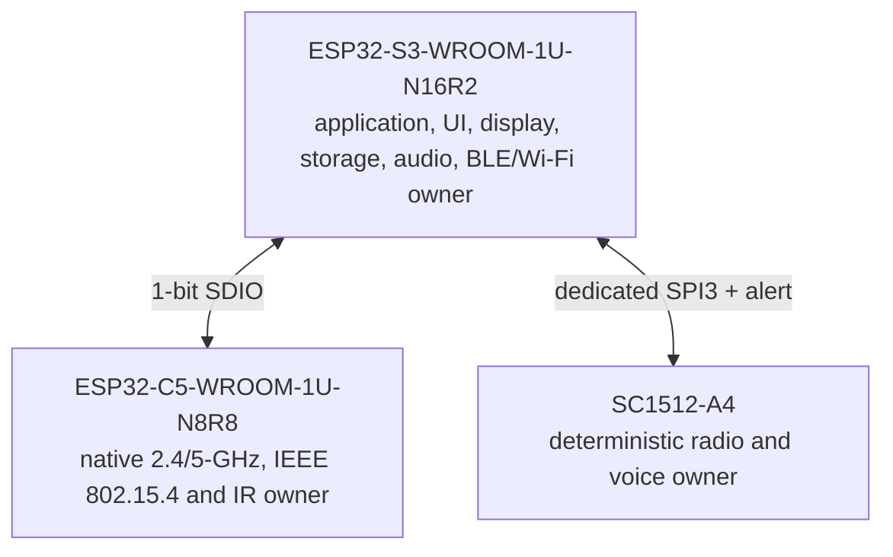
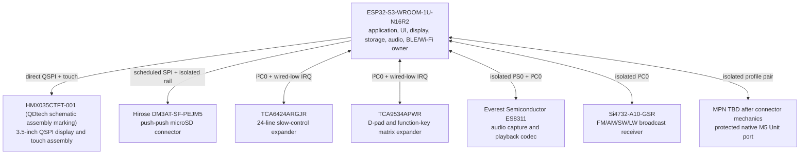
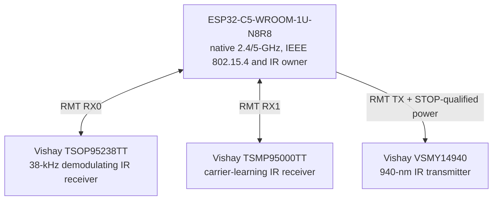
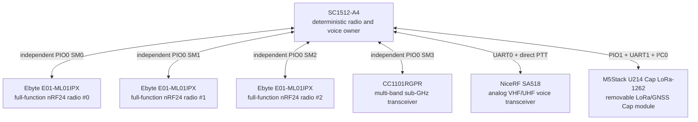
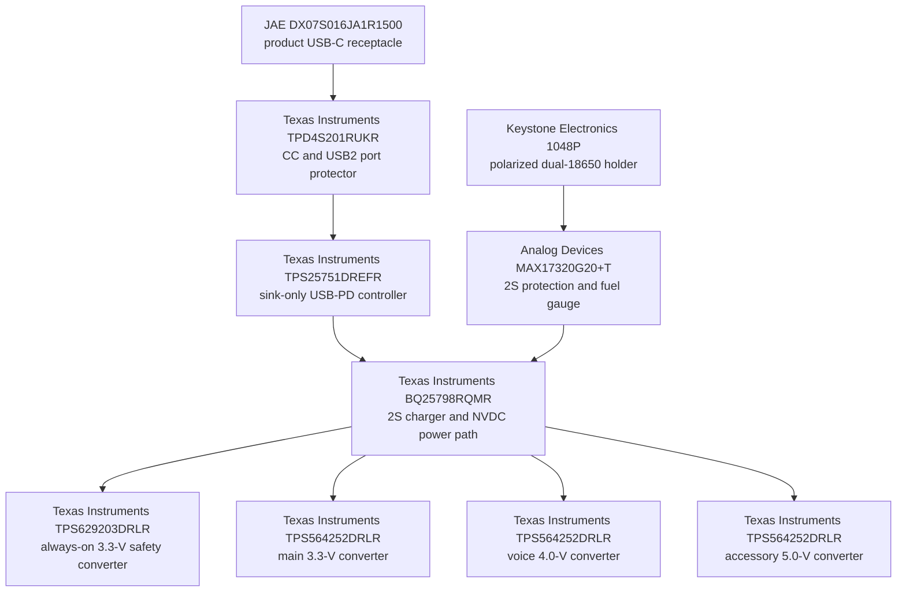

# Leshy2 Hardware

> **Target product site.** This page describes the finished Leshy2: its purpose,
> capabilities, interfaces, principled design and mandatory guarantees.
> Engineering progress and open validation work live in separate documents.

- [Русская версия](README.ru.md)
- [Firmware target product](https://github.com/anton-vinogradov/esp32-leshy2-firmware)
- [Current engineering state](docs/status/current-state.md)
- [Engineering decisions and evidence](docs/review/README.md)

## Finished-product intent

Leshy2 is an open, autonomous and portable instrument for spectrum observation,
diagnostics, communication and authorized research into wireless and contact
systems. It combines independent radio paths, a display, local controls, data
recording, audio, service access and expansion in one repairable device.

It is a field instrument rather than a general-purpose pocket computer: every
hardware capability must produce a measurable result, have a defined safe
state and remain diagnosable and recoverable by its owner.

## Three functional levels

1. **Main** — everyday tools, reception, diagnostics, navigation, maintenance
   and legitimate communications.
2. **Lab** — passive, defensive and bounded security-research tools.
3. **Lab → Controlled Zone** — dangerous active or disruptive tools. Every
   entry displays a fresh non-suppressible warning; every action separately
   requires an authorized target, isolated/conducted environment, or both.

Initial setup separately requires acceptance of the non-aggression pledge.
Neither acknowledgement arms a tool or overrides law, spectrum licensing,
privacy or the target owner's authorization.

## Finished-device capabilities

### Radio and communication

- Three independent full-function nRF24 paths operate concurrently in every
  `3R`, `1T2R`, `2T1R` and `3T` mix without silently disabling peer receivers.
- Exactly one top-level signal group owns the signal plane at a time. The three
  nRF paths form one such group and retain every required concurrent mix;
  contained cross-group Laboratory injection can characterize robustness but
  never grants a runtime permission. Every foreign interface is then driven to
  its measured quiet/off state.
- Each nRF path has switched-rail Ioff isolation in both digital directions,
  a dedicated full-band directional forward-power detector and its own
  external SMA feed. The module-side `IPX` mate is qualified from a received
  sample rather than assumed to be U.FL.
- Three separated nRF antennas provide calibrated relative sector/RPD
  comparison. The result is never presented as absolute dBm, angle or VSWR.
- 2.4/5 GHz Wi-Fi, Bluetooth LE, ESP-NOW and IEEE 802.15.4 provide ordinary
  communication, observation and authorized diagnostic workflows.
- The S3 2.4-GHz and C5 2.4/5-GHz radios keep independent external RP-SMA
  feeds. Each feed passes through its own `Hirose U.FL-R-SMT-1(10)` PCB mate
  and `KYOCERA AVX CP0603Q5425ENTR` directional coupler, so actual outgoing RF
  is measured without sharing an antenna or detector path.
- The dedicated `CC1101RGPR` Sub-GHz path selects 315, 433 or a combined
  868/915-MHz branch with two `BGS13SN8E6327XTSA1` switches, disconnecting every
  unused filter at both ends. Band controls change only while its rail is off;
  default `00` isolates all branches. A final-line 0.47-pF sample feeds an
  AON-held `AD8314ACPZ-RL7`; incoming RF can never authorize transmission.
- The Sub-GHz path handles packet systems; a broadcast receiver covers
  AM/FM/SW/LW; a VHF/UHF voice path provides analog communication and audio.
- The `Si4732-A10-GSR` keeps separate protected receive-only ports: FM/SW uses
  `FMI`, with `LQW15AN56NJ00D` 56-nH matching plus
  `GRM1555C1H102JA01D` 1-nF coupling as the FM starting network;
  AM/LW uses `GRM155R71A474KE01D` 0.47-uF coupling into a short labelled loop
  pod. Each boundary has its own `SESD0402X1UN-0020-090`; the AM/LW port is
  explicitly non-50-Ohm and arbitrary long coax is not supported. SW remains
  on the exact chip's published FMI input, but sensitivity is qualified from
  the complete path rather than inferred from the FM reference circuit.
- The exact audio endpoint can route either selected receive audio or the local
  electret microphone into the codec, play through a reset-off 4-Ohm speaker,
  or use insertion-detected 3.5-mm headphones. Codec, receiver and SA518 buses
  are physically isolated while their domains are off; PTT remains a separate
  STOP-dominated authorization and is never inferred from audio.
- Exact `TSOP95238TT` and `TSMP95000TT` receivers provide simultaneous robust
  38-kHz demodulation and measured 30–60-kHz carrier learning. Their filtered
  rail is discharged and Ioff-isolated while inactive. A side-view
  `VSMY14940` replays admitted profiles through a STOP-qualified, current-limited
  driver; a shielded `VEMD1060X01` optical pickup verifies emitted light rather
  than inferring it from drive current.
- All nine onboard antenna paths terminate at dedicated external ports: two
  RP-SMA for native Wi-Fi and seven standard SMA for the remaining paths.

### Interfaces and expansion

- A portrait 3.5-inch `320×480` touch IPS display uses direct QSPI; critical
  state and first menu feedback appear within `100 ms`.
- A removable microSD stores spectrum records, audio, profiles, logs and
  exported data. It is powered only for an active storage session, electrically
  isolated while off, protected on every exposed electrical contact, and
  detected independently of card power. Clean removal drains pending writes;
  unexpected removal is reported and recovered without pretending the last
  unwritten tail is intact.
- A rear 14-pin Cap-Bus accepts the removable M5Stack U214 LoRa/GNSS and
  compatible modules; a separate protected M5 Unit port supports GNSS,
  qualified LoRa modules, NFC, iButton/1-Wire and other extensions.
- A qualified raw-SDR or external RF-analysis module may define a separate
  high-throughput interface; a low-rate M5 command port is never presented as
  a raw-data path.
- Rare long-form text entry may use a locally paired phone, but the phone cannot
  authorize dangerous actions or replace controls on Leshy2.
- An external IMU may annotate measurements with pose and relative motion;
  without a qualified mount it is never presented as a compass or RF bearing.

### Serviceability

- Every programmable compute domain has its own programming, recovery and
  diagnostic path and does not depend on a healthy peer domain.
- S3 uses the protected product USB plus keyed UART0/RESET/BOOT access. C5 has
  its own data-only USB and keyed UART0/RESET/BOOT access; RP2354B has its own
  data-only USB and keyed SWD/RUN/USB_BOOT access. All three domains retain
  separate physical RESET and BOOT controls.
- The C5 and RP USB-C receptacles never power the product. Their VBUS reaches
  only a 1-MOhm bleeder/test point, and a board-powered USB switch disconnects
  D+/D- while the product is off, preventing cable backfeed.
- Hard STOP still dominates every recovery mode. Its reset output uses three
  passive-drain sinks, so a RESET button or fixture can pull a target low
  without fighting a driven-high logic output; recovery always starts TX-off.
- The product USB-C port keeps protected S3 USB2 Full-Speed data (12 Mbit/s)
  and accepts power only:
  5-V fallback, 9 V at 3 A and 15 V at 2 A, up to 30 W. It never acts as a
  power bank or USB-PD source.
- The PD controller enters hardware SafeMode directly from raw USB VBUS,
  autonomously loads a dedicated recoverable EEPROM and keeps the protected
  power path and charging off until a valid image is present. Factory pads can
  program a blank device; field updates verify an owner-signed image and retain
  a rollback region.
- The 2S charger is physically strapped to an efficient `750 kHz` profile
  with a `2.2 uH / 7 A` inductor. Reset restores a conservative `1 A` charge;
  normal operation never exceeds `2 A`, first limits input current to the
  actual 5/9/15-V USB contract and stops on direct battery-temperature faults.
- The supervised 2S battery uses two individually replaceable exact
  `XTAR 18650 4000mAh` protected button-top cells (`28.8 Wh` nominal per pair)
  in an exact polarized `Keystone 1048P` holder; both are required for battery
  operation. Raw flat-top cells are not supported, and the qualified cells
  ship as a separate regional kit by default. Reverse insertion is
  mechanically blocked; hardware observes and admits the pair before it may
  reach the system, and refuses an unsafe combination instead of forcing it
  to operate or equalize. The handheld also refuses deeply discharged cells:
  zero-volt/prequalification recovery is disabled, and any recovery research
  requires a separate isolated Controlled-Zone fixture. Before admission, a
  common-path 10-Ohm diagnostic applies approximately `0.57…0.88 A` for no
  more than `50 ms`. One non-retriggerable hardware channel prevents pulse
  stretching; a second channel then blocks every retry for at least `350 ms`,
  even if firmware is faulty. Two parallel 20-Ohm/2-W pulse-rated branches
  preserve the 10-Ohm load and safely share worst-case repetition heat. Normal
  software waits at least 10 seconds. This is a contact/cell screen, not a
  full-load qualification claim.
- Four independent fixed rails separate always-on safety, 3.3-V compute,
  4.0-V voice and protected 5.0-V accessory power. Unused radio, storage and
  audio branches are disconnected and discharged into a verified quiet state.
  Each converter output crosses its own hardware overvoltage/current/short
  cutoff before it can reach a load. The protected AON rail and its physical
  power-good evidence hold the 3.07-V supervisor in reset; only its delayed
  hardware POR enables the main rail. Firmware cannot bypass source admission,
  AON brownout, any internal protection boundary or that startup order.
  Runtime trusts only protected-side power-good evidence. A latched main fault
  requires complete source removal and fresh admission. The AON cutoff may
  perform its own bounded hardware recovery attempts, but software cannot
  accelerate them and main remains off until protected AON is stably valid.
- The protected accessory port admits startup through a controlled voltage
  slew under an immediately active current limit. It supports `1.25 A`
  continuously and a bounded `2.0 A` transient only after startup; an expired
  overload or other eFuse fault latches the port off instead of auto-retrying.
- Signed updates validate their target and support rollback. Build keys and the
  ability to install owner firmware remain owner-controlled; irreversible
  lockdown is not enabled by default.

## Principled solution design

Read the architecture from its three compute owners, not from the USB port.
The first map shows only inter-processor links; the following maps expand
each owner's devices and the independent power path. Every box is one
physical device with its exact/current MPN and product role; no box combines
different devices.

### Compute ownership map

### S3: user interface, storage, audio and native expansion

### C5: native 2.4/5 GHz, 802.15.4 and IR

### RP: deterministic radios, voice and U214

### Power as an independent path

The [complete rendered physical-device atlas](docs/review/architecture/generated/G2F-3I-principled-pinout.md) is split into bounded Mermaid diagrams. The original monolithic projection remains available for machine review as [`G2F-3I-principled-projection.mmd`](docs/review/architecture/generated/G2F-3I-principled-projection.mmd).

<strong>Principled pin assignment</strong>

- **S3↔C5:** S3 `GPIO10,GPIO11,GPIO12,GPIO13`; C5
  `GPIO7,GPIO8,GPIO9,GPIO10` — dedicated 1-bit SDIO.
- **S3↔RP:** S3 `GPIO3,GPIO9,GPIO14,GPIO21,GPIO48`; RP
  `GPIO19,GPIO24,GPIO25,GPIO26,GPIO27` — dedicated SPI plus alert.
- **Display and microSD:** S3
  `GPIO4,GPIO5,GPIO35,GPIO36,GPIO38,GPIO40,GPIO41,GPIO42` — direct QSPI
  and the only scheduled high-rate shared pair. Card-side Ioff buffers and a
  CS-gated MISO return keep the unpowered card and display D1 from contending.
- **Local controls:** S3 `GPIO39,GPIO47` are dedicated PCNT0 quadrature inputs.
  Dedicated `TCA9534APWR` `P0…P6` scans the diode-isolated 4×3 matrix containing
  D-pad/OK, BACK, OPT, F1, F2 and encoder push; `P7` is the local growth reserve.
  All rows are low in reset/idle, so any key asserts the wired-low interrupt.
  PTT is direct on RP `GPIO21`; STOP and RE-ARM remain independent AON paths.
- **Main slow I/O:** exact `TCA6424ARGJR` runs at address `0x22` from protected
  `3V3_MAIN`; RESET is available to the fixture and product recovery can fully
  power-cycle the main rail. AON STOP/evidence observations cross through
  separate open-drain buffers, so they cannot back-power an unpowered expander.
  P03/P04 are CC1101 rail-off band truth bits; P05 independently requests native
  M5 Unit power, so all 24 contacts are now allocated.
- **Audio and Si4732:** S3 `GPIO1,GPIO2,GPIO15,GPIO16,GPIO17,GPIO18` — I²S0
  and local I²C0 through power-valid physical isolation. Slow I/O `P00,P01,P02`
  select RX/microphone capture, enable the reset-off speaker and detect
  headphone absence. The PD controller also shares the bounded host bus and
  wired-low system IRQ; it consumes no new S3 GPIO.
- **M5 expansion:** S3 `GPIO7,GPIO8` reach the native HY2.0-4P Unit port through
  `TXS0102DCUR`; P05 controls its own `TPS259470LRPWR` 5-V branch. P17 controls
  the separate U214 branch. Both use protected-rail supervisors, high-Z signal
  isolation and connector ESD; neither connector exposes a real presence pin.
- **IR:** C5 `GPIO0,GPIO1,GPIO4,GPIO6,GPIO24` — two RX, TX, power and evidence.
- **nRF24 #0:** RP `GPIO0,GPIO1,GPIO2,GPIO30,GPIO31,GPIO32`.
- **nRF24 #1:** RP `GPIO3,GPIO4,GPIO5,GPIO33,GPIO34,GPIO35`.
- **nRF24 #2:** RP `GPIO6,GPIO7,GPIO8,GPIO36,GPIO37,GPIO38`.
- **CC1101:** RP `GPIO9,GPIO10,GPIO11,GPIO23,GPIO39,GPIO42,GPIO43`.
- **SA518/PTT:** RP `GPIO16,GPIO17,GPIO18,GPIO20,GPIO21`; the eight-source
  evidence mask shares local RP I²C0 and hardware aggregate uses `GPIO22`.
  Physical ANT contact 7 feeds a direct protected 50-Ohm standard-SMA path;
  `PESD24VY1BSF` and a separate `AD8314ACPZ-RL7` resistive sample provide
  1-W-compatible ESD and actual-TX evidence without spending P05.
- **U214 LoRa/GNSS:** RP
  `GPIO12,GPIO13,GPIO14,GPIO28,GPIO29,GPIO40,GPIO41,GPIO44,GPIO45,GPIO46,GPIO47`.
- **Resource result:** S3 `33 used / 3 reserved / 0 free`, C5 `14/6/1`, RP
  `48/0/0`, main slow I/O `24/0/0`, and UI matrix I/O `7/1/0`. Independent
  SWD/USB/RUN/BOOTSEL are outside this GPIO budget.

[Complete physical pad and net atlas](docs/review/architecture/generated/G2F-3I-principled-pinout.md)

## Physical design and controls

- The display is portrait-oriented; the waterfall redraws small regions and
  never blocks radio service.
- Its QSPI/touch assembly uses a 40-position ZIF candidate with reset-low
  defaults, local logic decoupling and a separately latch-protected PWM
  backlight. The assembly contains one exact `Sitronix ST77922` display/touch
  TDDI: touch uses I²C address `0x38`, and its active-low interrupt reaches the
  shared line through a pulled-up non-inverting open-drain buffer. Final
  connector orientation still requires the real panel tail; the electrical
  map does not pretend that mechanical fit has already passed.
- The push-push microSD endpoint uses an isolated switched rail, safe reset
  levels and always-readable card detection. Firmware enters SPI mode before
  display traffic resumes after every card-power cycle. Final socket placement,
  card access, media endurance and insert/remove fault tests remain physical HIL.
- Nine labelled antenna ports retain an unambiguous association between each
  connector, radio path and active antenna profile.
- The removable U214 mounts across the rear above the batteries while keeping
  its own antennas and connectors accessible.
- The complete local set is retained: D-pad directions plus OK, BACK, OPT, F1,
  F2, rotary encoder with push, dedicated hold-to-talk PTT, hardware STOP and
  recessed RE-ARM. None is replaced by touch or a phone.
- The nine discrete ordinary buttons, PTT and RE-ARM use exact low-current
  `Y78B23214FP`; gold-clad `AEQ10410` supplies the normally-closed STOP contact.
  Matrix, encoder/PTT and safety inputs have separate exact ESD arrays, and the
  STOP/RE-ARM array returns only to safety ground.
- Physical PTT, STOP and recessed RE-ARM are separate controls. STOP has an
  independent indicator and does not depend on the display.
- Programming and diagnostic connectors remain accessible on an assembled
  prototype and do not require a healthy application image.

## Safety and measurement integrity

- Every transmitter and Lab action starts disarmed after power, reset, update,
  watchdog or brownout.
- Initial transmission uses a conservative profile. Maximum power appears only
  after an explicit choice for the current scenario.
- Physical STOP dominates firmware and inter-processor communication. Releasing
  STOP never restores a previous target, channel, power or TX lease.
- The normally-closed STOP loop asynchronously latches all three compute domains
  in reset and independently blocks nRF CE, radio/accessory rails, voice PTT and
  the IR waveform. Only a fresh recessed RE-ARM press or a full power cycle can
  begin a new TX-off boot.
- Seven separate RF detectors and one optical IR detector produce eight
  source-specific states plus a diode-isolated physical red `ANY TX` indicator.
  An accessory without its own qualified evidence remains `Unknown`.
- Every onboard evidence channel has its own first-population threshold,
  hysteresis and open-drain pull-up. A triple open-drain boundary keeps the
  always-on evidence plane from back-powering C5 or RP when main power is off;
  measured per-path calibration still gates proof-mandatory transmission.
- Commanded TX, path current, radio-reported state and independent actual-TX
  evidence remain distinct. Unknown is never promoted to success or safety.
- Unused interfaces are powered down or enter a verified quiet state so they do
  not delay or desensitize the active signal group.
- Cost reduction is accepted only when capability, performance, safety,
  reliability, autonomy, serviceability and testability remain equivalent.

## Product boundary

The base product excludes 6 GHz/Wi-Fi 6E, generic USB host, a personal
FIDO/U2F authenticator, an integrated keyboard, a motor and an onboard IMU.
BadUSB/DuckyScript may exist only as an optional Controlled-Zone software
feature over the existing USB device path and does not shape the radio
instrument's hardware architecture.

## Project documentation

- [Current hardware engineering state](docs/status/current-state.md)
- [Principled pin map](docs/review/architecture/PIN-0003-g2f-3i-principled-pinout.md)
- [Complete requirements, decisions and evidence ledger](docs/review/README.md)
- [Firmware target product](https://github.com/anton-vinogradov/esp32-leshy2-firmware)
