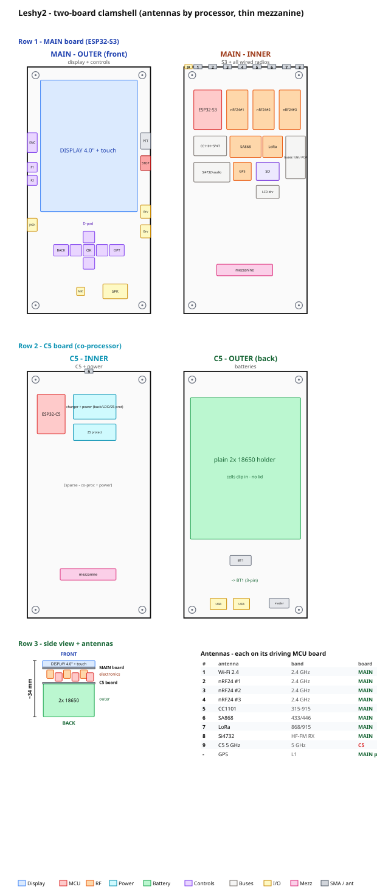

# Leshy2

*Read this in: **English** · [Русский](README.ru.md)*

**An open-source, portable, multiband RF handheld — a field tool you build yourself.**

Leshy2 is the successor to [esp32-leshy](https://github.com/anton-vinogradov/esp32-leshy), a firmware fork of [ESP32-DIV](https://github.com/cifertech/ESP32-DIV). It keeps the mature ESP32-S3 as the main brain and bolts on an **ESP32-C5 co-processor** for the one thing the S3 can't do — native **5 GHz** Wi-Fi. Two chips, one field tool, in the DIV-style handheld shape, built in the open for about **$135–160** (~$108–125 in electronics).

> 🛑 **Your own gear only.** An educational security-research and radio tool. Use it only on networks, devices, and radios you own or are explicitly authorized in writing to test. Radio law differs by country — it is on you to check and obey it.

---

## 📖 How to read this README

This README is the project's **source of truth**: the pipeline from idea to finished boards, **stage by stage**. Each stage sets a **Spec** (what and why), records the **Decisions** made in it, and produces **Artifacts** (files in this repo) that become the input to the next stage — so you can read it as *spec → decisions → result* and check each step.

**Status:** ⏳ planned · 🟡 in progress · ✅ done · 🔬 reviewed (self-review passed; a later edit drops it back to ✅). Nothing is built on real hardware yet.

| # | Stage | Status |
|--:|-------|:------:|
| 1 | [Why a new device](#1-why-a-new-device--vision) | 🔬 |
| 2 | [What it must do — capabilities](#2-what-it-must-do--capabilities) | ✅ |
| 3 | [Components](#3-components) | 🔬 |
| 4 | [Architecture](#4-architecture) | ✅ |
| 5 | [External design & controls](#5-external-design--controls) | ✅ |
| 6 | [Schematic sheets](#6-schematic-sheets) | 🟡 |
| 7 | [Merge, realize, review, complete](#7-merge-realize-review-complete) | 🟡 |
| 8 | [PCB layout](#8-pcb-layout) | 🟡 |
| 9 | [Firmware](#9-firmware) | ⏳ |
| 10 | [Firmware validation in emulation](#10-firmware-validation-in-emulation) | ⏳ |
| 11 | [Fabrication & bring-up](#11-fabrication--bring-up) | ⏳ |

---

## 1. Why a new device — vision

**✅ Spec.** Take [ESP32-DIV](https://github.com/cifertech/ESP32-DIV) further: keep its mature ESP32-S3 design and **broaden what the handheld can do** — first the 5 GHz Wi-Fi DIV lacks, then a wider set of on-board radios and peripherals. Concretely, support:

- **5 GHz Wi-Fi + Zigbee / 802.15.4 / Thread** — via an **ESP32-C5** co-processor (the only ESP32 with native 5 GHz).
- **Bluetooth LE** — BLE advertising flood, and the phone-typed text keyboard / companion link (both MCUs have BLE).
- **2.4 GHz raw** — 3× nRF24L01+PA/LNA (parallel scan, mousejack, jammer).
- **Sub-GHz 315 / 433 / 868 / 915 MHz** — CC1101 + an SP4T multi-band front end.
- **LoRa / Meshtastic** — SX1262 / E22-900M22S (+22 dBm).
- **Voice walkie** — SA868-U, 2 W TX/RX 433 / 446 MHz NBFM.
- **HF / CB / FM receiver + real analog audio** — Si4732 + a PAM8302 amp → speaker + a **TRRS headset jack** (headphone out + a mic ring to the SA868 walkie for hands-free) and an on-board MEMS mic.
- **GPS** — an **external M5 GPS Unit** on a Grove port (its own antenna); no on-board GPS. Plus **IR TX / RX**, **microSD** (PCAP logging).
- **2× Grove I²C** expansion for M5 Units (NFC / RFID2, RTC, IMU, sensors) + a **Grove-UART** port for the M5 GPS Unit (the S3's freed UART2).
- **2S 18650 power** with an on-board balancing boost-charger.
- **A bigger, higher-res display** — a **4.0″ 320×480 IPS** panel vs DIV's 2.8″ 240×320 (ILI9341): same SPI interface, but **~2× the area and 2× the pixels** (~2× the waterfall on screen) and IPS for wider viewing angles. Same ~143 ppi — bigger and roomier, not sharper. Plus **capacitive touch** (DIV is button-only).
- **A proper control set** — a **5-way D-pad + BACK + OPTIONS + PTT + panic STOP + F1 / F2 + an encoder wheel** (DIV's buttons are minimal); long text is typed from a phone.
- **Honest "on-air" indicators** — a per-TX-chain amber TX LED (7 chains; a passive hardware envelope detector, 0 GPIO) that shows a chain is transmitting even if the firmware hangs.

The S3 stays the brain (UI, display, all wired radios, SD, buses, 2.4 GHz Wi-Fi + BLE); the C5 is a pure 5 GHz co-processor. DIV handheld shape, fair price (~$135–160), open so people can join in.

**This peripheral wishlist is the driver for everything downstream** — it sets the capabilities (stage 2), which pick the components (stage 3), which shape the architecture (stage 4) and the physical device (stage 5).

**Decisions.**

- **Two chips, not one.** The earlier single-**ESP32-C5** plan lost to its pin crunch (20/20) — and 5 GHz is the *only* thing the C5 does better than the S3. So the **S3** (mature, ~36 GPIO, the leshy firmware already runs on it) is the brain and the **C5** is a pure 5 GHz co-processor.
- **Extend DIV, don't reinvent it.** Keep DIV's proven S3 base and the firmware lineage; bolt radios and peripherals around it rather than a clean-sheet design.
- **Draw the scope boundary here** (the *out-of-scope* list below) so the later stages don't chase full-5 GHz monitor+inject, Linux-class analytics, HF-TX, wideband SDR, cellular or jamming — chip, budget and legal limits.

**Wanted, but out of scope (and why).** Some capabilities were dropped for reasons beyond our control or because they'd blow up the budget — the boundary is set here so the later stages don't chase them:

- **Full 5 GHz Wi-Fi (monitor + injection, WPA-handshake capture, Pineapple-class).** The C5 does only Marauder-class recon (scan / deauth / beacon / probe / sniff); raw monitor+inject on 5 GHz needs a Linux Wi-Fi stack no ESP32 has. *(chip / SDK limit)*
- **On-device Linux-class analytics (aircrack-ng, Kismet, WiFi Pineapple, handshake cracking).** Would need a Raspberry-Pi-class Linux SBC bolted on — blowing up budget, size, power and battery life. The point is a lean, all-day ESP32 handheld, not a Linux box: log PCAPs to SD and crunch them on a laptop. *(budget / complexity)*
- **HF / CB / shortwave transmit.** The Si4732 is receive-only and physically cannot transmit. *(chip limit)*
- **Continuous wideband SDR capture / arbitrary TX (HackRF-class).** No wideband IQ front end — a different, far pricier class of device. *(scope / budget)*
- **Cellular / GSM.** No modem. *(cost + legality)*
- **True simultaneous multi-radio.** With nine antennas in one small volume, keying every TX chain at once desenses the receivers, so the different-band chains are time-shared (TDD arbitration in firmware); the 3× nRF24, one coordinated 2.4 GHz set, run in parallel — scan **and** multi-channel TX alike. *(RF coexistence — not the SPI bus, which sits at ~11–21 %.)*
- **Wideband jamming.** Deliberately not built — it is illegal (US §333, EU RED). *(legal — a "won't", not a "couldn't")*

**Artifacts.** This section, and the lineage it builds on:

- **[ESP32-DIV](https://github.com/cifertech/ESP32-DIV)** by CiferTech (MIT) — the hardware concept and the origin of the whole line.
- **[esp32-leshy](https://github.com/anton-vinogradov/esp32-leshy)** — the firmware predecessor (our ESP32-S3 take on DIV), which Leshy2's software ports from.

If you like this project, please star and support the original ESP32-DIV first.

---

## 2. What it must do — capabilities

**✅ Spec.** Fix the feature set the hardware has to deliver (everything for your own equipment).

**Decisions.**

- **Marauder-class Wi-Fi, not Pineapple-class.** Both bands do the useful management-frame work — scan, sniff, deauth, beacon / probe flood — because that runs on the ESP32 radio directly. Full monitor + injection (WPA-handshake capture, aircrack) needs a Linux Wi-Fi stack no ESP32 has, so we don't claim it.
- **Analog receive audio, no MCU in the path.** No ESP32 has a real DAC, so sound never touches the chip: the radio's line-out goes through an analog mux into a PAM8302 class-D amp to the speaker / headphone jack. Clean audio, and the CPU stays free for the UI.
- **Different-band chains are time-shared, not all keyed at once.** Nine antennas share one small volume, so firing every transmitter together desenses the receivers. Firmware time-shares the *different-band* chains (SA868 2 W, LoRa, CC1101, Wi-Fi). The **3× nRF24 are the parallel set** — one coordinated 2.4 GHz sub-system that runs three channels at once, both to scan the band **and** to transmit across several channels together (the leshy-style multi-channel test message / mousejack / jam).

**Artifacts.** The capability list + the frequency map below.

**Recon / attacks**
- Wi-Fi 2.4 GHz (ESP32-S3): scan, **deauth**, beacon / probe flood, sniff management frames — Marauder-class.
- Wi-Fi 5 GHz (ESP32-C5): scan, sniff, deauth, beacon / probe flood — Marauder-class on the 5 GHz band DIV never had. (5 GHz deauth is a target we'll attempt; unproven on production C5 until [bring-up](#11-fabrication--bring-up).)
- 2.4 GHz raw (3× nRF24L01+PA/LNA): parallel whole-band scan, mousejack, channel analyzer.
- Sub-GHz (CC1101): capture and replay OOK / FSK remotes on 315 / 433 / 868 / 915 MHz; RSSI activity "geiger".
- BLE advertising flood + 802.15.4 / Zigbee sniff (ESP32-C5).
- NFC (RFID2 unit over Grove): read MIFARE / NTAG.

**Listen (by voice)**
- Si4732 (receive only): CB 27 MHz, full HF / shortwave, MW / LW (AM / SSB / CW), and FM broadcast 64–108 MHz.
- SA868-U: 433 / 446 MHz NBFM voice — listen and talk.
- Real analog audio: line-out → PAM8302 class-D amp → speaker + headphone jack. The MCU is **not** in the audio path.

**Transmit**
- SA868-U walkie: talk on 433 / 446 MHz, RX and TX up to 2 W (PTT). TX power is region / licence limited.
- Meshtastic over LoRa (SX1262 / E22-900M22S, +22 dBm): encrypted text mesh at kilometer range; power caps enforced per region in firmware.

**Spectrum view**
- 4.0″ IPS TFT (ST7796, 320×480) over SPI, **capacitive touch** — a large color waterfall on hardware vertical scroll.
- 2.4 GHz raw spectrum via the nRF24 chain; sub-GHz waterfall via CC1101.
- Per-TX-chain amber TX LED (7) — a hardware envelope detector, honest "on air" even if firmware hangs, 0 GPIO.

**Aux**
- microSD (SPI) for PCAP logging · WS2812 RGB status LED + buzzer · GPS = external M5 Unit (Grove-UART) · IR TX/RX.
- **2× Grove HY2.0-4P (I²C, 3.3 V)** for M5 I²C Units (RFID2, RTC, IMU, sensors). Grove I²C Units only.
- Long text is typed on your phone (BLE / Wi-Fi) — no onboard keyboard (see stage 9).

### Frequency map

| Band | Chip | RX | TX | What you do |
|------|------|:--:|:--:|-------------|
| 2.4 GHz Wi-Fi + BLE | ESP32-S3 | ✓ | ✓ | scan, **deauth**, beacon / probe flood, sniff |
| 5 GHz Wi-Fi | ESP32-C5 | ✓ | ✓ | scan, sniff, deauth, beacon / probe flood |
| 802.15.4 / Zigbee + BLE | ESP32-C5 | ✓ | ✓ | Zigbee / Thread sniff, BLE adv flood |
| 2.4 GHz raw | 3× nRF24L01+ | ✓ | ✓ | whole-band scan, mousejack, analyzer |
| 315 / 433 / 868 / 915 MHz | CC1101 | ✓ | ✓ | capture / replay remotes, RSSI "geiger" |
| 433 / 446 MHz NBFM | SA868-U | ✓ | ✓ (≤2 W) | listen and talk (walkie, PTT) |
| 27 MHz CB + HF / MW / LW | Si4732 | ✓ | — | listen AM / SSB / CW and CB |
| 64–108 MHz FM | Si4732 | ✓ | — | listen to FM broadcast |
| LoRa (EU868 / US915) | SX1262 | ✓ | ✓ (+22 dBm) | Meshtastic encrypted text mesh |
| GPS L1 ~1.575 GHz | external M5 GPS Unit (Grove-UART) | ✓ | — | position / time |

**Honest limits.** 5 GHz is **Marauder-class only** (management-frame work — no full monitor + injection), all Si4732 HF is **receive-only**, and you **can't key every radio at once** (RF coexistence time-shares the chains — not a bus limit). For the full list of what's deliberately **out of scope and why** (raw 5 GHz, Linux-class analytics, wideband SDR, jamming…), see stage 1.

---

## 3. Components

**✅ Spec.** Choose the chips and modules that deliver the capabilities above, at a fair price.

**Decisions.**

- **Boost charger, not a buck or USB-PD.** The BQ25887 steps plain 5 V USB *up* to the 8.4 V a 2S pack needs, so no PD negotiation and no fragile high-voltage brick — any phone charger works. The trade-off: this chip has no power-path and no ship-mode, so a **hard master toggle is the only true off** (nothing sips the pack when it's off).
- **ST7796 on shared SPI, not AMOLED or a parallel panel.** The C5 has no `LCD_CAM` block and no spare pins for a parallel / QSPI bus, so the display shares the S3 SPI bus like every other wired part. SPI is enough because the waterfall rides the panel's **hardware vertical scroll** — per-frame writes stay tiny.
- **Wide-input bucks (MP2315) on both rails.** Both the +5 V and +3V3 bucks sit downstream of the 8.4 V BAT node, so each part must survive 8.4 V in. A 5.5 V-max part (e.g. TLV62569) would burn out there; the MP2315 takes the full 2S voltage.
- **Parts from LCSC / JLCPCB stock (assembly footprints).** Every choice is a real, in-stock, machine-placeable part rather than a datasheet ideal — so the BOM can actually be sourced and the board assembled without hand-soldering scarce chips.

**Artifacts.** The [**bill of materials & cost breakdown**](docs/bom.md) (~$108–125 in electronics) — every part, grouped by capability, with the biggest cost drivers.

---

## 4. Architecture

**✅ Spec.** Decide how the pieces connect: a two-chip topology, the shared bus and expanders, and a GPIO budget that fits this much radio.

**Decisions.**

- **S3 owns everything wired; the C5 owns the whole 2.4 / 5 GHz + IR block.** All the wired radios, buses, SD, the display and native 2.4 GHz Wi-Fi hang off the S3 brain; the C5 handles 5 GHz Wi-Fi and Zigbee / 802.15.4 **and drives the 3× nRF24 and the IR** (see [stage 5](#5-external-design--controls)). There is no RF mode-switch to hand a shared antenna between chips, so splitting the radio work any other way would need parts and pins the board does not have.
- **Quad PSRAM, not octal.** Octal PSRAM would eat GPIO35–37; quad frees those three pins for the chip-to-chip link. GPIO33/34 are not broken out on the WROOM module, so the C5's EN line moves onto a PCA9555 expander instead of costing an S3 pin (the C5 needs no BOOT line — its native USB auto-enters download).
- **The chip-to-chip link is SPI3 + DRDY, not UART.** A dedicated SPI3 bus with a data-ready strobe keeps the C5 a clean SPI slave off the shared bus and gives real bandwidth for scan results; the C5 flashes over its own USB-C and takes firmware updates as OTA over the link (the old S3→C5 UART bridge is dropped, freeing two C5 pins for the nRF / IR).
- **Expanders and a decoder beat the pin crunch.** The S3 is a full 36/36 chip, so ~30 slow signals (radio/display control, rail gates, UI buttons) go onto three I²C PCA9555 expanders at zero host pins, and one 74HC138 turns 3 pins into 8 chip-selects. Only timing-critical lines (encoder A/B, interrupts) keep direct S3 pins.
- **No standalone display on the C5.** Driving the panel from the C5 in a "C5-only" mode needed fragile Hi-Z and strapping-pin discipline on the shared bus for a low-value feature. Dropping it makes the C5 a pure co-processor and keeps the display firmly on the S3.
- **The design is two boards (see [stage 5](#5-external-design--controls)).** Logically the S3 is still the brain and drives every wired radio; physically it is a two-board clamshell — the **C5 board** carries the C5, its 5 GHz antenna, the **3× nRF24 and the IR** (all C5-driven) and their antennas, plus the power; the **main board** carries the S3 and everything else. Only the **SPI3 link + power** cross the board-to-board mezzanine — every radio stays local to its board, so no radio SPI crosses.
- **Diagram conventions (system diagram).** The [system diagram](docs/img/system-diagram.svg) is theme-aware (light / dark), kept in sync with these decisions (it must show the two-board split), and redrawn whenever the architecture changes — the same discipline as the [stage-5 mockup conventions](#5-external-design--controls).

**Artifacts.** [system diagram](docs/img/system-diagram.svg) · [pin budget](docs/pin-budget.md) · [full hardware breakdown](docs/hardware.md).

- **Two chips.** **ESP32-S3-WROOM-1U-N8R2** (dual-core, quad PSRAM) is the **main brain** — UI, display, all wired radios, SD, every bus, native 2.4 GHz Wi-Fi + BLE. **ESP32-C5-WROOM-1U** is a **pure co-processor** — the only ESP32 with native 5 GHz — on its own dual-band antenna.
- **Chip-to-chip link:** a dedicated **SPI3 + DRDY** strobe (the C5 is a clean SPI slave; it never touches the shared bus). The C5 flashes over its own USB-C and takes OTA over the link — brick-safe.
- **Shared bus (S3 FSPI):** microSD + CC1101 + SX1262 + the display — chip-selects via a 74HC138. Three I²C **PCA9555** expanders carry the slow lines (radio/display control, rail gates, and the UI buttons); interrupts stay on direct pins. (The 3× nRF24 leave this bus for the C5's own SPI — stage 5.)
- **Display:** the ST7796 **4.0″ 320×480 IPS** panel is on that shared SPI — the C5 has no `LCD_CAM` and there are no spare pins for a parallel / QSPI panel, so SPI it is; the waterfall rides the panel's **hardware vertical scroll** to keep per-frame updates tiny. The panel's **capacitive touch** rides the shared I²C bus (INT on the UI expander U14 — no host pin), a complement to the physical controls.
- **Human interface, split by board.** The **S3 reads the front controls** — the D-pad + BACK / OPTIONS — through a **PCA9555** (slow lines, 0 host pins). The **encoder, F1 / F2 and PTT / panic-STOP sit on the C5 board** ringing the battery (stage 5); the **C5 reads them locally** — the encoder's A/B quadrature on its own GPIO — and relays their state to the S3 over the link, freeing the S3's two encoder pins and those button lines.
- **9 antennas** — split five and five across the two boards (stage 5): **five on the main board** (S3 2.4, CC1101, SA868, LoRa, Si4732), **four on the C5 board** (3× nRF24 + C5 5 GHz) + **IR**, the nRF spread for isolation. Each chain has its own removable board-mounted SMA. (GPS is off-board — an external M5 Unit with its own antenna.)
- **Two USB-C:** J1 → S3 (charge + data), J2 → C5 (data-only); both mount on the C5 board's inner face (stage 5). The pack charges only through J1.
- **Power:** 2× 18650 in 2S — **BQ25887 boost charger** (charges 2S from plain 5 V USB), MP2315 +5 V and +3V3 bucks, a TPS7A2033 +3V3 analog rail, rail gates that cut idle radios. A hard master toggle is the only on/off.

One radio runs at a time, so the shared bus and slow control lines fit the pin budget.

---

## 5. External design & controls

**✅ Spec.** From the components, settle the **physical device**: a **two-board clamshell** (DIV-inspired), the control scheme, where the external interfaces sit, how the antennas split across the two boards, the mounting, and the mechanical stack — display + controls on the outer front, 2× 18650 on the outer back, all electronics protected on the inner faces. ~75 × 150 mm per board.

**Decisions.**

- **Two boards in a clamshell, split by role.** Both boards face their components inward; the outer faces carry the display + controls (front) and the battery pack (back) — plus each board's antenna SMA at the top — so the electronics live protected in the gap. The **S3 main board** holds the S3, the wired radios (CC1101 + SP4T, SA868, LoRa, Si4732 + audio), the display, microSD, the buses and every user control; the **C5 board** holds the C5 and the whole **2.4 / 5 GHz + IR radio block** — its 5 GHz, the 3× nRF24 and the IR — plus the charger, power and battery. Each board keeps its own radios local, so the board-to-board connector stays thin (below). ~75 × 150 mm per board.
- **Antennas by board — five and five, on the outer faces (DIV-style).** The **S3 main board** carries five removable SMA — Wi-Fi 2.4, CC1101 (sub-GHz), SA868 (UHF), LoRa, Si4732 (HF/CB/FM, + telescopic whip); the **C5 board** carries four — 3× nRF24 + the C5 dual-band 5 GHz — plus **IR**. (GPS is off-board — an external M5 Unit carries its own antenna.) This splits the 2.4 GHz cluster — Wi-Fi with the S3, the three nRF with the C5 — for real isolation. The SMA **mount on the outer faces, at the top, whips up** — the inner faces are full of electronics, so (exactly as on the DIV) mounting the antennas outside is the only way they fit; the radios reach them by short u.FL pigtails. Because the main bank sits on the **front** outer face and the C5's on the **back**, the two land on **opposite outer faces and cannot collide**. The three nRF sit on a **5-slot grid with one slot skipped** — at the extremes + centre, maximally spread — and every SMA clears the corner mounting holes; the **IR (TX emitter + RX receiver) sits on the C5 board's side edge**, not the top.
- **The C5 drives its own radios — the 3× nRF24 and the IR, not just hosts them.** The C5 owns the whole 2.4 / 5 GHz + IR block: it runs the nRF24 (2.4 raw — scan, ESB sniff, mousejack, multi-channel TX) and the IR TX/RX (38 kHz) on its own GPIO, and the S3 commands it over the link. Every radio line stays local to its board (thin mezzanine) and the S3's 36/36 is relieved — the nRF CE/IRQ, including the GPIO46 strap, and the IR pins all leave the S3. Cost: the C5 is native ESP-IDF, so these get **native drivers** (RMT is the idiomatic IR path on IDF; the nRF24 is an SPI-register port) rather than the Arduino RF24 / IRremote borrows the S3 would have had for free, and the link protocol grows nRF / IR opcodes (the link **pins** do not change). It fits the C5's pins once the S3→C5 UART flash bridge is dropped — the C5 flashes over its own USB-C — leaving ~2–3 spare (nRF: SPI 3 + shared CE 1 + combined IRQ 1 + CS via a 74HC139 2 = 7; IR TX/RX 2).
- **The display stays on the S3, driven directly.** Routing pixels S3 → link → C5 → panel adds a hop and fights the C5's 5 GHz stream — slower, not faster — and both S3 SPI hosts are taken (SPI2 = wired radios, SPI3 = link), while 8080-parallel would cost 11–20 pins the 36/36 budget can't spare. So SPI2 + DMA + dirty-rect is the pin-optimum: the display costs **2 direct pins** (DC + TE); SCK/MOSI ride shared SPI2, CS via the 74HC138, RST on a PCA9555.
- **Mezzanine: the link + power only — thin.** With every radio local to its board, only the **SPI3 link** (SCK/MOSI/MISO/CS/DRDY), the **power rails** (VBAT / 3V3 / GND), **C5_EN** (the S3 resets the C5) and the **J1 USB data** (S3 flashing / console, 2 lines) cross the board-to-board connector — of the order of a dozen lines, kept short with interleaved grounds. No radio SPI crosses; I²C, the display and every radio's SPI stay local to their board.
- **User controls — the display face plus the battery ring; only service parts go inside.** What the operator presses stays reachable: the **outer front** carries a real **centred 5-way D-pad** — a proper navigation switch, drawn as one, not loose keys — with **BACK + OK + OPTIONS on one line** beside it, the **TX-live LED row + RGB status**, and nothing else. The **encoder, F1 / F2 and PTT / panic-STOP ring the battery on the C5 outer back** (encoder above, F1 / F2 left, PTT / STOP right) — **face buttons, read locally by the C5**. The **3.5 mm TRRS jack** (above the **2× Grove**) sits on the main inner **right** edge, the **mic** centred on the main inner **bottom** edge, and the **round speaker** centred on the C5 inner face — the jack and the C5's IR fold onto **opposite** device side edges, so neither shares a case slot. Every TX-capable chain shows its **amber TX-live LED** (hardware envelope detector). Buttons ride a PCA9555; the encoder A/B are on direct GPIO for clean quadrature. Capacitive touch is an addition, never the only way in.
- **Connectors and service parts on the inner faces, reached through edge slots.** The outer faces stay clean (display front, battery back), so **both USB-C, the master switch and the recovery buttons mount on inner faces** and poke out through slots in the case edge. The **master switch is a slide / toggle** (SPDT, latching — not a momentary push): flick it through the edge slot. The two USB-C and the master switch sit on the **C5 board's inner face**; the S3's RESET / BOOT stay on the **main board's inner face** (they must reach the S3), so J1's USB data reaches the S3 across the mezzanine (flashing / console only).
- **Batteries on the outer back; a 3-pin connector on the board.** A **plain** 2× 18650 plastic holder on the C5 board's outer face — cells clip straight in and out, no separate lid (open frame, DIV-style) — a keep-out with no parts under the cells; it wires to a 3-pin `BT1` (P+ / mid / P−).
- **Four corner mounting holes; boards ~75 × 150 mm; the gap clears the inner parts.** M2.5 holes at the four corners of both boards; standoffs between them set the mezzanine gap and carry the display and battery loads. **Board size: ~75 × 150 mm each, ~36 mm total thickness (11 mm gap + 18.6 mm battery + boards + display)** (the 18650 pack is the thickest outer layer). The standoff height (the mezzanine gap) is **no shorter than the DIV's, and no shorter than the tallest inner-face component** — the 3× nRF24 modules, mounted **low** (DIV-style, soldered / short pins, **not** on tall 2×4 sockets), are the tallest at **~5–7 mm**, so the gap follows a fixed **11 mm gap** (measured on the DIV); the two boards' inner parts must never collide (`h_A + h_B ≤ gap` at every point).
- **Recovery buttons: both chips get RESET + BOOT.** Each MCU carries **RESET + BOOT** on its board's bottom edge (pinhole). The C5's native USB-Serial-JTAG usually auto-enters download over its own USB-C, but a physical **BOOT** forces it when firmware hangs or reconfigures the USB pins — and the C5 runs the most experimental firmware (5 GHz / nRF / IR), so it needs that recovery path as much as the S3. The button costs **no host pin** (it just pulls the download-strap low). This is separate from the dropped S3→C5 `C5_BOOT` *line* (that drove UART flashing, which is gone).
- **Mockup drawing conventions — see the dedicated [layout spec](docs/layout-spec.md).** The render is generated by a [script](docs/img/leshy2_layout.py) to a fixed, detailed spec — a stage-5 artifact of its own: board sizes, the **mirror rule** (inner faces are back views), **interface (blue) / component (grey)** colouring with **teal silkscreen labels** for what is printed on the board, **real datasheet footprints**, fixed placement — board · face · edge · direction — of every **interface**, while internal **components** sit in a per-board **area** (positioned in stage 8), plus seven automated checks (overlap, accessibility, arrow-on-label, mezzanine gap, mounting-hole clearance, the **cross-board clamshell fold** — the C5 board seats X-mirrored, so the two boards' side-edge connectors must not fold onto the same case slot — and the **mezzanine mate**, both board-to-board halves at matching device coords). The generator **refuses to write** a render that fails any check. **These rules bind the physical PCB layout too, not just the render**; when they disagree, the spec wins.

**Artifacts.** [**clamshell layout**](docs/img/layout-clamshell.en.svg) · [**controls & firmware conventions**](docs/firmware-controls.md).

**External interfaces & important components, by face:**

- **Main board (S3) — outer front:** 4.0″ (320 × 480 portrait) capacitive-touch display + a **centred 5-way D-pad** with **BACK + OK + OPTIONS on one line**; the **7 TX-live LEDs** (3× nRF, CC1101, SA868, LoRa, IR) spread across the width **+ RGB status**; **five antenna SMA across the top** (Wi-Fi 2.4, CC1101, SA868, LoRa, Si4732, whips up). The controls, speaker and mic are **not** here — they are on the C5 board / inner faces. Only what you look at or press lives on the front. 4 corner mounting holes.
- **Main board (S3) — inner:** ESP32-S3 + the wired radios (CC1101 + SP4T, SA868, SX1262 / LoRa, Si4732 + audio) + the buses (74HC138, 2× PCA9555) + display driver; **the connectors sit here on the inner face, at the edges** — 3.5 mm jack + 2× Grove I²C stacked on the **right** edge (jack on top), the **mic** centred on the bottom edge (microSD to its left, `RESET` / `BOOT` to its right), and microSD + `RESET` + `BOOT` (bottom edge) — reached through case slots; **u.FL pigtails up to the five outer SMA**; the mezzanine connector.
- **C5 board — inner:** ESP32-C5 + the **C5-driven 3× nRF24** (+ 74HC139 for their CS) + a PCA9555 + the charger and power (2× buck, LDO, S-8252A protection) — all inside a single **component area** (positioned in stage 8); the **round speaker** (lower) and the **IR TX + IR RX on the right side edge** (firing into the gap, DIV-style); **the bottom edge carries both USB-C, the master slide, `C5 RESET` and `C5 BOOT`**; the mezzanine connector.
- **C5 board — outer back:** the plain 2× 18650 holder (~40 × 78 mm, keep-out, no parts under cells) **ringed by the controls — encoder above, F1 / F2 left, PTT / panic-STOP right** (face buttons, C5-read) — plus `BT1`; **four antenna SMA across the top** (3× nRF24 + C5 5 GHz, whips up) on a **5-slot grid with one slot skipped so the nRF are maximally spread**. 4 corner mounting holes.

The physical set is sufficient by a [scenario-coverage review](docs/firmware-controls.md); most of the usability lives in firmware conventions (stage 9).

---

## 6. Schematic sheets

**✅ Spec.** Capture each subsystem as its own sheet, transcribed from the architecture — as design docs **and** as live [tscircuit](https://tscircuit.com) code (real parts, LCSC numbers, exports to KiCad).

**Decisions.**

- **Schematic as code, not hand-drawn KiCad.** Each subsystem is one tscircuit `.tsx`; the schematic, PCB, netlist and KiCad export are *generated* from it — nothing is drawn by hand. So the source of truth is one file per sheet, edits regenerate every view, and connectivity is proven by netlist rather than by how a drawing looks.
- **Real footprints from the parts engine, not hand-entered pins.** Every IC pulls its manufacturer-verified footprint and pin names from its LCSC number (`jlcpcb:C…`); pins are never typed by hand. An early hand draft had wrong pin assignments — letting the engine own the pinout kills that whole class of error.
- **One sheet per subsystem.** Six sheets (power / buses / RF / audio / expansion / indicators) split along the architecture, so each is small enough to review on its own before the whole board is merged.
- **Realize against real modules to surface hidden blockers.** Drawing on the actual parts catches problems the logical schematic can't see: the C5's GPIO33/34 aren't broken out (so those control lines move onto a PCA9555 expander), the charger is a boost topology, and the sub-GHz SP4T needs three control lines, not one.

**Artifacts.** Six sheets — each a design doc in its own `hardware/<sheet>/` folder (linked below), with the live tscircuit `.tsx` and the exported schematic SVG in [`hardware/tscircuit/`](hardware/tscircuit/):

1. [Power](hardware/power/power.md) — 2S, BQ25887 boost charger, rails, master toggle
2. [MCU + buses](hardware/c5-buses/c5-buses.md) — S3 + C5, the SPI3 link, 74HC138, PCA9555, USB
3. [RF chains](hardware/rf/rf.md) — 3× nRF24, CC1101 + SP4T, SX1262 (LoRa)
4. [Audio](hardware/audio/audio.md) — Si4732, SA868, analog path → PAM8302
5. [Expansion](hardware/expansion/expansion.md) — I²C Grove + Grove-UART (external M5 GPS Unit)
6. [Indicators / IO](hardware/indicators/indicators.md) — TX-live LEDs, IR clone/replay, microSD, encoder

🔄 **Re-netlist for the C5-drive split (per [§4](#4-architecture)).** The RF, buses and indicators sheets still show the **S3** driving the 3× nRF24 + IR, but the decision is that the **C5 drives them**. Rework: **`rf.tsx`** — the 3× nRF24 onto the C5's own SPI + a 74HC139 for CS, CE/IRQ on C5 GPIO; **`c5-buses.tsx`** — IR TX/RX + nRF CE/CSN/IRQ on C5 GPIO, drop the UART flash-bridge (`C5_FLASH_TX/RX`) + `C5_BOOT` (the C5 flashes over its own USB-C + OTA), mezzanine = SPI3 + power + `C5_EN`; **`indicators.tsx`** — the IR TX/RX and the C5/nRF TX-live detectors move to the C5 half. The sheets catch up to the already-final [`docs/pin-budget.md`](docs/pin-budget.md) (S3 30/36, C5 ~17/20). The stale `rf` / `c5-buses` schematic exports were **dropped**; the hand-drawn `hardware/kicad/` skeleton was **dropped** too — the tscircuit `.tsx` is the only source of truth.

> **How to (re)obtain a sheet:** edit its `.tsx`; pull the real footprint + pin names via `footprint="jlcpcb:C…"` (never hand-type pins — an early hand draft had wrong pins); regenerate its `schematic.svg` + `kicad_pcb` with the `package.json` scripts; prove connectivity only by netlist parity / `kicad-cli drc`, never by how it drew. Realizing against the **real module footprint** catches bonding bugs the logical schematic can't (the S3-WROOM-1U has no GPIO33/34 pads → `C5_EN`/`BOOT` moved to a PCA9555).

---

## 7. Merge, realize, review, complete

**🟡 Spec.** Realize the six sheets on real, manufacturer-verified parts, review adversarially, and finish the missing pieces so the schematic is complete before layout. 🔄 **Per [§5](#5-external-design--controls) the design is being re-split into two boards (front + back); the single-board merge described below predates that and is being reworked for the split.**

**Decisions.**

- **`board.tsx` is generated, not hand-merged.** `merge.py` assembles it from the six sheets + `integration.tsx`, so the sheets stay the single source of truth (edit a sheet, re-run the merge). A parts+nets diff-guard proved the generated board byte-identical to the hand-merged one it replaced — no silent drift when a sheet changes.
- **Review adversarially, before finishing.** Two whole-board self-reviews plus a per-sheet artifact pass ran *before* the completion work — they caught a real blocker (the PCA9555 has **no** internal pull-ups, so every switch input floated) and 5 major issues, all fixed. Cheaper to find on the schematic than at bring-up.
- **Antennas are removable board-edge SMA, distributed across the two boards.** Per [§5](#5-external-design--controls) the nine jacks split **five (front board) / four (back board) + IR** around both top edges — spreading the radios and the 3× nRF24 for isolation instead of nine on one edge. (GPS is off-board — an external M5 Unit with its own antenna.)
- **Part swaps chosen by real stock + margin.** A 4 A PPTC (thermal headroom over the draw), a 20 mm on-board speaker, an LC balun into each SP4T arm, **two single 18650 holders** (to expose the pack mid-point the BQ25887 needs for balancing), and one 5-way nav switch under the D-pad — pick parts that are in stock and leave slack, not the tightest fit.
- **No blind edits — defer what needs measuring.** The Si4732 RCLK load-cap count is left as-is and flagged for an AN383 check at bring-up, rather than guessing a value on paper.

**Artifacts.** The single-board `board.tsx` + its `board.kicad_pcb` / placement / routing were **dropped** (single-board topology, dead per the clamshell split). [`merge.py`](hardware/tscircuit/merge.py) + [`integration.tsx`](hardware/tscircuit/integration.tsx) + the six sheet `.tsx` stay.

> **How to (re)obtain the board — as two boards.** `board.tsx` is *generated* (`merge.py`), never hand-edited. Re-split `integration.tsx` for the clamshell (5 SMA on the main top + 4 on the C5 top + IR on the C5 side, not nine on one edge) and rework `merge.py` to emit **two `<board>`s** — one per physical board (main-S3, C5) — keeping the refdes-collision resolver (`U20 → m_U20/rf_U20`). Export the netlist with a **relative** `-o` path, in the background (~2-4 min); acceptance is `schematic_parity = 0` (`unconnected` = ratsnest, **not** a defect); never commit `.kicad_sch` (broken export, 319 ERC). Adversarial multi-agent review still catches what DRC can't (BQ25887 = boost charger with a separate `SNS`; ESD arrays common-cathode to **+3V3** not GND; PAM8302 needs input coupling caps; PCA9555 has **no** internal pull-ups → 14× 10k; J2 USB-C needs CC 5.1k). eFuse `set_flash_voltage 3.3V` de-straps GPIO45.

Done:

- **✅ Merge** — `board.tsx` is *generated* from the sheets (single source of truth: edit a sheet or `integration.tsx`, then re-run `merge.py`). A parts+nets diff-guard proves it byte-identical to the hand-merged board it replaced.
- **✅ Realize** — every IC / module / connector rides a real LCSC footprint (tscircuit parts engine); only mechanical placeholders stay geometric.
- **✅ Review** — two adversarial whole-board self-reviews + a per-sheet artifact review (electrical + `.md`↔`.tsx`). Confirmed defects fed the fixes below.
- **✅ Electrical fixes (review)** — pull-ups on every PCA9555 switch input (10 UI buttons + encoder / card-detect / jack-detect / PTT — the part has **no** internal pull-ups); **J2 CC 5.1 kΩ** (C5 flash-over-USB); a pull-up on the wired-OR `PCA9555_INT`; **local decoupling** (100 nF per IC/module power pin + bulk); ~1 kΩ base resistors on the buzzer / IR drivers. TX-live LEDs set to minimal power (10 kΩ, ~0.1 mA). `.md`↔`.tsx` wording synced; netlist verified clean.

Remaining (🟡) — the completion list:
- **Part swaps (placeholder → real).** TVS/ESD, PPTC fuse, electret mic, speaker, buzzer, 3.5 mm jack, an 18650 holder with a reachable mid-point (the BQ25887 balances the 2S pack), RF balun, per-band matching networks, and one 5-way nav switch under the D-pad.
- **Stage-3 sub-circuits to draw.** The 7 RF envelope detectors (TX-live LEDs), the backlight driver (+ PWM dim), the Si4732 HF PIN-limiter.
- **Fab-verify.** "Confirm at layout / bring-up" items: Grove pin-1 orientation, supercap polarity / inrush, Si4732 bus-mode strap **and RCLK load-cap count** (AN383 — why the crystal cap wasn't blindly changed), boot-state pull-downs.

*Detail lands here as each item is done.*

---

## 8. PCB layout

**🟡 WIP.** Place the complete board (edge-aware zones, two-sided) on a 4-layer stack with a GND plane, route it (auto + hand-RF), add the mechanical → gerbers. *Detail is filled in as this stage is worked.*

**Decisions.**

- **Autoroute with Freerouting, not the earlier tool.** The earlier router stalled at ~45 % of the nets; Freerouting reached 85 % in one pass and 424/425 nets through a Specctra DSN/SES pipeline — so it does the bulk of the copper and leaves only the hard cases for hand-finishing.
- **4-layer stack with a solid GND plane (In1 = GND).** A dedicated ground layer gives short, clean return paths and one stable reference for the many radios — something a 2-layer board cannot hold on a device this dense.
- **RF feeders routed by hand.** The antenna feed lines need controlled impedance, coplanar geometry and antenna keep-outs, which an autorouter cannot honour — so the RF traces are drawn manually while Freerouting handles the rest.
- **Edge-aware placement.** Each connector sits on the edge it must reach and the antenna bank goes to the top — so cables and pigtails leave cleanly and the radios stay away from the digital noise.

**Artifacts (regenerate).** The single-board `board-placed*` / `board-autorouted` / 4-layer files were **dropped** (single-board topology).

> **How to (re)obtain — two boards, each placed + routed separately.** Edge-aware placement (each connector on the edge it exits, antenna bank on top), 4-layer with a solid GND plane (In1 = GND; **In2.Cu must be `signal`, not `power`**, or Freerouting treats it as an empty plane and loses the layer). Route headless: Temurin **JDK 25** + **Freerouting 2.3.0** for signals/RF, then `route.py` plane-finalize (obstacle-aware GND-pad → polygon; a blind via straight into a GND pad = short — don't). DSN/SES via KiCad `pcbnew`-python; **FILL the zones before exporting the DSN**; RF feeders by hand (controlled impedance, antenna keep-outs). The two **mezzanine halves must mate** at matching device coordinates. Fab: JLCPCB into RU via a re-exporter (jlcpost.ru) or Rezonit; keep parts in LCSC stock.

---

## 9. Firmware

**⏳ WIP.** The firmware has its own repo — **[esp32-leshy2-firmware](https://github.com/anton-vinogradov/esp32-leshy2-firmware)** (same doc-first paradigm). Design it fresh from this device's capabilities, write the C5 5 GHz agent + the S3↔C5 protocol, implement the [control conventions](docs/firmware-controls.md) + the two safety blockers, and reuse working code from leshy and other open-source where it fits. *Detail is filled in as this stage is worked.*

**Decisions.**

- **Design fresh from this device's capabilities; reuse code per capability, not wholesale.** esp32-leshy was the proof that rolling your own firmware is easy — but it hit the ceiling of ESP32-DIV's fixed hardware, which is exactly why Leshy2 exists. So the firmware is built on our own terms now: top-down from a capability tree → a firmware tree, not from leshy's skeleton. For each capability we look at how open-source analogues solve it and decide — borrow the code, write it fresh, or take only the idea. Ports of leshy code are welcome and likely; leshy just doesn't dictate the structure.
- **The C5 is a thin 5 GHz agent behind a narrow S3↔C5 protocol.** The S3 stays the brain and owns the UI; the C5 only does 5 GHz recon and answers a small command/event link over SPI3 + DRDY — keeps the two codebases decoupled and the C5 easy to bring up or replace on its own.
- **Orderly shutdown is a firmware feature, not the master switch.** The switch cuts the pack instantly (no ship-mode), so an in-flight PCAP / log would corrupt; **OPTIONS → Shut down** (and a long-BACK) flushes SD, parks all radios, stops S3 + C5, then shows a "safe to flip" screen.
- **long-BACK / STOP kills all TX, over any screen.** A stuck transmit (deauth, beacon spam, latched PTT, nRF24 / CC1101 / LoRa jam) with a hung UI must stop without pulling power; one core handler — reached from the hardware STOP key or a long-BACK — stops every chain.
- **Long text is typed on a paired phone over BLE.** There's no room for an onboard keyboard; a BLE companion is the primary path (keeps Wi-Fi free during attacks), a Wi-Fi captive portal is the app-less fallback, and the D-pad char-wheel stays for short offline entry.

---

## 10. Firmware validation in emulation

**⏳ WIP.** Run the test firmware on emulators before committing copper — catch logic, driver, UI and link-protocol bugs while a fix still costs an edit, not a fab spin. *Detail is filled in as this stage is worked.*

**Decisions.**

- **Emulate the firmware before the board, in three free open layers.** **ESP-IDF Linux host-target + CMock** for driver and protocol unit tests in CI (the main layer, no hardware); **Wokwi** (with the headless `wokwi-cli`) for the on-screen UI and the SPI / I²C / UART buses; **Renode** (or the **Espressif QEMU fork**) to boot the real S3 binary and, in Renode, run S3 + C5 as two linked nodes. All three are open and scriptable in CI.
- **Emulation covers the digital half only — draw that line honestly.** It validates firmware logic, the ST7796 UI, register-level drivers (nRF24 / CC1101 / SX1262 / Si4732 / PCA9555), NMEA parsing and the S3↔C5 frame protocol. It does **not** touch RF physics, analog audio, power / charging, dense-SPI2 timing or the C5's 5 GHz radio — those stay on real hardware (stage 11).
- **No emulator ships our radios — we write them as behavioural stubs.** None of Wokwi / QEMU / Renode has nRF24 / CC1101 / SX1262 built in; each is a self-written SPI / I²C chip that answers the registers the driver actually pokes (CONFIG / STATUS / FIFO, the IRQ line). That proves the *driver*, not the over-the-air link — a virtual "packet arrived" is not a real RF channel.
- **The C5 is emulated as firmware logic only.** It is alpha in Wokwi and absent from QEMU / Renode, and its 5 GHz radio isn't modelled anywhere — so its command / state logic runs against a stub, and the real 5 GHz proof waits for bring-up (stage 11).
- **This replaces the old 5 GHz pre-fab gate.** 5 GHz physics can't be emulated and there is no budget plan B, so proving 5 GHz moved to bring-up on the real board (stage 11). This stage keeps the "prove it cheaply before copper" slot but aims it at what emulation *can* check — the firmware.

---

## 11. Fabrication & bring-up

**⏳ WIP.** Order (JLCPCB via a reshipper, or Rezonit), assemble, bring up (incl. the C5 5 GHz proof), tune antennas on a VNA. *Detail is filled in as this stage is worked.*

**Decisions.**

- **Prove the C5's 5 GHz here, on the real board — not as a pre-fab gate.** Emulation can't touch 5 GHz and there is no other 5 GHz part in budget, so the deauth / recon question is answered at bring-up. A miss only trims the C5 to passive recon (2.4 GHz deauth still runs on the S3) — it costs the C5 subsystem, not the board.
- **Fab at JLCPCB through a reshipper, Rezonit as the fallback.** JLCPCB has no direct shipping to Russia, so the board goes via a reshipper (jlcpost-class); the JLC7628 4-layer stack and its in-house assembly are the cheapest way to get the impedance-controlled RF board built. Rezonit is the domestic Plan B if the reshipper route stalls.
- **Keep every part in LCSC stock.** The BOM is pinned to parts JLCPCB can actually place from the same catalog it fabs on — no chasing unobtainable substitutions mid-order, no hand-soldering surprises. Procurability wins over the "perfect" part.
- **Tune every antenna by hand on a VNA at bring-up.** Nine antennas share one small volume and each RF chain has its own match net; that interaction can't be simulated cleanly, so the match is trimmed on real hardware with a VNA rather than trusted to the layout.
- **Plan for two spins, not one.** Budget and schedule assume one working spin plus one refinement spin — an honest RF-board expectation, so the first order isn't treated as final copper. See [roadmap](docs/roadmap.md).

---

*Get involved: [CONTRIBUTING.md](CONTRIBUTING.md).*

## License

[MIT](LICENSE) — same as upstream ESP32-DIV. Copyright © Anton Vinogradov ([anton-vinogradov](https://github.com/anton-vinogradov)).
