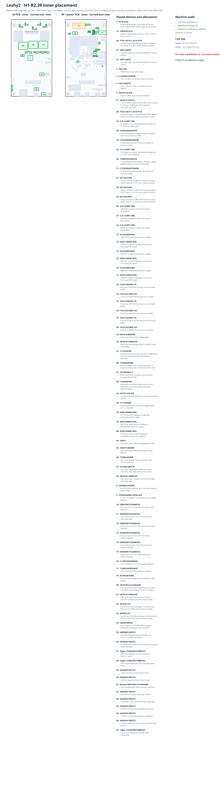
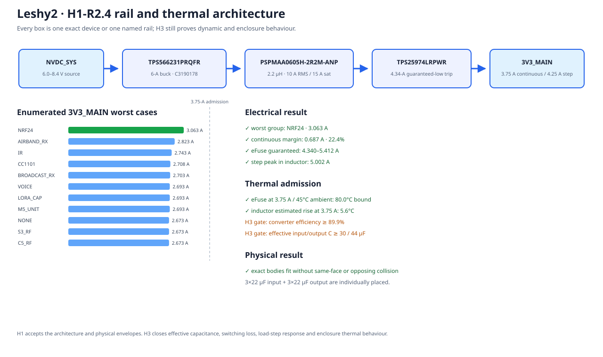
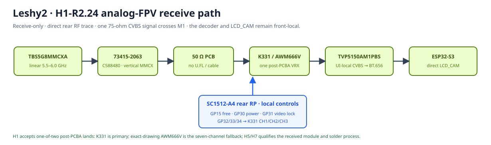

# ⭐ Leshy2

### An open autonomous multi-tool for radio, communications and authorized research

**2.4/5-GHz Wi‑Fi · BLE · 802.15.4 · 3× nRF24 · Sub‑GHz · VHF/UHF · FM/AM/SW/LW/Airband · analog FPV RX · IR · LoRa**

[Capabilities](docs/hardware.md) · [Mockup](#target-device-mockup) · [Schematics](docs/schematics.md) · [Roadmap](docs/roadmap.md) · [Firmware](https://github.com/anton-vinogradov/esp32-leshy2-firmware) · [Русский](README.ru.md)

**OPEN HARDWARE**　·　**MODULAR RF**　·　**FAIL-SAFE TX**　·　**REPAIRABLE**

> **Now: H1-R2.5 · the analog-FPV functional path and exact antenna are selected.**
> [H0-R2](docs/h0-r2-functional-architecture.md) adds a second `SC1512-A4`
> Hub, direct S3 analog-FPV capture and mandatory receive-only Airband AM.
> GPIO ownership and the factory-first Airband active BOM are closed. The Hub,
> Airband bodies and a replaceable K331 FPV receiver bay now have a collision-tested
> physical projection. K331 fits the reserved pins and power; its controlled
> body drawing and factory route remain open. The exact linear FPV antenna is
> selected. The Airband filter now has a generated nominal/stress
> feasibility audit and a larger tuning cell. The new 3V3_MAIN cell is now
> placed and accepts 3.75 A continuous / 4.25 A step; remaining placement, schematics and firmware
> contracts are still being regenerated. R1 H1–H5 remains evidence only.
> Purchasing, PCB routing and fabrication remain blocked.

**Direct UI and display · six compute domains · isolated radio groups · one autonomous instrument**

## What Leshy2 is

Leshy2 is a portable open instrument for radio observation, communications,
diagnostics and authorized security work. It brings different radio paths into
one autonomous device while physically separating loaded buses, power domains
and transmit safety.

| Capability | What the user gets |
|---|---|
| **Three independent nRF24 radios** | Concurrent `3R`, `1T2R`, `2T1R` and `3T`, with full RX/TX/mix |
| **Broad radio coverage** | 2.4/5-GHz Wi‑Fi, BLE, ESP‑NOW, 802.15.4, Sub‑GHz, VHF/UHF, FM/SW/Airband RX, analog 5.8-GHz FPV RX and IR |
| **Eleven antenna inputs** | Ten labelled SMA/RP-SMA paths plus a distinct MMCX `FPV RX 5.8G`; VHF and UHF have independent feeds |
| **Autonomous interface** | 3.5-inch `320×480` touch IPS, menus, waterfall, microSD and audio |
| **Modular expansion** | M5Stack U214/Leshy LoRa Cap and a protected M5 Unit port |
| **Recovery access** | Independent USB, RST/BOOT and internal DBG10 for compute owners |
| **Safety** | Quiet-state, TX evidence, watchdog, thermal shutdown and retained fault reason |

## How it is built

Six isolatable domains split the user interface, native radio/IR,
deterministic radio paths, high-speed peripheral fan-out, battery-pack
admission and independent safety automation.

- `ESP32-S3-WROOM-1U-N16R8` — UI, direct-QSPI display, analog FPV capture and Wi‑Fi/BLE.
- `ESP32-C5-WROOM-1U-N8R8` — 2.4/5-GHz Wi‑Fi, IEEE 802.15.4 and IR.
- `SC1512-A4` / RF RP2354B — 3× nRF24, Sub‑GHz, voice and Cap Bus.
- `SC1512-A4` / Hub RP2354B — C5/RF fan-out, storage, audio, FM/SW/Airband and M5 Unit.
- `MSPM0C1106SDGS20R` #1 — independent battery-pack admission.
- `MSPM0C1106SDGS20R` #2 — watchdog, thermal supervision and TX leases.

Unused interfaces are physically disabled and enter a verifiable quiet state.
See the [hardware architecture](docs/hardware.md) and
[safety levels](docs/safety.md) for details.

---

## Target device mockup

The compact diagram below is the current R2 architecture. The following
H1-R2.5 drawing is the current collision-tested incremental placement. The
complete exterior and sandwich views beneath it remain the accepted R1
geometric seed until all R2 bodies and the new rail stop moving.

[Open the readable current placement](docs/h1-r2-physical-layout.md) ·
[Rail and thermal result](docs/h1-r2-power-thermal.md) ·
[Analog-FPV path](docs/h1-r2-fpv.md) ·
[Airband filter feasibility](docs/h1-airband-filter.md).

Every view below is generated from the real envelopes of selected MPNs and one
coordinate model. Text outside component bodies on outer PCB faces is intended
silkscreen; inner faces carry no silkscreen.

### Outer faces

The main view opens this page; the detailed service, inner and edge views follow below.

### Programming and recovery

### Series navigation and replaceable display

### Inner sandwich faces

### Antenna-edge view

### Cross-sections

---

## Roadmap and current position

The roadmap remains on the landing page through printing/fabrication until manufacturing files are
explicitly released. The [full roadmap](docs/roadmap.md) contains dependencies
and exit criteria; [stage results](docs/stage-results.md) link published
drawings, schematics, contracts and checks.

| Stage | Status | Result |
|---|---|---|
| H0 · Product requirements and functional architecture | ✅ R2 Reviewed | [H0-R2 report](docs/h0-r2-functional-architecture.md) |
| **H1 · Physical product design** | **▶️ Current: H1-R2.5 FPV boundary and inner placement** | [Current result](docs/h1-r2-fpv.md) |
| H2 · Production ECAD schematic | ⏳ R1 evidence retained; waiting for R2 H1 | [H2 results](docs/stage-results.md#h2) |
| H3 · Virtual electrical verification | ⏳ rerun after R2 H2 | [R1 report](docs/h3-acceptance.md) |
| H4 · Joined pre-layout gate | ⏳ rerun after R2 H3 and firmware R2 contract | [R1 report](docs/h4-prelayout-gate-report.md) |
| H5 · Component evidence | ⏳ R1 routes retained; rebuild after R2 H4 | [R1 detail](docs/stage-results.md#h5) |
| H6 · PCB placement and routing | 🔒 Waiting for R2 H5 | [H6 plan](docs/stage-results.md#h6) |
| H7 · Prototype fabrication and bring-up | 🔒 Waiting for H6 and order approval | [H7 plan](docs/stage-results.md#h7) |
| H8 · Physical qualification | 🔒 Waiting for H7 | [H8 plan](docs/stage-results.md#h8) |
| H9 · Manufacturing release | 🔒 Waiting for H8 and firmware F11 | [H9 plan](docs/stage-results.md#h9) |

Every completed top-level `H*` phase receives a separate readable result report
linked from this table. Internal substeps update the exact marker but do not
create separate global reports.

**Hardware is at H1-R2.5.** H0-R2 fixes six compute domains, 33/33 used S3
GPIO, 45/48 used Hub GPIO and the receive-only Airband frequency plan. The
incremental Airband active BOM is live-checked at JLCPCB and costs `$20.2038`
before passives/assembly. The initial R2 placement adds four exact Airband
devices, Hub RP2354B, TVP5150 and a manufacturer-dimensioned MMCX without
same-face collisions;
26 opposing projections retain at least 2.44 mm against 0.70 mm required. The
exact `TPS7A2018PDBVR` part for the 1.8-V rail is accepted on the current
factory supply surface. A compact generated Airband LC candidate passes the
nominal reference mask and 95/105/155/220-MHz stress points, but its worst
180-MHz stress case is 34.62 dB against 40 dB required. It is therefore not a
production BOM; a 24×11-mm ground-fenced tuning cell with alternate/DNP pads is
reserved. H3 uses bounded pre-layout parasitics, H6 repeats with routed extraction
before the H7 order, and H8 closes the fitted/DNP state by VNA. Antenna ports and kit antennas now
share durable text codes, with colour only as redundant guidance. The R1 2.5-A
main rail is replaced by a placed `TPS566231PRQFR` / `PSPMAA0605H-2R2M-ANP`
cell. Twelve legal group states peak at 2.823 A; the accepted envelope is
3.75 A continuous / 4.25 A step, with a guaranteed 4.340-A eFuse threshold and
zero new body collision. `AKK K331` passes the reserved Hub pin and 5-V budget
fit, while `TBS5G8MMCXA` is the exact 13th kit antenna for the keyed
`FPV RX 5.8G` MMCX port. K331 remains a physical reserve until AKK-controlled
dimensions and a JLCPCB private/global-sourcing or explicit hand-install route exist.
H3 still proves effective capacitance, load-step,
switching loss and enclosure thermal behaviour. H1 must regenerate every complete physical view. No order is
authorized.

<!-- current-substep: H1-R2.5 -->

**Exact marker: `H1-R2.5`** — the [current placement](docs/h1-r2-physical-layout.md),
[power result](docs/h1-r2-power-thermal.md) and [FPV result](docs/h1-r2-fpv.md)
pass their machine audits. Next,
complete the remaining R2 body selection before regenerating all
views. This marker, its machine state and both language pages move together.

<strong>R1 evidence retained for reuse — not the current design</strong>

<!-- historical-substep: H5.0.3-R1 -->

**Exact marker: `H5.0.3-R1`** — the refreshed [physical-residual map](docs/component-evidence-map.md)
and [primary-source research](docs/component-source-research.md) are reviewed.
The [irreducible basket](docs/component-sample-basket.md) now contains 33 priced
lines for `$286.43`; the [platform map](docs/manufacturing-platform.md) assigns
all 210 BOM lines and 1052 placements to exact `J0`–`J3`/`J4-F`/`J4-P` routes
with zero replacement. Public/read-only evidence is exhausted. The no-order
JLCPCB's partial 26 August reply confirms SA818S-V MOQ 1 and a typical
8–15-working-day pre-order. It misunderstood the independent U/V positions as
a possible same-designator substitution, leaves most J4-F/J4-P lines open,
and conditionally reviews Function Test only after order. Accumulators are
`J5-U`, user-supplied and no longer a supplier gate. A precise clarification
reply is prepared but not sent.
[`H5-EVR08`](hardware/verification/generated/H5-EVR08-fallback-factory-readiness.json)
keeps PCBWay ready as the unsent full-device fallback and Seeed as the PCBA
second source.
No purchase, placement, routing or fabrication is authorized.

- ✅ `H1.8` — complete physical design accepted on 23 August 2026.
- ✅ `H2.0.1` — complete 1,081-row circuit inventory reviewed.
- ✅ `H2.0.2` — four projects, PCB boundaries and net names reviewed.
- ✅ `H2.0.3` — HW↔FW/BSP contract and cross-repository drift checks reviewed.
- ✅ `H2.1` — four independent KiCad projects and 28 native sheets created.
- ✅ `H2.2` — all ten UI/control PCB sheets reviewed.
- ✅ `H2.3` — all 12 functional RF/power PCB sheets are implemented and reviewed.
  - ✅ `H2.3.1` — `RF_00_ROOT`.
  - ✅ `H2.3.2` — `RF_01_USB_PD_CHARGE`.
  - ✅ `H2.3.3` — `RF_02_PACK_SAFETY_AON`.
  - ✅ `H2.3.4` — `RF_03_MAIN_RAILS_DOMAIN_GATES`.
  - ✅ `H2.3.5` — `RF_30_RP2354_CORE_SERVICE`.
  - ✅ `H2.3.6` — `RF_31_NRF24_X3`.
  - ✅ `H2.3.7-R1` — `RF_32_SUBGHZ_VOICE`: 143 components, 473 physical
    contacts, independent CC1101, SA818S-V and SA818S-U paths; reviewed.
  - ✅ `H2.3.8` — `RF_34_U214_M5_EXT`: 53 symbols, 52 board-fitted
    components, 228 contacts and two independently protected expansion paths;
    reviewed.
  - ✅ `H2.3.9` — `RF_35_REAR_CONTROLS`: seven fitted components, 36
    contacts and four independent direct controls; reviewed.
  - ✅ `H2.3.10` — `RF_36_AUDIO_IO_AMP`: 14 symbols, 34 contacts, exact
    microphone/amplifier footprints and two independent floating-BTL paths;
    reviewed.
  - ✅ `H2.3.11` — `RF_40_INTERBOARD_M1`: all 80 physical contacts and 51
    interfaces match UI-side M1 row-for-row; reviewed.
  - ✅ `H2.3.12` — `RF_50_TX_SAFETY_EVIDENCE`: 97 components and 369
    contacts, explicit AON power/bypass, hardware watchdog/latch/reset and five
    independent physical-RF evidence channels; reviewed.
  - ✅ `H2.3.13` — `RF_60_TESTPOINTS_MANUFACTURING`: 52 physical test pads,
    13 recovery paths and 6 RF-evidence channels; no purchased parts, child
    stubs or deferred fixture labels; reviewed.
- `H2.4` — display-adapter and LoRa Cap schematics.
  - ✅ `H2.4.1` — passive display adapter: both exact serial connectors, all
    40 one-to-one conductors and the manufacturer-derived FH34 footprint pass
    native KiCad review.
  - ✅ `H2.4.2` — LoRa Cap root, all three child sheets and the exact
    14-contact host boundary; native KiCad review passed.
  - ✅ `H2.4.3` — two exact regional one-of-two module options, direct final
    RF path, directional coupler, SMA and forward-power detector; reviewed.
  - ✅ `H2.4.4` — protected 3.3-V power and identity bus; eight serial
    components, 22 contacts and all five interfaces pass native KiCad review.
  - ✅ `H2.4.5` — independent physical-TX evidence: 11 serial components,
    34 contacts and a nominal 13.3-ms hardware pulse; native KiCad review passed.
- ✅ **`H2.5` — reviewed:** independent safety-path review.
  - ✅ `H2.5.1` — all sources, pack admission, charging and generated rails:
    [reviewed](docs/power-architecture.md).
  - ✅ `H2.5.2` — reset, boot, service and recovery:
    [reviewed](docs/service-recovery.md).
  - ✅ `H2.5.3` — no-back-power across USB, interboard and expansions:
    [reviewed](docs/interface-isolation.md).
  - ✅ `H2.5.4` — reset-safe quiet state and isolation of unused interfaces:
    [reviewed](docs/quiet-state.md).
  - ✅ `H2.5.5` — watchdog, thermal/fault supervision and `FAULT_KILL`:
    [reviewed](docs/fault-shutdown.md).
  - ✅ `H2.5.6` — [consolidated findings and closed review](docs/safety-review.md).
- ✅ `H2.6` — [native ERC and all 202 intentional NCs reviewed](docs/erc-review.md):
  four projects report zero native errors/warnings and every NC has a physical
  pin, exact marker and written rationale.
- ✅ `H2.7` — [H1, physical contacts, nets, M1 and firmware F2 reconciled](docs/hwfw-reconciliation.md):
  1,079 electrical identities, 270 root nets, 80 M1 contacts and 130
  controller allocations have zero remaining mismatch.
- ✅ **`H2.8` — reviewed:** formal final user acceptance before H3.
  - ✅ `H2.8.1` — [acceptance package and deferred gates prepared](docs/h2-acceptance.md).
  - ✅ `H2.8.2-R1` — accepted by the user on 26 August 2026; the exact
    source-hash baseline is recorded in the acceptance package.
- ✅ **`H3.0` — reviewed:** reproducible virtual-verification inputs and methods.
  - ✅ `H3.0.1` — [accepted H2 input and all 16 verification domains frozen](docs/virtual-verification.md).
  - ✅ `H3.0.2` — [parameter and model register complete](docs/parameter-model-register.md);
    three full-function nRF24 modules remain.
  - ✅ `H3.0.3` — [methods and ten pass/fail rules frozen](docs/verification-methods.md).
- ✅ **`H3.1` — reviewed:** worst-case DC budget.
  - ✅ `H3.1.1` — [43 source/charge and 2,032 complete states enumerated](docs/power-state-register.md).
  - ✅ `H3.1.2` — [all 200 rail profiles pass](docs/dc-power-budget.md); one eFuse threshold mismatch was corrected.
  - ✅ `H3.1.3` — [all 2,032 source/charge/discharge states pass](docs/source-charge-budget.md).
  - ✅ `H3.1.4` — [DC evidence consolidated and reviewed](docs/dc-verification-result.md).
- ✅ **`H3.2` — reviewed:** power transitions and safety-loop dynamics.
  - ✅ `H3.2.1` — [startup, orderly shutdown and hard `FAULT_KILL`](docs/power-transition-startup.md).
  - ✅ `H3.2.2` — [USB↔pack handover, DPM and brownout](docs/power-handover.md).
  - ✅ `H3.2.3` — [eFuse, inrush and load steps](docs/inrush-load-step.md).
  - ✅ `H3.2.4` — [watchdog, retained fault record and fault-only UI](docs/watchdog-fault-display.md).
  - ✅ `H3.2.5` — [H3.2 consolidation](docs/power-transition-result.md); two source errors corrected.
- ✅ **`H3.3` — reviewed:** analog peripheral corners.
  - ✅ `H3.3.1` — [display supply, backlight and direct-QSPI reviewed](docs/display-electrical-verification.md); two source errors corrected.
  - ✅ `H3.3.2` — [codec, microphone, headset, speaker and voice TX reviewed](docs/audio-electrical-verification.md); four source errors corrected.
  - ✅ `H3.3.3` — [IR receive, transmit, optical evidence and thermal limits reviewed](docs/ir-electrical-verification.md); four source errors corrected.
  - ✅ `H3.3.4` — [battery sensing, thermistors and analog fault thresholds reviewed](docs/battery-analog-verification.md); four source errors corrected.
  - ✅ `H3.3.5` — [all 154 leaf and 22 consolidation checks reviewed](docs/analog-corner-result.md); 14 source corrections closed.
- ✅ **`H3.4` — reviewed:** digital levels, timing and loading.
  - ✅ `H3.4.1` — [voltage levels, pulls, reset defaults and no-back-power reviewed](docs/digital-levels-verification.md).
  - ✅ `H3.4.2` — [bandwidth, latency and timing reviewed](docs/digital-timing-verification.md).
  - ✅ `H3.4.3` — [M1, U214, M5 Unit and service-boundary loading reviewed](docs/boundary-loading-verification.md).
  - ✅ `H3.4.4` — [171 leaf and 27 cross-domain digital checks reviewed](docs/digital-verification-result.md).
- ✅ **`H3.5` — reviewed:** RF feeds, return paths, corridors and coexistence.
  - ✅ `H3.5.1` — [feed, connector, matching and loss constraints reviewed](docs/rf-feed-constraints.md) for all ten antenna paths.
  - ✅ `H3.5.2` — [RF corridors, keepouts, reference planes and returns reviewed](docs/rf-layout-constraints.md).
  - ✅ `H3.5.3` — [isolation, quiet-state and concurrent 3×nRF24 reviewed](docs/rf-coexistence.md).
  - ✅ `H3.5.4` — [128 leaf and 22 cross-domain RF checks consolidated](docs/rf-verification-result.md).
- ✅ **`H3.6` — reviewed:** thermal, fault-tree and unattended-operation verification.
  - ✅ `H3.6.1` — [board, battery and enclosure thermal model reviewed](docs/thermal-model.md); charger TREG/TSHUT corrected.
  - ✅ `H3.6.2` — [30 single faults traced through independent shutdown and recovery](docs/single-fault-review.md).
  - ✅ `H3.6.3` — [`0 to 35 °C` engineering target, USB guidance and configurable full self-test reviewed](docs/unattended-operation.md); no operating-time promise is made.
  - ✅ `H3.6.4` — [70 leaf and 24 thermal/fault/endurance consolidation checks reviewed](docs/thermal-fault-result.md).
- ✅ **`H3.7` — reviewed:** final virtual-verification closure.
  - ✅ `H3.7.1` — [all H3 requirements, artifacts, H2 instances and root nets cross-checked](docs/h3-crosscheck.md).
  - ✅ `H3.7.2` — [all 85 physical-only residual rows published with evidence owners](docs/physical-evidence-register.md).
  - ✅ `H3.7.3` — [formal H3 acceptance package prepared](docs/h3-acceptance.md).
  - ✅ `H3.7.4` — explicit user acceptance recorded.
- ✅ `H4.0.1-R1` — current H3 hashes joined with reviewed firmware F3 evidence.
- ✅ `H4.1-R1` — H1 mechanics, H2 ECAD, H3 evidence and firmware F3 joined.
- ✅ `H4.2-R1` — repeated join contains no stale source or open virtual contradiction.
- ✅ `H4.3-R1` — refreshed [joined pre-layout report reviewed](docs/h4-prelayout-gate-report.md).
- ✅ `H5.0.1-R1` — [nine residuals and 14 mechanical gates remapped](docs/component-evidence-map.md) for both serial SA818S modules.
- ✅ `H5.0.2-R1` — [primary sources and serial alternatives reviewed](docs/component-source-research.md); exact U/V routes retained and CE recorded as a non-silent qualified-pending UHF alternate.
- ▶️ `H5.0.3-R1` — basket and 210-route map complete; partial JLCPCB reply recorded, with exact SA818S-V MOQ/typical lead known; accumulators are user-supplied `J5-U`; two-designator/J4-F/J4-P clarification open; PCBWay fallback not contacted.

The reviewed H2 plan is [`h2-schematic-plan.json`](hardware/ecad/h2-schematic-plan.json).
The completed H3/H4 plans are [`h3-verification-plan.json`](hardware/verification/h3-verification-plan.json)
and [`h4-prelayout-plan.json`](hardware/verification/h4-prelayout-plan.json);
the current plan is [`h5-component-evidence-plan.json`](hardware/verification/h5-component-evidence-plan.json).
Closing each subtask changes this marker and both roadmap pages in the same commit.

Firmware F3 has passed before H7: target skeletons for all five domains build,
image-size/rollback gates pass, S3 executes in exact QEMU, and unavailable
non-S3 peripheral evidence remains assigned to later dev-board/HIL gates. This
reviewed input is inherited through H4; it does not authorize fabrication.

<!-- BEGIN GENERATED PRINCIPLE DIAGRAMS -->

## Principle diagrams and electrical implementation

The device principle diagrams remain part of the site, but the landing page now routes to a [readable functional-domain atlas](docs/schematics.md). The [exact pin assignment](docs/pinout.md), [inter-board M1 map](docs/interconnect.md) and [hardware architecture](docs/hardware.md) are published alongside it.

<!-- END GENERATED PRINCIPLE DIAGRAMS -->

## Documentation

| Section | Contents |
|---|---|
| [Hardware architecture](docs/hardware.md) | Capabilities, MPNs and domain structure |
| [Principle diagrams](docs/schematics.md) | Component links and current KiCad sheets |
| [Pin assignment](docs/pinout.md) | Exact GPIOs, nets, directions and owners |
| [Inter-board M1](docs/interconnect.md) | All 80 contacts and physical crossing |
| [Memory and rollback](docs/memory.md) | Flash/PSRAM, partitions and recovery |
| [Safety](docs/safety.md) | Three feature levels, TX leases and FAULT_KILL |
| [LoRa Cap](docs/lora-cap.md) | Removable regional LoRa module |
| [Manufacturing platform](docs/manufacturing-platform.md) | PCBA reference, availability tiers and exact assembly boundary |
| [Physical sources](docs/physical-source-register.md) | Envelope source for every body |
| [Stage results](docs/stage-results.md) | H0…H9 artifacts and evidence |

**Leshy2 — see the spectrum, understand the path, stay in control.**

