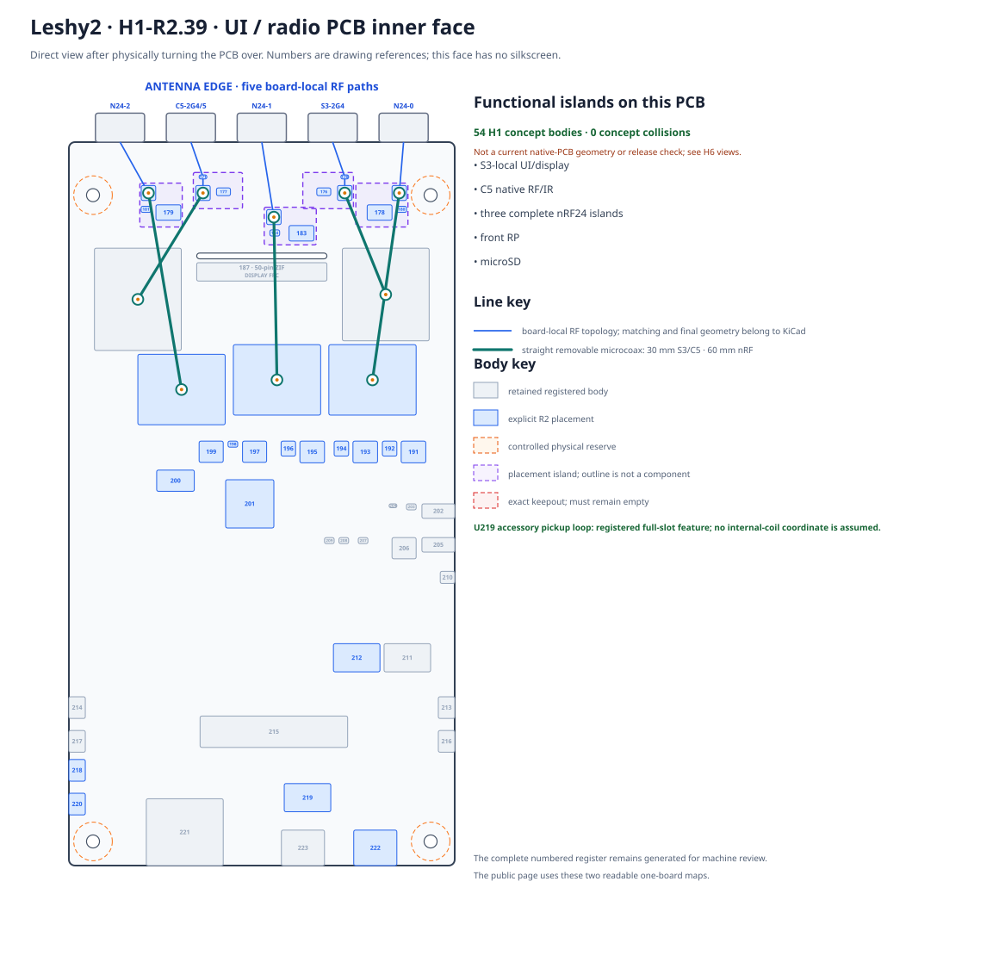
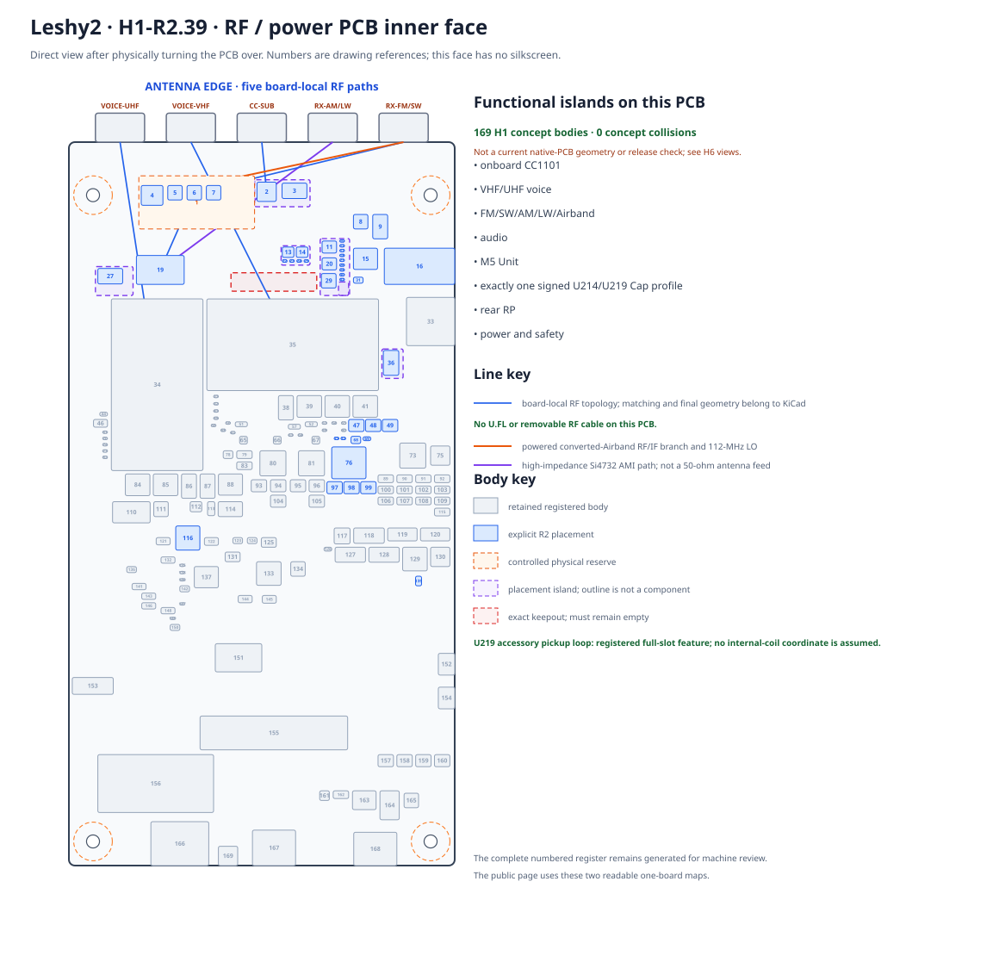

# Leshy2 ⭐

### Open autonomous hardware for radio, communications and authorized research

**2.4/5-GHz Wi-Fi · BLE · 802.15.4 · 3× nRF24 · Sub-GHz · VHF/UHF · FM/AM/SW/LW/Airband · analog FPV RX · IR · LoRa expansion**

[Capabilities](docs/hardware.md) · [How it is built](docs/h0-r2-functional-architecture.md) · [Schematics](docs/schematics.md) · [Roadmap](docs/roadmap.md) · [Firmware](https://github.com/anton-vinogradov/esp32-leshy2-firmware) · [Русский](README.ru.md)

> **Current hardware marker: `H1-R2.18`.** The two-PCB physical model is in progress. Ten main SMA ports are split `5 + 5`; the separate vertical rear-face MMCX is `FPV RX · 5.8G`. Placement and interboard budgets pass, but KiCad and ordering remain blocked until the controlled K331 production package closes H1.

## What it is

Leshy2 is a portable, repairable instrument for radio observation,
communications, diagnostics and authorized security work. It keeps the user
interface responsive while active radio groups run on local buses and unused
interfaces enter a hardware-verifiable quiet state.

| Capability | Finished-device result |
|---|---|
| Three nRF24 radios | Concurrent full RX/TX/mixed modes: `3R`, `1T2R`, `2T1R`, `3T` |
| Native wireless | S3 Wi-Fi/BLE and C5 2.4/5-GHz Wi-Fi, 802.15.4 and IR |
| Dedicated RF | CC1101 Sub-GHz, independent VHF/UHF voice, FM/AM/SW/LW/Airband RX |
| Video | Receive-only analog 5.8-GHz FPV through a dedicated rear MMCX |
| Interface | 3.5-inch 320×480 touch IPS over direct 32-MHz i8080-8, direct S3 buttons, waterfall, microSD and audio |
| Expansion | Rear U214 LoRa Cap rail and protected M5 Unit interface |
| Recovery | Four independent USB paths, recessed per-controller controls and DBG10 fallbacks |
| Unattended safety | TX evidence, watchdog, thermal supervision, hard power-off and retained fault reason |

Transmission and intrusive laboratory functions are separated from ordinary
use by the [three-level safety model](docs/safety.md). Installation requires the
user to accept the non-aggression/authorized-use terms.

## How it is built

The front UI/radio PCB owns S3, C5, all three complete nRF24 islands, the front
RP, microSD and the TVP5150 decoder. The rear RF/power PCB owns CC1101,
VHF/UHF voice, broadcast/Airband, audio, K331 FPV, M5/U214, the rear RP, power
and independent safety.

Only one 75-ohm CVBS signal crosses the 80-contact M1 connector. The decoder's
11-line camera bus and the independent i8080-8 display TX path remain local to
S3; nRF payload remains local to the front RP. M1 is fully assigned: 25 live
signals, 14 main-power contacts, 2 AON contacts, 25 defined returns and 14 NC
reserves.

### Front PCB · inner face

### Rear PCB · inner face

The drawings are generated from one machine-readable placement source. Inner
labels are drawing references, not silkscreen. The complete 163-body projection
is retained as machine-review evidence and intentionally omitted from this page.

[Open the readable physical result](docs/h1-r2-physical-layout.md) ·
[Power and thermal result](docs/h1-r2-power-thermal.md) ·
[Analog-FPV path](docs/h1-r2-fpv.md) ·
[Airband filter feasibility](docs/h1-airband-filter.md)

## Schematics and interfaces

The public site keeps the principle schematics needed to understand the finished
device:

- [component and bus schematics](docs/schematics.md);
- [working principle pin design](docs/h0-r2-functional-architecture.md#working-principle-pin-design);
- [external programming and recovery](docs/h1-r2-physical-layout.md#what-the-user-sees);
- [safety and hard-off architecture](docs/safety.md).

## Roadmap and current position

The roadmap stays on this landing page until prototype fabrication is approved.
Firmware has its own [independent roadmap](https://github.com/anton-vinogradov/esp32-leshy2-firmware/blob/main/docs/roadmap.md).

| Stage | Status | Published result |
|---|---|---|
| H0 · Requirements and functional architecture | ✅ Reviewed · R2 | [H0-R2 result](docs/h0-r2-functional-architecture.md) |
| **H1 · Physical product design** | **▶ Current · `H1-R2.18`** | [Current placement](docs/h1-r2-physical-layout.md) |
| H2 · Production ECAD schematic | ⏳ Waiting for R2 H1 | [Stage page](docs/stage-results.md#h2) |
| H3 · Virtual electrical verification | ⏳ Waiting for R2 H2 | [Stage page](docs/stage-results.md#h3) |
| H4 · Joined hardware/firmware pre-layout gate | ⏳ Waiting for R2 H3 and firmware contract | [Stage page](docs/stage-results.md#h4) |
| H5 · Component and factory evidence | ⏳ Waiting for R2 H4 | [Stage page](docs/stage-results.md#h5) |
| H6 · KiCad placement and routing | 🔒 Waiting for R2 H5 | [Stage page](docs/stage-results.md#h6) |
| H7 · Prototype fabrication and bring-up | 🔒 Waiting for H6 and explicit order approval | [Stage page](docs/stage-results.md#h7) |
| H8 · Physical qualification | 🔒 Waiting for H7 | [Stage page](docs/stage-results.md#h8) |
| H9 · Manufacturing release | 🔒 Waiting for H8 and firmware F11 | [Stage page](docs/stage-results.md#h9) |

### Current H1 composition

- ✅ Functional islands and front/rear RP GPIO budgets: `46/48` (2 free) and `45/48` (3 free); K331 RSSI is officially NC.
- ✅ Ten main antenna ports repartitioned `5 + 5`; no main RF trace crosses M1.
- ✅ Direct i8080-8 display closes at 32 MB/s while buttons, encoder, USB and camera RX remain direct S3 paths.
- ✅ M1 has a complete 80-contact map and an enclosure load path: four 11-mm stops, anti-shear datums and independent PCB capture.
- ✅ Antenna silkscreen passes generated body/cable/accessory/fastener no-overlap checks.
- ✅ Vertical Molex `73415-2063` FPV MMCX: exact JLCPCB route, SMT-only, no interboard tail.
- ✅ Placement audit: zero same-face collisions; 1.44 mm minimum opposing clearance against 0.70 mm required.
- ✅ Public exterior, separate readable inner faces, service surface and real section views regenerated.
- ▶ **Exact current point:** obtain one AKK-controlled K331 package with maximum XYZ, land pattern and packaging/reflow evidence.
- 🔒 KiCad, prototype purchase and fabrication remain unauthorized.

Every closed top-level `H*` phase publishes a bilingual readable report linked
from the table. Internal substeps update this exact marker and both repositories,
but do not pretend that a whole phase has been reviewed.

<!-- current-substep: H1-R2.18 -->

## Repository

Hardware documentation and generators live here. Firmware lives in
[`esp32-leshy2-firmware`](https://github.com/anton-vinogradov/esp32-leshy2-firmware).
Both repositories are open; signed releases protect update authenticity without
preventing owners from building and signing their own firmware.
