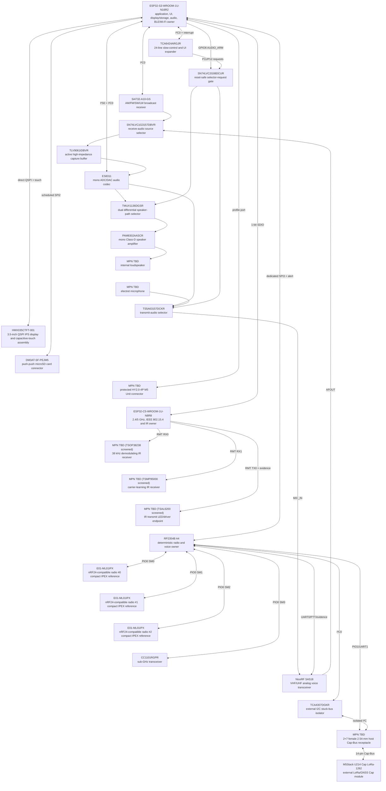

# Leshy2 Hardware

> **Target product site.** This page describes the finished Leshy2: its purpose,
> capabilities, interfaces, principled design and mandatory guarantees.
> Engineering progress and open validation work live in separate documents.

- [Русская версия](README.ru.md)
- [Firmware target product](https://github.com/anton-vinogradov/esp32-leshy2-firmware)
- [Current engineering state](docs/status/current-state.md)
- [Engineering decisions and evidence](docs/review/README.md)

## Finished-product intent

Leshy2 is an open, autonomous and portable instrument for spectrum observation,
diagnostics, communication and authorized research into wireless and contact
systems. It combines independent radio paths, a display, local controls, data
recording, audio, service access and expansion in one repairable device.

It is a field instrument rather than a general-purpose pocket computer: every
hardware capability must produce a measurable result, have a defined safe
state and remain diagnosable and recoverable by its owner.

## Three functional levels

1. **Main** — everyday tools, reception, diagnostics, navigation, maintenance
   and legitimate communications.
2. **Lab** — passive, defensive and bounded security-research tools.
3. **Lab → Controlled Zone** — dangerous active or disruptive tools. Every
   entry displays a fresh non-suppressible warning; every action separately
   requires an authorized target, isolated/conducted environment, or both.

Initial setup separately requires acceptance of the non-aggression pledge.
Neither acknowledgement arms a tool or overrides law, spectrum licensing,
privacy or the target owner's authorization.

## Finished-device capabilities

### Radio and communication

- Three independent full-function nRF24 paths operate concurrently in every
  `3R`, `1T2R`, `2T1R` and `3T` mix without silently disabling peer receivers.
- Three separated nRF antennas provide calibrated relative sector/RPD
  comparison. The result is never presented as absolute dBm, angle or VSWR.
- 2.4/5 GHz Wi-Fi, Bluetooth LE, ESP-NOW and IEEE 802.15.4 provide ordinary
  communication, observation and authorized diagnostic workflows.
- A dedicated Sub-GHz path handles packet systems; a broadcast receiver covers
  AM/FM/SW/LW; a VHF/UHF voice path provides analog communication and audio.
- Two IR receivers provide robust consumer decoding and unknown-carrier
  measurement at the same time; a separate transmitter replays learned profiles.
- All nine onboard antenna paths terminate at dedicated external ports: two
  RP-SMA for native Wi-Fi and seven standard SMA for the remaining paths.

### Interfaces and expansion

- A portrait 3.5-inch `320×480` touch IPS display uses direct QSPI; critical
  state and first menu feedback appear within `100 ms`.
- microSD stores spectrum records, audio, profiles, logs and exported data.
- A rear 14-pin Cap-Bus accepts the removable M5Stack U214 LoRa/GNSS and
  compatible modules; a separate protected M5 Unit port supports GNSS,
  qualified LoRa modules, NFC, iButton/1-Wire and other extensions.
- A qualified raw-SDR or external RF-analysis module may define a separate
  high-throughput interface; a low-rate M5 command port is never presented as
  a raw-data path.
- Rare long-form text entry may use a locally paired phone, but the phone cannot
  authorize dangerous actions or replace controls on Leshy2.
- An external IMU may annotate measurements with pose and relative motion;
  without a qualified mount it is never presented as a compass or RF bearing.

### Serviceability

- Every programmable compute domain has its own programming, recovery and
  diagnostic path and does not depend on a healthy peer domain.
- Signed updates validate their target and support rollback. Build keys and the
  ability to install owner firmware remain owner-controlled; irreversible
  lockdown is not enabled by default.

## Principled solution design

Three compute domains separate the UI, broadband wireless functions and
deterministic radio service. Independent buses keep an active radio path from
waiting for the display, storage or another radio. Unused interfaces enter a
verified electrically quiet state.

The diagram is maintained as a narrow top-to-bottom projection of the target
internals. Every box represents one physical component and includes its MPN or
an explicit `MPN TBD`, together with its role in the finished device.

<strong>Principled pin assignment</strong>

- **S3↔C5:** S3 `GPIO10,GPIO11,GPIO12,GPIO13`; C5
  `GPIO7,GPIO8,GPIO9,GPIO10` — dedicated 1-bit SDIO.
- **S3↔RP:** S3 `GPIO3,GPIO9,GPIO14,GPIO21,GPIO48`; RP
  `GPIO19,GPIO24,GPIO25,GPIO26,GPIO27` — dedicated SPI plus alert.
- **Display and microSD:** S3
  `GPIO4,GPIO5,GPIO35,GPIO36,GPIO38,GPIO39,GPIO40,GPIO41,GPIO42` — direct QSPI
  and the only scheduled high-rate shared pair.
- **Audio and Si4732:** S3 `GPIO1,GPIO2,GPIO15,GPIO16,GPIO17,GPIO18` — I²S0
  and local I²C0.
- **M5 Unit:** S3 `GPIO7,GPIO8` — separate configurable profile port.
- **IR:** C5 `GPIO0,GPIO1,GPIO4,GPIO6,GPIO24` — two RX, TX, power and evidence.
- **nRF24 #0:** RP `GPIO0,GPIO1,GPIO2,GPIO30,GPIO31,GPIO32`.
- **nRF24 #1:** RP `GPIO3,GPIO4,GPIO5,GPIO33,GPIO34,GPIO35`.
- **nRF24 #2:** RP `GPIO6,GPIO7,GPIO8,GPIO36,GPIO37,GPIO38`.
- **CC1101:** RP `GPIO9,GPIO10,GPIO11,GPIO23,GPIO39,GPIO42,GPIO43`.
- **SA518/PTT:** RP `GPIO16,GPIO17,GPIO18,GPIO20,GPIO21,GPIO22`.
- **U214 LoRa/GNSS:** RP
  `GPIO12,GPIO13,GPIO14,GPIO28,GPIO29,GPIO40,GPIO41,GPIO44,GPIO45,GPIO46,GPIO47`.
- **Resource result:** S3 `32 used / 3 reserved / 1 free`, C5 `14/6/1`, RP
  `48/0/0` and slow I/O `24/0/0`. Independent SWD/USB/RUN/BOOTSEL are outside
  this GPIO budget.

[Complete physical pad and net atlas](docs/review/architecture/generated/G2F-3I-principled-pinout.md)

## Physical design and controls

- The display is portrait-oriented; the waterfall redraws small regions and
  never blocks radio service.
- Nine labelled antenna ports retain an unambiguous association between each
  connector, radio path and active antenna profile.
- The removable U214 mounts across the rear above the batteries while keeping
  its own antennas and connectors accessible.
- Physical PTT, STOP and recessed RE-ARM are separate controls. STOP has an
  independent indicator and does not depend on the display.
- Programming and diagnostic connectors remain accessible on an assembled
  prototype and do not require a healthy application image.

## Safety and measurement integrity

- Every transmitter and Lab action starts disarmed after power, reset, update,
  watchdog or brownout.
- Initial transmission uses a conservative profile. Maximum power appears only
  after an explicit choice for the current scenario.
- Physical STOP dominates firmware and inter-processor communication. Releasing
  STOP never restores a previous target, channel, power or TX lease.
- Commanded TX, path current, radio-reported state and independent actual-TX
  evidence remain distinct. Unknown is never promoted to success or safety.
- Unused interfaces are powered down or enter a verified quiet state so they do
  not delay or desensitize the active signal group.
- Cost reduction is accepted only when capability, performance, safety,
  reliability, autonomy, serviceability and testability remain equivalent.

## Product boundary

The base product excludes 6 GHz/Wi-Fi 6E, generic USB host, a personal
FIDO/U2F authenticator, an integrated keyboard, a motor and an onboard IMU.
BadUSB/DuckyScript may exist only as an optional Controlled-Zone software
feature over the existing USB device path and does not shape the radio
instrument's hardware architecture.

## Project documentation

- [Current hardware engineering state](docs/status/current-state.md)
- [Principled pin map](docs/review/architecture/PIN-0003-g2f-3i-principled-pinout.md)
- [Complete requirements, decisions and evidence ledger](docs/review/README.md)
- [Firmware target product](https://github.com/anton-vinogradov/esp32-leshy2-firmware)
