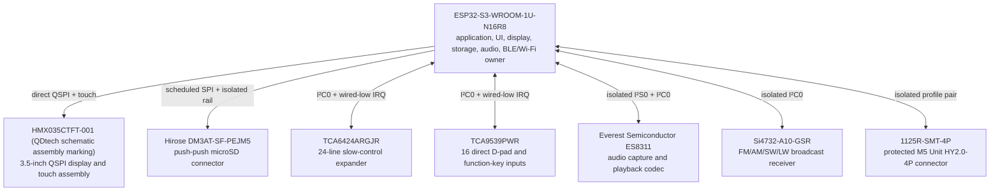
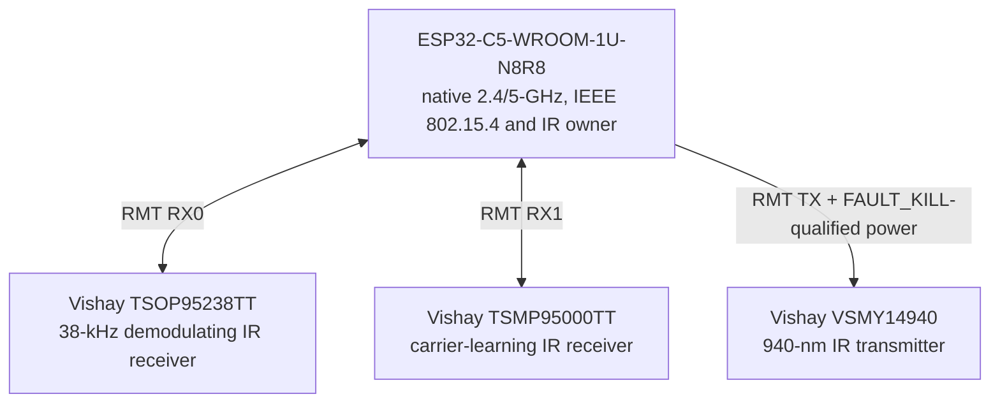
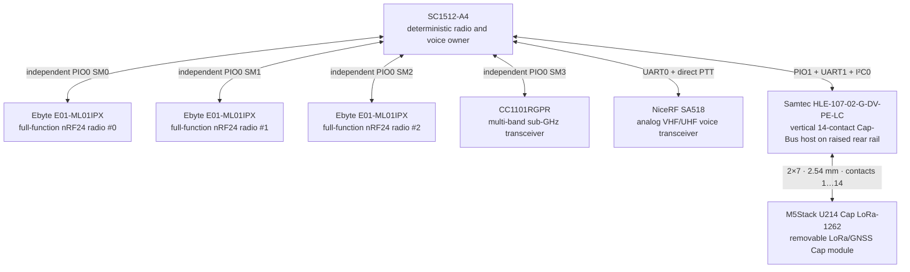
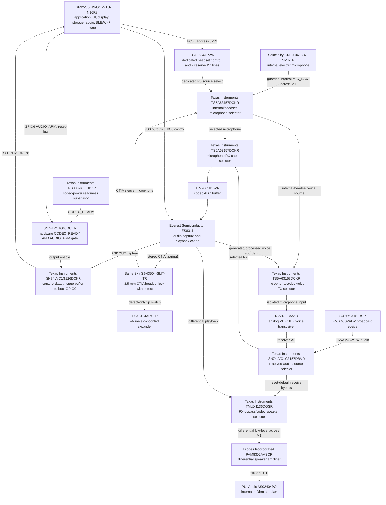
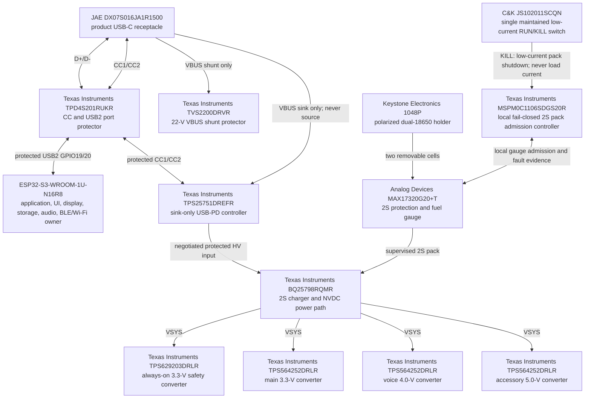

# Leshy2 hardware

[Русский](README.ru.md) · [Firmware](https://github.com/anton-vinogradov/esp32-leshy2-firmware)

> **Hardware status: H2 — production ECAD schematic.** The H1 physical design
> is accepted. Schematic work is active; PCB routing and purchasing remain blocked.
> Follow the [hardware roadmap](docs/roadmap.md).

## Roadmap and current position

This block stays on the landing page until manufacturing files are explicitly
released for printing/fabrication. The [full roadmap](docs/roadmap.md) contains
dependencies and exit criteria.

| Stage | Status | Result |
|---|---|---|
| H0 · Product requirements and functional architecture | ✅ Reviewed | capability scope, compute domains, owners, interfaces and safety rules |
| H1 · Physical product design | ✅ Reviewed | accepted exterior/inner arrangement, real dimensions, controls, labels and feasible resource allocation |
| **H2 · Production ECAD schematic** | **▶️ Current** | exact symbols, pins, footprints, values, nets and clean ERC |
| H3 · Virtual electrical verification | ⏳ Waiting for H2 | power, transient, thermal, timing, RF and fault evidence |
| H4 · Joined pre-layout gate | 🔒 Waiting for H1–H3 and firmware F3 | closed virtual blockers and named physical uncertainties |
| H5 · Component evidence samples | 🔒 Waiting for H4 and cost approval | received-part identity, dimensions and fit evidence |
| H6 · PCB placement and routing | 🔒 Waiting for H5 | reviewed two-board layout, DRC and manufacturing package |
| H7 · Prototype fabrication and bring-up | 🔒 Waiting for H6 and order approval | prototype boards, rail/boot/recovery and interface smoke tests |
| H8 · Physical qualification | 🔒 Waiting for H7 | RF, power, thermal, safety, endurance and full 3×nRF24 HIL |
| H9 · Manufacturing release | 🔒 Waiting for H8 and firmware F11 | reproducible BOM/fab/test package and compatible release tags |

**Hardware is at H2.** The production schematic is being created; there is no
PCB layout or target-emulator run, and no order is authorized.

### Current phase H2 — detailed position

<!-- current-substep: H2.3.3 -->

**Exact marker: `H2.3.3`** — implement and review pack admission, always-on
safety and independent supervision on `RF_02_PACK_SAFETY_AON`.

- ✅ `H1.8` — complete physical design accepted on 23 August 2026.
- `H2.0` — freeze authoritative schematic inputs and project structure.
  - ✅ `H2.0.1` — complete 997-row circuit inventory reviewed: 969 main-device
    instances plus 26 common and 2 alternative LoRa-Cap instances.
  - ✅ `H2.0.2` — four-project sheet graph, board boundaries and net naming reviewed.
  - ✅ `H2.0.3` — generated 123-contact HW↔FW/BSP contract and cross-repository drift checks reviewed.
- ✅ `H2.1` — four independent KiCad projects, 28 native sheet files and
  repository-controlled library tables created; KiCad 10 parser/empty ERC passed.
- ✅ `H2.2` — implement and review UI/control PCB sheets.
  - ✅ `H2.2.1` — UI root reviewed: nine child sheets, 95 exact cross-sheet
    nets and 232 named pins/child labels; direct root rails parse in KiCad.
  - ✅ `H2.2.2` — S3 core reviewed: 32 exact ledger components plus the module
    U.FL assembly boundary, all 41 carrier pads and 39 hierarchy interfaces.
  - ✅ `H2.2.3` — reviewed 49 exact display/touch/storage instances: the
    40-contact panel, all 11 microSD contacts, protected backlight, data
    isolation and all 18 hierarchy interfaces.
  - ✅ `H2.2.4` — reviewed 71 exact control/indicator components: 15 serial
    switches, slow/matrix I/O, thermal/ESD paths, nine actual-TX LEDs, the
    hardware FAULT LED, 45 hierarchy interfaces and three explained NC pins.
  - ✅ `H2.2.5` — reviewed 102 exact codec/headset components: all 21 ES8311
    contacts, the six-contact CTIA jack, five analog selectors, power/interface
    isolation, 24 hierarchy interfaces and eight explained NC pins.
  - ✅ `H2.2.6` — reviewed 59 exact C5/IR/service BOM instances plus the
    factory ANT1 boundary: all 32 carrier pads, two IR receive paths,
    fail-closed IR TX, data-only USB, recovery and 18 hierarchy interfaces.
  - ✅ `H2.2.7` — reviewed 32 exact FM/AM/SW/LW receiver components: two
    distinct antenna ports, full Si4732 power/control/clock/audio circuitry,
    eight hierarchy interfaces and four explained NC pins.
  - ✅ `H2.2.8` — exact UI-side M1 reviewed: all 80 physical contacts,
    51 hierarchy interfaces, 20 actual power returns, no reserves or NCs.
  - ✅ `H2.2.9` — reviewed 28 exact TX safety/evidence components: two RF
    detectors, a physical optical IR sensor, four comparator channels, two
    reset sinks and 18 hierarchy interfaces; one NC is explained.
  - ✅ `H2.2.10` — reviewed 11 exact physical 1.0-mm manufacturing/test pads;
    each has one real net, stable fixture identity and no false BOM/MPN entry.
- ▶️ `H2.3` — implement and review RF/power PCB sheets.
  - ✅ `H2.3.1` — `RF_00_ROOT` reviewed: 12 child sheets, 133 exact
    cross-sheet nets and 301 explicit pins/labels; the current ERC findings
    are exactly accounted component-empty child stubs.
  - ✅ `H2.3.2` — `RF_01_USB_PD_CHARGE` reviewed: 52 exact components,
    208 physical package pads, protected sink-only USB-PD, 2S/750-kHz NVDC
    charging, nine hierarchy interfaces and ten explained NC contacts.
  - ▶️ **`H2.3.3` — current:** pack admission and always-on safety.
  - ⏳ `H2.3.4` — main rails and quietable domain gates.
  - ⏳ `H2.3.5` — RP2354 core, flash and service access.
  - ⏳ `H2.3.6` — three independent full-function nRF24 paths.
  - ⏳ `H2.3.7` — Sub-GHz and VHF/UHF voice paths.
  - ⏳ `H2.3.8` — U214 and protected M5 Unit expansion.
  - ⏳ `H2.3.9` — rear controls and encoder.
  - ⏳ `H2.3.10` — speaker, microphone and audio amplification.
  - ⏳ `H2.3.11` — RF/power side of the exact 80-contact M1 contract.
  - ⏳ `H2.3.12` — RF-side TX safety and physical evidence.
  - ⏳ `H2.3.13` — RF/power manufacturing/test pads.
- ⏳ `H2.4` — implement and review display-adapter and LoRa-Cap sheets.
- ⏳ `H2.5` — independently review power, boot, recovery, quiet-state and
  `FAULT_KILL` paths.
- ⏳ `H2.6` — close ERC and justify every intentional no-connect.
- ⏳ `H2.7` — reconcile schematic contacts with H1, M1 and firmware F2.
- 🔒 `H2.8` — formal final user acceptance before H3.

The exact machine-readable execution plan is
[`h2-schematic-plan.json`](hardware/ecad/h2-schematic-plan.json). Closing any
substep updates this marker and both roadmap pages in the same commit. A later
functional or physical correction reopens every affected review gate.

Leshy2 is an open, autonomous instrument for radio observation,
communications, diagnostics and authorized research of wireless and contact
systems. This documentation describes what the target device does and how it
is built.

## What the device can do

- Operate three full-function nRF24 radios concurrently in `3R`, `1T2R`,
  `2T1R` and `3T` combinations.
- Work with 2.4/5-GHz Wi-Fi, Bluetooth LE, ESP-NOW, IEEE 802.15.4,
  315/433/868/915-MHz Sub-GHz, FM/AM/SW/LW, VHF/UHF voice and IR.
- Route all nine onboard RF paths to outward-face antenna jacks: two RP-SMA
  and seven SMA ports. Neither connector bank occupies the interboard channel.
- Use a [profiled 12-item antenna kit](docs/antennas.md): nine can stay
  connected at once, with clearly labelled interchangeable items for
  315/433/868/915 MHz and VHF/UHF.
- Show menus, a spectrum waterfall and path state on a 3.5-inch portrait
  `320×480` touch IPS display driven by direct QSPI.
- Record data and audio to removable microSD, play through the speaker or a
  CTIA headset, and capture from either the built-in or headset microphone.
- Accept a rear M5Stack U214 for LoRa receive/GNSS or the exact
  [Leshy LoRa Cap](docs/lora-cap.md) for evidence-qualified EU868/US915 RX/TX,
  plus a separately protected M5 Unit port for other external modules.
- Give the owner independent programming, recovery and diagnostic paths for
  every programmable controller.

## How it is built

The device contains five isolatable compute and control domains. The
`ESP32-S3-WROOM-1U-N16R8` owns UI, display, storage and audio;
`ESP32-C5-WROOM-1U-N8R8` owns native 2.4/5-GHz radio, IEEE 802.15.4 and IR;
`SC1512-A4` (RP2354B) owns the three nRF24 radios, Sub-GHz, voice and U214;
one `MSPM0C1106SDGS20R` independently admits the battery pack; a second
`MSPM0C1106SDGS20R` owns the watchdog, thermal supervision and TX leases.
Unused interfaces are powered down and placed into a verifiable quiet state.

## Device layout

### External and inner board faces

Five exact series navigation buttons and their clearances have a separate
machine-checked placement drawing.

The first projection shows only the outward, user-facing PCB sides: display,
controls, labelled RF ports, indicators and side interfaces. The second shows
the two mirrored inner faces and the exact devices inside the sandwich. A
number inside a component outline maps to the adjacent exact MPN and role. The
same drawing also shows all five RF cable routes/reserves and the seven encoder
terminals that enter the interboard channel; final PCB copper remains a KiCad
DRC gate.
On the UI board, a solid green line is only the removable 30-mm cable from a
module's built-in U.FL to the board U.FL receptacle; its dashed blue continuation
shows the future 50-ohm PCB mainline through the TX coupler to the outward RP-SMA.
On the RF board, the same physical nRF24 cable sections are cyan.
The concentric ring inside each S3/C5 module is its built-in U.FL; the numbered
ring at the other end is the separate board receptacle and visible cable/trace
boundary. Each nRF module also shows its published IPEX connector; its position
is schematic because the exact generation and axis remain an H5 specimen check.
Every solid cable is a direct connector-to-connector 2D projection. The selected
assembly is 30 mm long, so its excess over the roughly 15-mm S3/C5 chord is 3D
slack rather than a PCB-like sequence of right-angle bends.
Matching blue topology guides connect all nine labelled antenna ports to S3,
the two Si4732 inputs, C5, all three nRF24 modules, CC1101 and SA518.

### Top view from the antenna edge

The true top projection looks along the board from its antenna edge and shows
the sandwich width and depth, both antenna banks and the symmetric Cap
overhang.

### Sandwich sections

Section A–A crosses the LoRa Cap zone; B–B crosses the battery and rear-control
zone. Different longitudinal zones are never combined in one projection.

<!-- BEGIN GENERATED PRINCIPLE DIAGRAMS -->

## Principle component interconnections

Read the architecture from its three compute owners, not from the USB port.
The first map shows only inter-processor links; the following maps expand
each owner's devices and the independent power path. Every box is one
physical device with its selected part number or an explicit ‘not selected’
mark and product role; no box combines different devices.

### Compute ownership map

### S3: user interface, storage, audio and native expansion

### C5: native 2.4/5 GHz, 802.15.4 and IR

### RP: deterministic radios, voice and Cap Bus

### Controls: from each physical switch to its owner

```mermaid
flowchart TD
S3["ESP32-S3-WROOM-1U-N16R8<br/>application, UI, display, storage, audio, BLE/Wi-Fi owner"]
RP["SC1512-A4<br/>deterministic radio and voice owner"]
UI_MATRIX_IO["TCA9539PWR<br/>16 direct D-pad and function-key inputs"]
UI_DPAD_UP["OMRON B3S-1100P<br/>independent UP navigation button"]
UI_DPAD_DOWN["OMRON B3S-1100P<br/>independent DOWN navigation button"]
UI_DPAD_LEFT["OMRON B3S-1100P<br/>independent LEFT navigation button"]
UI_DPAD_RIGHT["OMRON B3S-1100P<br/>independent RIGHT navigation button"]
UI_DPAD_OK["OMRON B3S-1100P<br/>independent OK confirmation button"]
UI_SWITCH_BACK["OMRON B3S-1100P<br/>BACK button"]
UI_SWITCH_OPT["OMRON B3S-1100P<br/>OPT button"]
UI_SWITCH_F1["OMRON B3S-1100P<br/>left display-side F1 button"]
UI_SWITCH_F2["OMRON B3S-1100P<br/>left display-side F2 button"]
UI_SWITCH_F3["OMRON B3S-1100P<br/>left display-side F3 button"]
UI_SWITCH_F4["OMRON B3S-1100P<br/>left display-side F4 button"]
UI_SWITCH_F5["OMRON B3S-1100P<br/>right display-side F5 button"]
UI_SWITCH_F6["OMRON B3S-1100P<br/>right display-side F6 button"]
UI_SWITCH_F7["OMRON B3S-1100P<br/>right display-side F7 button"]
UI_SWITCH_F8["OMRON B3S-1100P<br/>right display-side F8 button"]
ENCODER["Alps Alpine EC11E18244AU<br/>rear rotary encoder with push"]
PTT_SWITCH["OMRON B3S-1100P<br/>independent rear PTT button"]
POWER_COMMAND_SWITCH["C&K JS102011SCQN<br/>single maintained low-current RUN/KILL switch"]
SAFETY_CONTROLLER["Texas Instruments MSPM0C1106SDGS20R<br/>independent AON watchdog, thermal and TX-lease controller"]
SAFETY_WATCHDOG["Texas Instruments TPS3435CAKAGDDFR<br/>independent 1.6-s timeout watchdog"]
SAFE_CONDITIONER["74LVC2G14GW,125<br/>physical RUN and S3 fault-reset conditioner"]
SAFE_LATCH["SN74LVC1G74DCUR<br/>asynchronous FAULT_KILL latch"]
  UI_DPAD_UP -->|"direct P00"| UI_MATRIX_IO
  UI_DPAD_DOWN -->|"direct P01"| UI_MATRIX_IO
  UI_DPAD_LEFT -->|"direct P02"| UI_MATRIX_IO
  UI_DPAD_RIGHT -->|"direct P03"| UI_MATRIX_IO
  UI_DPAD_OK -->|"direct P04"| UI_MATRIX_IO
  UI_SWITCH_BACK -->|"direct P05"| UI_MATRIX_IO
  UI_SWITCH_OPT -->|"direct P06"| UI_MATRIX_IO
  UI_SWITCH_F3 -->|"direct P07"| UI_MATRIX_IO
  UI_SWITCH_F1 -->|"direct P10"| UI_MATRIX_IO
  UI_SWITCH_F2 -->|"direct P11"| UI_MATRIX_IO
  ENCODER -->|"push P12 across M1"| UI_MATRIX_IO
  UI_SWITCH_F4 -->|"direct P13"| UI_MATRIX_IO
  UI_SWITCH_F5 -->|"direct P14"| UI_MATRIX_IO
  UI_SWITCH_F6 -->|"direct P15"| UI_MATRIX_IO
  UI_SWITCH_F7 -->|"direct P16"| UI_MATRIX_IO
  UI_SWITCH_F8 -->|"direct P17"| UI_MATRIX_IO
  UI_MATRIX_IO -->|"I²C0 + IRQ"| S3
  ENCODER -->|"A/B direct PCNT"| S3
  PTT_SWITCH -->|"direct active-low PTT"| RP
  POWER_COMMAND_SWITCH -->|"physical KILL / RUN edge"| SAFE_CONDITIONER
  SAFETY_CONTROLLER -->|"deadline service"| SAFETY_WATCHDOG
  SAFETY_WATCHDOG -->|"WDO_N"| SAFE_LATCH
  SAFE_CONDITIONER -->|"KILL / physical re-arm clock"| SAFE_LATCH
```

### Audio path: receive, capture, playback and transmit

### Programming, recovery and diagnostics for all three compute owners

```mermaid
flowchart TD
S3["ESP32-S3-WROOM-1U-N16R8<br/>application, UI, display, storage, audio, BLE/Wi-Fi owner"]
PRODUCT_USB_CONNECTOR["JAE DX07S016JA1R1500<br/>product USB-C receptacle"]
PRODUCT_USB_PROTECTOR["Texas Instruments TPD4S201RUKR<br/>CC and USB2 port protector"]
S3_DBG_HEADER["Samtec FTSH-105-01-L-DV-K-P-TR<br/>internal fallback DBG10: UART0/RESET/BOOT"]
S3_RESET_BUTTON["Alps Alpine SKRTLAE010<br/>external side S3 RESET button"]
S3_BOOT_BUTTON["Alps Alpine SKRTLAE010<br/>external side S3 BOOT button"]
C5["ESP32-C5-WROOM-1U-N8R8<br/>native 2.4/5-GHz, IEEE 802.15.4 and IR owner"]
C5_SERVICE_USB_CONNECTOR["GCT USB4105-GF-A<br/>data-only C5 recovery USB-C"]
C5_SERVICE_USB_SWITCH["onsemi FSUSB42MUX<br/>power-off-protected C5 USB2 switch"]
C5_DBG_HEADER["Samtec FTSH-105-01-L-DV-K-P-TR<br/>internal fallback DBG10: UART0/RESET/BOOT"]
C5_RESET_BUTTON["Alps Alpine SKRTLAE010<br/>external side C5 RESET button"]
C5_BOOT_BUTTON["Alps Alpine SKRTLAE010<br/>external side C5 BOOT button"]
RP["SC1512-A4<br/>deterministic radio and voice owner"]
RP_SERVICE_USB_CONNECTOR["GCT USB4105-GF-A<br/>data-only RP recovery USB-C"]
RP_SERVICE_USB_SWITCH["onsemi FSUSB42MUX<br/>power-off-protected RP USB2 switch"]
RP_DBG_HEADER["Samtec FTSH-105-01-L-DV-K-P-TR<br/>internal fallback DBG10: SWD/RUN/USB_BOOT"]
RP_RESET_BUTTON["Alps Alpine SKRTLAE010<br/>external side RP RUN/RESET button"]
RP_BOOT_BUTTON["Alps Alpine SKRTLAE010<br/>external side RP USB_BOOT button"]
  PRODUCT_USB_CONNECTOR <-->|"USB2 data"| PRODUCT_USB_PROTECTOR <-->|"native USB"| S3
  S3_DBG_HEADER <-->|"UART0 + RESET + BOOT"| S3
  S3_RESET_BUTTON -->|"RESET"| S3
  S3_BOOT_BUTTON -->|"GPIO0; gated I²S_DIN only after boot"| S3
  C5_SERVICE_USB_CONNECTOR <-->|"data only; VBUS sense only"| C5_SERVICE_USB_SWITCH <-->|"native USB"| C5
  C5_DBG_HEADER <-->|"UART0 + RESET + BOOT"| C5
  C5_RESET_BUTTON -->|"RESET"| C5
  C5_BOOT_BUTTON -->|"GPIO28"| C5
  RP_SERVICE_USB_CONNECTOR <-->|"data only; VBUS sense only"| RP_SERVICE_USB_SWITCH <-->|"native USB"| RP
  RP_DBG_HEADER <-->|"SWD + RUN + USB_BOOT"| RP
  RP_RESET_BUTTON -->|"RUN"| RP
  RP_BOOT_BUTTON -->|"QSPI_SS / USB_BOOT"| RP
```

### Nine independent antenna ports

```mermaid
flowchart TD
S3["ESP32-S3-WROOM-1U-N16R8<br/>application, UI, display, storage, audio, BLE/Wi-Fi owner"]
S3_EXTERNAL_RP_SMA["GCT RFPC-SMA32-FN-175-A<br/>external S3 2.4-GHz RP-SMA port"]
C5["ESP32-C5-WROOM-1U-N8R8<br/>native 2.4/5-GHz, IEEE 802.15.4 and IR owner"]
C5_EXTERNAL_RP_SMA["GCT RFPC-SMA32-FN-175-A<br/>external C5 2.4/5-GHz RP-SMA port"]
RECEIVER["Si4732-A10-GSR<br/>FM/AM/SW/LW broadcast receiver"]
RECEIVER_FMSW_EXTERNAL_SMA["GCT RFPC-SMA31-FN-175-A<br/>receive-only FM/SW SMA port"]
RECEIVER_AMLW_EXTERNAL_SMA["GCT RFPC-SMA31-FN-175-A<br/>non-50-Ohm AM/LW loop/pod SMA port"]
NRF0["Ebyte E01-ML01IPX<br/>full-function nRF24 radio #0"]
NRF0_EXTERNAL_SMA["GCT RFPC-SMA31-FN-175-A<br/>independent nRF24 #0 SMA port"]
NRF1["Ebyte E01-ML01IPX<br/>full-function nRF24 radio #1"]
NRF1_EXTERNAL_SMA["GCT RFPC-SMA31-FN-175-A<br/>independent nRF24 #1 SMA port"]
NRF2["Ebyte E01-ML01IPX<br/>full-function nRF24 radio #2"]
NRF2_EXTERNAL_SMA["GCT RFPC-SMA31-FN-175-A<br/>independent nRF24 #2 SMA port"]
CC["CC1101RGPR<br/>multi-band sub-GHz transceiver"]
CC_EXTERNAL_SMA["GCT RFPC-SMA31-FN-175-A<br/>multi-band sub-GHz SMA port"]
VOICE["NiceRF SA518<br/>analog VHF/UHF voice transceiver"]
VOICE_EXTERNAL_SMA["GCT RFPC-SMA31-FN-175-A<br/>VHF/UHF voice SMA port"]
  S3 -->|"50 Ω"| S3_EXTERNAL_RP_SMA
  C5 -->|"50 Ω"| C5_EXTERNAL_RP_SMA
  RECEIVER -->|"FM/SW receive"| RECEIVER_FMSW_EXTERNAL_SMA
  RECEIVER -->|"AM/LW loop/pod"| RECEIVER_AMLW_EXTERNAL_SMA
  NRF0 -->|"50 Ω"| NRF0_EXTERNAL_SMA
  NRF1 -->|"50 Ω"| NRF1_EXTERNAL_SMA
  NRF2 -->|"50 Ω"| NRF2_EXTERNAL_SMA
  CC -->|"50 Ω"| CC_EXTERNAL_SMA
  VOICE -->|"50 Ω"| VOICE_EXTERNAL_SMA
```

### Power as an independent path

### RUN/KILL, watchdog, thermal supervision and physical TX evidence

```mermaid
flowchart TD
POWER_COMMAND_SWITCH["C&K JS102011SCQN<br/>single maintained low-current RUN/KILL switch"]
SAFE_SUPERVISOR["TPS3808G33DBVR<br/>always-on safety-rail supervisor"]
SAFETY_CONTROLLER["Texas Instruments MSPM0C1106SDGS20R<br/>independent AON watchdog, thermal and TX-lease controller"]
SAFETY_WATCHDOG["Texas Instruments TPS3435CAKAGDDFR<br/>independent 1.6-s timeout watchdog"]
SAFE_CONDITIONER["74LVC2G14GW,125<br/>physical RUN and S3 fault-reset conditioner"]
SAFE_LATCH["SN74LVC1G74DCUR<br/>asynchronous FAULT_KILL latch"]
SAFE_GATE_A["SN74LVC08APWR<br/>hardware permits for three nRF24 radios and their rail"]
SAFE_GATE_B["SN74LVC08APWR<br/>hardware permits for CC, voice and expansion"]
IR_SAFE_GATE["SN74LVC1G08DCKR<br/>local hardware permit for the IR carrier"]
EVIDENCE_CMP_A["TLV1824PWR<br/>UI-local physical-TX comparator for S3, C5 and IR"]
EVIDENCE_CMP_B["TLV1824PWR<br/>RF-local physical-TX comparator for 3×nRF24 and CC"]
EVIDENCE_CMP_VOICE["TLV1821DCKR<br/>dedicated RF-local physical voice-TX comparator"]
U214_CONNECTOR["Samtec HLE-107-02-G-DV-PE-LC<br/>vertical 14-contact Cap-Bus host on raised rear rail"]
EXT_EVIDENCE_BUFFER["SN74LVC1G07DCKR<br/>5-V-tolerant LoRa Cap evidence boundary"]
EVIDENCE_MASK["TCA9535PWR<br/>16-bit AON mask register for nine TX evidence sources"]
EVIDENCE_OR_0["BAT54ALT1G<br/>S3 and C5 evidence diode combiner"]
EVIDENCE_OR_1["BAT54ALT1G<br/>nRF24 #1 and #2 evidence diode combiner"]
EVIDENCE_OR_2["BAT54ALT1G<br/>nRF24 #3 and sub-GHz evidence diode combiner"]
EVIDENCE_OR_3["BAT54ALT1G<br/>voice and IR evidence diode combiner"]
EVIDENCE_OR_4["BAT54ALT1G<br/>LoRa/EXT evidence diode combiner"]
EVIDENCE_MAIN_ISOLATOR["SN74LVC3G07DCUR<br/>digital TX-evidence isolation into the main domain"]
  SAFE_SUPERVISOR -->|"power-on reset"| SAFE_LATCH
  POWER_COMMAND_SWITCH -->|"KILL / physical RUN edge"| SAFE_CONDITIONER
  SAFETY_CONTROLLER -->|"deadline service"| SAFETY_WATCHDOG
  SAFETY_WATCHDOG -->|"WDO_N"| SAFE_LATCH
  SAFE_CONDITIONER -->|"KILL / physical re-arm clock"| SAFE_LATCH
  SAFE_LATCH -->|"RUN_PERMIT"| SAFE_GATE_A
  SAFE_LATCH -->|"RUN_PERMIT"| SAFE_GATE_B
  SAFE_LATCH -->|"one digital permit across M1"| IR_SAFE_GATE
  EVIDENCE_CMP_A -->|"three UI-local digital evidence lines"| EVIDENCE_MASK
  EVIDENCE_CMP_B -->|"four RF-local digital evidence lines"| EVIDENCE_MASK
  EVIDENCE_CMP_VOICE -->|"one RF-local digital evidence line"| EVIDENCE_MASK
  U214_CONNECTOR -->|"stock 5V_OUT high or qualified EXT_TX_EVIDENCE_N low"| EXT_EVIDENCE_BUFFER
  EXT_EVIDENCE_BUFFER -->|"ninth active-low evidence line"| EVIDENCE_MASK
  EVIDENCE_CMP_A -->|"C5 / IR evidence"| EVIDENCE_MAIN_ISOLATOR
  EVIDENCE_CMP_A -->|"sources 0 / 1"| EVIDENCE_OR_0
  EVIDENCE_CMP_B -->|"sources 2 / 3"| EVIDENCE_OR_1
  EVIDENCE_CMP_B -->|"sources 4 / 5"| EVIDENCE_OR_2
  EVIDENCE_CMP_VOICE -->|"source 6"| EVIDENCE_OR_3
  EVIDENCE_CMP_A -->|"source 7"| EVIDENCE_OR_3
  EXT_EVIDENCE_BUFFER -->|"source 8"| EVIDENCE_OR_4
  EVIDENCE_OR_0 -->|"wired ANY_TX_AON_N"| EVIDENCE_MAIN_ISOLATOR
  EVIDENCE_OR_1 -->|"wired ANY_TX_AON_N"| EVIDENCE_MAIN_ISOLATOR
  EVIDENCE_OR_2 -->|"wired ANY_TX_AON_N"| EVIDENCE_MAIN_ISOLATOR
  EVIDENCE_OR_3 -->|"wired ANY_TX_AON_N"| EVIDENCE_MAIN_ISOLATOR
  EVIDENCE_OR_4 -->|"wired ANY_TX_AON_N"| EVIDENCE_MAIN_ISOLATOR
```

Exact contacts are in the [pin assignment](docs/pinout.md), while signals crossing the two boards are in the [M1 map](docs/interconnect.md).

<!-- END GENERATED PRINCIPLE DIAGRAMS -->

## Safety levels

1. **Normal mode** — receive, diagnostics, maintenance and ordinary
   communications.
2. **Laboratory** — passive, defensive and constrained research tools.
3. **Laboratory → Controlled Zone** — potentially dangerous active functions
   for an isolated environment or an explicitly authorized target. Every entry
   displays a fresh mandatory warning.

The maintained `RUN/KILL` switch is the only physical admission control. Any
latched fault disables transmission and requires a real `KILL`→`RUN` cycle;
software cannot restart the device automatically. Initial setup requires
acceptance of a non-aggression agreement; it does not replace law, spectrum
licensing or the target owner's permission.

## Documentation

- [Roadmap and current project position](docs/roadmap.md)
- [Hardware architecture and components](docs/hardware.md)
- [Exact removable LoRa Cap](docs/lora-cap.md)
- [Device principle diagrams](docs/schematics.md)
- [Exact M1 inter-board connection](docs/interconnect.md)
- [Exact controller pin assignment](docs/pinout.md)
- [S3 memory and boot wiring](docs/memory.md)
- [Safety, power, update and recovery](docs/safety.md)
- [Firmware capabilities and architecture](https://github.com/anton-vinogradov/esp32-leshy2-firmware)
