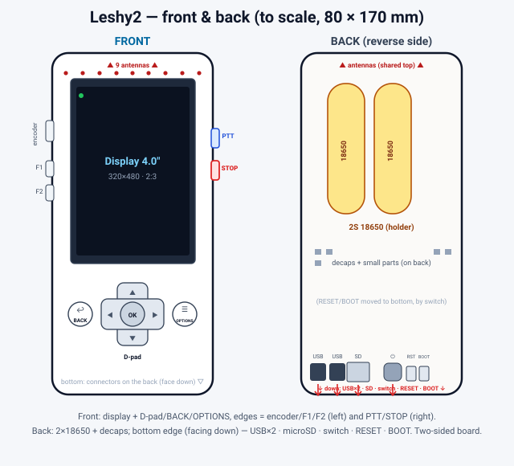

# Leshy2

*Read this in: **English** · [Русский](README.ru.md)*

**An open-source, portable, multiband RF handheld — a field tool you build yourself.**

Leshy2 is the successor to [esp32-leshy](https://github.com/anton-vinogradov/esp32-leshy), a firmware fork of [ESP32-DIV](https://github.com/cifertech/ESP32-DIV). It keeps the mature ESP32-S3 as the main brain and bolts on an **ESP32-C5 co-processor** for the one thing the S3 can't do — native **5 GHz** Wi-Fi. Two chips, one field tool, in the DIV-style handheld shape, built in the open for about **$135–160** (~$108–125 in electronics).

> 🛑 **Your own gear only.** An educational security-research and radio tool. Use it only on networks, devices, and radios you own or are explicitly authorized in writing to test. Radio law differs by country — it is on you to check and obey it.

---

## 📖 How to read this README

This README is the project's **source of truth**: the pipeline from idea to finished boards, **stage by stage**. Each stage sets a **Spec** (what and why) and produces **Artifacts** (files in this repo) that become the input to the next stage — so you can read it as *spec vs. result* and check each step.

**Status:** ✅ done · 🟡 in progress · ⏳ planned. Nothing is built on real hardware yet.

| # | Stage | Status |
|--:|-------|:------:|
| 1 | [Why a new device](#1-why-a-new-device--vision) | ✅ |
| 2 | [What it must do — capabilities](#2-what-it-must-do--capabilities) | ✅ |
| 3 | [Components](#3-components) | ✅ |
| 4 | [Architecture](#4-architecture) | ✅ |
| 5 | [External design & controls](#5-external-design--controls) | ✅ |
| 6 | [Schematic sheets](#6-schematic-sheets) | ✅ |
| 7 | [Merge, realize, review, complete](#7-merge-realize-review-complete) | 🟡 |
| 8 | [PCB layout](#8-pcb-layout) | 🟡 |
| 9 | [Firmware](#9-firmware) | ⏳ |
| 10 | [Validation gate — 5 GHz PoC](#10-validation-gate--5-ghz-poc) | ⏳ |
| 11 | [Fabrication & bring-up](#11-fabrication--bring-up) | ⏳ |

---

## 1. Why a new device — vision

**✅ Spec.** Take [ESP32-DIV](https://github.com/cifertech/ESP32-DIV) further: keep its mature ESP32-S3 design and **broaden what the handheld can do** — first the 5 GHz Wi-Fi DIV lacks, then a wider set of on-board radios and peripherals. Concretely, support:

- **5 GHz Wi-Fi + Zigbee / 802.15.4 / Thread** — via an **ESP32-C5** co-processor (the only ESP32 with native 5 GHz).
- **2.4 GHz raw** — 3× nRF24L01+PA/LNA (parallel scan, mousejack, jammer).
- **Sub-GHz 315 / 433 / 868 / 915 MHz** — CC1101 + an SP4T multi-band front end.
- **LoRa / Meshtastic** — SX1262 / E22-900M22S (+22 dBm).
- **Voice walkie** — SA868-U, 2 W TX/RX 433 / 446 MHz NBFM.
- **HF / CB / FM receiver + real analog audio** — Si4732 + a PAM8302 amp → speaker + headphone jack.
- **GPS** (u-blox), **IR TX / RX**, **microSD** (PCAP logging).
- **2× Grove I²C** expansion for M5 Units (NFC / RFID2, RTC, IMU, sensors).
- **2S 18650 power** with an on-board balancing boost-charger, and a **4.0″ color spectrum display**.

The S3 stays the brain (UI, display, all wired radios, SD, buses, 2.4 GHz Wi-Fi + BLE); the C5 is a pure 5 GHz co-processor. DIV handheld shape, fair price (~$135–160), open so people can join in.

**This peripheral wishlist is the driver for everything downstream** — it sets the capabilities (stage 2), which pick the components (stage 3), which shape the architecture (stage 4) and the physical device (stage 5).

**Artifacts.** This section, and the lineage it builds on:

- **[ESP32-DIV](https://github.com/cifertech/ESP32-DIV)** by CiferTech (MIT) — the hardware concept and the origin of the whole line.
- **[esp32-leshy](https://github.com/anton-vinogradov/esp32-leshy)** — the firmware predecessor (our ESP32-S3 take on DIV), which Leshy2's software ports from.

If you like this project, please star and support the original ESP32-DIV first.

---

## 2. What it must do — capabilities

**✅ Spec.** Fix the feature set the hardware has to deliver (everything for your own equipment).

**Artifacts.** The capability list + the frequency map below.

**Recon / attacks**
- Wi-Fi 2.4 GHz (ESP32-S3): scan, **deauth**, beacon / probe flood, sniff management frames — Marauder-class.
- Wi-Fi 5 GHz (ESP32-C5): scan, sniff, beacon / probe flood — 5 GHz recon that DIV never had.
- 2.4 GHz raw (3× nRF24L01+PA/LNA): parallel whole-band scan, mousejack, channel analyzer.
- Sub-GHz (CC1101): capture and replay OOK / FSK remotes on 315 / 433 / 868 / 915 MHz; RSSI activity "geiger".
- BLE advertising flood + 802.15.4 / Zigbee sniff (ESP32-C5).
- NFC (RFID2 unit over Grove): read MIFARE / NTAG.

**Listen (by voice)**
- Si4732 (receive only): CB 27 MHz, full HF / shortwave, MW / LW (AM / SSB / CW), and FM broadcast 64–108 MHz.
- SA868-U: 433 / 446 MHz NBFM voice — listen and talk.
- Real analog audio: line-out → PAM8302 class-D amp → speaker + headphone jack. The MCU is **not** in the audio path.

**Transmit**
- SA868-U walkie: talk on 433 / 446 MHz, RX and TX up to 2 W (PTT). TX power is region / licence limited.
- Meshtastic over LoRa (SX1262 / E22-900M22S, +22 dBm): encrypted text mesh at kilometer range; power caps enforced per region in firmware.

**Spectrum view**
- 4.0″ IPS TFT (ST7796, 320×480) over SPI — a large color waterfall on hardware vertical scroll.
- 2.4 GHz raw spectrum via the nRF24 chain; sub-GHz waterfall via CC1101.
- Per-antenna amber TX LED — a hardware envelope detector, honest "on air" even if firmware hangs, 0 GPIO.

**Aux**
- microSD (SPI) for PCAP logging · WS2812 RGB status LED + buzzer · GPS (u-blox, UART) · IR TX/RX.
- **2× Grove HY2.0-4P (I²C, 3.3 V)** for M5 I²C Units (RFID2, RTC, IMU, sensors). Grove I²C Units only.
- Long text is typed on your phone (BLE / Wi-Fi) — no onboard keyboard (see stage 9).

### Frequency map

| Band | Chip | RX | TX | What you do |
|------|------|:--:|:--:|-------------|
| 2.4 GHz Wi-Fi + BLE | ESP32-S3 | ✓ | ✓ | scan, **deauth**, beacon / probe flood, sniff |
| 5 GHz Wi-Fi | ESP32-C5 | ✓ | ✓ | scan, sniff, beacon / probe flood (recon-only) |
| 802.15.4 / Zigbee + BLE | ESP32-C5 | ✓ | ✓ | Zigbee / Thread sniff, BLE adv flood |
| 2.4 GHz raw | 3× nRF24L01+ | ✓ | ✓ | whole-band scan, mousejack, analyzer |
| 315 / 433 / 868 / 915 MHz | CC1101 | ✓ | ✓ | capture / replay remotes, RSSI "geiger" |
| 433 / 446 MHz NBFM | SA868-U | ✓ | ✓ (≤2 W) | listen and talk (walkie, PTT) |
| 27 MHz CB + HF / MW / LW | Si4732 | ✓ | — | listen AM / SSB / CW and CB |
| 64–108 MHz FM | Si4732 | ✓ | — | listen to FM broadcast |
| LoRa (EU433 / EU868 / US915) | SX1262 | ✓ | ✓ (+22 dBm) | Meshtastic encrypted text mesh |
| GPS L1 ~1.575 GHz | u-blox (UART) | ✓ | — | position / time |

**Honest limits.** 5 GHz is **recon-only** (no injection / handshake capture — that needs Linux, avoided for battery life). All Si4732 HF is **receive-only**. **One radio at a time** (the chains share the SPI bus). **Not a HackRF** — no wideband capture, no arbitrary TX. **No wideband jamming** — illegal (US §333, EU RED), will not be built.

---

## 3. Components

**✅ Spec.** Choose the chips and modules that deliver the capabilities above, at a fair price.

**Artifacts.** The [**bill of materials & cost breakdown**](docs/bom.md) (~$108–125 in electronics) — every part, grouped by capability, with the biggest cost drivers.

---

## 4. Architecture

**✅ Spec.** Decide how the pieces connect: a two-chip topology, the shared bus and expanders, and a GPIO budget that fits this much radio.

**Artifacts.** [system diagram](docs/img/system-diagram.svg) · [pin budget](docs/pin-budget.md) · [full hardware breakdown](docs/hardware.md).

- **Two chips.** **ESP32-S3-WROOM-1U-N8R2** (dual-core, quad PSRAM) is the **main brain** — UI, display, all wired radios, SD, every bus, native 2.4 GHz Wi-Fi + BLE. **ESP32-C5-WROOM-1U** is a **pure co-processor** — the only ESP32 with native 5 GHz — on its own dual-band antenna.
- **Chip-to-chip link:** a dedicated **SPI3 + DRDY** strobe (the C5 is a clean SPI slave; it never touches the shared bus). The S3 flashes the C5 over UART0; the C5 also has its own USB-C for brick-safe recovery.
- **Shared bus (S3 FSPI):** microSD + CC1101 + 3× nRF24 + SX1262 + the display — chip-selects via a 74HC138. Three I²C **PCA9555** expanders carry the slow lines (radio/display control, rail gates, and the UI buttons); interrupts stay on direct pins.
- **9 antennas** (S3 2.4, C5 2.4/5, 3× nRF24, CC1101, Si4732 whip, SA868, LoRa) — each chain its own antenna, mounted via **u.FL pigtails to panel SMA/RP-SMA**, spread for isolation (details in stage 5).
- **Two USB-C:** J1 → S3 (charge + data), J2 → C5 (data-only). The pack charges only through J1.
- **Power:** 2× 18650 in 2S — **BQ25887 boost charger** (charges 2S from plain 5 V USB), MP2315 +5 V and +3V3 bucks, a TPS7A2033 +3V3 analog rail, rail gates that cut idle radios. A hard master toggle is the only on/off.

One radio runs at a time, so the shared bus and slow control lines fit the pin budget.

---

## 5. External design & controls

**✅ Spec.** From the components, settle the **physical device**: form factor (~80 × 170 mm, no case, DIV-style open frame), the control scheme, where the external interfaces sit, and the mechanical stack (display on the front over the electronics; 2× 18650 on the back; two-sided board).

**Artifacts.** [**front & back layout**](docs/img/layout-front-back.en.svg) · [**controls & firmware conventions**](docs/firmware-controls.md).

- **Front:** 4.0″ display + D-pad (5-way) + BACK + OPTIONS.
- **Left edge:** IR TX/RX (top), encoder wheel (volume / value), F1 / F2, 3.5 mm jack.
- **Right edge:** PTT + panic STOP, 2× Grove (I²C).
- **Front (lower):** speaker + mic.
- **Bottom (on the back, facing down):** USB-C ×2, microSD, master toggle, RESET / BOOT.
- **Back:** 2× 18650 in clips (a keep-out zone — no parts under the cells).

The physical set is sufficient by a [scenario-coverage review](docs/firmware-controls.md); most of the usability lives in firmware conventions (stage 9).

---

## 6. Schematic sheets

**✅ Spec.** Capture each subsystem as its own sheet, transcribed from the architecture — as design docs **and** as live [tscircuit](https://tscircuit.com) code (real parts, LCSC numbers, exports to KiCad).

**Artifacts.** Six sheets in [hardware/](hardware/) — each a `.md` design doc + a `.tsx` + a schematic SVG:

1. [Power](hardware/power/power.md) — 2S, BQ25887 boost charger, rails, master toggle
2. [MCU + buses](hardware/c5-buses/c5-buses.md) — S3 + C5, the SPI3 link, 74HC138, PCA9555, USB
3. [RF chains](hardware/rf/rf.md) — 3× nRF24, CC1101 + SP4T, SX1262 (LoRa)
4. [Audio](hardware/audio/audio.md) — Si4732, SA868, analog path → PAM8302
5. [Expansion + GPS](hardware/expansion/expansion.md) — I²C, u-blox GPS, Grove
6. [Indicators / IO](hardware/indicators/indicators.md) — TX-live LEDs, microSD, encoder

---

## 7. Merge, realize, review, complete

**🟡 Spec.** Merge the six sheets into one board, put it on **real, manufacturer-verified parts**, review it hard, and complete every missing piece before layout.

**Artifacts.** [`board.tsx`](hardware/tscircuit/board.tsx) (merged, **191 components**) → [`board.kicad_pcb`](hardware/tscircuit/board.kicad_pcb) (connectivity proven, KiCad `schematic_parity = 0`).

Done so far:

- **✅ Merged** — all six sheets into one board.
- **✅ Two adversarial self-reviews** — **~14 real defects fixed, 4 board-killers** (wrong charger topology, two unbonded MCU pins, a single-supply walkie, a reversed I²C ESD array, a shorted current-sense).
- **✅ Completeness audit + first completion pass** — the audit found the merged board still carried **placeholders and off-sheet stubs**. Added: the **display FPC connector**, the **antenna u.FL connectors**, the **full control set** (D-pad + BACK + OPTIONS + STOP + F1 + F2 on a third PCA9555) and the **real master switch**.

Still to finish (🟡):

- **Part swaps** — TVS, PPTC fuse, mic, speaker, buzzer, 3.5 mm jack, 18650 holder (with cell midpoint for the balancing charger), RF balun, band-matching networks, and a single 5-way nav switch for the D-pad.
- **Subcircuits to draw** — the 7 TX-live envelope detectors, the backlight LED driver (+ PWM dim), the Si4732 RX PIN-limiter.

---

## 8. PCB layout

**🟡 Spec.** From the complete board: place it (edge-aware zones, connectors to the right edges, two-sided) on a **4-layer** stack with a GND plane, route it (auto-route what's routable + hand-route the RF), add the mechanical (mounting holes, fiducials) → **gerbers**.

**Artifacts.** [`board-autorouted.kicad_pcb`](hardware/tscircuit/board-autorouted.kicad_pcb) · gerbers (pending).

The toolchain is proven: placement + **[Freerouting](https://github.com/freerouting/freerouting)** auto-route (via Specctra DSN/SES) reached **424 / 425 nets** on the 4-layer board over a filled GND plane, 4 DRC nits. It runs on the **pre-completion** board, so it re-places + re-routes once stage 7 is finished. RF feeds get impedance-controlled, coplanar-ground, antenna-keep-out hand routing regardless.

---

## 9. Firmware

**⏳ Spec.** Port the ESP32-S3 [leshy](https://github.com/anton-vinogradov/esp32-leshy) codebase (most of the S3 side is done), write the **C5 5 GHz agent** + the S3↔C5 protocol, and implement the control conventions + the two safety blockers (orderly shutdown, panic stop-all-TX).

**Artifacts.** [**controls & firmware conventions**](docs/firmware-controls.md) — the physical controls, the two firmware-only safety blockers, the 14 usability conventions, and the phone-keyboard text path (BLE / Wi-Fi captive portal). Code: later.

---

## 10. Validation gate — 5 GHz PoC

**⏳ Spec.** Before ordering a board, prove the riskiest premise: **5 GHz-deauth / recon on a C5 dev-kit**. The whole dual-chip bet rests on the C5's 5 GHz being useful; learning that cheaply, early, gates the fab spend.

**Artifacts.** PoC notes (pending).

---

## 11. Fabrication & bring-up

**⏳ Spec.** Order the PCB (JLCPCB via a reshipper to Russia, or Rezonit), assemble, bring it up, and **tune the antennas on a VNA**.

**Artifacts.** Finished boards. Direction and open questions: [roadmap](docs/roadmap.md).

---

*Get involved: [CONTRIBUTING.md](CONTRIBUTING.md).*

## License

[MIT](LICENSE) — same as upstream ESP32-DIV. Copyright © Anton Vinogradov ([anton-vinogradov](https://github.com/anton-vinogradov)).
