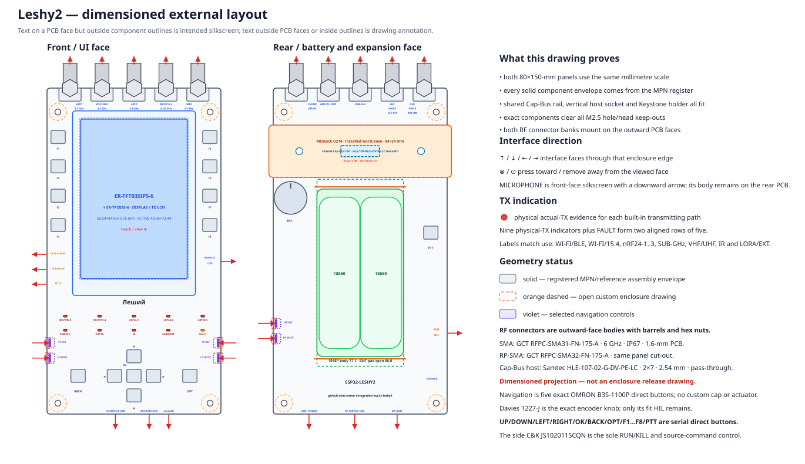

# Leshy2 — аппаратная часть

[English](README.md) · [Прошивка](https://github.com/anton-vinogradov/esp32-leshy2-firmware/blob/main/README.ru.md)

Leshy2 — открытый автономный прибор для наблюдения за радиоэфиром, связи,
диагностики и разрешённого исследования беспроводных и контактных систем.
Документация показывает целевое устройство: что оно умеет и как устроено.

## Что умеет устройство

- Одновременно управляет тремя полнофункциональными nRF24 в сочетаниях `3R`,
  `1T2R`, `2T1R` и `3T`.
- Работает с Wi‑Fi 2,4/5 ГГц, Bluetooth LE, ESP‑NOW, IEEE 802.15.4,
  Sub‑GHz 315/433/868/915 МГц, FM/AM/SW/LW, VHF/UHF voice и IR.
- Выводит все девять бортовых RF-трактов на внешние антенны: два RP‑SMA и
  семь SMA.
- Показывает меню, спектральный водопад и состояние трактов на вертикальном
  сенсорном IPS-дисплее 3,5″ `320×480` с прямым QSPI.
- Записывает данные и аудио на съёмную microSD, воспроизводит звук через
  динамик или наушники и принимает звук со встроенного микрофона.
- Поддерживает задний M5Stack U214 LoRa/GNSS Cap и отдельный защищённый M5 Unit
  port для внешних GNSS, LoRa, NFC, iButton/1‑Wire и других модулей.
- Даёт владельцу независимые пути прошивки, восстановления и диагностики
  каждого программируемого контроллера.

## Как устроено

Внутри четыре изолируемых вычислительных домена. `ESP32-S3-WROOM-1U-N16R2`
ведёт интерфейс, дисплей, storage и audio; `ESP32-C5-WROOM-1U-N8R8` — native
2,4/5‑ГГц radio, IEEE 802.15.4 и IR; `SC1512-A4` (RP2354B) — три nRF24,
Sub‑GHz, voice и U214; `MSPM0C1104SDGS20R` независимо допускает батарейный
пакет. Неиспользуемые интерфейсы отключаются и переводятся в проверяемое тихое
состояние.

## Безопасные уровни

1. **Основной режим** — приём, диагностика, обслуживание и обычная связь.
2. **Лаборатория** — пассивные, защитные и ограниченные исследовательские
   инструменты.
3. **Лаборатория → Контролируемая зона** — потенциально опасные active-функции
   только для изолированной среды или явно разрешённой цели. Каждый вход заново
   показывает обязательное предупреждение.

Физический `STOP` аппаратно доминирует над передачей, а `RE‑ARM` требует
отдельного действия. При первичной установке пользователь принимает акт о
ненападении; он не заменяет закон, лицензию на спектр и разрешение владельца
цели.

## Документация

- [Аппаратная архитектура и компоненты](docs/hardware.ru.md)
- [Принципиальные схемы устройства](docs/schematics.ru.md)
- [Точное межплатное соединение M1](docs/interconnect.ru.md)
- [Точная распиновка контроллеров](docs/pinout.ru.md)
- [Безопасность, питание, обновление и восстановление](docs/safety.ru.md)
- [Возможности и архитектура прошивки](https://github.com/anton-vinogradov/esp32-leshy2-firmware/blob/main/README.ru.md)
