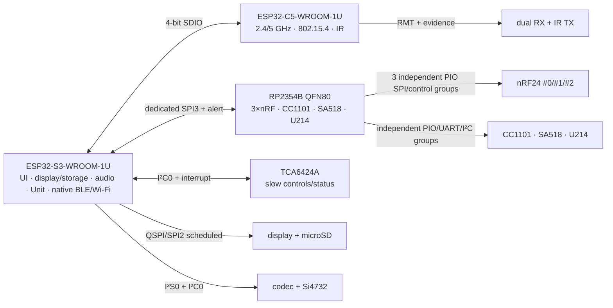

# Аппаратная часть Leshy2

> **Целевой документ продукта.** Страница описывает проверенное поведение,
> границы готового продукта и текущий принципиальный working design. Он не
> равен финальной электронной архитектуре или текущей реализации. Состояние
> проработки — в [current state](docs/status/current-state.ru.md).

- [English version](README.md)
- [Целевой firmware-продукт](https://github.com/anton-vinogradov/esp32-leshy2-firmware/blob/main/README.ru.md)
- [Канонический журнал ревью](docs/review/README.md)

## Образ готового продукта

Leshy2 — открытый автономный портативный all-in-one инструмент для radio/
wireless наблюдения, диагностики, связи и разрешённых исследований, включая
беспроводные и контактные credential tools. Навигация, обслуживание и compute
поддерживают эти результаты, а не превращают продукт в general-purpose
peripheral computer. Это должен быть собираемый, ремонтопригодный и измеримый
продукт, а не набор maximum-capability demos.

Финальные form factor, components, board split и enclosure открыты. Текущая
owner/bus/pin гипотеза принята ниже как reopenable working design, а не frozen
target. Бывший `PKG-0001/SYN-3A` после
[`DEC-0032`](docs/review/decisions/DEC-0032-reopen-product-design-before-cad.md)
сохранён только как один candidate study.

## Три уровня функциональности

1. **Основной режим** — повседневные инструменты, приём, диагностика,
   навигация, обслуживание и законная связь.
2. **Лаборатория** — пассивные, защитные и ограниченные security-инструменты.
3. **Лаборатория → Контролируемая зона** — опасные active/disruptive функции.
   Каждый вход показывает новое неснимаемое предупреждение, а каждое действие
   отдельно требует авторизованной цели, изолированной/проводной среды или обоих.

При первичной установке отдельно принимается акт о ненападении. Ни он, ни banner
не вооружают функцию и не отменяют spectrum/licensing/privacy/third-party gates
([`DEC-0002`](docs/review/decisions/DEC-0002-project-vision.md),
[`DEC-0010`](docs/review/decisions/DEC-0010-three-functional-levels.md)).

## Проверенный целевой набор возможностей

- Три независимых полнофункциональных nRF24 сохраняют native PTX/PRX и обязаны
  поддерживать любой одновременный mix `3R/1T2R/2T1R/3T` без automatic standby
  соседей и скрытых RX gaps. Packet/drop/timestamp и exact mixed-RF profile
  evidence остаются явными. Ведущий paper candidate `G2F-3I` размещает их на
  RP2354B; atomic ownership и wiring ещё не финальны.
- Продукт даёт обычные Wi-Fi 2.4/5 ГГц, IEEE 802.15.4, native Bluetooth LE и
  Wi-Fi 2.4/ESP-NOW profiles. Точные radios и ownership выбирает только будущая
  whole-device architecture.
- Packet Sub-GHz, broadcast receiver, analog voice, калиброванное 2.4 GHz
  sector/RPD comparison, consumer IR learning/TX и digital/analog audio paths
  остаются в scope со своими проверенными safety/evidence limits.
- Бортовые GNSS, LoRa и HF NFC frontends не обязательны. Product design должен
  поддержать внешние M5-style GNSS, общепринятые LoRa bands через cap и
  expansion-module strategies где это реализуемо, а также внешний NFC.
  iButton/1-Wire реализуется заменяемым пассивным M5-style Port-B адаптером,
  без обязательных контактов на корпусе базы.
- M5 Unit A/B/C/custom и полный U214-compatible 14-pin Cap образуют основной
  low-rate expansion tier. Принятые raw SDR и external RF/credential-analysis
  profiles могут вывести отдельный high-throughput class; base не обещает
  generic host или native 30-pin M5-Bus. Число/расположение портов и high-speed
  connector выбираются позже.
- Опциональный qualified external IMU может добавлять к RF records timestamped
  motion, pitch/roll и short-term relative-rotation metadata. Device-pose claim
  требует жёсткий indexed mount и sensor-to-antenna transform. Six-axis data не
  является absolute heading или RF bearing; base IMU не требуется.
- Core field operation, display/storage controls, PTT, hard STOP, explicit
  re-arm, pairing/revoke, service и recovery остаются автономными. В base нет
  постоянной text keyboard; заявленный редкий/длинный text workflow может
  использовать локально сопряжённый owner phone. Телефон передаёт видимый текст,
  но не authority для safety, Controlled Zone, TX, destructive, trust или
  recovery actions.
- Производительность дисплея задаётся задачами продукта, а не video-like full
  frames/s: dirty/tiled updates показывают critical state и первый menu feedback
  за `≤100 ms`, waterfall остаётся preemptible при admitted radio/audio/storage
  load, а любое visual coalescing/drop явно учитывается. Exact panel и optics
  остаются решениями architecture/product design.
- Каждый в итоге выбранный programmable chip получает постоянные независимые
  пути прошивки, восстановления и диагностики для prototype bring-up и owner
  repair. Точные connectors и pins пока открыты.
- Owner-controlled signed updates сохраняют target validation, rollback,
  offline keys/tools и intentional physical recovery. Необратимый lockdown —
  отдельный optional decision, а не default.
- Generic USB host, personal FIDO/U2F authenticator и 6 GHz/Wi-Fi 6E находятся
  вне product mission. Конкретный принятый RF/SDR profile может позже вывести
  exact high-throughput transport, не превращая generic host в capability.
- BadUSB/DuckyScript — одно явное non-core исключение: release-optional
  Controlled-Zone software profile поверх существующего USB device/service
  path. Он не добавляет base hardware, не формирует architecture и не задерживает
  radio/key core, но всё равно требует authorization, parser/security review и HIL.

Названные в требованиях и candidate studies modules/IC являются first targets
или evidence, но не молча зафиксированным BOM.

## Принципиальный дизайн решения

[`DEC-0051`](docs/review/decisions/DEC-0051-principled-pinout-as-working-design.md)
принимает `G2F-3I/PIN-0003` как текущий working design для физической
компоновки. Это проведённое ревью принципиальной распиновки, но не финальная
atomic architecture и не разрешение на KiCad.
[`DEC-0052`](docs/review/decisions/DEC-0052-qspi-first-display-path.md)
добавляет direct-QSPI D2/D3 на S3 GPIO41/42 и measured `≤1 ms` display
occupancy. [`DEC-0053`](docs/review/decisions/DEC-0053-new-35in-qspi-display-class.md)
принимает 3.5-inch portrait `320×480` IPS direct-QSPI capacitive-touch class.
[`DSP-0004`](docs/review/architecture/DSP-0004-display-part-number-register.md)
перечисляет все известные display part numbers. Official QDtech schematic
раскрывает exact assembly `HMX035CTFT-001`; `DSP-0005/REV-0005A` проводят
ревью его 40-contact electrical fit без расхода новых GPIO. Standalone
orderability/drawing/lifecycle, exact connector, backlight, optics и protection
остаются явно открытыми.
`AUDIO-0001/REV-0005B` также вносят exact контакты `ES8311` QFN-20: `CE` —
strap адреса `0x19`, P10 — внешний `CODEC_PWR_EN`, бюджет S3 не меняется.
`AUDIO-0002/REV-0005C` исправляют пропущенный RX-source control на slow P27 и
сравнивают complete capture/playback/TX/reset paths. Exact differential analog
routing и direct reset-default arm остаются открытым решением `IMP-0046`.

| Принципиальная группа | Exact owner contacts текущей карты | Контракт |
|---|---|---|
| S3↔C5 | S3 `GPIO10,GPIO11,GPIO12,GPIO13,GPIO44,GPIO47`; C5 `GPIO7,GPIO8,GPIO9,GPIO10,GPIO13,GPIO14` | dedicated 4-bit SDIO |
| S3↔RP | S3 `GPIO3,GPIO9,GPIO14,GPIO21,GPIO48`; RP `GPIO19,GPIO24,GPIO25,GPIO26,GPIO27` | dedicated SPI3/SPI1 + alert |
| display+microSD | S3 `GPIO4,GPIO5,GPIO35,GPIO36,GPIO38,GPIO39,GPIO40,GPIO41,GPIO42` | direct QSPI display + 1-bit SPI microSD; единственная high-rate scheduled pair |
| audio+Si4732 | S3 `GPIO1,GPIO2,GPIO15,GPIO16,GPIO17,GPIO18` | I²S0 и bounded internal I²C0 |
| M5 Unit | S3 `GPIO7,GPIO8` | отдельный configurable profile port |
| IR | C5 `GPIO0,GPIO1,GPIO4,GPIO6,GPIO24` | dual RX, TX, power gate и evidence |
| nRF24 #0 | RP `GPIO0,GPIO1,GPIO2,GPIO30,GPIO31,GPIO32` | PIO0 SM0, direct CE/CSN/IRQ |
| nRF24 #1 | RP `GPIO3,GPIO4,GPIO5,GPIO33,GPIO34,GPIO35` | PIO0 SM1, direct CE/CSN/IRQ |
| nRF24 #2 | RP `GPIO6,GPIO7,GPIO8,GPIO36,GPIO37,GPIO38` | PIO0 SM2, direct CE/CSN/IRQ |
| CC1101 | RP `GPIO9,GPIO10,GPIO11,GPIO23,GPIO39,GPIO42,GPIO43` | independent PIO0 SM3/GDO/power |
| SA518/PTT | RP `GPIO16,GPIO17,GPIO18,GPIO20,GPIO21,GPIO22` | UART0, PTT, activity/evidence |
| U214 LoRa/GNSS | RP `GPIO12,GPIO13,GPIO14,GPIO28,GPIO29,GPIO40,GPIO41,GPIO44,GPIO45,GPIO46,GPIO47` | independent PIO1/UART1/I²C0 |

Pin budget: S3 `31 used / 3 reserved / 2 free`, C5 `14/6/1`, RP
`48/0/0`, slow I/O `24/0/0`. RP не имеет свободного direct GPIO; независимые
SWD/USB/RUN/BOOTSEL сохранены вне этого бюджета.

Полная нормативная проекция текущей карты находится в
[`PIN-0003`](docs/review/architecture/PIN-0003-g2f-3i-principled-pinout.md) и
машинно сгенерированном
[`exact pad/net atlas`](docs/review/architecture/generated/G2F-3I-principled-pinout.md).
Оставшиеся electrical boundaries перечислены в
[`FND-0060`](docs/review/findings/FND-0060-abstract-electrical-endpoints-block-final-pinout.md)
и могут изменить working design после повторного ревью. Current display path
уже заканчивается на `HMX035CTFT-001`: S3 GPIO39 — touch IRQ, slow P06/P07 —
display/touch reset; S3 GPIO6/GPIO43 остаются free.
Audio digital path также заканчивается на exact ES8311 contacts через S3
GPIO1/2/15/16/17/18; питание codec и differential analog conditioner остаются
явными электрическими блокерами, а не скрытыми GPIO. Бывший slow reserve P27
теперь несёт обязательный `RX_AUDIO_SOURCE_SEL`; proposed direct `AUDIO_ARM`
не считается занятым до принятия `IMP-0046`.

## Границы безопасности и стоимости

- Каждый transmitter и Lab action стартует разоружённым после power/reset/
  update/watchdog/brownout.
- Первая TX использует консервативный профиль; максимум требует явного выбора
  для текущего сценария.
- Physical STOP доминирует над firmware и communication failures. Его отпускание
  никогда не восстанавливает прежние target, power или lease.
- Actual-TX evidence отделено от команды и UI indication.
- Стоимость уменьшается только при доказанной эквивалентности capabilities,
  performance, safety, reliability, autonomy, serviceability и testability.

## Состояние разработки

125 capability leaves и competitor delta прошли повторное ревью G2. Physical/
product inputs G3 остаются проверенными, но теперь сначала проходит G2F.
Единый machine-readable источник содержит три structurally checked карты;
`DEC-0044/NIF-0001/REV-0004L` выбрали `G2F-3I` ведущей reviewed paper map без
radio-bus contention. `DEC-0047` выбирает qualified `SG-N24` envelope;
заказанный второй ESP32-DIV даёт ранний `L0 DIV↔DIV` pre-HIL, но target pass
требует `T1` на Leshy2. `DEC-0048` принимает три compact IPEX→external-SMA
nRF paths и внешний SMA для всех бортовых antenna endpoints;
`ANT-0001/REV-0004P` подтверждают отдельные Si4732 input domains для FM/SW и
AM/LW; `DEC-0049/REV-0004Q` принимают девять labelled SMA с раздельными
`RX-FM/SW` и `RX-AM/LW`. Последний требует короткий loop/pod либо
квалифицированный buffered profile и не является generic coax port.
`RFH-0001/REV-0004R` дополнительно проверяют module-to-panel feeds: S3/C5
официально совместимы с first-generation U.FL/MHF I/AMC, но Ebyte называет
свой разъём только `IPX`, поэтому `FND-0057` требует specimen-fit gate.
`RFH-0002/REV-0004S` проверяют antenna ecosystems: RP-SMA типичен для native
Wi-Fi, Ebyte/nRF использует standard SMA, а sub-GHz имеет обе polarity.
`DEC-0050/REV-0004T` принимают ограниченный `2 RP-SMA + 7 standard SMA`:
RP-SMA только для native Wi-Fi S3/C5, standard SMA для остальных семи;
`ANT-0002/REV-0004U` проверяют procurement candidates, но выбор kit,
mounting, длины кабелей, two-source assemblies и target RF qualification
остаются открытыми.
`PIN-0003/REV-0004V` добавляют generated principled owner/net/pad atlas.
Current exact exposed-contact budget равен S3 `31/3/2`, C5 `14/6/1`, RP
`48/0/0`, slow I/O `24/0/0`; exact SA518 service и Si4732 control/RF contacts
внесены, а оставшиеся electrical abstractions открыты как `FND-0060`.
Physical RF/full-mix measurements,
quiet-state power controls неиспользуемых interfaces, peripherals, power и HIL
закрываются параллельно адаптации legacy physical mockup и могут переоткрыть
working pinout.
Whole-device optimality, conceptual placement и новое atomic architecture
decision обязаны предшествовать компонентам и KiCad. Нормативный порядок —
[`FLOW-0001`](docs/review/architecture/FLOW-0001-product-to-cad-gates.md).
