# Аппаратная часть Leshy2

> **Целевой сайт продукта.** Здесь описан готовый Leshy2: назначение,
> возможности, интерфейсы, принципиальное устройство и обязательные гарантии.
> Ход разработки и открытые проверки вынесены в отдельные инженерные документы.

- [English version](README.md)
- [Целевой firmware-продукт](https://github.com/anton-vinogradov/esp32-leshy2-firmware/blob/main/README.ru.md)
- [Состояние разработки](docs/status/current-state.ru.md)
- [Инженерные решения и доказательства](docs/review/README.md)

## Образ готового продукта

Leshy2 — открытый автономный портативный инструмент для наблюдения за
радиоэфиром, диагностики, связи и разрешённых исследований беспроводных и
контактных систем. Он объединяет несколько независимых радиотрактов, экран,
локальное управление, запись данных, аудио, сервисные интерфейсы и расширения
в одном ремонтопригодном устройстве.

Это полевой прибор, а не универсальный карманный компьютер: каждая аппаратная
возможность должна давать измеримый результат, иметь понятное безопасное
состояние и быть доступной для диагностики и восстановления владельцем.

## Три уровня функциональности

1. **Основной режим** — повседневные инструменты, приём, диагностика,
   навигация, обслуживание и законная связь.
2. **Лаборатория** — пассивные, защитные и ограниченные security-инструменты.
3. **Лаборатория → Контролируемая зона** — опасные active/disruptive функции.
   Каждый вход показывает новое неснимаемое предупреждение, а каждое действие
   отдельно требует авторизованной цели, изолированной/проводной среды или обоих.

При первичной установке отдельно принимается акт о ненападении. Ни он, ни
предупреждение не вооружают функцию и не отменяют требования законодательства,
лицензирования спектра, приватности и разрешения владельца цели.

## Возможности готового устройства

### Радио и связь

- Три независимых полнофункциональных nRF24 работают одновременно в любом
  сочетании `3R`, `1T2R`, `2T1R` и `3T`, без скрытого отключения соседних
  приёмников.
- Три разнесённых nRF-антенны дают калиброванное относительное sector/RPD
  сравнение. Результат не выдаётся за абсолютные dBm, угол или VSWR.
- Wi-Fi 2,4/5 ГГц, Bluetooth LE, ESP-NOW и IEEE 802.15.4 обеспечивают обычную
  связь, наблюдение и разрешённые диагностические сценарии.
- Отдельный Sub-GHz тракт работает с пакетными системами; широковещательный
  приёмник покрывает AM/FM/SW/LW; VHF/UHF voice-тракт поддерживает аналоговую
  связь и аудиообработку.
- Два IR-приёмника позволяют одновременно надёжно декодировать бытовые команды
  и измерять несущую неизвестного сигнала; отдельный передатчик воспроизводит
  изученные профили.
- Все девять бортовых антенных трактов выведены на собственные внешние порты:
  два RP-SMA для native Wi-Fi и семь standard SMA для остальных трактов.

### Интерфейсы и расширения

- Вертикальный сенсорный IPS-дисплей 3,5 дюйма, `320×480`, подключён прямым QSPI;
  критическое состояние и первый отклик меню появляются не позднее `100 мс`.
- microSD хранит записи эфира, аудио, профили, журналы и экспортируемые данные.
- Задний 14-контактный Cap-Bus принимает съёмный M5Stack U214 LoRa/GNSS и
  совместимые модули; отдельный защищённый M5 Unit-порт поддерживает GNSS,
  квалифицированные LoRa-модули, NFC, iButton/1-Wire и другие расширения.
- Квалифицированный raw-SDR или внешний RF-analysis модуль может определить
  отдельный high-throughput интерфейс; low-rate M5 command port не выдаётся за
  тракт сырых данных.
- Редкий длинный ввод текста может выполняться с локально сопряжённого телефона,
  но телефон не подтверждает опасные действия и не заменяет управление Leshy2.
- Внешний IMU может добавлять к измерениям положение и относительное движение;
  без квалифицированного крепления эти данные не выдаются за компас или пеленг.

### Обслуживание

- Каждый программируемый вычислительный домен имеет собственные пути прошивки,
  восстановления и диагностики, не зависящие от исправности соседнего домена.
- Основной USB-C сохраняет прямые USB2-линии S3 и только принимает питание:
  fallback 5 В, 9 В при 3 А и 15 В при 2 А, до 30 Вт. Режимы power bank и
  USB-PD source отсутствуют.
- PD-контроллер автономно загружается из отдельной восстанавливаемой EEPROM.
  Заводские площадки позволяют прошить пустую микросхему; полевое обновление
  проверяет подписанный владельцем образ и сохраняет rollback-регион.
- Батарея 2S состоит из двух отдельно заменяемых 18650. Переполюсовка
  исключается механически; перед зарядом или разрядом устройство проверяет обе
  ячейки и отказывает несовместимой либо опасной паре вместо принудительной
  работы или балансировки.
- Подписанные обновления проверяют целевое устройство и поддерживают откат;
  ключи сборки и возможность установки владельческой прошивки остаются у
  владельца. Необратимая блокировка не включается по умолчанию.

## Принципиальный дизайн решения

Три вычислительных домена разделяют UI, широкополосные беспроводные функции и
детерминированное обслуживание радио. Независимые шины не заставляют активный
радиотракт ждать дисплей, карту памяти или соседнее радио. Неиспользуемые
интерфейсы переводятся в тихое аппаратное состояние.

Диаграмма поддерживается как узкая вертикальная проекция целевой начинки.
Каждый квадрат обозначает один физический компонент и содержит его MPN или
явный `MPN TBD`, а также роль в готовом устройстве.

```mermaid
flowchart TD
  USBC["MPN TBD<br/>основной USB-C: прямые USB2-линии S3 и только приём питания"]
  VBUSPROT["TVS2200DRVR<br/>22-В flat-clamp защита VBUS от импульсов"]
  PDCTRL["TPS25751DREFR<br/>sink-only USB-PD политика и защищённый high-voltage тракт"]
  PDCFG["CAT24C512WI-GT3<br/>отдельная EEPROM с patch/configuration PD"]
  CHARGER["BQ25798RQMR<br/>2S buck-boost зарядник и NVDC системный power path"]
  CELL0["MPN TBD<br/>отдельно заменяемая квалифицированная 18650 №0"]
  CELL1["MPN TBD<br/>отдельно заменяемая квалифицированная 18650 №1"]
  PACKMGR["MPN TBD<br/>контроль допуска ячеек, защита, gauge и балансировка"]
  S3["ESP32-S3-WROOM-1U-N16R2<br/>application, UI, display/storage, audio, BLE/Wi-Fi owner"]
  C5["ESP32-C5-WROOM-1U-N8R8<br/>2.4/5 GHz, IEEE 802.15.4 and IR owner"]
  RP["RP2354B A4<br/>deterministic radio and voice owner"]
  SLOW["TCA6424ARGJR<br/>24-line slow-control and UI expander"]
  LCD["HMX035CTFT-001<br/>3.5-inch QSPI IPS display and capacitive-touch assembly"]
  SD["DM3AT-SF-PEJM5<br/>push-push microSD card connector"]
  SI["Si4732-A10-GS<br/>AM/FM/SW/LW broadcast receiver"]
  CODEC["ES8311<br/>mono ADC/DAC audio codec"]
  RXMUX["SN74LVC1G3157DBVR<br/>receive-audio source selector"]
  BUF["TLV9061IDBVR<br/>active high-impedance capture buffer"]
  SPKSEL["TMUX1136DGSR<br/>dual differential speaker-path selector"]
  TXSEL["TS5A63157DCKR<br/>transmit-audio selector"]
  SAFE["SN74LVC2G08DCUR<br/>reset-safe selector-request gate"]
  PAM["PAM8302AASCR<br/>mono Class-D speaker amplifier"]
  SPK["MPN TBD<br/>internal loudspeaker"]
  MIC["MPN TBD<br/>electret microphone"]
  NRF0["E01-ML01IPX<br/>nRF24-compatible radio #0 compact IPEX reference"]
  NRF1["E01-ML01IPX<br/>nRF24-compatible radio #1 compact IPEX reference"]
  NRF2["E01-ML01IPX<br/>nRF24-compatible radio #2 compact IPEX reference"]
  CC["CC1101RGPR<br/>sub-GHz transceiver"]
  SA["NiceRF SA518<br/>VHF/UHF analog voice transceiver"]
  CAPDOCK["MPN TBD<br/>2×7 female 2.54-mm host Cap-Bus receptacle"]
  U214["M5Stack U214 Cap LoRa-1262<br/>external LoRa/GNSS Cap module"]
  ISO["TCA4307DGKR<br/>external I2C stuck-bus isolator"]
  UNIT["MPN TBD<br/>protected HY2.0-4P M5 Unit connector"]
  IR0["MPN TBD (TSOP38238 screened)<br/>38 kHz demodulating IR receiver"]
  IR1["MPN TBD (TSMP95000 screened)<br/>carrier-learning IR receiver"]
  IRTX["MPN TBD (TSAL6200 screened)<br/>IR transmit LED/driver endpoint"]
  STOPSW["MPN TBD<br/>normally-closed physical STOP control"]
  REARMSW["MPN TBD<br/>normally-open recessed RE-ARM control"]
  SUP["TPS3808G33DBVR<br/>AON rail supervisor and power-on reset"]
  COND["74LVC2G14GW,125<br/>STOP and RE-ARM Schmitt conditioner"]
  POROR["74LVC1G32GV,125<br/>STOP-dominant POR/clear combiner"]
  LATCH["SN74LVC1G74DCUR<br/>asynchronous latched hard STOP"]
  RSTBUF["SN74LVC3G34DCUR<br/>Ioff three-domain reset fan-out"]
  GATEA["SN74LVC08APWR #1<br/>four STOP-dominant nRF request gates"]
  GATEB["SN74LVC08APWR #2<br/>four STOP-dominant rail/IR/accessory gates"]
  PTTOR["74LVC1G32GV,125 #2<br/>active-low voice PTT force-RX gate"]
  STOPLED["LTST-C190KFKT<br/>orange physical latched-STOP indicator"]
  DS3["LTC5532ES6#TRMPBF #S3<br/>S3 2.4-GHz RF power detector"]
  DC5["LTC5532ES6#TRMPBF #C5<br/>C5 2.4/5-GHz RF power detector"]
  DN0["LTC5532ES6#TRMPBF #nRF0<br/>nRF0 2.4-GHz RF power detector"]
  DN1["LTC5532ES6#TRMPBF #nRF1<br/>nRF1 2.4-GHz RF power detector"]
  DN2["LTC5532ES6#TRMPBF #nRF2<br/>nRF2 2.4-GHz RF power detector"]
  DCC["LTC5507ES6#TRMPBF #CC<br/>CC1101 sub-GHz RF power detector"]
  DVOICE["LTC5507ES6#TRMPBF #voice<br/>SA518 VHF/UHF RF power detector"]
  DIR["VEMD1060X01<br/>IR optical-evidence photodiode"]
  CMPA["TLV1824PWR #1<br/>S3/C5/nRF0/nRF1 evidence thresholds"]
  CMPB["TLV1824PWR #2<br/>nRF2/CC/voice/IR evidence thresholds"]
  EVMASK["TCA9534APWR<br/>eight-bit evidence source mask on local RP I²C0"]
  OR0["BAT54ALT1G #0<br/>evidence diode-OR pair 0/1"]
  OR1["BAT54ALT1G #1<br/>evidence diode-OR pair 2/3"]
  OR2["BAT54ALT1G #2<br/>evidence diode-OR pair 4/5"]
  OR3["BAT54ALT1G #3<br/>evidence diode-OR pair 6/7"]
  ANYLED["LTST-C190KRKT<br/>red physical ANY-TX indicator"]
  %% Layout-only invisible spine: these links are not electrical connections.
  USBC ~~~ VBUSPROT ~~~ PDCTRL ~~~ PDCFG ~~~ CHARGER
  CHARGER ~~~ CELL0 ~~~ CELL1 ~~~ PACKMGR ~~~ S3 ~~~ SLOW
  SLOW ~~~ SAFE ~~~ SI ~~~ RXMUX ~~~ BUF ~~~ CODEC
  CODEC ~~~ SPKSEL ~~~ PAM ~~~ SPK ~~~ MIC ~~~ TXSEL
  TXSEL ~~~ LCD ~~~ SD ~~~ UNIT ~~~ C5 ~~~ IR0 ~~~ IR1 ~~~ IRTX
  IRTX ~~~ RP ~~~ NRF0 ~~~ NRF1 ~~~ NRF2 ~~~ CC ~~~ SA
  SA ~~~ ISO ~~~ CAPDOCK ~~~ U214 ~~~ STOPSW ~~~ REARMSW
  REARMSW ~~~ SUP ~~~ COND ~~~ POROR ~~~ LATCH ~~~ RSTBUF
  RSTBUF ~~~ GATEA ~~~ GATEB ~~~ PTTOR ~~~ STOPLED
  STOPLED ~~~ DS3 ~~~ DC5 ~~~ DN0 ~~~ DN1 ~~~ DN2
  DN2 ~~~ DCC ~~~ DVOICE ~~~ DIR ~~~ CMPA ~~~ CMPB
  CMPB ~~~ EVMASK ~~~ OR0 ~~~ OR1 ~~~ OR2 ~~~ OR3 ~~~ ANYLED
  USBC -->|"только приём VBUS"| PDCTRL
  USBC -->|"шунтирующая защита VBUS"| VBUSPROT
  USBC <-->|"D-/D+ напрямую, без ответвления к PD/charger"| S3
  PDCTRL <-->|"локальная I²C, boot image"| PDCFG
  PDCTRL <-->|"защищённый VBUS + локальные I²C/IRQ"| CHARGER
  S3 <-->|"SYS I²C0 + общий wired-low IRQ"| PDCTRL
  CELL0 --> PACKMGR
  CELL1 --> PACKMGR
  PACKMGR <-->|"квалифицированная граница 2S"| CHARGER
  S3 <-->|"1-bit SDIO"| C5
  S3 <-->|"dedicated SPI3 + alert"| RP
  S3 <-->|"I²C0 + interrupt"| SLOW
  S3 -->|"direct QSPI + touch"| LCD
  S3 <-->|"scheduled SPI2"| SD
  S3 <-->|"I²S0 + I²C0"| CODEC
  S3 <-->|"I²C0"| SI
  S3 <-->|"profile port"| UNIT
  SI --> RXMUX --> BUF --> CODEC
  SA -->|"AFOUT"| RXMUX
  CODEC --> SPKSEL --> PAM
  PAM --> SPK
  CODEC --> TXSEL -->|"MIC_IN"| SA
  MIC --> TXSEL
  S3 -->|"GPIO6 AUDIO_ARM"| SAFE
  SLOW -->|"P11/P12 requests"| SAFE
  SAFE --> SPKSEL
  SAFE --> TXSEL
  C5 -->|"RMT RX0"| IR0
  C5 -->|"RMT RX1"| IR1
  RP <-->|"PIO0 SM0"| NRF0
  RP <-->|"PIO0 SM1"| NRF1
  RP <-->|"PIO0 SM2"| NRF2
  RP <-->|"PIO0 SM3"| CC
  RP <-->|"UART0/PTT request"| SA
  RP <-->|"PIO1/UART1"| CAPDOCK
  RP <-->|"I²C0"| ISO
  ISO <-->|"isolated I²C"| CAPDOCK
  CAPDOCK <-->|"14-pin Cap-Bus"| U214
  STOPSW --> COND --> LATCH
  REARMSW --> COND
  SUP --> POROR --> LATCH
  STOPSW --> POROR
  LATCH -->|"RUN_PERMIT"| RSTBUF
  RSTBUF -->|"CHIP_PU"| S3
  RSTBUF -->|"CHIP_PU"| C5
  RSTBUF -->|"RUN"| RP
  LATCH --> GATEA
  LATCH --> GATEB
  LATCH --> PTTOR
  LATCH --> STOPLED
  RP -->|"3×CE + nRF rail requests"| GATEA
  RP -->|"CC rail request"| GATEB
  C5 -->|"IR carrier request"| GATEB
  SLOW -->|"voice/accessory rail requests"| GATEB
  RP -->|"PTT request"| PTTOR --> SA
  GATEA --> NRF0
  GATEA --> NRF1
  GATEA --> NRF2
  GATEB --> CC
  GATEB --> IRTX
  GATEB --> U214
  S3 --> DS3 --> CMPA
  C5 --> DC5 --> CMPA
  NRF0 --> DN0 --> CMPA
  NRF1 --> DN1 --> CMPA
  NRF2 --> DN2 --> CMPB
  CC --> DCC --> CMPB
  SA --> DVOICE --> CMPB
  IRTX --> DIR --> CMPB
  CMPA --> EVMASK
  CMPB --> EVMASK
  CMPA --> OR0
  CMPA --> OR1
  CMPB --> OR2
  CMPB --> OR3
  OR0 --> ANYLED
  OR1 --> ANYLED
  OR2 --> ANYLED
  OR3 --> ANYLED
  EVMASK <-->|"local I²C0 source mask"| RP
  ANYLED -->|"GPIO22 RP_ANY_TX_N"| RP
```

<strong>Принципиальная распиновка</strong>

- **S3↔C5:** S3 `GPIO10,GPIO11,GPIO12,GPIO13`; C5
  `GPIO7,GPIO8,GPIO9,GPIO10` — выделенная 1-bit SDIO.
- **S3↔RP:** S3 `GPIO3,GPIO9,GPIO14,GPIO21,GPIO48`; RP
  `GPIO19,GPIO24,GPIO25,GPIO26,GPIO27` — выделенная SPI + alert.
- **Дисплей и microSD:** S3
  `GPIO4,GPIO5,GPIO35,GPIO36,GPIO38,GPIO39,GPIO40,GPIO41,GPIO42` — direct QSPI
  и единственная планируемая high-rate shared pair.
- **Audio и Si4732:** S3 `GPIO1,GPIO2,GPIO15,GPIO16,GPIO17,GPIO18` — I²S0 и
  локальная I²C0. PD-контроллер также использует эту ограниченную control-шину
  и общий wired-low system IRQ, не занимая нового GPIO S3.
- **M5 Unit:** S3 `GPIO7,GPIO8` — отдельный конфигурируемый profile-port.
- **IR:** C5 `GPIO0,GPIO1,GPIO4,GPIO6,GPIO24` — два RX, TX, power и evidence.
- **nRF24 #0:** RP `GPIO0,GPIO1,GPIO2,GPIO30,GPIO31,GPIO32`.
- **nRF24 #1:** RP `GPIO3,GPIO4,GPIO5,GPIO33,GPIO34,GPIO35`.
- **nRF24 #2:** RP `GPIO6,GPIO7,GPIO8,GPIO36,GPIO37,GPIO38`.
- **CC1101:** RP `GPIO9,GPIO10,GPIO11,GPIO23,GPIO39,GPIO42,GPIO43`.
- **SA518/PTT:** RP `GPIO16,GPIO17,GPIO18,GPIO20,GPIO21`; восьмибитная маска
  evidence делит локальную RP I²C0, а аппаратный aggregate использует `GPIO22`.
- **U214 LoRa/GNSS:** RP
  `GPIO12,GPIO13,GPIO14,GPIO28,GPIO29,GPIO40,GPIO41,GPIO44,GPIO45,GPIO46,GPIO47`.
- **Ресурсный итог:** S3 `32 used / 3 reserved / 1 free`, C5 `14/6/1`, RP
  `48/0/0`, slow I/O `24/0/0`. Независимые SWD/USB/RUN/BOOTSEL не входят в
  этот GPIO-бюджет.

[Полная карта физических контактов и сетей](docs/review/architecture/generated/G2F-3I-principled-pinout.md)

## Конструкция и органы управления

- Экран расположен вертикально; водопад обновляется небольшими областями и не
  блокирует обслуживание радио.
- Девять подписанных антенных портов сохраняют однозначную связь между
  разъёмом, трактом и активным профилем антенны.
- Съёмный U214 устанавливается поперёк задней стороны над аккумуляторами; его
  собственные антенны и разъёмы остаются доступными.
- Физические PTT, STOP и утопленный RE-ARM являются разными органами управления.
  STOP имеет независимую индикацию и не зависит от экрана.
- Разъёмы прошивки и диагностики доступны при собранном прототипе и не требуют
  исправной основной прошивки.

## Безопасность и честность измерений

- Каждый передатчик и лабораторное действие стартуют разоружёнными после
  включения, reset, watchdog, brownout или обновления.
- Первая передача использует консервативный профиль. Максимальная мощность
  появляется только после явного выбора для текущего сценария.
- Физический STOP доминирует над firmware и межпроцессорной связью. Отпускание
  STOP не восстанавливает прежние цель, канал, мощность или TX-lease.
- Нормально-замкнутая STOP-петля асинхронно защёлкивает reset всех трёх
  вычислительных доменов и независимо блокирует nRF CE, radio/accessory rails,
  voice PTT и IR waveform. Только новое нажатие утопленного RE-ARM или полное
  выключение питания начинают новый TX-off boot.
- Семь отдельных RF detectors и один оптический IR detector формируют восемь
  source-specific состояний и diode-isolated красный физический индикатор
  `ANY TX`. Аксессуар без собственного qualified evidence остаётся `Unknown`.
- Команда передачи, ток тракта, сообщение самого радио и независимое
  фактическое evidence отображаются как разные состояния. Неизвестное не
  превращается в успешное или безопасное.
- Неиспользуемые интерфейсы обесточиваются или переводятся в проверенное тихое
  состояние, чтобы не тормозить и не заглушать активную группу сигналов.
- Снижение стоимости допустимо только при сохранении функций, производительности,
  безопасности, надёжности, автономности, ремонтопригодности и тестируемости.

## Границы продукта

В базовый продукт не входят 6 ГГц/Wi-Fi 6E, generic USB host, персональный
FIDO/U2F-аутентификатор, встроенная клавиатура, мотор и встроенный IMU.
BadUSB/DuckyScript может существовать только как необязательная программная
функция Контролируемой зоны поверх уже имеющегося USB device-пути и не влияет
на аппаратную архитектуру радио-прибора.

## Документация проекта

- [Текущее состояние аппаратной проработки](docs/status/current-state.ru.md)
- [Принципиальная карта контактов](docs/review/architecture/PIN-0003-g2f-3i-principled-pinout.md)
- [Полный журнал требований, решений и проверок](docs/review/README.md)
- [Целевое описание прошивки](https://github.com/anton-vinogradov/esp32-leshy2-firmware/blob/main/README.ru.md)
