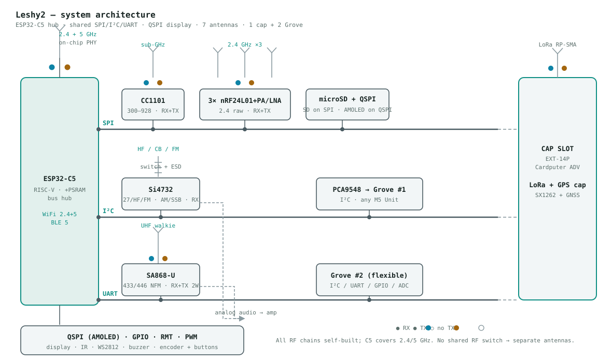
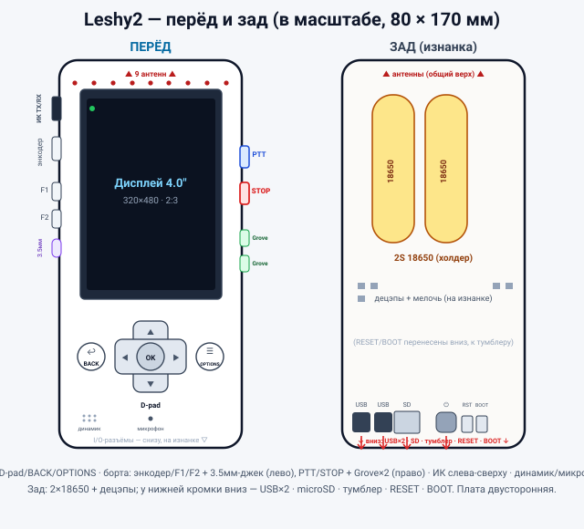

# Leshy2

*Читать на: [English](README.md) · **Русском***

**Открытый портативный многодиапазонный РЧ-наладонник — полевой инструмент, который ты собираешь сам.**

Leshy2 — преемник [esp32-leshy](https://github.com/anton-vinogradov/esp32-leshy), прошивочного форка [ESP32-DIV](https://github.com/cifertech/ESP32-DIV). Сохраняет зрелый ESP32-S3 как главный мозг и добавляет **сопроцессор ESP32-C5** ради того, чего S3 не умеет — нативного **5 ГГц** Wi-Fi. Два чипа, один полевой инструмент, в форме наладонника DIV, разрабатывается открыто, примерно за **$135–160** (~$108–125 электроники).

> 🛑 **Только своё железо.** Учебный инструмент для security-research и радио. Используй только на сетях, устройствах и радио, которыми владеешь или на тест которых есть письменное разрешение. Радиозакон различается по странам — проверять и соблюдать его на тебе.

---

## 📖 Как читать этот README

Этот README — **источник истины** проекта: конвейер от идеи до готовых плат, **этап за этапом**. Каждый этап задаёт **Постановку** (что и зачем) и рождает **Артефакты** (файлы в репо), которые становятся входом следующего этапа — так это читается как *постановка vs результат*, и каждый шаг можно чекать.

**Статус:** ✅ сделано · 🟡 в работе · ⏳ запланировано. На реальном железе пока ничего не собрано.

| # | Этап | Статус |
|--:|------|:------:|
| 1 | [Зачем девайс](#1-зачем-девайс--vision) | ✅ |
| 2 | [Что умеет — возможности](#2-что-умеет--возможности) | ✅ |
| 3 | [Компоненты](#3-компоненты) | ✅ |
| 4 | [Архитектура](#4-архитектура) | ✅ |
| 5 | [Внешний вид и управление](#5-внешний-вид-и-управление) | ✅ |
| 6 | [Листы схемы](#6-листы-схемы) | ✅ |
| 7 | [Свод, реализация, ревью, достройка](#7-свод-реализация-ревью-достройка) | 🟡 |
| 8 | [Разводка PCB](#8-разводка-pcb) | 🟡 |
| 9 | [Прошивка](#9-прошивка) | ⏳ |
| 10 | [Гейт валидации — PoC 5 ГГц](#10-гейт-валидации--poc-5-ггц) | ⏳ |
| 11 | [Изготовление и bring-up](#11-изготовление-и-bring-up) | ⏳ |

---

## 1. Зачем девайс — vision

**✅ Постановка.** Развить [ESP32-DIV](https://github.com/cifertech/ESP32-DIV): сохранить его зрелый дизайн ESP32-S3 и **расширить, что умеет наладонник** — сначала 5 ГГц Wi-Fi, которого у DIV нет, затем более широкий набор бортовых радио и периферии. Конкретно — поддержать:

- **5 ГГц Wi-Fi + Zigbee / 802.15.4 / Thread** — через сопроцессор **ESP32-C5** (единственный ESP32 с нативным 5 ГГц).
- **Bluetooth LE** — BLE-adv флуд и клавиатура/компаньон с телефона (BLE есть у обоих МК).
- **2.4 ГГц raw** — 3× nRF24L01+PA/LNA (параллельный скан, mousejack, джаммер).
- **Sub-GHz 315 / 433 / 868 / 915 МГц** — CC1101 + мультибэнд-фронтенд на SP4T.
- **LoRa / Meshtastic** — SX1262 / E22-900M22S (+22 дБм).
- **Голосовая рация** — SA868-U, 2 Вт TX/RX 433 / 446 МГц NBFM.
- **HF / CB / FM приёмник + настоящий аналоговый звук** — Si4732 + усилитель PAM8302 → динамик + джек.
- **GPS** (u-blox), **ИК TX / RX**, **microSD** (PCAP-логи).
- **2× Grove I²C** расширение под M5-юниты (NFC / RFID2, RTC, IMU, сенсоры).
- **Питание 2S 18650** с бортовым балансирным boost-зарядником.
- **Крупнее и выше разрешение** — **4.0″ 320×480 IPS** против 2.8″ 240×320 (ILI9341) у DIV: тот же интерфейс SPI, но **~2× площадь и 2× пикселей** (вдвое больше водопада на экране) и IPS (шире углы). Плотность та же ~143 ppi — крупнее и просторнее, не «чётче».
- **Полноценное управление** — **5-поз. D-pad + BACK + OPTIONS + PTT + паник-STOP + F1 / F2 + энкодер-колесо** (у DIV кнопки минимальные); длинный текст печатается с телефона.
- **Честные «в эфире»-индикаторы** — янтарный TX-LED на каждый TX-тракт (7 шт.; пассивный аппаратный детектор огибающей, 0 GPIO), показывает передачу тракта даже при зависшей прошивке.

S3 остаётся мозгом (UI, экран, все проводные радио, SD, шины, 2.4 ГГц Wi-Fi + BLE); C5 — чистый сопроцессор 5 ГГц. Форма наладонника DIV, честная цена (~$135–160), открыто — чтобы люди присоединялись.

**Этот перечень периферии — драйвер всего дальнейшего:** он задаёт возможности (этап 2), которые выбирают компоненты (этап 3), которые формируют архитектуру (этап 4) и физический девайс (этап 5).

**Хотели, но вне scope (и почему).** Часть возможностей отброшена по независящим от нас причинам или из-за раздувания бюджета — граница задаётся здесь, чтобы дальнейшие этапы за ними не гнались:

- **Полный 5 ГГц Wi-Fi (monitor + инъекция, захват WPA-handshake, Pineapple-класс).** C5 умеет только Marauder-класс разведки (скан / deauth / beacon / probe / сниф); raw monitor+inject на 5 ГГц требует Linux-стека Wi-Fi, которого нет ни у одного ESP32. *(ограничение чипа / SDK)*
- **Аналитика уровня Linux на устройстве (aircrack-ng, Kismet, WiFi Pineapple, взлом handshake).** Требует прикрутить Linux-SBC класса Raspberry Pi — раздувает бюджет, размер, потребление и убивает батарею. Смысл в лёгком наладоннике-ESP32 на весь день, а не в Linux-коробке: писать PCAP на SD и жевать их на ноутбуке. *(бюджет / сложность)*
- **Передача на HF / CB / КВ.** Si4732 — только приёмник, физически не передаёт. *(ограничение чипа)*
- **Непрерывный широкополосный SDR-захват / произвольный TX (HackRF-класс).** Нет широкополосного IQ-фронтенда — это другой, куда более дорогой класс устройства. *(scope / бюджет)*
- **Сотовая связь / GSM.** Нет модема. *(цена + легальность)*
- **Настоящая одновременная работа всех радио.** Девять антенн в одном малом объёме: одновременная работа всех TX-трактов глушит приёмники, поэтому тракты работают по очереди (TDD-арбитраж в прошивке; кроме параллельного скана 3× nRF24). *(РЧ-сосуществование, а не SPI-шина — та занята ~11–21 %.)*
- **Широкополосное глушение.** Намеренно не делается — незаконно (US §333, EU RED). *(легальность — «не будем», а не «не смогли»)*

**Артефакты.** Этот раздел и родословная, на которой он стоит:

- **[ESP32-DIV](https://github.com/cifertech/ESP32-DIV)** от CiferTech (MIT) — концепт железа и исток всей линейки.
- **[esp32-leshy](https://github.com/anton-vinogradov/esp32-leshy)** — прошивочный предшественник (наш ESP32-S3-взгляд на DIV), откуда портируется софт Leshy2.

Если проект нравится — сначала звёздочка и поддержка оригинала ESP32-DIV.

---

## 2. Что умеет — возможности

**✅ Постановка.** Зафиксировать набор функций, который железо обязано дать (всё для своего оборудования).

**Артефакты.** Список возможностей + карта частот ниже.

**Разведка / атаки**
- Wi-Fi 2.4 ГГц (ESP32-S3): скан, **deauth**, beacon / probe-флуд, сниф management-кадров — Marauder-класс.
- Wi-Fi 5 ГГц (ESP32-C5): скан, сниф, beacon / probe-флуд — Marauder-класс на 5 ГГц, которого у DIV не было.
- 2.4 ГГц raw (3× nRF24L01+PA/LNA): параллельный скан всей полосы, mousejack, анализатор каналов.
- Sub-GHz (CC1101): захват и replay OOK / FSK пультов 315 / 433 / 868 / 915 МГц; RSSI-«гейгер».
- BLE-adv флуд + сниф 802.15.4 / Zigbee (ESP32-C5).
- NFC (RFID2 через Grove): чтение MIFARE / NTAG.

**Слушать (голосом)**
- Si4732 (только приём): CB 27 МГц, весь HF / КВ, MW / LW (AM / SSB / CW) и FM 64–108 МГц.
- SA868-U: 433 / 446 МГц NBFM голос — слушать и говорить.
- Настоящий аналоговый звук: line-out → усилитель класса D PAM8302 → динамик + джек. МК **не** в звуковом тракте.

**Передавать**
- Рация SA868-U: 433 / 446 МГц, RX и TX до 2 Вт (PTT). Мощность ограничена регионом / лицензией.
- Meshtastic по LoRa (SX1262 / E22-900M22S, +22 дБм): шифрованный текст-меш на километры; лимиты по региону в прошивке.

**Спектр**
- 4.0″ IPS TFT (ST7796, 320×480) по SPI — большой цветной водопад на аппаратном верт. скролле.
- 2.4 ГГц raw-спектр через nRF24; sub-GHz водопад через CC1101.
- Янтарный TX-LED на каждый TX-тракт (7 шт.) — аппаратный детектор огибающей, честное «в эфире» даже при зависшей прошивке, 0 GPIO.

**Aux**
- microSD (SPI) для PCAP-логов · WS2812 RGB-статус + зуммер · GPS (u-blox, UART) · ИК TX/RX.
- **2× Grove HY2.0-4P (I²C, 3.3 В)** под M5 I²C-юниты (RFID2, RTC, IMU, сенсоры). Только Grove I²C-юниты.
- Длинный текст печатается с телефона (BLE / Wi-Fi) — бортовой клавиатуры нет (см. этап 9).

### Карта частот

| Полоса | Чип | RX | TX | Что делаешь |
|--------|-----|:--:|:--:|-------------|
| 2.4 ГГц Wi-Fi + BLE | ESP32-S3 | ✓ | ✓ | скан, **deauth**, beacon / probe-флуд, сниф |
| 5 ГГц Wi-Fi | ESP32-C5 | ✓ | ✓ | скан, сниф, beacon / probe-флуд |
| 802.15.4 / Zigbee + BLE | ESP32-C5 | ✓ | ✓ | сниф Zigbee / Thread, BLE-adv флуд |
| 2.4 ГГц raw | 3× nRF24L01+ | ✓ | ✓ | скан всей полосы, mousejack, анализатор |
| 315 / 433 / 868 / 915 МГц | CC1101 | ✓ | ✓ | захват / replay пультов, RSSI-«гейгер» |
| 433 / 446 МГц NBFM | SA868-U | ✓ | ✓ (≤2 Вт) | слушать и говорить (рация, PTT) |
| 27 МГц CB + HF / MW / LW | Si4732 | ✓ | — | слушать AM / SSB / CW и CB |
| 64–108 МГц FM | Si4732 | ✓ | — | слушать FM-вещание |
| LoRa (EU868 / US915) | SX1262 | ✓ | ✓ (+22 дБм) | Meshtastic шифр-меш |
| GPS L1 ~1.575 ГГц | u-blox (UART) | ✓ | — | позиция / время |

**Честные пределы.** 5 ГГц — **только Marauder-класс** (management-кадры — без полного monitor + injection), весь HF Si4732 — **только приём**, и **нельзя гонять все радио разом** (РЧ-сосуществование делит тракты по времени — не лимит шины). Полный список того, что намеренно **вне scope и почему** (raw 5 ГГц, аналитика уровня Linux, широкополосный SDR, глушение…), — в этапе 1.

---

## 3. Компоненты

**✅ Постановка.** Под возможности выше подобрать чипы и модули по честной цене.

**Артефакты.** [**BOM и разбор стоимости**](docs/bom.ru.md) (~$108–125 электроники) — каждая деталь, сгруппировано по возможностям, с главными драйверами цены.

---

## 4. Архитектура

**✅ Постановка.** Решить, как соединить части: топология двух чипов, общая шина и экспандеры, пин-бюджет, вмещающий столько радио.

**Артефакты.** [system-diagram](docs/img/system-diagram.svg) · [пин-бюджет](docs/pin-budget.ru.md) · [полный разбор железа](docs/hardware.ru.md).

- **Два чипа.** **ESP32-S3-WROOM-1U-N8R2** (2 ядра, quad PSRAM) — **главный мозг**: UI, экран, все проводные радио, SD, все шины, нативные 2.4 ГГц Wi-Fi + BLE. **ESP32-C5-WROOM-1U** — **чистый сопроцессор**: единственный ESP32 с нативным 5 ГГц, на своей dual-band антенне.
- **Линк чип-чип:** выделенный **SPI3 + DRDY** (C5 — чистый SPI-slave, общую шину не трогает). S3 шьёт C5 по UART0; у C5 свой USB-C для brick-safe восстановления.
- **Общая шина (S3 FSPI):** microSD + CC1101 + 3× nRF24 + SX1262 + экран — CS через 74HC138. Три I²C **PCA9555** несут медленные линии (управление радио/экраном, гейты рейлов, UI-кнопки); прерывания — на прямых ногах.
- **Экран:** панель ST7796 **4.0″ 320×480 IPS** — на той же общей SPI: у C5 нет `LCD_CAM` и нет свободных ног под параллель / QSPI, поэтому SPI; водопад идёт на **аппаратном верт. скролле** панели, чтобы обновления кадра были крошечными.
- **Human interface:** D-pad, BACK / OPTIONS / STOP / F1 / F2 и нажатие энкодера читаются через I²C-экспандеры **PCA9555** (GPIO S3 забиты, кнопки медленные); только A/B-квадратура энкодера держит две прямые ноги S3 (тайминг-критично). Все кнопки на одном INT.
- **9 антенн** (S3 2.4, C5 2.4/5, 3× nRF24, CC1101, телескоп Si4732, SA868, LoRa) — у каждого тракта своя антенна, крепление — **9 съёмных SMA-джеков на плате** вдоль верхнего торца, 3× nRF24 разнесены для изоляции (детали в этапе 5).
- **Два USB-C:** J1 → S3 (заряд + данные), J2 → C5 (только данные). Пакет заряжается только через J1.
- **Питание:** 2× 18650 в 2S — **BQ25887 boost-зарядник** (заряжает 2S от обычных 5 В USB), бэки MP2315 +5 В и +3V3, аналоговый рейл TPS7A2033 +3V3, гейты рейлов, гасящие спящие радио. Единственный вкл/выкл — жёсткий master-тумблер.

Одно радио за раз, поэтому общая шина и медленные линии влезают в пин-бюджет.

---

## 5. Внешний вид и управление

**✅ Постановка.** От компонентов — определить **физический девайс**: форм-фактор (~80 × 170 мм, без корпуса, открытая плата в стиле DIV), схему управления, где сидят внешние интерфейсы, и механический стек (экран спереди над электроникой; 2× 18650 сзади; двусторонний монтаж — детали с обеих сторон).

**Артефакты.** [**компоновка перёд/зад**](docs/img/layout-front-back.ru.svg) · [**управление и firmware-соглашения**](docs/firmware-controls.ru.md).

- **Перёд:** экран 4.0″ + D-pad (5-поз.) + BACK + OPTIONS.
- **Лев. борт:** ИК TX/RX (сверху), энкодер-колесо (громкость / значение), F1 / F2, 3.5 мм джек.
- **Прав. борт:** PTT + паник-STOP, 2× Grove (I²C).
- **Перёд (низ):** динамик + микрофон.
- **Низ (на изнанке, вниз):** USB-C ×2, microSD, master-тумблер, RESET / BOOT.
- **Зад:** 2× 18650 в клипсах (зона keep-out — под банками деталей нет).

Физический набор достаточен по [ревью покрытия сценариев](docs/firmware-controls.ru.md); бо́льшая часть удобства — в firmware-соглашениях (этап 9).

---

## 6. Листы схемы

**✅ Постановка.** Каждый подузел — своим листом, транскрибированным из архитектуры — и как дизайн-доки, **и** как живой [tscircuit](https://tscircuit.com)-код (реальные детали, LCSC-номера, экспорт в KiCad).

**Артефакты.** Шесть листов — каждый дизайн-док в своей папке `hardware/<лист>/` (ссылки ниже), а живой tscircuit-`.tsx` и экспортированный schematic SVG лежат в [`hardware/tscircuit/`](hardware/tscircuit/):

1. [Питание](hardware/power/power.ru.md) — 2S, BQ25887 boost-зарядник, рейлы, master-тумблер
2. [MCU + шины](hardware/c5-buses/c5-buses.ru.md) — S3 + C5, линк SPI3, 74HC138, PCA9555, USB
3. [РЧ-тракты](hardware/rf/rf.ru.md) — 3× nRF24, CC1101 + SP4T, SX1262 (LoRa)
4. [Аудио](hardware/audio/audio.ru.md) — Si4732, SA868, аналог-тракт → PAM8302
5. [Расширение + GPS](hardware/expansion/expansion.ru.md) — I²C, u-blox GPS, Grove
6. [Индикация / IO](hardware/indicators/indicators.ru.md) — TX-live LED, ИК клон/повтор, microSD, энкодер

---

## 7. Свод, реализация, ревью, достройка

**🟡 Постановка.** Свести шесть листов в одну плату на реальных, проверенных производителем деталях; отревьюить состязательно; достроить недостающее, чтобы схема была полной до разводки.

**Артефакты.** [`board.tsx`](hardware/tscircuit/board.tsx) — **генерируется** [`merge.py`](hardware/tscircuit/merge.py) из шести листов + [`integration.tsx`](hardware/tscircuit/integration.tsx) (223 детали) → [`board.kicad_pcb`](hardware/tscircuit/board.kicad_pcb) (связность доказана, `schematic_parity = 0`).

Сделано:

- **✅ Свод** — `board.tsx` *генерируется* из листов (источник истины: правишь лист или `integration.tsx`, затем `merge.py`). Diff-guard по деталям+цепям доказал побайтовую идентичность заменённому ручному своду.
- **✅ Реализация** — каждый IC / модуль / разъём на реальном LCSC-футпринте (движок tscircuit); геометрией остаются только механические плейсхолдеры.
- **✅ Ревью** — два состязательных саморевью всей платы + по-листовое ревью артефактов (электрика + `.md`↔`.tsx`). Подтверждённые дефекты легли в фиксы ниже.
- **✅ Электрофиксы (ревью)** — подтяжки на каждый вход-переключатель PCA9555 (10 UI-кнопок + энкодер / детект карты / детект джека / PTT — у чипа **нет** внутренних pull-up); **CC 5.1 кОм на J2** (прошивка C5 по USB); подтяжка на wired-OR `PCA9555_INT`; **локальный декаплинг** (100 нФ на каждую ногу питания ИС/модуля + bulk); базовые резисторы ~1 кОм у драйверов зуммера / ИК. TX-live LED переведены на минимальную мощность (10 кОм, ~0,1 мА). Формулировки `.md`↔`.tsx` сведены; нетлист проверен, чисто.

Осталось (🟡) — список достройки:
- **Свапы деталей (плейсхолдер → реальность).** TVS/ESD, PPTC-предохранитель, электретный микрофон, динамик, зуммер, 3.5 мм джек, холдер 18650 с доступной средней точкой (BQ25887 балансирует 2S), РЧ-балун, полосовые матч-сети и единый 5-поз. nav-switch под D-pad.
- **Подсхемы Этапа-3.** 7 РЧ-детекторов огибающей (TX-live LED), драйвер подсветки (+ ШИМ-дим), PIN-лимитер HF Si4732.
- **Проверка на фабе.** Пункты «сверить при разводке / bring-up»: ориентация pin-1 Grove, полярность / пусковой ток суперкапа, страп выбора шины Si4732 **и число груз-конденсаторов RCLK** (AN383 — почему кварцевый кап не трогали вслепую), boot-подтяжки.

*Детали дополняются здесь по мере закрытия пунктов.*

---

## 8. Разводка PCB

**🟡 WIP.** Разместить готовую плату (edge-aware зоны, двусторонка) на 4-слойном стеке с GND-планом, развести (авто + РЧ руками), добавить механику → gerbers. *Детали дополняются по мере проработки этапа.*

---

## 9. Прошивка

**⏳ WIP.** Портировать код S3 leshy, написать агент C5 для 5 ГГц + протокол S3↔C5, реализовать [соглашения управления](docs/firmware-controls.ru.md) + два блокера безопасности. *Детали дополняются по мере проработки этапа.*

---

## 10. Гейт валидации — PoC 5 ГГц

**⏳ WIP.** До заказа доказать 5 ГГц-deauth / разведку на девките C5 — самый рискованный тезис, проверяется дёшево. *Детали дополняются по мере проработки этапа.*

---

## 11. Изготовление и bring-up

**⏳ WIP.** Заказать (JLCPCB через реэкспедитора, или Резонит), собрать, запустить, настроить антенны по VNA. *Детали дополняются по мере проработки этапа.* См. [roadmap](docs/roadmap.md).

---

*Присоединиться: [CONTRIBUTING.md](CONTRIBUTING.md).*

## Лицензия

[MIT](LICENSE) — как у апстрима ESP32-DIV. Copyright © Антон Виноградов ([anton-vinogradov](https://github.com/anton-vinogradov)).
