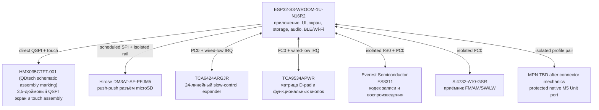
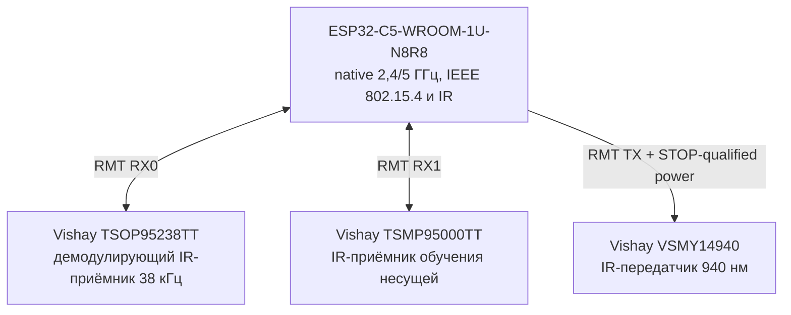
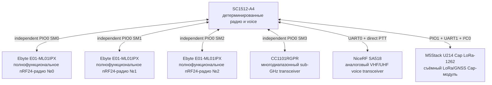
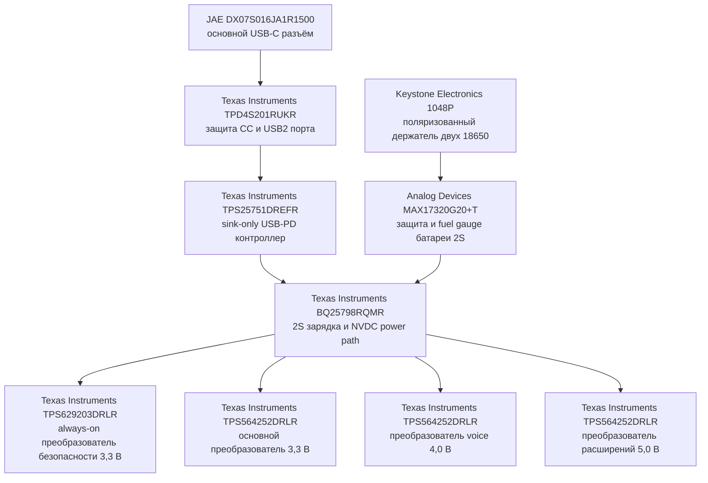

# Аппаратная часть Leshy2

> **Целевой сайт продукта.** Здесь описан готовый Leshy2: назначение,
> возможности, интерфейсы, принципиальное устройство и обязательные гарантии.
> Ход разработки и открытые проверки вынесены в отдельные инженерные документы.

- [English version](README.md)
- [Целевой firmware-продукт](https://github.com/anton-vinogradov/esp32-leshy2-firmware/blob/main/README.ru.md)
- [Состояние разработки](docs/status/current-state.ru.md)
- [Инженерные решения и доказательства](docs/review/README.md)

## Образ готового продукта

Leshy2 — открытый автономный портативный инструмент для наблюдения за
радиоэфиром, диагностики, связи и разрешённых исследований беспроводных и
контактных систем. Он объединяет несколько независимых радиотрактов, экран,
локальное управление, запись данных, аудио, сервисные интерфейсы и расширения
в одном ремонтопригодном устройстве.

Это полевой прибор, а не универсальный карманный компьютер: каждая аппаратная
возможность должна давать измеримый результат, иметь понятное безопасное
состояние и быть доступной для диагностики и восстановления владельцем.

## Три уровня функциональности

1. **Основной режим** — повседневные инструменты, приём, диагностика,
   навигация, обслуживание и законная связь.
2. **Лаборатория** — пассивные, защитные и ограниченные security-инструменты.
3. **Лаборатория → Контролируемая зона** — опасные active/disruptive функции.
   Каждый вход показывает новое неснимаемое предупреждение, а каждое действие
   отдельно требует авторизованной цели, изолированной/проводной среды или обоих.

При первичной установке отдельно принимается акт о ненападении. Ни он, ни
предупреждение не вооружают функцию и не отменяют требования законодательства,
лицензирования спектра, приватности и разрешения владельца цели.

## Возможности готового устройства

### Радио и связь

- Три независимых полнофункциональных nRF24 работают одновременно в любом
  сочетании `3R`, `1T2R`, `2T1R` и `3T`, без скрытого отключения соседних
  приёмников.
- В каждый момент сигнальным трактом владеет ровно одна верхнеуровневая группа.
  Три nRF образуют одну такую группу и сохраняют все обязательные одновременные
  сочетания; контролируемая межгрупповая инъекция в Лаборатории проверяет
  устойчивость, но никогда не создаёт runtime-разрешение. Все чужие интерфейсы
  при этом переводятся в измеримое quiet/off-состояние.
- У каждого nRF есть двусторонняя развязка Ioff на отключаемой шине,
  отдельный широкополосный направленный детектор прямой мощности и собственный
  внешний SMA-тракт. Тип ответной части обозначенного модулем `IPX` проверяется
  по реальному образцу, а не объявляется U.FL по предположению.
- Три разнесённых nRF-антенны дают калиброванное относительное sector/RPD
  сравнение. Результат не выдаётся за абсолютные dBm, угол или VSWR.
- Wi-Fi 2,4/5 ГГц, Bluetooth LE, ESP-NOW и IEEE 802.15.4 обеспечивают обычную
  связь, наблюдение и разрешённые диагностические сценарии.
- Радио S3 2,4 ГГц и C5 2,4/5 ГГц сохраняют независимые внешние RP-SMA-тракты.
  Каждый проходит через собственную платную ответную часть
  `Hirose U.FL-R-SMT-1(10)` и направленный ответвитель
  `KYOCERA AVX CP0603Q5425ENTR`, поэтому фактическое исходящее RF измеряется
  без общей антенны или общего детекторного тракта.
- Отдельный Sub-GHz тракт на `CC1101RGPR` выбирает ветку 315, 433 или общую
  868/915 МГц двумя `BGS13SN8E6327XTSA1`, отключая каждый невыбранный фильтр с
  обеих сторон. Band controls меняются только при выключенной шине; default
  `00` изолирует все ветви. Последний 50-Ом участок через 0,47-пФ sample
  наблюдает AON-held `AD8314ACPZ-RL7`; входящий RF никогда не разрешает TX.
- Sub-GHz тракт работает с пакетными системами; широковещательный
  приёмник покрывает AM/FM/SW/LW; VHF/UHF voice-тракт поддерживает аналоговую
  связь и аудиообработку.
- `Si4732-A10-GSR` сохраняет два отдельных защищённых RX-only порта: FM/SW
  работает через `FMI`, где `LQW15AN56NJ00D` 56 нГн и
  `GRM1555C1H102JA01D` 1 нФ образуют стартовый FM-тракт, а AM/LW —
  `GRM155R71A474KE01D` 0,47 мкФ и короткий маркированный loop-под. На каждой
  границе стоит свой `SESD0402X1UN-0020-090`; AM/LW явно не является 50-Ом
  портом и не допускает произвольный длинный коаксиал. SW остаётся на
  опубликованном для exact-чипа входе FMI, но его чувствительность принимается
  только по измерению полного тракта, а не по одной FM reference-схеме.
- Точный аудиотракт умеет направлять в кодек выбранный RX-звук или локальный
  электретный микрофон, воспроизводить через выключенный в reset 4-Ом динамик
  либо через определяемые по вставке наушники 3,5 мм. Шины кодека, приёмника и
  SA518 физически отсоединены при снятом питании; PTT остаётся отдельным
  STOP-доминируемым разрешением и никогда не выводится из наличия звука.
- Точные приёмники `TSOP95238TT` и `TSMP95000TT` одновременно обеспечивают
  устойчивую демодуляцию 38 кГц и измерение несущей 30–60 кГц. Их фильтрованная
  шина разряжается и Ioff-изолируется при простое. Боковой `VSMY14940`
  воспроизводит допущенные профили через STOP-квалифицированный ограниченный по
  току драйвер; экранированный оптический датчик `VEMD1060X01` подтверждает
  реальное излучение, а не выводит его из тока управления.
- Все девять бортовых антенных трактов выведены на собственные внешние порты:
  два RP-SMA для native Wi-Fi и семь standard SMA для остальных трактов.

### Интерфейсы и расширения

- Вертикальный сенсорный IPS-дисплей 3,5 дюйма, `320×480`, подключён прямым QSPI;
  критическое состояние и первый отклик меню появляются не позднее `100 мс`.
- Съёмная microSD хранит записи эфира, аудио, профили, журналы и экспортируемые
  данные. Питание включается только на время сессии накопителя; выключенная
  карта электрически изолирована, все доступные электрические контакты защищены,
  а наличие карты читается независимо от её питания. Штатное извлечение сначала
  завершает отложенную запись; неожиданное извлечение явно сообщается и не
  выдаёт незаписанный хвост данных за целый.
- Задний 14-контактный Cap-Bus принимает съёмный M5Stack U214 LoRa/GNSS и
  совместимые модули; отдельный защищённый M5 Unit-порт поддерживает GNSS,
  квалифицированные LoRa-модули, NFC, iButton/1-Wire и другие расширения.
- Квалифицированный raw-SDR или внешний RF-analysis модуль может определить
  отдельный high-throughput интерфейс; low-rate M5 command port не выдаётся за
  тракт сырых данных.
- Редкий длинный ввод текста может выполняться с локально сопряжённого телефона,
  но телефон не подтверждает опасные действия и не заменяет управление Leshy2.
- Внешний IMU может добавлять к измерениям положение и относительное движение;
  без квалифицированного крепления эти данные не выдаются за компас или пеленг.

### Обслуживание

- Каждый программируемый вычислительный домен имеет собственные пути прошивки,
  восстановления и диагностики, не зависящие от исправности соседнего домена.
- S3 использует защищённый основной USB и keyed UART0/RESET/BOOT. C5 имеет
  собственный data-only USB и keyed UART0/RESET/BOOT; RP2354B — собственный
  data-only USB и keyed SWD/RUN/USB_BOOT. Для каждого домена сохранены
  отдельные физические кнопки RESET и BOOT.
- USB-C портов C5/RP никогда не питает устройство: VBUS подключён только к
  1-МОм bleeder/test point, а питаемый от платы USB-ключ отключает D+/D− при
  выключенном устройстве и исключает обратную подпитку от кабеля.
- Hard STOP доминирует и в recovery mode. Три passive-drain reset sinks
  позволяют кнопке или fixture притянуть выбранный reset вниз без конфликта с
  активным высоким выходом; после recovery устройство всегда стартует TX-off.
- Основной USB-C сохраняет защищённые USB2 Full-Speed линии S3 (12 Мбит/с)
  и только принимает питание:
  fallback 5 В, 9 В при 3 А и 15 В при 2 А, до 30 Вт. Режимы power bank и
  USB-PD source отсутствуют.
- PD-контроллер прямо от сырого USB VBUS входит в аппаратный SafeMode,
  автономно загружается из отдельной восстанавливаемой EEPROM и не включает
  защищённый силовой тракт и заряд до появления валидного образа. Заводские
  площадки позволяют прошить пустую микросхему; полевое обновление проверяет
  подписанный владельцем образ и сохраняет rollback-регион.
- Зарядник 2S физически настроен на эффективный профиль `750 кГц` с дросселем
  `2,2 мкГн / 7 А`. После reset заряд начинается с консервативного `1 А`;
  штатно он не превышает `2 А`, сначала ограничивает вход по фактическому
  USB-контракту 5/9/15 В и прекращается при прямой ошибке температуры батареи.
- Контролируемая батарея 2S использует две отдельно заменяемые exact
  `XTAR 18650 4000mAh` защищённого button-top типа (`28,8 Вт·ч` nominal на
  пару) в точном поляризованном держателе `Keystone 1048P`; для работы от
  батарей нужны обе. Raw flat-top ячейки не поддерживаются, а квалифицированные
  аккумуляторы по умолчанию поставляются отдельным региональным комплектом. Переполюсовка
  исключается механически; аппаратная часть наблюдает и допускает пару до её
  подключения к системе и отказывает опасному сочетанию вместо принудительной
  работы или выравнивания. Глубоко разряженная банка также отклоняется:
  zero-volt/prequalification recovery в самом устройстве отключён, а любые
  исследования восстановления требуют отдельной изолированной оснастки
  Controlled Zone. Перед допуском общий тракт с нагрузкой 10 Ом прикладывает
  примерно `0,57…0,88 А` не дольше `50 мс`. Один non-retriggerable аппаратный
  канал не даёт растянуть импульс, а второй после него запрещает повтор минимум
  на `350 мс` даже при неисправной firmware. Две параллельные pulse-rated ветви
  по 20 Ом/2 Вт сохраняют суммарные 10 Ом и безопасно делят нагрев; штатная
  программа ждёт между попытками не менее 10 секунд. Это screen ячеек/контактов,
  а не обещание полной проверки под нагрузкой.
- Четыре независимые фиксированные шины разделяют always-on безопасность,
  вычислительное питание 3,3 В, голосовой тракт 4,0 В и защищённый порт
  расширения 5,0 В. Неиспользуемые ветви радио, накопителя и аудио физически
  отключаются и разряжаются до проверенного тихого состояния. Выход каждого
  преобразователя проходит собственную аппаратную отсечку перенапряжения,
  перегрузки и короткого замыкания до любого потребителя. Защищённая шина AON
  и её физический power-good удерживают supervisor 3,07 В в reset, и только
  его задержанный аппаратный POR включает основную шину. Firmware не может
  обойти допуск источника, brownout AON, любую внутреннюю границу защиты или
  этот порядок запуска.
  Runtime доверяет только power-good защищённой стороны. Защёлкнутая ошибка
  main требует полностью снять источник и заново пройти допуск. AON-отсечка
  может выполнять собственные ограниченные аппаратные попытки восстановления,
  но software не может их ускорить, а main остаётся выключенной до устойчиво
  исправной защищённой AON.
- Защищённый порт расширения запускается с управляемой скоростью нарастания
  напряжения и сразу действующим ограничением тока. Он поддерживает `1,25 А`
  постоянно и ограниченный по времени импульс `2,0 А` только после запуска;
  затянувшаяся перегрузка или иной fault eFuse защёлкивает порт выключенным без
  автоматических повторов.
- Подписанные обновления проверяют целевое устройство и поддерживают откат;
  ключи сборки и возможность установки владельческой прошивки остаются у
  владельца. Необратимая блокировка не включается по умолчанию.

## Принципиальный дизайн решения

Архитектура читается от трёх вычислительных владельцев, а не от USB-порта.
Первая схема показывает только межпроцессорные связи; следующие схемы
разворачивают устройства каждого владельца и отдельный power path.
Каждый прямоугольник — одно физическое устройство с exact/current MPN
и ролью; разные устройства не объединяются.

### Карта вычислительных владельцев

### S3: интерфейс пользователя, storage, audio и native expansion

### C5: native 2,4/5 ГГц, 802.15.4 и IR

### RP: детерминированные радио, voice и U214

### Питание как отдельный тракт

[Полный отрисовываемый атлас всех физических устройств](docs/review/architecture/generated/G2F-3I-principled-pinout.md) разбит на ограниченные Mermaid-диаграммы. Исходная монолитная проекция для машинного ревью сохраняется отдельно в [`G2F-3I-principled-projection.mmd`](docs/review/architecture/generated/G2F-3I-principled-projection.mmd).

<strong>Принципиальная распиновка</strong>

- **S3↔C5:** S3 `GPIO10,GPIO11,GPIO12,GPIO13`; C5
  `GPIO7,GPIO8,GPIO9,GPIO10` — выделенная 1-bit SDIO.
- **S3↔RP:** S3 `GPIO3,GPIO9,GPIO14,GPIO21,GPIO48`; RP
  `GPIO19,GPIO24,GPIO25,GPIO26,GPIO27` — выделенная SPI + alert.
- **Дисплей и microSD:** S3
  `GPIO4,GPIO5,GPIO35,GPIO36,GPIO38,GPIO40,GPIO41,GPIO42` — direct QSPI
  и единственная планируемая high-rate shared pair. Ioff-буферы со стороны
  карты и CS-gated возврат MISO исключают конфликт выключенной карты с D1 экрана.
- **Локальные органы управления:** S3 `GPIO39,GPIO47` — выделенные входы
  quadrature PCNT0. Отдельный `TCA9534APWR` `P0…P6` сканирует
  диодно-изолированную матрицу 4×3 с D-pad/OK, BACK, OPT, F1, F2 и нажатием
  энкодера; `P7` — локальный резерв. В reset/idle все строки низкие, поэтому
  любая кнопка вызывает wired-low interrupt. PTT подключён прямо к RP `GPIO21`,
  а STOP и RE-ARM остаются независимыми AON-трактами.
- **Главный slow I/O:** точный `TCA6424ARGJR` работает по адресу `0x22` от
  защищённого `3V3_MAIN`; RESET доступен fixture, а продукт умеет полностью
  перезапустить main-rail. Наблюдение STOP/evidence переходит из AON через
  отдельные open-drain буферы и не подпитывает выключенный расширитель.
  P03/P04 задают CC1101 band truth только при снятом питании; P05 независимо
  запрашивает питание native M5 Unit, поэтому распределены все 24 контакта.
- **Audio и Si4732:** S3 `GPIO1,GPIO2,GPIO15,GPIO16,GPIO17,GPIO18` — I²S0 и
  локальная I²C0 через физическую power-valid развязку. Slow I/O `P00,P01,P02`
  выбирают запись RX/микрофона, включают выключенный в reset динамик и
  определяют отсутствие наушников. PD-контроллер также использует ограниченную
  host-шину и общий wired-low system IRQ, не занимая нового GPIO S3.
- **M5 expansion:** S3 `GPIO7,GPIO8` идут к native HY2.0-4P Unit port через
  `TXS0102DCUR`; P05 управляет его отдельной 5-В ветвью `TPS259470LRPWR`, а P17 —
  отдельной ветвью U214. Обе ветви имеют supervisor защищённого питания,
  высокоимпедансную изоляцию сигналов и connector ESD; настоящего presence-pin
  нет ни у одного из этих разъёмов.
- **IR:** C5 `GPIO0,GPIO1,GPIO4,GPIO6,GPIO24` — два RX, TX, power и evidence.
- **nRF24 #0:** RP `GPIO0,GPIO1,GPIO2,GPIO30,GPIO31,GPIO32`.
- **nRF24 #1:** RP `GPIO3,GPIO4,GPIO5,GPIO33,GPIO34,GPIO35`.
- **nRF24 #2:** RP `GPIO6,GPIO7,GPIO8,GPIO36,GPIO37,GPIO38`.
- **CC1101:** RP `GPIO9,GPIO10,GPIO11,GPIO23,GPIO39,GPIO42,GPIO43`.
- **SA518/PTT:** RP `GPIO16,GPIO17,GPIO18,GPIO20,GPIO21`; восьмибитная маска
  evidence делит локальную RP I²C0, а аппаратный aggregate использует `GPIO22`.
  Физический ANT contact 7 идёт в direct protected 50-Ом standard-SMA path;
  `PESD24VY1BSF` и отдельный `AD8314ACPZ-RL7` resistive sample дают совместимые
  с 1 Вт ESD и actual-TX evidence, не расходуя P05.
- **U214 LoRa/GNSS:** RP
  `GPIO12,GPIO13,GPIO14,GPIO28,GPIO29,GPIO40,GPIO41,GPIO44,GPIO45,GPIO46,GPIO47`.
- **Ресурсный итог:** S3 `33 used / 3 reserved / 0 free`, C5 `14/6/1`, RP
  `48/0/0`, main slow I/O `24/0/0`, UI matrix I/O `7/1/0`. Независимые
  SWD/USB/RUN/BOOTSEL не входят в этот GPIO-бюджет.

[Полная карта физических контактов и сетей](docs/review/architecture/generated/G2F-3I-principled-pinout.md)

## Конструкция и органы управления

- Экран расположен вертикально; водопад обновляется небольшими областями и не
  блокирует обслуживание радио.
- Сборка QSPI/touch подключается через кандидат 40-контактного ZIF, имеет
  reset-low состояния по умолчанию, локальную развязку логики и отдельно
  защищённую защёлкиваемым ключом ШИМ-подсветку. Внутри находится единый exact
  `Sitronix ST77922` display/touch TDDI: touch использует I²C-адрес `0x38`, а
  его active-low interrupt входит в общую линию через подтянутый
  non-inverting open-drain buffer. Окончательная ориентация разъёма требует
  реального шлейфа экрана: электрическая карта не подменяет механическую
  квалификацию.
- Push-push microSD получает изолированное включаемое питание, безопасные
  reset-состояния и всегда читаемый card-detect. После каждого цикла питания
  прошивка переводит карту в SPI mode до возобновления обмена с дисплеем.
  Размещение гнезда, доступ к карте, ресурс носителей и fault-тесты вставки и
  извлечения остаются физическим HIL.
- Девять подписанных антенных портов сохраняют однозначную связь между
  разъёмом, трактом и активным профилем антенны.
- Съёмный U214 устанавливается поперёк задней стороны над аккумуляторами; его
  собственные антенны и разъёмы остаются доступными.
- Полный локальный набор сохранён: направления D-pad и OK, BACK, OPT, F1, F2,
  энкодер с нажатием, отдельный PTT с удержанием, аппаратный STOP и утопленный
  RE-ARM. Ни touch, ни телефон не заменяют эти органы управления.
- Девять дискретных обычных кнопок, PTT и RE-ARM используют exact low-current
  `Y78B23214FP`; gold-clad `AEQ10410` даёт нормально-замкнутый контакт STOP.
  У matrix, encoder/PTT и safety inputs отдельные exact ESD arrays, причём
  защита STOP/RE-ARM возвращается только в safety ground.
- Физические PTT, STOP и утопленный RE-ARM являются разными органами управления.
  STOP имеет независимую индикацию и не зависит от экрана.
- Разъёмы прошивки и диагностики доступны при собранном прототипе и не требуют
  исправной основной прошивки.

## Безопасность и честность измерений

- Каждый передатчик и лабораторное действие стартуют разоружёнными после
  включения, reset, watchdog, brownout или обновления.
- Первая передача использует консервативный профиль. Максимальная мощность
  появляется только после явного выбора для текущего сценария.
- Физический STOP доминирует над firmware и межпроцессорной связью. Отпускание
  STOP не восстанавливает прежние цель, канал, мощность или TX-lease.
- Нормально-замкнутая STOP-петля асинхронно защёлкивает reset всех трёх
  вычислительных доменов и независимо блокирует nRF CE, radio/accessory rails,
  voice PTT и IR waveform. Только новое нажатие утопленного RE-ARM или полное
  выключение питания начинают новый TX-off boot.
- Семь отдельных RF detectors и один оптический IR detector формируют восемь
  source-specific состояний и diode-isolated красный физический индикатор
  `ANY TX`. Аксессуар без собственного qualified evidence остаётся `Unknown`.
- Каждый onboard evidence-канал имеет собственные first-population threshold,
  hysteresis и open-drain pull-up. Тройная open-drain граница не позволяет
  постоянно запитанному evidence-домену подпитывать выключенные C5 или RP;
  обязательная измеренная калибровка каждого тракта остаётся TX-gate.
- Команда передачи, ток тракта, сообщение самого радио и независимое
  фактическое evidence отображаются как разные состояния. Неизвестное не
  превращается в успешное или безопасное.
- Неиспользуемые интерфейсы обесточиваются или переводятся в проверенное тихое
  состояние, чтобы не тормозить и не заглушать активную группу сигналов.
- Снижение стоимости допустимо только при сохранении функций, производительности,
  безопасности, надёжности, автономности, ремонтопригодности и тестируемости.

## Границы продукта

В базовый продукт не входят 6 ГГц/Wi-Fi 6E, generic USB host, персональный
FIDO/U2F-аутентификатор, встроенная клавиатура, мотор и встроенный IMU.
BadUSB/DuckyScript может существовать только как необязательная программная
функция Контролируемой зоны поверх уже имеющегося USB device-пути и не влияет
на аппаратную архитектуру радио-прибора.

## Документация проекта

- [Текущее состояние аппаратной проработки](docs/status/current-state.ru.md)
- [Принципиальная карта контактов](docs/review/architecture/PIN-0003-g2f-3i-principled-pinout.md)
- [Полный журнал требований, решений и проверок](docs/review/README.md)
- [Целевое описание прошивки](https://github.com/anton-vinogradov/esp32-leshy2-firmware/blob/main/README.ru.md)
