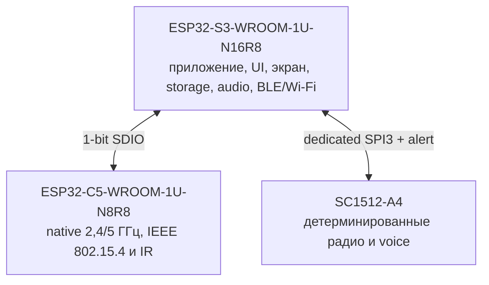
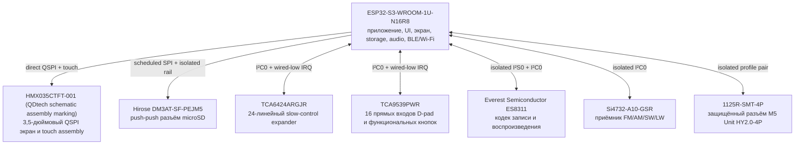
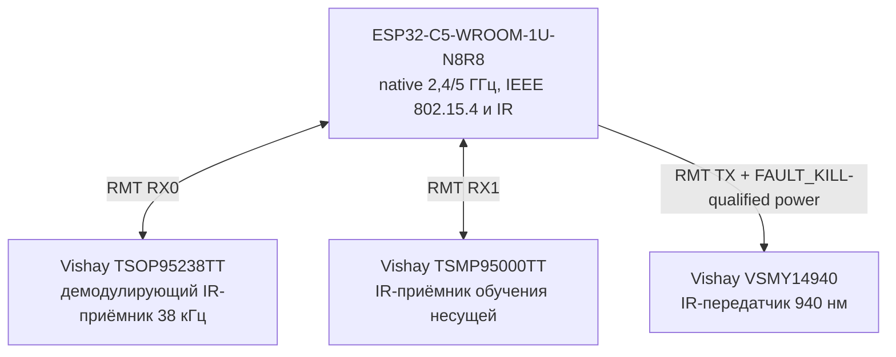
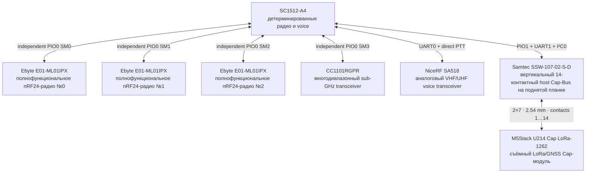
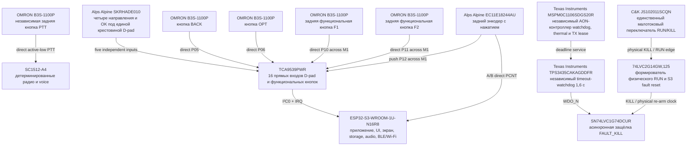
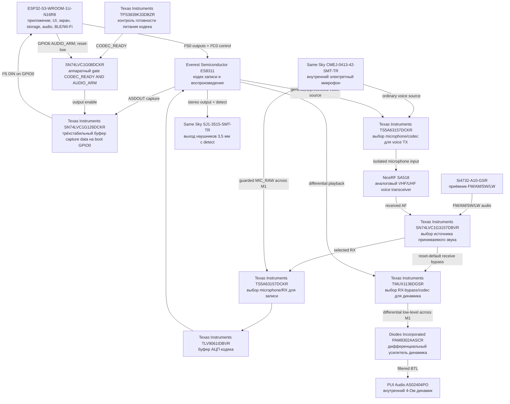
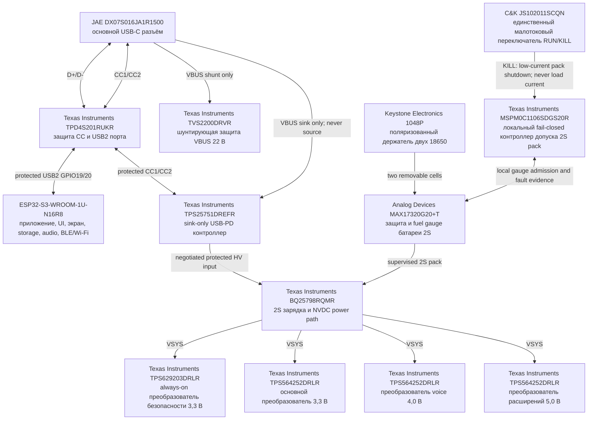

# Leshy2 — аппаратная часть

[English](README.md) · [Прошивка](https://github.com/anton-vinogradov/esp32-leshy2-firmware/blob/main/README.ru.md)

> **Статус железа: H1 — физический дизайн устройства.** Текущий мокап не
> принят; production ECAD, PCB routing и закупка заблокированы. Полный путь и
> текущая позиция показаны в [аппаратном роадмапе](docs/roadmap.ru.md).

## Роадмап и текущая позиция

Этот блок остаётся на стартовой странице до явной передачи производственных
файлов в печать/на фабрику. В [полном роадмапе](docs/roadmap.ru.md) приведены
зависимости и критерии выхода.

| Этап | Статус | Результат |
|---|---|---|
| H0 · Требования и функциональная архитектура | ✅ Проведено ревью | границы возможностей, вычислительные домены, владельцы, интерфейсы и safety rules |
| **H1 · Физический дизайн устройства** | **▶️ Сейчас** | принятая внешняя/внутренняя компоновка, реальные размеры, органы управления, подписи и сходящийся resource budget |
| H2 · Production ECAD-схема | ⏳ Ожидает H1 | точные symbols, pins, footprints, номиналы, nets и чистый ERC |
| H3 · Виртуальная электрическая проверка | ⏳ Ожидает H2 | power, transient, thermal, timing, RF и fault evidence |
| H4 · Объединённый pre-layout gate | 🔒 Ожидает H1–H3 и firmware F3 | закрытые виртуальные blockers и названные физические неопределённости |
| H5 · Образцы компонентов | 🔒 Ожидает H4 и одобрение стоимости | подтверждённые MPN, размеры и физическая совместимость |
| H6 · PCB placement и routing | 🔒 Ожидает H5 | проверенная разводка двух плат, DRC и manufacturing package |
| H7 · Печать прототипа и bring-up | 🔒 Ожидает H6 и одобрение заказа | платы-прототипы, rails, boot/recovery и smoke tests интерфейсов |
| H8 · Физическая квалификация | 🔒 Ожидает H7 | RF, power, thermal, safety, endurance и полный HIL 3×nRF24 |
| H9 · Производственный release | 🔒 Ожидает H8 и firmware F11 | воспроизводимый BOM/fab/test package и совместимые release tags |

**Железо находится на H1.** Актуальной production-схемы, PCB layout и target-прогонов в
эмуляторах ещё нет; ни один заказ не разрешён.

### Текущая фаза H1 — детальная позиция

<!-- current-substep: H1.1.3.3.3 -->

**Точный маркер: `H1.1.3.3.3`** — получить у производителей оставшиеся
controlled-данные дисплея, nRF и U214 без размещения заказа. Поиск по открытым
источникам и ревью замен завершены; ни один sample-заказ не разрешён. Уже
отрисованные виды остаются черновыми.

- ✅ `H1.0` — перенести требования H0 в механический acceptance list.
- `H1.1` — собрать реестр физических первоисточников.
  - ✅ `H1.1.1` — зарегистрировать каждый выбранный корпус или явный `MPN TBD`
    ровно с одной ролью в продукте.
  - ✅ `H1.1.2` — сверить размеры, origin, ориентацию и направление
    connector/actuator с evidence производителя.
  - `H1.1.3` — классифицировать каждую оставшуюся физическую неопределённость.
    - ✅ `H1.1.3.1` — собрать все открытые границы механических evidence.
    - ✅ `H1.1.3.2` — записать четыре blocker H1 и девять sample gate H5.
    - `H1.1.3.3` — закрыть оставшиеся source-data blocker до фиксации renderer.
      - ✅ `H1.1.3.3.1` — исчерпать открытые controlled-источники
        производителей и актуальные evidence жизненного цикла/наличия.
      - ✅ `H1.1.3.3.2` — сравнить полностью документированные замены без
        ухудшения принятого функционала.
      - ▶️ **`H1.1.3.3.3` — сейчас:** запросить у производителя оставшиеся
        controlled-данные без размещения заказа.
      - 🔒 `H1.1.3.3.4` — лишь если предыдущие пути исчерпаны, подготовить
        минимальный sample-план для отдельного согласования.
  - 🔒 `H1.1.4` — ждёт H1.1.3.3, затем фиксирует source table renderer.
- ⏳ `H1.2` — создать единую систему координат двух плат и корпуса.
- ⏳ `H1.3.0` — сгенерировать из единого source внешние стороны, органы
  управления, стрелки и читаемую шелкографию.
  - ✅ Последняя черновая корректировка: десять TX-индикаторов выровнены в два
    ряда по пять, лицевые кнопки подняты на 5 мм, а экран разделён на корпус
    54,5×83,0 мм и точную активную область 48,96×73,44 мм с пропорцией 2:3.
- 🔒 `H1.3.1` — пользовательское согласование целиком лицевой и задней сторон.
- ⏳ `H1.4.0` — сгенерировать зеркальные внутренние стороны и межплатный stack.
- 🔒 `H1.4.1` — пользовательское согласование обеих внутренних сторон и
  бутерброда.
- ⏳ `H1.5.0` — сгенерировать настоящий вид от антенного торца, разрезы, U214 и
  траектории доступа к батареям.
- 🔒 `H1.5.1` — пользовательское согласование геометрии сверху/на разрезах и
  service access.
- ⏳ `H1.6` — пройти проверки коллизий, зазоров, видимости и service access.
- ⏳ `H1.7.0` — повторить pin/resource fit и собрать единый cross-view package.
- 🔒 `H1.7.1` — пользовательское согласование сводной компоновки и всех дельт.
- 🔒 `H1.8` — формальная финальная приёмка H1; только после неё начинается H2.

`H1.1.3.3` завершается, когда по дисплею, nRF и U214 есть controlled evidence
или проверенный ограничивающий дизайн, а D-pad имеет размерный проверяемый
дизайн. Закупка не служит коротким путём: сначала идут поиск источников, ревью
документированной замены и запрос данных у производителя без заказа. Sample
можно предложить только последним резервом и всё равно отдельно согласовать.
После закрытия любой подзадачи этот маркер и обе страницы роадмапа обновляются
тем же commit до перехода дальше. Поздняя правка повторно открывает
затронутый пользовательский gate и все зависящие от него gates.

Leshy2 — открытый автономный прибор для наблюдения за радиоэфиром, связи,
диагностики и разрешённого исследования беспроводных и контактных систем.
Документация показывает целевое устройство: что оно умеет и как устроено.

## Что умеет устройство

- Одновременно управляет тремя полнофункциональными nRF24 в сочетаниях `3R`,
  `1T2R`, `2T1R` и `3T`.
- Работает с Wi‑Fi 2,4/5 ГГц, Bluetooth LE, ESP‑NOW, IEEE 802.15.4,
  Sub‑GHz 315/433/868/915 МГц, FM/AM/SW/LW, VHF/UHF voice и IR.
- Выводит все девять бортовых RF-трактов на разъёмы наружных сторон плат:
  два RP‑SMA и семь SMA. Ни одна антенная гребёнка не занимает межплатный канал.
- Использует [12-предметный профилированный комплект антенн](docs/antennas.ru.md):
  девять можно держать подключёнными одновременно, а сменные варианты точно
  подписаны для 315/433/868/915 МГц и VHF/UHF.
- Показывает меню, спектральный водопад и состояние трактов на вертикальном
  сенсорном IPS-дисплее 3,5″ `320×480` с прямым QSPI.
- Записывает данные и аудио на съёмную microSD, воспроизводит звук через
  динамик или наушники и принимает звук со встроенного микрофона.
- Поддерживает задний M5Stack U214 для LoRa RX/GNSS или точный
  [Leshy LoRa Cap](docs/lora-cap.ru.md) для evidence-qualified EU868/US915
  RX/TX, а также отдельный защищённый M5 Unit port для других модулей.
- Даёт владельцу независимые пути прошивки, восстановления и диагностики
  каждого программируемого контроллера.

## Как устроено

Внутри пять изолируемых вычислительных и управляющих доменов. `ESP32-S3-WROOM-1U-N16R8`
ведёт интерфейс, дисплей, storage и audio; `ESP32-C5-WROOM-1U-N8R8` — native
2,4/5‑ГГц radio, IEEE 802.15.4 и IR; `SC1512-A4` (RP2354B) — три nRF24,
Sub‑GHz, voice и U214; один `MSPM0C1106SDGS20R` независимо допускает батарейный
пакет, а второй ведёт watchdog, температурный контроль и разрешения TX.
Неиспользуемые интерфейсы отключаются и переводятся в проверяемое тихое состояние.

## Компоновка устройства

### Внешние и внутренние стороны плат

Первая проекция показывает только внешние, доступные пользователю стороны:
экран, органы управления, подписанные RF-разъёмы, индикаторы и боковые
интерфейсы. Вторая показывает две зеркально обращённые внутренние стороны и
точные устройства внутри бутерброда. Номер внутри компонента соответствует
указанным рядом точному MPN и роли.

### Вид сверху со стороны антенного торца

Настоящая верхняя проекция смотрит вдоль платы от антенн и показывает ширину,
глубину бутерброда, две антенные группы и симметричный вылет LoRa Cap.

### Разрезы бутерброда

Разрез A–A проходит через зону LoRa Cap, а B–B — через батареи и органы
управления. Разные продольные зоны не смешиваются в одной проекции.

<!-- BEGIN GENERATED PRINCIPLE DIAGRAMS -->

## Принципиальные связи компонентов

Архитектура читается от трёх вычислительных владельцев, а не от USB-порта.
Первая схема показывает только межпроцессорные связи; следующие схемы
разворачивают устройства каждого владельца и отдельный тракт питания.
Каждый прямоугольник — одно физическое устройство с выбранным партномером
или явной пометкой «партномер не выбран», а также его ролью в продукте.

### Карта вычислительных владельцев

### S3: интерфейс пользователя, storage, audio и native expansion

### C5: native 2,4/5 ГГц, 802.15.4 и IR

### RP: детерминированные радио, voice и Cap Bus

### Органы управления: от физической кнопки до владельца

### Аудиотракт: приём, запись, воспроизведение и передача

### Прошивка, восстановление и диагностика трёх вычислителей

```mermaid
flowchart TD
S3["ESP32-S3-WROOM-1U-N16R8<br/>приложение, UI, экран, storage, audio, BLE/Wi-Fi"]
PRODUCT_USB_CONNECTOR["JAE DX07S016JA1R1500<br/>основной USB-C разъём"]
PRODUCT_USB_PROTECTOR["Texas Instruments TPD4S201RUKR<br/>защита CC и USB2 порта"]
S3_DBG_HEADER["Samtec FTSH-105-01-L-DV-K-P-TR<br/>ключевой DBG10: UART0/RESET/BOOT"]
S3_RESET_BUTTON["Alps Alpine SKQGADE010<br/>технологическая кнопка RESET S3"]
S3_BOOT_BUTTON["Alps Alpine SKQGADE010<br/>технологическая кнопка BOOT S3"]
C5["ESP32-C5-WROOM-1U-N8R8<br/>native 2,4/5 ГГц, IEEE 802.15.4 и IR"]
C5_SERVICE_USB_CONNECTOR["GCT USB4105-GF-A<br/>data-only USB-C восстановления C5"]
C5_SERVICE_USB_SWITCH["onsemi FSUSB42MUX<br/>power-off-защищённый USB2 ключ C5"]
C5_DBG_HEADER["Samtec FTSH-105-01-L-DV-K-P-TR<br/>ключевой DBG10: UART0/RESET/BOOT"]
C5_RESET_BUTTON["Alps Alpine SKQGADE010<br/>технологическая кнопка RESET C5"]
C5_BOOT_BUTTON["Alps Alpine SKQGADE010<br/>технологическая кнопка BOOT C5"]
RP["SC1512-A4<br/>детерминированные радио и voice"]
RP_SERVICE_USB_CONNECTOR["GCT USB4105-GF-A<br/>data-only USB-C восстановления RP"]
RP_SERVICE_USB_SWITCH["onsemi FSUSB42MUX<br/>power-off-защищённый USB2 ключ RP"]
RP_DBG_HEADER["Samtec FTSH-105-01-L-DV-K-P-TR<br/>ключевой DBG10: SWD/RUN/USB_BOOT"]
RP_RESET_BUTTON["Alps Alpine SKQGADE010<br/>технологическая кнопка RUN/RESET RP"]
RP_BOOT_BUTTON["Alps Alpine SKQGADE010<br/>технологическая кнопка USB_BOOT RP"]
  PRODUCT_USB_CONNECTOR <-->|"USB2 data"| PRODUCT_USB_PROTECTOR <-->|"native USB"| S3
  S3_DBG_HEADER <-->|"UART0 + RESET + BOOT"| S3
  S3_RESET_BUTTON -->|"RESET"| S3
  S3_BOOT_BUTTON -->|"GPIO0; gated I²S_DIN only after boot"| S3
  C5_SERVICE_USB_CONNECTOR <-->|"data only; VBUS sense only"| C5_SERVICE_USB_SWITCH <-->|"native USB"| C5
  C5_DBG_HEADER <-->|"UART0 + RESET + BOOT"| C5
  C5_RESET_BUTTON -->|"RESET"| C5
  C5_BOOT_BUTTON -->|"GPIO28"| C5
  RP_SERVICE_USB_CONNECTOR <-->|"data only; VBUS sense only"| RP_SERVICE_USB_SWITCH <-->|"native USB"| RP
  RP_DBG_HEADER <-->|"SWD + RUN + USB_BOOT"| RP
  RP_RESET_BUTTON -->|"RUN"| RP
  RP_BOOT_BUTTON -->|"QSPI_SS / USB_BOOT"| RP
```

### Девять независимых антенных портов

```mermaid
flowchart TD
S3["ESP32-S3-WROOM-1U-N16R8<br/>приложение, UI, экран, storage, audio, BLE/Wi-Fi"]
S3_EXTERNAL_RP_SMA["GCT RFPC-SMA32-FN-175-A<br/>внешний RP-SMA порт S3 2,4 ГГц"]
C5["ESP32-C5-WROOM-1U-N8R8<br/>native 2,4/5 ГГц, IEEE 802.15.4 и IR"]
C5_EXTERNAL_RP_SMA["GCT RFPC-SMA32-FN-175-A<br/>внешний RP-SMA порт C5 2,4/5 ГГц"]
RECEIVER["Si4732-A10-GSR<br/>приёмник FM/AM/SW/LW"]
RECEIVER_FMSW_EXTERNAL_SMA["GCT RFPC-SMA31-FN-175-A<br/>приёмный SMA порт FM/SW"]
RECEIVER_AMLW_EXTERNAL_SMA["GCT RFPC-SMA31-FN-175-A<br/>не-50-омный SMA порт AM/LW loop/pod"]
NRF0["Ebyte E01-ML01IPX<br/>полнофункциональное nRF24-радио №0"]
NRF0_EXTERNAL_SMA["GCT RFPC-SMA31-FN-175-A<br/>независимый SMA порт nRF24 №0"]
NRF1["Ebyte E01-ML01IPX<br/>полнофункциональное nRF24-радио №1"]
NRF1_EXTERNAL_SMA["GCT RFPC-SMA31-FN-175-A<br/>независимый SMA порт nRF24 №1"]
NRF2["Ebyte E01-ML01IPX<br/>полнофункциональное nRF24-радио №2"]
NRF2_EXTERNAL_SMA["GCT RFPC-SMA31-FN-175-A<br/>независимый SMA порт nRF24 №2"]
CC["CC1101RGPR<br/>многодиапазонный sub-GHz transceiver"]
CC_EXTERNAL_SMA["GCT RFPC-SMA31-FN-175-A<br/>многодиапазонный SMA порт sub-GHz"]
VOICE["NiceRF SA518<br/>аналоговый VHF/UHF voice transceiver"]
VOICE_EXTERNAL_SMA["GCT RFPC-SMA31-FN-175-A<br/>SMA порт VHF/UHF voice"]
  S3 -->|"50 Ω"| S3_EXTERNAL_RP_SMA
  C5 -->|"50 Ω"| C5_EXTERNAL_RP_SMA
  RECEIVER -->|"FM/SW receive"| RECEIVER_FMSW_EXTERNAL_SMA
  RECEIVER -->|"AM/LW loop/pod"| RECEIVER_AMLW_EXTERNAL_SMA
  NRF0 -->|"50 Ω"| NRF0_EXTERNAL_SMA
  NRF1 -->|"50 Ω"| NRF1_EXTERNAL_SMA
  NRF2 -->|"50 Ω"| NRF2_EXTERNAL_SMA
  CC -->|"50 Ω"| CC_EXTERNAL_SMA
  VOICE -->|"50 Ω"| VOICE_EXTERNAL_SMA
```

### Питание как отдельный тракт

### RUN/KILL, watchdog, thermal и подтверждение фактической передачи

```mermaid
flowchart TD
POWER_COMMAND_SWITCH["C&K JS102011SCQN<br/>единственный малотоковый переключатель RUN/KILL"]
SAFE_SUPERVISOR["TPS3808G33DBVR<br/>контроль always-on питания безопасности"]
SAFETY_CONTROLLER["Texas Instruments MSPM0C1106SDGS20R<br/>независимый AON-контроллер watchdog, thermal и TX lease"]
SAFETY_WATCHDOG["Texas Instruments TPS3435CAKAGDDFR<br/>независимый timeout-watchdog 1,6 с"]
SAFE_CONDITIONER["74LVC2G14GW,125<br/>формирователь физического RUN и S3 fault reset"]
SAFE_LATCH["SN74LVC1G74DCUR<br/>асинхронная защёлка FAULT_KILL"]
SAFE_GATE_A["SN74LVC08APWR<br/>аппаратные разрешения трёх nRF24 и их питания"]
SAFE_GATE_B["SN74LVC08APWR<br/>аппаратные разрешения CC, voice и расширений"]
IR_SAFE_GATE["SN74LVC1G08DCKR<br/>локальное аппаратное разрешение IR carrier"]
EVIDENCE_CMP_A["TLV1824PWR<br/>UI-компаратор фактического TX S3, C5 и IR"]
EVIDENCE_CMP_B["TLV1824PWR<br/>RF-компаратор фактического TX 3×nRF24 и CC"]
EVIDENCE_CMP_VOICE["TLV1821DCKR<br/>отдельный RF-компаратор фактического voice TX"]
U214_CONNECTOR["Samtec SSW-107-02-S-D<br/>вертикальный 14-контактный host Cap-Bus на поднятой планке"]
EXT_EVIDENCE_BUFFER["SN74LVC1G07DCKR<br/>5-В-стойкая развязка evidence от LoRa Cap"]
EVIDENCE_MASK["TCA9535PWR<br/>16-битный AON-регистр маски девяти источников TX"]
EVIDENCE_OR_0["BAT54ALT1G<br/>диодное объединение evidence S3 и C5"]
EVIDENCE_OR_1["BAT54ALT1G<br/>диодное объединение evidence nRF24 №1 и №2"]
EVIDENCE_OR_2["BAT54ALT1G<br/>диодное объединение evidence nRF24 №3 и Sub-GHz"]
EVIDENCE_OR_3["BAT54ALT1G<br/>диодное объединение evidence voice и IR"]
EVIDENCE_OR_4["BAT54ALT1G<br/>диодное объединение evidence LoRa/EXT"]
EVIDENCE_MAIN_ISOLATOR["SN74LVC3G07DCUR<br/>развязка цифровых TX-свидетельств в main domain"]
  SAFE_SUPERVISOR -->|"power-on reset"| SAFE_LATCH
  POWER_COMMAND_SWITCH -->|"KILL / physical RUN edge"| SAFE_CONDITIONER
  SAFETY_CONTROLLER -->|"deadline service"| SAFETY_WATCHDOG
  SAFETY_WATCHDOG -->|"WDO_N"| SAFE_LATCH
  SAFE_CONDITIONER -->|"KILL / physical re-arm clock"| SAFE_LATCH
  SAFE_LATCH -->|"RUN_PERMIT"| SAFE_GATE_A
  SAFE_LATCH -->|"RUN_PERMIT"| SAFE_GATE_B
  SAFE_LATCH -->|"one digital permit across M1"| IR_SAFE_GATE
  EVIDENCE_CMP_A -->|"three UI-local digital evidence lines"| EVIDENCE_MASK
  EVIDENCE_CMP_B -->|"four RF-local digital evidence lines"| EVIDENCE_MASK
  EVIDENCE_CMP_VOICE -->|"one RF-local digital evidence line"| EVIDENCE_MASK
  U214_CONNECTOR -->|"stock 5V_OUT high or qualified EXT_TX_EVIDENCE_N low"| EXT_EVIDENCE_BUFFER
  EXT_EVIDENCE_BUFFER -->|"ninth active-low evidence line"| EVIDENCE_MASK
  EVIDENCE_CMP_A -->|"C5 / IR evidence"| EVIDENCE_MAIN_ISOLATOR
  EVIDENCE_CMP_A -->|"sources 0 / 1"| EVIDENCE_OR_0
  EVIDENCE_CMP_B -->|"sources 2 / 3"| EVIDENCE_OR_1
  EVIDENCE_CMP_B -->|"sources 4 / 5"| EVIDENCE_OR_2
  EVIDENCE_CMP_VOICE -->|"source 6"| EVIDENCE_OR_3
  EVIDENCE_CMP_A -->|"source 7"| EVIDENCE_OR_3
  EXT_EVIDENCE_BUFFER -->|"source 8"| EVIDENCE_OR_4
  EVIDENCE_OR_0 -->|"wired ANY_TX_AON_N"| EVIDENCE_MAIN_ISOLATOR
  EVIDENCE_OR_1 -->|"wired ANY_TX_AON_N"| EVIDENCE_MAIN_ISOLATOR
  EVIDENCE_OR_2 -->|"wired ANY_TX_AON_N"| EVIDENCE_MAIN_ISOLATOR
  EVIDENCE_OR_3 -->|"wired ANY_TX_AON_N"| EVIDENCE_MAIN_ISOLATOR
  EVIDENCE_OR_4 -->|"wired ANY_TX_AON_N"| EVIDENCE_MAIN_ISOLATOR
```

Точные контакты показаны в [распиновке](docs/pinout.ru.md), а прохождение сигналов между платами — в [карте M1](docs/interconnect.ru.md).

<!-- END GENERATED PRINCIPLE DIAGRAMS -->

## Безопасные уровни

1. **Основной режим** — приём, диагностика, обслуживание и обычная связь.
2. **Лаборатория** — пассивные, защитные и ограниченные исследовательские
   инструменты.
3. **Лаборатория → Контролируемая зона** — потенциально опасные active-функции
   только для изолированной среды или явно разрешённой цели. Каждый вход заново
   показывает обязательное предупреждение.

Фиксируемый переключатель `RUN/KILL` — единственный физический орган допуска.
Любая защёлкнутая авария запрещает передачу и требует настоящего цикла
`KILL`→`RUN`; программный автоматический перезапуск невозможен. При первичной
установке пользователь принимает акт о ненападении; он не заменяет закон,
лицензию на спектр и разрешение владельца цели.

## Документация

- [Роадмап и текущая позиция проекта](docs/roadmap.ru.md)
- [Аппаратная архитектура и компоненты](docs/hardware.ru.md)
- [Точный съёмный LoRa Cap](docs/lora-cap.ru.md)
- [Принципиальные схемы устройства](docs/schematics.ru.md)
- [Точное межплатное соединение M1](docs/interconnect.ru.md)
- [Точная распиновка контроллеров](docs/pinout.ru.md)
- [Память S3 и загрузочные линии](docs/memory.ru.md)
- [Безопасность, питание, обновление и восстановление](docs/safety.ru.md)
- [Возможности и архитектура прошивки](https://github.com/anton-vinogradov/esp32-leshy2-firmware/blob/main/README.ru.md)
