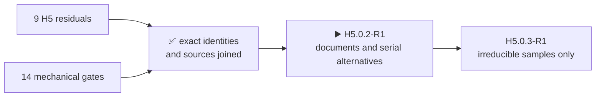

# H5.0.1-R1 · component-evidence map

[Русский](component-evidence-map.ru.md) · [Home](../README.md) · [Roadmap](roadmap.md)

The mapping review is complete: all nine H5 residuals and all 14 mechanical gates are joined to selected serial parts, existing sources, missing data and pre-accepted pass rules. This does **not** close a physical check and does **not** authorize a purchase.

## Nine physical residuals

### `H3-PHY-017` · `display`

- Selected: `HMX035CTFT-001 (QDtech schematic assembly marking)`; `Sitronix ST77922`; `Hirose DF40C(2.0)-40DS-0.4V(58)`; `Hirose DF40C-40DP-0.4V(51)`; `Hirose FH34SRJ-40S-0.5SH(99)`.
- Still to prove: standalone order identity and current-lot full FPC outline for the HMX035CTFT-001-marked assembly; received-controller identity/readback and measured VDD/VDDI ramp equality.
- Pass rule: the received specimen directly demonstrates this item: confirm HMX035CTFT-001 tail, ST77922 identity, VDD/VDDI ramp equality and reset/readback on received specimens; a mismatch reopens the owning H1/H2/H3 result

### `H3-PHY-024` · `ir`

- Selected: `Vishay TSOP75238TT`; `Vishay TSMP95000TT`; `Vishay VSMY14940`.
- Still to prove: received-lot orientation and measured startup, quiet-guard, capture and no-back-power behaviour.
- Pass rule: the received specimen directly demonstrates this item: verify received TSOP75238TT/TSMP95000TT identity, orientation, two-channel capture, 20-ms startup guard, 5-ms QOD quiet guard and no-back-power; a mismatch reopens the owning H1/H2/H3 result

### `H3-PHY-028` · `battery`

- Selected: `Analog Devices MAX17320G20+T`.
- Still to prove: programmed golden-image readback plus blank, corrupt and exhausted-write fault-injection records.
- Pass rule: the received specimen directly demonstrates this item: program one golden MAX17320 image, verify both address spaces/checksum/readback and fault-inject blank, corrupt and exhausted-write specimens; a mismatch reopens the owning H1/H2/H3 result

### `H3-PHY-038` · `timing`

- Selected: `Hirose DM3AT-SF-PEJM5`.
- Still to prove: exact serial microSD reference-medium MPN is not selected; received-card CMD6 identity, throughput, stall distribution and 512-KiB-buffer trace.
- Pass rule: the received specimen directly demonstrates this item: qualify SD card identity/CMD6 high-speed mode, >=4.0-MB/s storage, 1.5-MB/s record, 250-ms stalls and 512-KiB buffering; a mismatch reopens the owning H1/H2/H3 result

### `H3-PHY-046` · `boundaries`

- Selected: `M5Stack U214 Cap LoRa-1262`; `Samtec HLE-107-02-G-DV-PE-LC`.
- Still to prove: the stock U214 fitted male-post manufacturer/MPN, section, material and plating are not published; measured continuity, insertion/withdrawal force and repeated-cycle retention for the mixed stock-U214/HLE pair.
- Pass rule: the received specimen directly demonstrates this item: verify received stock U214 male-post material/plating, current continuity, insertion/withdrawal force and repeated-cycle retention; the 4.1-A figure proves only the controlled HLE/TSM pair; a mismatch reopens the owning H1/H2/H3 result

### `H3-PHY-048` · `boundaries`

- Selected: `1125R-SMT-4P`; `Texas Instruments TXS0102DCUR`.
- Still to prove: exact serial cable/accessory set for the admitted I2C, UART, GPIO and 1-Wire profiles is not selected; received cable lengths, pull networks and profile waveforms through TXS0102.
- Pass rule: the received specimen directly demonstrates this item: qualify each native Unit profile, cable length and pull network through TXS0102; 1-Wire remains specimen-only; a mismatch reopens the owning H1/H2/H3 result

### `H3-PHY-053` · `phase`

- Selected: `Ebyte E01-ML01IPX`; `TE Connectivity 2118651-2`; `Hirose U.FL-R-SMT-1(10)`; `GCT RFPC-SMA31-FN-175-A`.
- Still to prove: the fitted microcoax receptacle MPN and connector axis on each received E01-ML01IPX lot are not published; three independent assembled-feed loss/match and mating/retention records.
- Pass rule: the received specimen directly demonstrates this item: measure all three E01 module-to-SMA feeds and received-lot Gen1 mating/retention independently; a mismatch reopens the owning H1/H2/H3 result

### `H3-PHY-057` · `phase`

- Selected: `Si4732-A10-GSR`; `GCT RFPC-SMA31-FN-175-A`; `L2-ANT-AM-LW-001`.
- Still to prove: received edge-SMA and controlled pod constituent identities, physical envelopes and mating records before the H6 routed-capacitance budget and H8 total measurement.
- Pass rule: the received SMA and every controlled pod constituent match their selected identities and physical envelopes; H5 does not claim total assembled-path capacitance

### `H3-PHY-062` · `phase`

- Selected: `ESP32-S3-WROOM-1U-N16R8`; `ESP32-C5-WROOM-1U-N8R8`; `Ebyte E01-ML01IPX`; `TE Connectivity 2118651-2`; `Hirose U.FL-R-SMT-1(10)`.
- Still to prove: received 2118651-2 bend, retention and strain behaviour in all five installed paths; received E01 fitted-connector axes before freezing placement.
- Pass rule: the received specimen directly demonstrates this item: measure received 2118651-2 bend/retention/strain behavior and E01 connector axes before freezing the five microcoax paths; a mismatch reopens the owning H1/H2/H3 result

## Fourteen mechanical gates

- `H5-MECH-DISPLAY-TAIL` — `HMX035CTFT-001 (QDtech schematic assembly marking)`; `Hirose DF40C(2.0)-40DS-0.4V(58)`; `Hirose DF40C-40DP-0.4V(51)`; `Hirose FH34SRJ-40S-0.5SH(99)`; open: Standalone order identity, current-lot complete FPC outline, thickness, stiffener, adhesive, bend path and actual insertion/retention in the selected dual-contact ZIF remain received-display properties; a mismatch may revise only the small adapter and its panel-side connector.
- `H5-MECH-NRF-GEN1-FEEDS` — `Ebyte E01-ML01IPX`; `TE Connectivity 2118651-2`; `Hirose U.FL-R-SMT-1(10)`; `GCT RFPC-SMA31-FN-175-A`; open: The connector axis and current-lot receptacle manufacturer's exact MPN, actual fit/retention, bend/strain behaviour and end-to-end RF loss remain received-part properties. H1.2/H1.6 must prove the conservative module-face-to-board-receptacle corridor without relying on a nominal axis.
- `H5-MECH-U214-MATING-STACK` — `M5Stack U214 Cap LoRa-1262`; `Samtec HLE-107-02-G-DV-PE-LC`; open: Current-lot U214 post section, insertion force, contact retention, repeated-cycle fit, retention-screw engagement and final compliant rail preload remain received-part properties; none changes the bounded H1 exterior envelope or main-board placement.
- `H5-MECH-NAVIGATION-CONTROLS` — `OMRON B3S-1100P`; open: Assembled enclosure opening access, accidental-press margin, multi-button feel, sealing boundary and endurance.
- `H5-MECH-SA818S-DUAL-LAND-FIT` — `G-NiceRF SA818S-U`; `G-NiceRF SA818S-V`; open: Received SA818S-U/V lot identity, common-land tolerance, solder fillet and thermal assembly behaviour.
- `H5-MECH-ENCODER-KNOB` — `Alps Alpine EC11E18244AU`; `Davies Molding 1227-J`; open: Insertion depth, retention, push travel, feel and final rear depth on received parts.
- `H5-MECH-DIRECT-PRESS-CONTROLS` — `OMRON B3S-1100P`; open: PCB/enclosure press feel, accidental-press margin and endurance.
- `H5-MECH-RUN-KILL` — `C&K JS102011SCQN`; open: Received side access, detent force, accidental motion and endurance.
- `H5-MECH-M5-UNIT-MATE` — `1125R-SMT-4P`; open: Received Grove cable insertion, retention, strain relief and repeated mating.
- `H5-MECH-CELL-HOLDER-FIT` — `Keystone Electronics 1048P`; `XTAR 18650 4000mAh`; open: Received insertion force, contact compression, polarity protection, vibration and thermal cycling.
- `H5-MECH-NATIVE-RF-JUMPERS` — `TE Connectivity 2118651-2`; `Hirose U.FL-R-SMT-1(10)`; open: Actual bend radius, strain relief, insertion force, retention and RF loss after assembly.
- `H5-MECH-DISPLAY-PERFORMANCE` — `HMX035CTFT-001 (QDtech schematic assembly marking)`; `Hirose DF40C(2.0)-40DS-0.4V(58)`; `Hirose DF40C-40DP-0.4V(51)`; `Hirose FH34SRJ-40S-0.5SH(99)`; open: QSPI/touch operation, optical quality, backlight current/thermal, flex endurance and lot repeatability.
- `H5-MECH-ACOUSTIC-PATHS` — `PUI Audio AS02404PO`; `Same Sky CMEJ-0413-42-SMT-TR`; open: Enclosure acoustic treatment, cavity resonance, sealing, feedback, microphone response and vibration.
- `H5-MECH-HEADSET-JACK` — `Same Sky SJ-43504-SMT-TR`; open: Received cutout tolerance, shield and solder-tab fit, enclosure opening, plug insertion/withdrawal force, CTIA and three-pole TRS behavior, retention and unplug transient remain assembled-product properties.

## Honest result boundary

- Every board-fitted part in a mechanical gate has an exact non-TBD MPN.
- Test articles not selected yet are explicit: a reference microSD and the M5 Unit/cable profile set.
- The fitted connector in a received `E01-ML01IPX` and the fitted post on a stock `U214` were not assigned invented MPNs; their makers do not publish them.
- Actual fit, retention, RF, timing and lot identity remain open until received-sample evidence exists.
- The next exact marker is `H5.0.2-R1`; purchase, PCB placement/routing and fabrication remain prohibited.

Machine result: [`H5-EVR01`](../hardware/verification/generated/H5-EVR01-residual-map.json).
