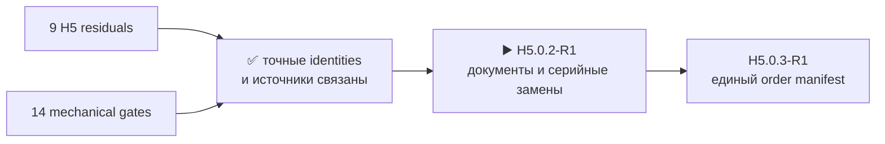

# H5.0.1-R1 · карта evidence компонентов

[English](component-evidence-map.md) · [На главную](../README.ru.md) · [Роадмап](roadmap.ru.md)

Карта проведена: все девять H5-residuals и все 14 механических gate’ов связаны с выбранными серийными деталями, существующими источниками, недостающими данными и заранее принятыми pass rules. Это **не** закрывает физические проверки и **не** разрешает закупку.

## Девять физических residuals

### `H3-PHY-017` · `display`

- Выбрано: `EastRising ER-TFT035IPS-6 + ER-TPC035-6`; `Sitronix ST77922`; прямой UI-PCB `Hirose FH34SRJ-50S-0.5SH(50)`.
- Осталось доказать: самостоятельный order identity и полный контур FPC production panel; identity/readback контроллера и равенство разгона VDD/VDDI на единственном прототипе в H7/H8.
- Критерий: полученный и однозначно идентифицированный образец напрямую подтверждает пункт; несовпадение повторно открывает связанный результат H1/H2/H3.

### `H3-PHY-024` · `ir`

- Выбрано: `Vishay TSOP75238TR`; `Vishay TSMP95000TT`; `Vishay VSMY14940`.
- Осталось доказать: ориентацию полученной партии, startup, quiet guard, два канала захвата и отсутствие обратного питания.
- Критерий: полученный и однозначно идентифицированный образец подтверждает TSOP75238TR/TSMP95000TT, ориентацию, два канала захвата, 20-мс startup guard, 5-мс QOD quiet guard и отсутствие обратного питания; для TSOP75238TR дополнительно сверяются CPL rotation и подача из feeder с placement preview JLCPCB; несовпадение повторно открывает связанный результат H1/H2/H3.

### `H3-PHY-028` · `battery`

- Выбрано: `Analog Devices MAX17320G20+T`.
- Осталось доказать: на одном экземпляре — blank → намеренно некорректная, но электрически безопасная конфигурация → golden/recovery с чтением обоих address space, checksum, NVError и bitmap оставшихся обновлений; zero-remaining и failed-copy — только в emulator/fixture без расходования всех семи физических записей.
- Критерий: полученный и однозначно идентифицированный образец напрямую подтверждает пункт; несовпадение повторно открывает связанный результат H1/H2/H3.

### `H3-PHY-038` · `timing`

- Выбрано: `Hirose DM3AT-SF-PEJM5`.
- Осталось доказать: выбрать точный серийный MPN эталонной microSD; измерить CMD6 identity, скорость, задержки и работу 512-КиБ буфера.
- Критерий: полученный и однозначно идентифицированный образец напрямую подтверждает пункт; несовпадение повторно открывает связанный результат H1/H2/H3.

### `H3-PHY-046` · `boundaries`

- Выбрано: `M5Stack U214 Cap LoRa-1262`; `Samtec HLE-107-02-G-DV-PE-LC`.
- Осталось доказать: непубликуемые MPN/материал/покрытие штырей stock U214; непрерывность, усилия и удержание смешанной пары U214/HLE.
- Критерий: полученный и однозначно идентифицированный образец напрямую подтверждает пункт; несовпадение повторно открывает связанный результат H1/H2/H3.

### `H3-PHY-048` · `boundaries`

- Выбрано: `1125R-SMT-4P`; `Texas Instruments TXS0102DCUR`.
- Осталось доказать: выбрать серийный набор кабелей/аксессуаров для I2C, UART, GPIO и 1-Wire; измерить длины, pull-сети и формы сигналов через TXS0102.
- Критерий: полученный и однозначно идентифицированный образец напрямую подтверждает пункт; несовпадение повторно открывает связанный результат H1/H2/H3.

### `H3-PHY-053` · `phase`

- Выбрано: `Ebyte E01-ML01SP4`; `TE Connectivity 2118651-2`; `Hirose U.FL-R-SMT-1(80)`; `GCT RFPC-SMA31-FN-175-A`.
- Осталось доказать: непубликуемый MPN встроенного разъёма E01-ML01SP4; его положение известно из чертежа, а на собранном устройстве отдельно измеряются три RF-тракта и удержание.
- Критерий: полученный и однозначно идентифицированный образец напрямую подтверждает пункт; несовпадение повторно открывает связанный результат H1/H2/H3.

### `H3-PHY-057` · `phase`

- Выбрано: `Si4732-A10-GSR`; `GCT RFPC-SMA31-FN-175-A`; `L2-ANT-AM-LW-001`.
- Осталось доказать: identity, физические envelopes и mating полученного краевого SMA и составляющих pod до H6 routed-budget и итогового измерения H8.
- Критерий: полученный и однозначно идентифицированный образец напрямую подтверждает пункт; несовпадение повторно открывает связанный результат H1/H2/H3.

### `H3-PHY-062` · `phase`

- Выбрано: `ESP32-S3-WROOM-1U-N16R8`; `ESP32-C5-WROOM-1U-N8R8`; `Ebyte E01-ML01SP4`; `TE Connectivity 2118651-2`; `Hirose U.FL-R-SMT-1(80)`.
- Осталось доказать: изгиб, удержание и разгрузку пяти полученных 2118651-2; fit встроенных разъёмов E01 в опубликованных положениях до фиксации placement.
- Критерий: полученный и однозначно идентифицированный образец напрямую подтверждает пункт; несовпадение повторно открывает связанный результат H1/H2/H3.

## Четырнадцать механических gate’ов

- `H5-MECH-DISPLAY-TAIL` — `EastRising ER-TFT035IPS-6 + ER-TPC035-6`; прямой UI-PCB `Hirose FH34SRJ-50S-0.5SH(50)`; открыто: контур, толщина, stiffener, клей, изгиб и ввод FPC текущей партии. Нагрузку панели несут рамка, perimeter PSA, locators и упругий прижим; несовпадение блокирует одноплатную компоновку, а не молча возвращает переходник
- `H5-MECH-NRF-GEN1-FEEDS` — `Ebyte E01-ML01SP4`; `TE Connectivity 2118651-2`; `Hirose U.FL-R-SMT-1(80)`; `GCT RFPC-SMA31-FN-175-A`; открыто: ось и MPN встроенного разъёма партии E01, fit/retention, изгиб и сквозные RF-потери
- `H5-MECH-U214-MATING-STACK` — `M5Stack U214 Cap LoRa-1262`; `Samtec HLE-107-02-G-DV-PE-LC`; открыто: сечение штырей U214, усилия, циклы, винтовое удержание и preload планки
- `H5-MECH-NAVIGATION-CONTROLS` — `OMRON B3S-1100P`; открыто: доступ через корпус, защита от случайного нажатия, ощущения, герметизация и ресурс
- `H5-MECH-SA818S-DUAL-LAND-FIT` — `G-NiceRF SA818S-U`; `G-NiceRF SA818S-V`; открыто: identity двух партий, общий 18-land fit, пайку и тепловое поведение SA818S-U/V; conducted RF остаётся H8
- `H5-MECH-ENCODER-KNOB` — `Alps Alpine EC11E18244AU`; `Davies Molding 1227-J`; открыто: глубина посадки, удержание, ход нажатия, ощущения и итоговая глубина
- `H5-MECH-DIRECT-PRESS-CONTROLS` — `OMRON B3S-1100P`; открыто: ощущения через корпус, защита от случайного нажатия и ресурс
- `H5-MECH-RUN-KILL` — `C&K JS102011SCQN`; открыто: доступ сбоку, усилие фиксации, случайное перемещение и ресурс
- `H5-MECH-M5-UNIT-MATE` — `1125R-SMT-4P`; открыто: вставка, удержание, разгрузка и циклы полученного Grove-кабеля
- `H5-MECH-CELL-HOLDER-FIT` — `Keystone Electronics 1048P`; `XTAR 18650 4000mAh`; открыто: усилие вставки, прижим контактов, полярность, вибрация и термоциклы
- `H5-MECH-NATIVE-RF-JUMPERS` — `TE Connectivity 2118651-2`; `Hirose U.FL-R-SMT-1(80)`; открыто: реальный радиус изгиба, разгрузка, усилие, удержание и RF-потери после сборки
- `H5-MECH-DISPLAY-PERFORMANCE` — `EastRising ER-TFT035IPS-6 + ER-TPC035-6`; прямой UI-PCB `Hirose FH34SRJ-50S-0.5SH(50)`; открыто: i8080/recovery-serial и touch, оптика, ток и нагрев подсветки, ресурс flex и повторяемость партий
- `H5-MECH-ACOUSTIC-PATHS` — `PUI Audio AS02404PO`; `Same Sky CMEJ-0413-42-SMT-TR`; открыто: акустика корпуса, резонанс, герметизация, feedback, response микрофона и вибрация
- `H5-MECH-HEADSET-JACK` — `Same Sky SJ-43504-SMT-TR`; открыто: допуски выреза, shield/solder-tab fit, усилия, CTIA/TRS, удержание и transient отключения

## Честная граница результата

- У всех устанавливаемых деталей в механических gate’ах есть точный, не-TBD MPN.
- Не выбранные пока **тестовые** изделия отмечены явно: эталонная microSD и набор M5 Unit/cable для профилей.
- Встроенный разъём полученного `E01-ML01SP4` и штырь установленного на stock `U214` не превращены в выдуманные MPN: производитель их не публикует.
- Реальный fit, retention, RF, timing и lot identity остаются открыты до owner bring-up единственного прототипа в H7/H8; отдельной sample/coupon-закупки нет.
- Следующий точный маркер — `H5.0.2-R1`; заказ, PCB placement/routing и fabrication запрещены.

Машинный результат: [`H5-EVR01`](../hardware/verification/generated/H5-EVR01-residual-map.json).
