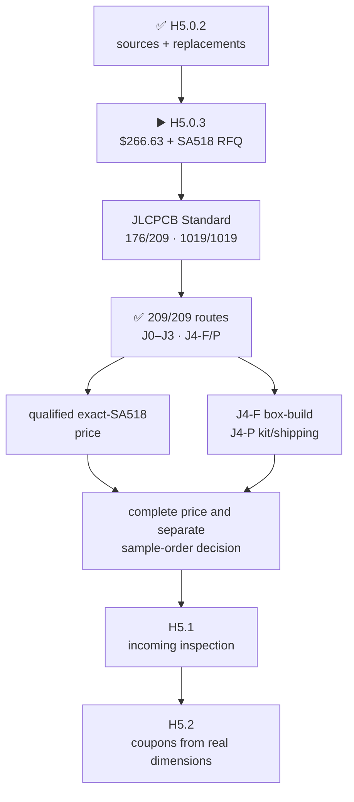

# H5.0.3 · one irreducible engineering-sample basket

[Русский](component-sample-basket.ru.md) · [Home](../README.md) · [Roadmap](roadmap.md) · [Previous research](component-source-research.md)

> **Superseded working input:** this page still shows the former single-SA518
> basket. It does not describe the current product. `H5.0.3-R1` is rebuilding
> it for the selected `SA818S-U` + `SA818S-V` pair; no purchase is authorized.

The basket is published, but **H5.0.3 is not yet reviewed**: [JLCPCB Standard PCBA is now the manufacturing reference](manufacturing-platform.md); its controlled BOM Tool run matched 176/209 lines and parsed all 1019 placements, while exact search gave all 209 lines `J0`–`J3`, `J4-F` or `J4-P` routes without replacement. `NiceRF SA518` remains the basket's only unpriced component; the `J4-F` box-build and `J4-P` kit/packing/shipping factory gates are separately open. The JLCAPI app exists and Parts permission is under review; purchase, sourcing request, quote/reservation, PCB placement/routing and fabrication are not authorized.

## Cost summary

- **$266.63** is the known conservative material budget for every priced line.
- It contains **$262.63** of published USD prices and **$4.00** of conservative caps for two cheap IR parts whose live pages expose AUD/INR prices.
- Separately, **one `SA518` is RFQ**. An unqualified marketplace listing gives only a `£24.24` delivered ceiling, not an identity-controlled source.
- Freight, taxes, customs and H5.2 coupon PCBs are excluded. Some coupon geometry depends on H5.1 incoming measurements; fabricating it now would recreate the cycle this phase removes.
- The former `$164.54` was not a cheaper complete basket: it covered only eight partial lines and omitted most H5 gates.

## Exact received articles

### Display

- **2 × `Elecrow DLE06235B / QDtech ES3C35P donor containing HMX035CTFT-001` — $41.80.** [Elecrow current complete-board page](https://www.elecrow.com/3-5-esp32-s3-display-320x480-capacitive-ips-touchscreen-with-speaker-mic-bat-interface-supports-ai-voice-chat.html); listed in stock.
  Minimum basis: one retained intact electrical/visual reference and one sacrificial tail/adapter specimen; the former five-donor plan added three unneeded spares
- **1 × `Hirose FH34SRJ-40S-0.5SH(99)` — $3.40.** [Mouser exact-MPN listing](https://www.mouser.com/ProductDetail/Hirose-Connector/FH34SRJ-40S-0.5SH99); orderable exact MPN.
  Minimum basis: one repeated-mating adapter coupon uses one panel ZIF; failure means the test fails rather than consuming a hidden spare
- **1 × `Hirose DF40C(2.0)-40DS-0.4V(58)` — $1.36.** [Mouser exact-MPN listing](https://www.mouser.com/ProductDetail/Hirose-Connector/DF40C2.0-40DS-0.4V58); orderable exact MPN.
  Minimum basis: one fixed receptacle is sufficient for the single display-adapter coupon
- **1 × `Hirose DF40C-40DP-0.4V(51)` — $1.01.** [Mouser exact-MPN listing](https://www.mouser.com/ProductDetail/Hirose-Connector/DF40C-40DP-0.4V51); orderable exact MPN.
  Minimum basis: one plug is sufficient for the single display-adapter coupon

### Expansion

- **1 × `M5Stack U214 Cap LoRa-1262` — $14.50.** [M5Stack official store](https://shop.m5stack.com/products/cap-lora-1262); listed in stock.
  Minimum basis: the same non-destructive unit closes identity, dimensions, mating and functional checks
- **1 × `Samtec HLE-107-02-G-DV-PE-LC` — $3.34.** [Samtec exact product page](https://www.samtec.com/products/hle-107-02-g-dv-pe-lc); manufacturer orderable.
  Minimum basis: one production host socket is the actual mixed-pair mate; the former quantity five was spare stock, not evidence
- **1 × `Seeed 114020164 / 1125R-SMT-4P` — $2.80.** [Seeed official store](https://www.seeedstudio.com/Grove-Female-Header-SMD-4P-2.0mm-90D-20Pcs-p-4590.html); listed in stock.
  Minimum basis: one is needed, but the exact serial connector is sold as a smallest 20-piece pack
- **1 × `M5Stack A034-G` — $3.95.** [M5Stack official store](https://shop.m5stack.com/products/4pin-buckled-grove-cable); orderable.
  Minimum basis: one smallest pack supplies the short-profile test article
- **1 × `M5Stack A034-B` — $2.59.** [authorized-distributor exact SKU listing](https://www.digikey.com/en/products/detail/m5stack-technology-co-ltd/A034-B/13974037); orderable.
  Minimum basis: one smallest pack supplies the boundary-length test article
- **1 × `M5Stack A096` — $4.50.** [DigiKey exact-SKU listing](https://www.digikey.com/en/products/detail/m5stack-technology-co-ltd/A096/18084377); authorized stock.
  Minimum basis: one smallest pack exposes the admitted profiles to instruments

### RF paths

- **3 × `Ebyte E01-ML01IPX` — $7.11.** [RobotShop, sold and fulfilled by Ebyte](https://www.robotshop.com/products/ebyte-e01-ml01ipx-frequency-hopping-nrf24l01p-high-speed-24g-rf-wireless-100mw-24ghz-nrf24l01-tx-rx-module); 98 shown in stock.
  Minimum basis: exactly three modules are required to prove simultaneous full RX, TX and mixed operation; no untouched spare
- **5 × `TE Connectivity 2118651-2` — $12.60.** [DigiKey exact-MPN listing](https://www.digikey.com/en/products/detail/te-connectivity-amp-connectors/2118651-2/16538824); 3,082 shown in stock.
  Minimum basis: five real paths exist: S3, C5 and three nRF24; every installed bend/retention path must be represented
- **5 × `Hirose U.FL-R-SMT-1(10)` — $8.35.** [DigiKey exact-MPN listing](https://www.digikey.com/en/products/detail/hirose-electric-co-ltd/U-FL-R-SMT-1-10/2391570); 319,443 shown in stock.
  Minimum basis: one board mate per selected 30-mm jumper path
- **4 × `GCT RFPC-SMA31-FN-175-A` — $13.56.** [DigiKey exact-MPN listing](https://www.digikey.com/en/products/detail/gct/RFPC-SMA31-FN-175-A/25576371); 638 shown in stock.
  Minimum basis: three nRF24 boundaries plus one AM/LW receive boundary; the S3/C5 module cables use their separately selected SMA32 path
- **1 × `NiceRF SA518` — RFQ.** [NiceRF manufacturer product/RFQ page](https://www.nicerf.com/walkie-talkie-module/sa518-uv-dual-frequency-walkie-talkie-module.html); current product; public manufacturer price absent.
  Minimum basis: one module is enough for land-fit, thermal, conducted RF, audio and fault testing; a spare does not add a distinct claim

### Controls

- **16 × `Omron B3S-1100P` — $14.40.** [DigiKey exact-MPN listing](https://www.digikey.com/en/products/detail/omron-electronics-inc-emc-div/B3S-1100P/368393); 33,862 shown in stock.
  Minimum basis: five navigation positions plus BACK, OPT, F1-F8 and PTT must all be populated simultaneously to test spacing and enclosure actuation
- **1 × `Alps Alpine EC11E18244AU` — $4.90.** [Mouser exact-MPN listing](https://www.mouser.com/en/ProductDetail/Alps-Alpine/EC11E18244AU); 966 shown in stock.
  Minimum basis: one assembled encoder/knob path closes the only encoder gate
- **1 × `Davies Molding 1227-J` — $1.58.** [Mouser exact-MPN listing](https://www.mouser.com/en/ProductDetail/Davies-Molding/1227-J); 524 shown in stock.
  Minimum basis: one exact production knob mates to the one encoder specimen
- **1 × `C&K JS102011SCQN` — $1.11.** [DigiKey exact-MPN listing](https://www.digikey.com/en/products/detail/c-k/JS102011SCQN/7355835); 535 shown in stock.
  Minimum basis: one switch/aperture path closes force, detent and endurance evidence

### Power

- **1 × `Keystone 1048P` — $11.19.** [Mouser exact-MPN listing](https://www.mouser.com/ProductDetail/Keystone-Electronics/1048P); 145 shown in stock.
  Minimum basis: one holder is the actual two-cell mechanism
- **2 × `XTAR protected 18650 4000 mAh 10 A` — $29.00.** [XTAR official store](https://xtardirect.com/products/xtar-high-capacity-36v-18650-4000mah-10a-protected-lithium-ion-battery); 98 shown in stock.
  Minimum basis: one matched same-lot pair is the only admitted operating pack; mixed MPN, lot, age or state of charge remains forbidden
- **2 × `Analog Devices MAX17320G20+T` — $12.38.** [Mouser exact-MPN listing](https://www.mouser.com/en/ProductDetail/Analog-Devices-Maxim-Integrated/MAX17320G20%2BT); 7,638 shown in stock.
  Minimum basis: one retained golden device and one sacrificial device sequenced through blank, corrupt and exhausted-write states; four dedicated chips are unnecessary

### Audio

- **1 × `PUI Audio AS02404PO` — $3.97.** [DigiKey exact-MPN listing](https://www.digikey.com/en/product-highlight/p/pui-audio/as-series-high-quality-speakers); 421 immediate units shown.
  Minimum basis: one final-cavity specimen closes the speaker path
- **1 × `Same Sky CMEJ-0413-42-SMT-TR` — $0.64.** [DigiKey exact-MPN listing](https://www.digikey.com/en/products/detail/same-sky-formerly-cui-devices/CMEJ-0413-42-SMT-TR/10253447); 12,929 shown in stock.
  Minimum basis: one downward microphone path closes response, sealing and feedback checks
- **1 × `Same Sky SJ-43504-SMT-TR` — $1.29.** [Mouser exact-MPN listing](https://www.mouser.com/ProductDetail/Same-Sky/SJ-43504-SMT-TR); 5,344 shown in stock.
  Minimum basis: one repeated CTIA/TRS mating specimen closes the only jack gate

### IR

- **1 × `Vishay TSOP75238TT` — $1.46.** [DigiKey exact-MPN cut-tape listing](https://www.digikey.com/en/products/detail/vishay-semiconductor-opto-division/TSOP75238TT/4075864); 13 shown in cut-tape stock.
  Minimum basis: one received robust-demodulator channel; the full-reel-only TSOP95238TT is no longer selected
- **1 × `Vishay TSMP95000TT` — $2.00.** [Mouser exact-MPN listing](https://www.mouser.com/ProductDetail/Vishay-Semiconductors/TSMP95000TT); 4,182 shown in cut-tape stock.
  Minimum basis: one independent carrier-learning channel
- **1 × `Vishay VSMY14940` — $2.00.** [DigiKey exact-MPN listing](https://www.digikey.com/en/products/detail/vishay-semiconductor-opto-division/VSMY14940/4071416); 4,872 shown in cut-tape stock.
  Minimum basis: one actual emitter is sufficient for optical, current and temperature evidence

### Storage

- **1 × `SanDisk SDSQQNR-032G-GN6IA` — $40.05.** [TME exact-MPN listing](https://www.tme.com/in/en/details/sdsqqnr-032g-gn6ia/memory-cards/sandisk/); 200 shown in stock.
  Minimum basis: one identity-controlled reference medium is sufficient for CMD6, throughput, stalls and buffer traces

### AM/LW pod

- **1 × `Fair-Rite 3061990901` — $2.70.** [Mouser exact-MPN listing](https://www.mouser.com/ProductDetail/Fair-Rite/3061990901); 1,792 shown in stock.
  Minimum basis: one controlled first-pod core is measured and wound
- **1 × `Adam Tech RF2-154-T-17-50-G` — $3.76.** [DigiKey exact-MPN listing](https://www.digikey.com/en/products/detail/adam-tech/RF2-154-T-17-50-G/9831243); 839 shown in stock.
  Minimum basis: one male plug mates to the one AM/LW device boundary
- **1 × `Remington 38SNSP.125` — $13.33.** [Remington Industries official store](https://www.remingtonindustries.com/magnet-wire/magnet-wire-38-awg-enameled-copper-6-spool-sizes/); smallest exact-wire spool orderable.
  Minimum basis: one smallest spool supplies the controlled winding and measurement retries

## Measurement contracts

All `23` residuals/gates are covered by `11` contracts. A pass/fail summary without raw evidence is not accepted.

<code>H5-MSR-DISPLAY</code>

- Covers: `H3-PHY-017, H5-MECH-DISPLAY-TAIL, H5-MECH-DISPLAY-PERFORMANCE`.
- Method: retain one donor intact; photograph both lots; disassemble the second; measure flex outline, pitch, thickness, contact side, stiffener and bend keepout; cycle the exact adapter; then record QSPI/touch identity, VDD/VDDI ramps, reset/IRQ, backlight current, temperature and optical response.
- Pass rule: the current HMX035CTFT-001 tail fits and retains in a replaceable adapter without changing the UI PCB/enclosure datum, and the complete measured display path meets every inherited H3 timing/power rule.
- Artifacts: dimensioned photos, raw measurements, continuity matrix, logic/power traces and signed record.

<code>H5-MSR-U214</code>

- Covers: `H3-PHY-046, H5-MECH-U214-MATING-STACK`.
- Method: measure the fitted U214 posts and exact HLE; record all 14 continuities, bottoming, insertion/withdrawal force, repeated cycles, rail preload and screw retention.
- Pass rule: the mixed U214/HLE pair mates without yield or bottoming, retains every contact and preserves the protected hot-plug sequence.
- Artifacts: metrology, force/cycle CSV, continuity log and installed photos.

<code>H5-MSR-M5</code>

- Covers: `H3-PHY-048, H5-MECH-M5-UNIT-MATE`.
- Method: measure connector/cable geometry and run I2C, UART, GPIO and 1-Wire profiles through TXS0102 at short and boundary lengths with the breakout attached.
- Pass rule: insertion, retention, strain relief, pull networks and waveforms satisfy each admitted profile; unsupported motor/actuator loads remain excluded.
- Artifacts: cable photos/lengths, force/cycle records and oscilloscope captures.

<code>H5-MSR-RF5</code>

- Covers: `H3-PHY-053, H3-PHY-062, H5-MECH-NRF-GEN1-FEEDS, H5-MECH-NATIVE-RF-JUMPERS`.
- Method: inspect all E01 factory receptacles; assemble five straight U.FL-to-U.FL cable paths and four edge SMA boundaries; measure bend, retention and S-parameters; run all three nRF24 simultaneously in full RX, TX and mixed modes with every inactive interface hardware-quiet.
- Pass rule: all five paths meet inherited loss/match and retention limits, all three nRF24 meet concurrent deadlines without neighbouring-interface stalls or desense.
- Artifacts: microscope photos, force/cycle CSV, five VNA touchstone sets and 3R/1T2R/2T1R/3T traffic traces.

<code>H5-MSR-SA518</code>

- Covers: `H5-MECH-SA518-LAND-FIT`.
- Method: confirm received revision/variant and contact map; measure castellations; populate one shortest contact-7 coupon; record solder heat, VNA, supply/current/temperature, both bands, both power settings, audio, UART/PTT/PD/H-L and FAULT_KILL.
- Pass rule: the exact manufacturer-controlled sample fits the accepted reserve and meets the complete inherited RF/audio/safety contract without undocumented drive of UPDATE or VOXEN.
- Artifacts: supplier response, incoming record, land-fit X-ray/photos, VNA/RF/audio/power/thermal/fault traces.

<code>H5-MSR-CONTROLS</code>

- Covers: `H5-MECH-NAVIGATION-CONTROLS, H5-MECH-DIRECT-PRESS-CONTROLS, H5-MECH-ENCODER-KNOB, H5-MECH-RUN-KILL`.
- Method: populate the full 16-switch interface plus encoder/knob and side RUN/KILL aperture; measure access, actuation, accidental-press protection, depth, detents and repeated cycles.
- Pass rule: every serial control is independently reachable in the accepted external layout, remains recessed where required and passes the declared force/endurance limits.
- Artifacts: dimensioned assembled photos, force curves, cycle log and signed ergonomic checklist.

<code>H5-MSR-PACK</code>

- Covers: `H3-PHY-028, H5-MECH-CELL-HOLDER-FIT`.
- Method: test one matched same-lot protected-cell pair in the exact holder across insertion, compression, polarity, vibration and thermal cycles; retain one MAX17320 golden device and sequence the second through blank, corrupt and exhausted-write conditions.
- Pass rule: the matched pair remains mechanically/electrically retained at all admitted corners and every gauge fault state deterministically blocks or recovers exactly as specified.
- Artifacts: cell lot record, dimensional/force/thermal/vibration traces, gauge images/readbacks and fault logs.

<code>H5-MSR-AUDIO</code>

- Covers: `H5-MECH-ACOUSTIC-PATHS, H5-MECH-HEADSET-JACK`.
- Method: mount the exact speaker and downward microphone in the representative cavity; sweep response/noise/feedback/vibration; cycle the jack with CTIA and ordinary TRS while recording detect, source selection, bias, transient and unplug pop.
- Pass rule: the enclosure path meets the inherited gain/noise/thermal limits and the jack preserves CTIA/TRS behavior without blocking the internal microphone.
- Artifacts: audio sweeps, noise/feedback captures, insertion-force/cycle data and transient traces.

<code>H5-MSR-IR</code>

- Covers: `H3-PHY-024`.
- Method: verify markings/orientation; run simultaneous robust-envelope and 30-to-60-kHz carrier capture; measure startup/QOD/no-back-power; replay the protocol corpus and measure emitter current, range, alignment, temperature and optical safety.
- Pass rule: both receive channels and fail-closed transmit satisfy the inherited timing/electrical/optical bounds with no back-power or false provenance.
- Artifacts: incoming photos, logic/power traces, protocol corpus results and optical/thermal measurements.

<code>H5-MSR-STORAGE</code>

- Covers: `H3-PHY-038`.
- Method: record CID/CSD/CMD6 identity and run the admitted record/display contention profile through temperature and induced stalls.
- Pass rule: the exact reference card sustains >=1.5 MB/s logging, qualified >=4.0 MB/s transfers and the 512-KiB buffer contract without a radio deadline miss.
- Artifacts: identity dump, raw throughput/stall CSV and buffer/radio timing trace.

<code>H5-MSR-AMLW</code>

- Covers: `H3-PHY-057`.
- Method: verify exact identities and physical envelopes; wind and trim the first pod to 300 uH +/-5%; document mating and constituent geometry.
- Pass rule: the received SMA and every controlled pod constituent match the selected identities/envelopes and the completed pod meets inductance; routed parasitic budget remains H6 and total populated capacitance remains H8.
- Artifacts: incoming photos, dimensions, winding record, L/Q sweep and mating record.

## Sole open supplier input

`SA518` remains the best functional fit: `SA818Pro` needs two separate U/V modules and an RF/power/audio redesign, while dual-band `SA528` is `54.03 × 38.30 × 7.70 mm` with a different 23-contact interface. NiceRF publishes current technical sources but no qualified sample price or production-variant confirmation.

The live short JLCPCB quote form substitutes generic `JLCPCB Assembly C9900300438`, with stock `0`, MOQ `442` and a `$0.0203` estimate; NiceRF manufacturer/datasheet/revision identity is not proven, so no quote was submitted and that price is rejected. The prepared [exact-identity RFQ](../hardware/procurement/SA518-sample-rfq.md) may be sent only through a channel that preserves `NiceRF`, the current production revision and its datasheet. A qualified response enables the exact whole-basket cost and a separate order decision.

Machine result: [`H5-EVR03`](../hardware/verification/generated/H5-EVR03-irreducible-sample-basket.json).
