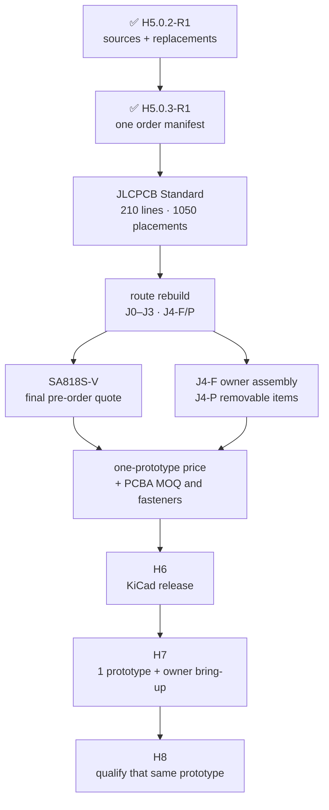

# H5.0.3 · sole-prototype article manifest

[Русский](component-sample-basket.ru.md) · [Home](../README.md) · [Roadmap](roadmap.md) · [Previous research](component-source-research.md)

`H5.0.3-R1` is reviewed as one integrated manifest for exactly **one Leshy2 prototype** assembled by the owner from two factory-populated PCBAs and the exact mechanical/accessory kit. There is no separate engineering-sample purchase and no separate H5 coupon board. The factory populates the boards without engineering guesses; the owner installs exact `ER-TFT035IPS-6 + ER-TPC035-6` option 5344 on one ready-cut `3M (TC) 4910SQ-2(5)`, mates its FPC with `FH34SRJ-50S-0.5SH(50)`, snaps in five microcoax jumpers, fits the knob and closes the enclosure from the released instructions. First full USB image/backlight/touch bring-up follows that assembly in H7, with physical qualification on the same prototype in H8. Paid factory Function Test is optional quote-only insurance, not a gate. Batteries are neither factory-installed nor included. HMX035CTFT-001 and complete donor boards remain legacy evidence only. [JLCPCB Standard PCBA remains the non-exclusive manufacturing reference](manufacturing-platform.md). H6 PCB placement/routing is authorized; purchase, sourcing request, quote/reservation and fabrication are not.

## Cost summary

- **$267.91** is the known conservative material budget for every priced line.
- It contains **$261.91** of published USD prices and **$6.00** of conservative caps for two cheap IR parts with live AUD/INR prices and the EUR-priced minimum pack of exact 11-mm stops.
- The total includes exact `SA818S-U` `C3001549` at `$9.7347` and exact `SA818S-V` `C51897911` at `$10.0710`; the VHF module has zero stock, MOQ 1 and a typical 8–15-working-day lead, while final quote/lead remain an order-time gate.
- The exact production panel at `$14.91` and one ready-cut `3M (TC) 4910SQ-2(5)` at `$22.12` are included. The square requires no owner cutting; before bonding, the owner verifies folded-FPC stack `≤0.714 mm`, actual clearance `≥0.20 mm`, contact orientation and relaxed flex reserve.
- The exact ten-piece pack of 11-mm Ettinger `007.02.611` pass-through stops is included at a conservative `$2.00` cap; four go into the device. PCBA fabrication/assembly at MOQ 2, four exact-H6-length M2.5 nylon screws, enclosure manufacture, freight, taxes and customs remain excluded. There is no separate H5 coupon order.
- The former `$164.54` was not a cheaper complete basket: it covered only eight partial lines and omitted most H5 gates.

## Integrated order and bring-up articles

### Display

- **1 × `EastRising ER-TFT035IPS-6 + ER-TPC035-6 option 5344` — $14.91.** [BuyDisplay exact product page](https://www.buydisplay.com/3-5-inch-ips-320x480-tft-lcd-display-capacitive-touch-screen); listed in stock; one-piece price published; exact panel/touch drawings and interface table available.
  Minimum basis: exactly one production panel is owner-installed and mated in the finished prototype; the exact FH34SRJ-50S-0.5SH(50) board connector is populated during PCBA
- **1 × `3M (TC) 4910SQ-2(5)` — $22.12.** [DigiKey exact-MPN listing](https://www.digikey.com/en/products/detail/3m-tc/4910SQ-2-5/3339259); active; 16 sellable units shown in stock; quantity-one displayed price.
  Minimum basis: one ready-cut 50.80 x 50.80 mm square retains the sole production display without an owner cutting operation; no spare or long roll is included

### Mechanical kit

- **1 × `Ettinger 007.02.611` — $2.00.** [Buerklin exact-MPN listing](https://www.buerklin.com/en/p/ettinger/spacer-bolts/007-02-611/18H0210/); 300 pieces available in 5 days; MOQ 10; listed EUR 0.1345 each including VAT.
  Minimum basis: four exact 11.00-mm unthreaded polyamide sleeves form the compression stops; the smallest ten-piece order leaves six ordinary replacements

### Expansion

- **1 × `M5Stack U214 Cap LoRa-1262` — $14.50.** [M5Stack official store](https://shop.m5stack.com/products/cap-lora-1262); listed in stock.
  Minimum basis: the same non-destructive unit closes identity, dimensions, mating and functional checks
- **1 × `Samtec HLE-107-02-G-DV-PE-LC` — $3.34.** [Samtec exact product page](https://www.samtec.com/products/hle-107-02-g-dv-pe-lc); manufacturer orderable.
  Minimum basis: one production host socket is the actual mixed-pair mate; the former quantity five was spare stock, not evidence
- **1 × `Seeed 114020164 / 1125R-SMT-4P` — $2.80.** [Seeed official store](https://www.seeedstudio.com/Grove-Female-Header-SMD-4P-2.0mm-90D-20Pcs-p-4590.html); listed in stock.
  Minimum basis: one is needed, but the exact serial connector is sold as a smallest 20-piece pack
- **1 × `M5Stack A034-G` — $3.95.** [M5Stack official store](https://shop.m5stack.com/products/4pin-buckled-grove-cable); orderable.
  Minimum basis: one smallest pack supplies the short-profile test article
- **1 × `M5Stack A034-B` — $2.59.** [authorized-distributor exact SKU listing](https://www.digikey.com/en/products/detail/m5stack-technology-co-ltd/A034-B/13974037); orderable.
  Minimum basis: one smallest pack supplies the boundary-length test article
- **1 × `M5Stack A096` — $4.50.** [DigiKey exact-SKU listing](https://www.digikey.com/en/products/detail/m5stack-technology-co-ltd/A096/18084377); authorized stock.
  Minimum basis: one smallest pack exposes the admitted profiles to instruments

### RF paths

- **3 × `Ebyte E01-ML01SP4 / JLCPCB C97340` — $13.45.** [JLCPCB exact original-manufacturer part page](https://jlcpcb.com/partdetail/E01-ML01SP4/C97340); 405 in stock, 388 available, MOQ 1; factory SMT placement.
  Minimum basis: exactly three factory-fitted PA/LNA modules are required to prove simultaneous full RX, TX and mixed operation; no owner placement or untouched spare
- **2 × `TE Connectivity 2118651-2` — $5.04.** [DigiKey exact-MPN listing](https://www.digikey.com/en/products/detail/te-connectivity-amp-connectors/2118651-2/16538824); 3,082 shown in stock.
  Minimum basis: two exact 30-mm paths serve S3 and C5; each installed bend/retention path must be represented
- **3 × `TE Connectivity 1-2118651-0` — $5.43.** [DigiKey exact-MPN listing](https://www.digikey.com/en/products/detail/te-connectivity-amp-connectors/1-2118651-0/12380462); 7,283 shown in stock.
  Minimum basis: three exact 60-mm paths serve the E01-ML01SP4 radios and retain at least the generated conservative routing slack
- **5 × `Hirose U.FL-R-SMT-1(80)` — $0.51.** [JLCPCB exact original-manufacturer part C88374](https://jlcpcb.com/partdetail/U.FL-R-SMT-1%2880%29/C88374); 72,989 in stock; 68,798 orderable; MOQ 1; factory SMT placement.
  Minimum basis: one board mate per selected 30-mm jumper path; (80) changes reel presentation only
- **4 × `GCT RFPC-SMA31-FN-175-A` — $13.56.** [DigiKey exact-MPN listing](https://www.digikey.com/en/products/detail/gct/RFPC-SMA31-FN-175-A/25576371); 638 shown in stock.
  Minimum basis: three nRF24 boundaries plus one AM/LW receive boundary; the S3/C5 module cables use their separately selected SMA32 path
- **1 × `G-NiceRF SA818S-U` — $9.74.** [JLCPCB exact G-NiceRF part C3001549](https://jlcpcb.com/partdetail/GNiceRF-SA818SU/C3001549); 68 in stock; 60 available to order.
  Minimum basis: one exact UHF module is required because band-specific RF, conducted power, audio, UART and thermal behavior cannot be inferred from the VHF variant
- **1 × `G-NiceRF SA818S-V` — $10.07.** [JLCPCB exact G-NiceRF part C51897911](https://jlcpcb.com/partdetail/GNiceRF-SA818SV/C51897911); stock zero; MOQ one; pre-order; typical 8-15 working days.
  Minimum basis: one exact VHF module is required because it is an independent installed product path; common land geometry alone does not prove band-specific RF, audio, UART or thermal behavior

### Controls

- **16 × `Omron B3S-1100P` — $14.40.** [DigiKey exact-MPN listing](https://www.digikey.com/en/products/detail/omron-electronics-inc-emc-div/B3S-1100P/368393); 33,862 shown in stock.
  Minimum basis: five navigation positions plus BACK, OPT, F1-F8 and PTT must all be populated simultaneously to test spacing and enclosure actuation
- **1 × `Alps Alpine EC11E18244AU` — $4.90.** [Mouser exact-MPN listing](https://www.mouser.com/en/ProductDetail/Alps-Alpine/EC11E18244AU); 966 shown in stock.
  Minimum basis: one assembled encoder/knob path closes the only encoder gate
- **1 × `Davies Molding 1227-J` — $1.58.** [Mouser exact-MPN listing](https://www.mouser.com/en/ProductDetail/Davies-Molding/1227-J); 524 shown in stock.
  Minimum basis: one exact production knob mates to the one encoder specimen
- **1 × `C&K JS102011SCQN` — $1.11.** [DigiKey exact-MPN listing](https://www.digikey.com/en/products/detail/c-k/JS102011SCQN/7355835); 535 shown in stock.
  Minimum basis: the installed switch/aperture path closes fit, detent and ordinary-actuation evidence

### Power

- **1 × `Keystone 1048P` — $11.19.** [Mouser exact-MPN listing](https://www.mouser.com/ProductDetail/Keystone-Electronics/1048P); 145 shown in stock.
  Minimum basis: one holder is the actual two-cell mechanism
- **2 × `XTAR protected 18650 4000 mAh 10 A` — $29.00.** [XTAR official store](https://xtardirect.com/products/xtar-high-capacity-36v-18650-4000mah-10a-protected-lithium-ion-battery); 98 shown in stock.
  Minimum basis: one matched same-lot pair is the only admitted operating pack; mixed MPN, lot, age or state of charge remains forbidden
- **1 × `Analog Devices MAX17320G20+T` — $6.19.** [Mouser exact-MPN listing](https://www.mouser.com/en/ProductDetail/Analog-Devices-Maxim-Integrated/MAX17320G20%2BT); 7,638 shown in stock.
  Minimum basis: one device covers blank -> deliberately invalid but electrically safe configuration -> reviewed golden/recovery with complete readback; zero-remaining and failed-copy are emulator/fixture-only, all seven physical updates are never consumed and no sacrificial chip is required

### Audio

- **1 × `PUI Audio AS02404PO` — $3.97.** [DigiKey exact-MPN listing](https://www.digikey.com/en/product-highlight/p/pui-audio/as-series-high-quality-speakers); 421 immediate units shown.
  Minimum basis: one final-cavity specimen closes the speaker path
- **1 × `Same Sky CMEJ-0413-42-SMT-TR` — $0.64.** [DigiKey exact-MPN listing](https://www.digikey.com/en/products/detail/same-sky-formerly-cui-devices/CMEJ-0413-42-SMT-TR/10253447); 12,929 shown in stock.
  Minimum basis: one downward microphone path closes response, sealing and feedback checks
- **1 × `Same Sky SJ-43504-SMT-TR` — $1.29.** [Mouser exact-MPN listing](https://www.mouser.com/ProductDetail/Same-Sky/SJ-43504-SMT-TR); 5,344 shown in stock.
  Minimum basis: one repeated CTIA/TRS mating specimen closes the only jack gate

### IR

- **1 × `Vishay TSOP75238TR` — $1.30.** [JLCPCB C511498 exact Vishay listing](https://jlcpcb.com/partdetail/x/C511498); 15 currently placeable; MOQ 1.
  Minimum basis: one production robust-demodulator channel; TR preserves the TT body, contacts and electrical function but requires explicit CPL rotation/feeder-presentation approval before PCBA
- **1 × `Vishay TSMP95000TT` — $2.00.** [Mouser exact-MPN listing](https://www.mouser.com/ProductDetail/Vishay-Semiconductors/TSMP95000TT); 4,182 shown in cut-tape stock.
  Minimum basis: one independent carrier-learning channel
- **1 × `Vishay VSMY14940` — $2.00.** [DigiKey exact-MPN listing](https://www.digikey.com/en/products/detail/vishay-semiconductor-opto-division/VSMY14940/4071416); 4,872 shown in cut-tape stock.
  Minimum basis: one actual emitter is sufficient for optical, current and temperature evidence

### Storage

- **1 × `SanDisk SDSQQNR-032G-GN6IA` — $40.05.** [TME exact-MPN listing](https://www.tme.com/in/en/details/sdsqqnr-032g-gn6ia/memory-cards/sandisk/); 200 shown in stock.
  Minimum basis: one identity-controlled reference medium is sufficient for CMD6, throughput, stalls and buffer traces

### AM/LW pod

- **1 × `Fair-Rite 3061990901` — $2.70.** [Mouser exact-MPN listing](https://www.mouser.com/ProductDetail/Fair-Rite/3061990901); 1,792 shown in stock.
  Minimum basis: one controlled first-pod core is measured and wound
- **1 × `Adam Tech RF2-154-T-17-50-G` — $3.76.** [DigiKey exact-MPN listing](https://www.digikey.com/en/products/detail/adam-tech/RF2-154-T-17-50-G/9831243); 839 shown in stock.
  Minimum basis: one male plug mates to the one AM/LW device boundary
- **1 × `Remington 38SNSP.125` — $13.33.** [Remington Industries official store](https://www.remingtonindustries.com/magnet-wire/magnet-wire-38-awg-enameled-copper-6-spool-sizes/); smallest exact-wire spool orderable.
  Minimum basis: one smallest spool supplies the controlled winding and measurement retries

## H7/H8 owner evidence contracts

All `23` residuals/gates are covered by `12` contracts. They execute after the sole prototype arrives in H7/H8, not through a separate sample/coupon purchase. A pass/fail summary without raw evidence is not accepted.

<code>H5-MSR-DISPLAY</code>

- Covers: `H3-PHY-017, H5-MECH-DISPLAY-TAIL, H5-MECH-DISPLAY-PERFORMANCE`.
- Method: the owner dry-fits exact ER-TFT035IPS-6 + ER-TPC035-6 option 5344, confirms contact orientation and relaxed FPC reserve, folds the FPC through the controlled slot, mates it through factory-populated FH34SRJ-50S-0.5SH(50), then bonds the panel using one ready-cut 3M (TC) 4910SQ-2(5) with uniformly supported pressure; first USB-powered bring-up records known-image, backlight and touch results.
- Pass rule: the released drawing, connector, mating and retention steps are deterministic; measured folded-FPC stack is <=0.714 mm, actual pad-to-stack clearance is >=0.20 mm, the flex is untwisted and not tensioned, and dry-fit image/backlight/touch checks pass before the irreversible PSA bond; any paid supplier installation or Function Test remains optional.
- Artifacts: controlled panel, pad and connector identities/drawings, incoming pad dimensions/lot, FPC stack and clearance measurement, dry-fit orientation/slack photos, deterministic owner assembly record, USB bring-up image/backlight/touch traces and signed result.

<code>H5-MSR-SANDWICH</code>

- Covers: `H5-MECH-DISPLAY-PERFORMANCE, H5-MECH-U214-MATING-STACK`.
- Method: fit four exact Ettinger 007.02.611 pass-through sleeves between the boards, select the exact M2.5 nylon screw length only after H6 locks both enclosure wall thicknesses, then assemble the four-corner stack with the released low torque and verify the capture lips and anti-shear datums are seated.
- Pass rule: all four measured PCB-to-PCB gaps are 11.00 mm within the released H6 tolerance; screw ends have safe engagement without bottoming or entering the user/button volume; ordinary side load is carried by enclosure datums rather than soldered connectors or board flex.
- Artifacts: exact sleeve identity/receipt, H6 screw-length calculation and exact MPN, four gap measurements, torque record and assembled side photographs.

<code>H5-MSR-U214</code>

- Covers: `H3-PHY-046, H5-MECH-U214-MATING-STACK`.
- Method: measure the fitted U214 posts and exact HLE; during ordinary assembly/disassembly record all 14 continuities, bottoming clearance, rail preload, screw retention and visual condition without a prescribed force or cycle programme.
- Pass rule: the mixed U214/HLE pair mates without yield or bottoming, retains every contact and preserves the protected hot-plug sequence.
- Artifacts: metrology, continuity log and installed photos.

<code>H5-MSR-M5</code>

- Covers: `H3-PHY-048, H5-MECH-M5-UNIT-MATE`.
- Method: measure connector/cable geometry, inspect ordinary mating and strain relief, and run I2C, UART, GPIO and 1-Wire profiles through TXS0102 at short and boundary lengths with the breakout attached.
- Pass rule: ordinary mating, retention, strain relief, pull networks and waveforms satisfy each admitted profile; unsupported motor/actuator loads remain excluded.
- Artifacts: cable photos/lengths, continuity records and oscilloscope captures.

<code>H5-MSR-RF5</code>

- Covers: `H3-PHY-053, H3-PHY-062, H5-MECH-NRF-GEN1-FEEDS, H5-MECH-NATIVE-RF-JUMPERS`.
- Method: inspect all E01 factory receptacles; assemble the two 30-mm and three 60-mm U.FL cable paths and edge SMA boundaries normally; inspect bend, retention and strain relief, verify continuity and S-parameters, then run all three nRF24 simultaneously in full RX, TX and mixed modes with every inactive interface hardware-quiet.
- Pass rule: all five paths meet inherited loss/match and retention limits, all three nRF24 meet concurrent deadlines without neighbouring-interface stalls or desense.
- Artifacts: microscope photos, continuity records, five VNA touchstone sets and 3R/1T2R/2T1R/3T traffic traces.

<code>H5-MSR-SA818S-DUAL</code>

- Covers: `H5-MECH-SA818S-DUAL-LAND-FIT`.
- Method: confirm both factory-installed G-NiceRF identities and the common Rev 1.8 18-land contact map on the sole prototype; inspect each module and castellations, then record VNA, supply/current/temperature, band limits, both power settings, audio, UART/PTT/PD/H-L and FAULT_KILL for each independently selectable installed variant during H7/H8 owner bring-up.
- Pass rule: both exact modules fit the common accepted production land and each independently meets its inherited RF/audio/safety contract; no CE substitution is silent and no test drives reserved contacts 8-18.
- Artifacts: factory identity/assembly records, arrival and land-fit photos, VNA/RF/audio/power/thermal/fault traces for U and V.

<code>H5-MSR-CONTROLS</code>

- Covers: `H5-MECH-NAVIGATION-CONTROLS, H5-MECH-DIRECT-PRESS-CONTROLS, H5-MECH-ENCODER-KNOB, H5-MECH-RUN-KILL`.
- Method: use the full 16-switch interface plus encoder/knob and side RUN/KILL aperture on the one assembled prototype; inspect access, ordinary actuation, accidental-press protection, depth and detents without artificial ageing.
- Pass rule: every serial control is independently reachable in the accepted external layout, remains recessed where required and works during ordinary operation.
- Artifacts: dimensioned assembled photos, continuity/actuation record and signed ergonomic checklist.

<code>H5-MSR-PACK</code>

- Covers: `H3-PHY-028, H5-MECH-CELL-HOLDER-FIT`.
- Method: verify exact holder/cradle/stop geometry and polarity, install/remove the matched same-lot protected-cell pair only as ordinarily required, then inspect pads/contact retention and continuity; keep the pair inside its exact MPN voltage/current/temperature limits; on one MAX17320 record blank -> deliberately invalid but electrically safe configuration -> reviewed golden/recovery with both address spaces, checksum, NVError and remaining-update bitmap; inject zero-remaining, failed-copy, reversed, swapped, open, short, missing, imbalance and temperature thresholds through the emulator or current-limited cell-simulator/NTC fixture.
- Pass rule: the enclosure rather than SMT pads carries ordinary insertion/removal load, the matched pair remains mechanically/electrically retained, the gauge blocks and recovers deterministically, all seven physical NVM updates are not consumed, and no real cell is abused beyond its MPN limits.
- Artifacts: cell identity record, dimensioned installation photos, pad/contact continuity inspection, simulator/NTC-fixture traces, gauge images/readbacks and fault logs.

<code>H5-MSR-AUDIO</code>

- Covers: `H5-MECH-ACOUSTIC-PATHS, H5-MECH-HEADSET-JACK`.
- Method: mount the exact speaker and downward microphone in the representative cavity; sweep response/noise/feedback and inspect buzz/rattle during ordinary playback; mate CTIA and ordinary TRS as needed while recording detect, source selection, bias, transient and unplug pop.
- Pass rule: the enclosure path meets the inherited gain/noise/thermal limits and the jack preserves CTIA/TRS behavior without blocking the internal microphone.
- Artifacts: audio sweeps, noise/feedback captures, ordinary-mating continuity record and transient traces.

<code>H5-MSR-IR</code>

- Covers: `H3-PHY-024`.
- Method: verify markings/orientation; confirm TSOP75238TR CPL rotation and feeder presentation against the JLCPCB placement preview; run simultaneous robust-envelope and 30-to-60-kHz carrier capture; measure startup/QOD/no-back-power; replay the protocol corpus and measure emitter current, range, alignment, temperature and optical safety.
- Pass rule: the assembled TR orientation matches the Vishay contact map, both receive channels and fail-closed transmit satisfy the inherited timing/electrical/optical bounds with no back-power or false provenance.
- Artifacts: CPL/placement approval, incoming photos, logic/power traces, protocol corpus results and optical/thermal measurements.

<code>H5-MSR-STORAGE</code>

- Covers: `H3-PHY-038`.
- Method: record CID/CSD/CMD6 identity and run the admitted record/display contention profile through temperature and induced stalls.
- Pass rule: the exact reference card sustains >=1.5 MB/s logging, qualified >=4.0 MB/s transfers and the 512-KiB buffer contract without a radio deadline miss.
- Artifacts: identity dump, raw throughput/stall CSV and buffer/radio timing trace.

<code>H5-MSR-AMLW</code>

- Covers: `H3-PHY-057`.
- Method: verify exact delivered identities and physical envelopes; wind and trim the first owner pod to 300 uH +/-5% after arrival; document mating and constituent geometry.
- Pass rule: the installed SMA and every controlled pod constituent match the selected identities/envelopes and the completed pod meets inductance; routed parasitic budget remains H6 and total populated capacitance remains H8.
- Artifacts: arrival photos, dimensions, winding record, L/Q sweep and mating record.

## Assigned H6 and order-time inputs

Both selected module prices are known. JLCPCB's [substantive 2 September response](../hardware/procurement/H5.0.3-R1-jlcpcb-response-2026-09-02.md) confirms separate-designator placement of exact `SA818S-V C51897911` and `SA818S-U C3001549` through BOM Matching, exact-MPN incoming control and no replacement without customer confirmation. PCBA MOQ 2 remains a cost factor, but JLCPCB's final-device decline no longer blocks the project: the owner accepted installation of the display with ready-cut PSA, microcoax jumpers, knob and enclosure. The exact 11-mm pass-through stop is now Ettinger `007.02.611`; H6 owns the exact M2.5 nylon screw length because it depends on released enclosure walls. The real PCBA price likewise requires H6 Gerber/BOM/CPL. Final `SA818S-V` pre-order terms and the complete stock recheck are immediate pre-order gates, not reasons to block layout. The [PCBWay reply](../hardware/procurement/H5.0.3-R1-pcbway-fallback-inquiry.md) is an optional cost/convenience comparison. `SA818S-CE C19632390` remains only a qualified-pending UHF alternate after HIL and a 470-MHz firmware clamp. No quote, reservation or order was created.

Machine result: [`H5-EVR03`](../hardware/verification/generated/H5-EVR03-irreducible-sample-basket.json).
