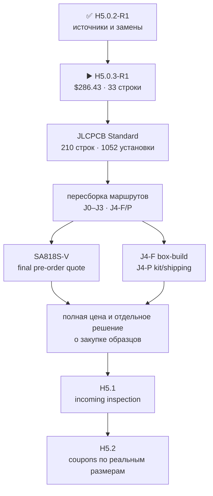

# H5.0.3 · единая корзина неустранимых образцов

[English](component-sample-basket.md) · [На главную](../README.ru.md) · [Роадмап](roadmap.ru.md) · [Предыдущий поиск](component-source-research.ru.md)

Корзина `H5.0.3-R1` пересобрана для текущей dual-SA818S архитектуры. В ней есть по одному exact `SA818S-U` и `SA818S-V`; обе цены известны, но VHF-модуль доступен только через pre-order. [JLCPCB Standard PCBA остаётся неэксклюзивным производственным ориентиром](manufacturing-platform.ru.md). Закупка, sourcing request, quote/reservation, PCB placement/routing и fabrication не разрешены.

## Сводка стоимости

- **$286.43** — известный консервативный material budget для всех priced lines.
- Внутри него **$282.43** — публичные USD-цены и **$4.00** — два консервативных cap для дешёвых IR-деталей, чьи live-страницы показывают цену в AUD/INR.
- В сумму включены exact `SA818S-U` `C3001549` за `$9.7347` и exact `SA818S-V` `C51897911` за `$10.0710`; у VHF-модуля stock `0`, MOQ 1 и типичные 8–15 рабочих дней, а final quote/lead остаются order-time gate.
- Не включены доставка, налоги, таможня и H5.2 coupon PCB: геометрия части coupons зависит от H5.1 incoming measurements, поэтому преждевременная печать создала бы тот же цикл, который мы устраняем.
- Старая сумма `$164.54` была не дешёвой полной корзиной, а неполным набором из восьми строк; она не покрывала большинство H5 gates.

## Что именно требуется получить

### Дисплей

- **2 × `Elecrow DLE06235B / QDtech ES3C35P donor containing HMX035CTFT-001` — $41.80.** [Elecrow current complete-board page](https://www.elecrow.com/3-5-esp32-s3-display-320x480-capacitive-ips-touchscreen-with-speaker-mic-bat-interface-supports-ai-voice-chat.html); listed in stock.
  Почему минимум: one retained intact electrical/visual reference and one sacrificial tail/adapter specimen; the former five-donor plan added three unneeded spares
- **1 × `Hirose FH34SRJ-40S-0.5SH(99)` — $3.40.** [Mouser exact-MPN listing](https://www.mouser.com/ProductDetail/Hirose-Connector/FH34SRJ-40S-0.5SH99); orderable exact MPN.
  Почему минимум: one repeated-mating adapter coupon uses one panel ZIF; failure means the test fails rather than consuming a hidden spare
- **1 × `Hirose DF40C(2.0)-40DS-0.4V(58)` — $1.36.** [Mouser exact-MPN listing](https://www.mouser.com/ProductDetail/Hirose-Connector/DF40C2.0-40DS-0.4V58); orderable exact MPN.
  Почему минимум: one fixed receptacle is sufficient for the single display-adapter coupon
- **1 × `Hirose DF40C-40DP-0.4V(51)` — $1.01.** [Mouser exact-MPN listing](https://www.mouser.com/ProductDetail/Hirose-Connector/DF40C-40DP-0.4V51); orderable exact MPN.
  Почему минимум: one plug is sufficient for the single display-adapter coupon

### Расширения

- **1 × `M5Stack U214 Cap LoRa-1262` — $14.50.** [M5Stack official store](https://shop.m5stack.com/products/cap-lora-1262); listed in stock.
  Почему минимум: the same non-destructive unit closes identity, dimensions, mating and functional checks
- **1 × `Samtec HLE-107-02-G-DV-PE-LC` — $3.34.** [Samtec exact product page](https://www.samtec.com/products/hle-107-02-g-dv-pe-lc); manufacturer orderable.
  Почему минимум: one production host socket is the actual mixed-pair mate; the former quantity five was spare stock, not evidence
- **1 × `Seeed 114020164 / 1125R-SMT-4P` — $2.80.** [Seeed official store](https://www.seeedstudio.com/Grove-Female-Header-SMD-4P-2.0mm-90D-20Pcs-p-4590.html); listed in stock.
  Почему минимум: one is needed, but the exact serial connector is sold as a smallest 20-piece pack
- **1 × `M5Stack A034-G` — $3.95.** [M5Stack official store](https://shop.m5stack.com/products/4pin-buckled-grove-cable); orderable.
  Почему минимум: one smallest pack supplies the short-profile test article
- **1 × `M5Stack A034-B` — $2.59.** [authorized-distributor exact SKU listing](https://www.digikey.com/en/products/detail/m5stack-technology-co-ltd/A034-B/13974037); orderable.
  Почему минимум: one smallest pack supplies the boundary-length test article
- **1 × `M5Stack A096` — $4.50.** [DigiKey exact-SKU listing](https://www.digikey.com/en/products/detail/m5stack-technology-co-ltd/A096/18084377); authorized stock.
  Почему минимум: one smallest pack exposes the admitted profiles to instruments

### Радиотракты

- **3 × `Ebyte E01-ML01IPX` — $7.11.** [RobotShop, sold and fulfilled by Ebyte](https://www.robotshop.com/products/ebyte-e01-ml01ipx-frequency-hopping-nrf24l01p-high-speed-24g-rf-wireless-100mw-24ghz-nrf24l01-tx-rx-module); 98 shown in stock.
  Почему минимум: exactly three modules are required to prove simultaneous full RX, TX and mixed operation; no untouched spare
- **5 × `TE Connectivity 2118651-2` — $12.60.** [DigiKey exact-MPN listing](https://www.digikey.com/en/products/detail/te-connectivity-amp-connectors/2118651-2/16538824); 3,082 shown in stock.
  Почему минимум: five real paths exist: S3, C5 and three nRF24; every installed bend/retention path must be represented
- **5 × `Hirose U.FL-R-SMT-1(10)` — $8.35.** [DigiKey exact-MPN listing](https://www.digikey.com/en/products/detail/hirose-electric-co-ltd/U-FL-R-SMT-1-10/2391570); 319,443 shown in stock.
  Почему минимум: one board mate per selected 30-mm jumper path
- **4 × `GCT RFPC-SMA31-FN-175-A` — $13.56.** [DigiKey exact-MPN listing](https://www.digikey.com/en/products/detail/gct/RFPC-SMA31-FN-175-A/25576371); 638 shown in stock.
  Почему минимум: three nRF24 boundaries plus one AM/LW receive boundary; the S3/C5 module cables use their separately selected SMA32 path
- **1 × `G-NiceRF SA818S-U` — $9.74.** [JLCPCB exact G-NiceRF part C3001549](https://jlcpcb.com/partdetail/GNiceRF-SA818SU/C3001549); 68 in stock; 60 available to order.
  Почему минимум: one exact UHF module is required because band-specific RF, conducted power, audio, UART and thermal behavior cannot be inferred from the VHF variant
- **1 × `G-NiceRF SA818S-V` — $10.07.** [JLCPCB exact G-NiceRF part C51897911](https://jlcpcb.com/partdetail/GNiceRF-SA818SV/C51897911); stock zero; MOQ one; pre-order; typical 8-15 working days.
  Почему минимум: one exact VHF module is required because it is an independent installed product path; common land geometry alone does not prove band-specific RF, audio, UART or thermal behavior

### Органы управления

- **16 × `Omron B3S-1100P` — $14.40.** [DigiKey exact-MPN listing](https://www.digikey.com/en/products/detail/omron-electronics-inc-emc-div/B3S-1100P/368393); 33,862 shown in stock.
  Почему минимум: five navigation positions plus BACK, OPT, F1-F8 and PTT must all be populated simultaneously to test spacing and enclosure actuation
- **1 × `Alps Alpine EC11E18244AU` — $4.90.** [Mouser exact-MPN listing](https://www.mouser.com/en/ProductDetail/Alps-Alpine/EC11E18244AU); 966 shown in stock.
  Почему минимум: one assembled encoder/knob path closes the only encoder gate
- **1 × `Davies Molding 1227-J` — $1.58.** [Mouser exact-MPN listing](https://www.mouser.com/en/ProductDetail/Davies-Molding/1227-J); 524 shown in stock.
  Почему минимум: one exact production knob mates to the one encoder specimen
- **1 × `C&K JS102011SCQN` — $1.11.** [DigiKey exact-MPN listing](https://www.digikey.com/en/products/detail/c-k/JS102011SCQN/7355835); 535 shown in stock.
  Почему минимум: one switch/aperture path closes force, detent and endurance evidence

### Питание

- **1 × `Keystone 1048P` — $11.19.** [Mouser exact-MPN listing](https://www.mouser.com/ProductDetail/Keystone-Electronics/1048P); 145 shown in stock.
  Почему минимум: one holder is the actual two-cell mechanism
- **2 × `XTAR protected 18650 4000 mAh 10 A` — $29.00.** [XTAR official store](https://xtardirect.com/products/xtar-high-capacity-36v-18650-4000mah-10a-protected-lithium-ion-battery); 98 shown in stock.
  Почему минимум: one matched same-lot pair is the only admitted operating pack; mixed MPN, lot, age or state of charge remains forbidden
- **2 × `Analog Devices MAX17320G20+T` — $12.38.** [Mouser exact-MPN listing](https://www.mouser.com/en/ProductDetail/Analog-Devices-Maxim-Integrated/MAX17320G20%2BT); 7,638 shown in stock.
  Почему минимум: one retained golden device and one sacrificial device sequenced through blank, corrupt and exhausted-write states; four dedicated chips are unnecessary

### Аудио

- **1 × `PUI Audio AS02404PO` — $3.97.** [DigiKey exact-MPN listing](https://www.digikey.com/en/product-highlight/p/pui-audio/as-series-high-quality-speakers); 421 immediate units shown.
  Почему минимум: one final-cavity specimen closes the speaker path
- **1 × `Same Sky CMEJ-0413-42-SMT-TR` — $0.64.** [DigiKey exact-MPN listing](https://www.digikey.com/en/products/detail/same-sky-formerly-cui-devices/CMEJ-0413-42-SMT-TR/10253447); 12,929 shown in stock.
  Почему минимум: one downward microphone path closes response, sealing and feedback checks
- **1 × `Same Sky SJ-43504-SMT-TR` — $1.29.** [Mouser exact-MPN listing](https://www.mouser.com/ProductDetail/Same-Sky/SJ-43504-SMT-TR); 5,344 shown in stock.
  Почему минимум: one repeated CTIA/TRS mating specimen closes the only jack gate

### IR

- **1 × `Vishay TSOP75238TT` — $1.46.** [DigiKey exact-MPN cut-tape listing](https://www.digikey.com/en/products/detail/vishay-semiconductor-opto-division/TSOP75238TT/4075864); 13 shown in cut-tape stock.
  Почему минимум: one received robust-demodulator channel; the full-reel-only TSOP95238TT is no longer selected
- **1 × `Vishay TSMP95000TT` — $2.00.** [Mouser exact-MPN listing](https://www.mouser.com/ProductDetail/Vishay-Semiconductors/TSMP95000TT); 4,182 shown in cut-tape stock.
  Почему минимум: one independent carrier-learning channel
- **1 × `Vishay VSMY14940` — $2.00.** [DigiKey exact-MPN listing](https://www.digikey.com/en/products/detail/vishay-semiconductor-opto-division/VSMY14940/4071416); 4,872 shown in cut-tape stock.
  Почему минимум: one actual emitter is sufficient for optical, current and temperature evidence

### Хранилище

- **1 × `SanDisk SDSQQNR-032G-GN6IA` — $40.05.** [TME exact-MPN listing](https://www.tme.com/in/en/details/sdsqqnr-032g-gn6ia/memory-cards/sandisk/); 200 shown in stock.
  Почему минимум: one identity-controlled reference medium is sufficient for CMD6, throughput, stalls and buffer traces

### AM/LW pod

- **1 × `Fair-Rite 3061990901` — $2.70.** [Mouser exact-MPN listing](https://www.mouser.com/ProductDetail/Fair-Rite/3061990901); 1,792 shown in stock.
  Почему минимум: one controlled first-pod core is measured and wound
- **1 × `Adam Tech RF2-154-T-17-50-G` — $3.76.** [DigiKey exact-MPN listing](https://www.digikey.com/en/products/detail/adam-tech/RF2-154-T-17-50-G/9831243); 839 shown in stock.
  Почему минимум: one male plug mates to the one AM/LW device boundary
- **1 × `Remington 38SNSP.125` — $13.33.** [Remington Industries official store](https://www.remingtonindustries.com/magnet-wire/magnet-wire-38-awg-enameled-copper-6-spool-sizes/); smallest exact-wire spool orderable.
  Почему минимум: one smallest spool supplies the controlled winding and measurement retries

## Измерительные контракты

Все `23` residual/gate покрыты `11` контрактами. Pass/fail без raw evidence не принимается.

<code>H5-MSR-DISPLAY</code>

- Покрывает: `H3-PHY-017, H5-MECH-DISPLAY-TAIL, H5-MECH-DISPLAY-PERFORMANCE`.
- Метод: retain one donor intact; photograph both lots; disassemble the second; measure flex outline, pitch, thickness, contact side, stiffener and bend keepout; cycle the exact adapter; then record QSPI/touch identity, VDD/VDDI ramps, reset/IRQ, backlight current, temperature and optical response.
- Критерий: the current HMX035CTFT-001 tail fits and retains in a replaceable adapter without changing the UI PCB/enclosure datum, and the complete measured display path meets every inherited H3 timing/power rule.
- Артефакты: dimensioned photos, raw measurements, continuity matrix, logic/power traces and signed record.

<code>H5-MSR-U214</code>

- Покрывает: `H3-PHY-046, H5-MECH-U214-MATING-STACK`.
- Метод: measure the fitted U214 posts and exact HLE; record all 14 continuities, bottoming, insertion/withdrawal force, repeated cycles, rail preload and screw retention.
- Критерий: the mixed U214/HLE pair mates without yield or bottoming, retains every contact and preserves the protected hot-plug sequence.
- Артефакты: metrology, force/cycle CSV, continuity log and installed photos.

<code>H5-MSR-M5</code>

- Покрывает: `H3-PHY-048, H5-MECH-M5-UNIT-MATE`.
- Метод: measure connector/cable geometry and run I2C, UART, GPIO and 1-Wire profiles through TXS0102 at short and boundary lengths with the breakout attached.
- Критерий: insertion, retention, strain relief, pull networks and waveforms satisfy each admitted profile; unsupported motor/actuator loads remain excluded.
- Артефакты: cable photos/lengths, force/cycle records and oscilloscope captures.

<code>H5-MSR-RF5</code>

- Покрывает: `H3-PHY-053, H3-PHY-062, H5-MECH-NRF-GEN1-FEEDS, H5-MECH-NATIVE-RF-JUMPERS`.
- Метод: inspect all E01 factory receptacles; assemble five straight U.FL-to-U.FL cable paths and four edge SMA boundaries; measure bend, retention and S-parameters; run all three nRF24 simultaneously in full RX, TX and mixed modes with every inactive interface hardware-quiet.
- Критерий: all five paths meet inherited loss/match and retention limits, all three nRF24 meet concurrent deadlines without neighbouring-interface stalls or desense.
- Артефакты: microscope photos, force/cycle CSV, five VNA touchstone sets and 3R/1T2R/2T1R/3T traffic traces.

<code>H5-MSR-SA818S-DUAL</code>

- Покрывает: `H5-MECH-SA818S-DUAL-LAND-FIT`.
- Метод: confirm both received G-NiceRF identities and the common Rev 1.8 18-land contact map; measure each module and castellations; populate one common-land coupon with independently selectable UHF/VHF positions; record solder heat, VNA, supply/current/temperature, band limits, both power settings, audio, UART/PTT/PD/H-L and FAULT_KILL for each installed variant.
- Критерий: both exact modules fit the common accepted reserve and each independently meets its inherited RF/audio/safety contract; no CE substitution is silent and no test drives reserved contacts 8-18.
- Артефакты: JLC identity records, incoming photos, land-fit X-ray/photos, VNA/RF/audio/power/thermal/fault traces for U and V.

<code>H5-MSR-CONTROLS</code>

- Покрывает: `H5-MECH-NAVIGATION-CONTROLS, H5-MECH-DIRECT-PRESS-CONTROLS, H5-MECH-ENCODER-KNOB, H5-MECH-RUN-KILL`.
- Метод: populate the full 16-switch interface plus encoder/knob and side RUN/KILL aperture; measure access, actuation, accidental-press protection, depth, detents and repeated cycles.
- Критерий: every serial control is independently reachable in the accepted external layout, remains recessed where required and passes the declared force/endurance limits.
- Артефакты: dimensioned assembled photos, force curves, cycle log and signed ergonomic checklist.

<code>H5-MSR-PACK</code>

- Покрывает: `H3-PHY-028, H5-MECH-CELL-HOLDER-FIT`.
- Метод: test one matched same-lot protected-cell pair in the exact holder across insertion, compression, polarity, vibration and thermal cycles; retain one MAX17320 golden device and sequence the second through blank, corrupt and exhausted-write conditions.
- Критерий: the matched pair remains mechanically/electrically retained at all admitted corners and every gauge fault state deterministically blocks or recovers exactly as specified.
- Артефакты: cell lot record, dimensional/force/thermal/vibration traces, gauge images/readbacks and fault logs.

<code>H5-MSR-AUDIO</code>

- Покрывает: `H5-MECH-ACOUSTIC-PATHS, H5-MECH-HEADSET-JACK`.
- Метод: mount the exact speaker and downward microphone in the representative cavity; sweep response/noise/feedback/vibration; cycle the jack with CTIA and ordinary TRS while recording detect, source selection, bias, transient and unplug pop.
- Критерий: the enclosure path meets the inherited gain/noise/thermal limits and the jack preserves CTIA/TRS behavior without blocking the internal microphone.
- Артефакты: audio sweeps, noise/feedback captures, insertion-force/cycle data and transient traces.

<code>H5-MSR-IR</code>

- Покрывает: `H3-PHY-024`.
- Метод: verify markings/orientation; run simultaneous robust-envelope and 30-to-60-kHz carrier capture; measure startup/QOD/no-back-power; replay the protocol corpus and measure emitter current, range, alignment, temperature and optical safety.
- Критерий: both receive channels and fail-closed transmit satisfy the inherited timing/electrical/optical bounds with no back-power or false provenance.
- Артефакты: incoming photos, logic/power traces, protocol corpus results and optical/thermal measurements.

<code>H5-MSR-STORAGE</code>

- Покрывает: `H3-PHY-038`.
- Метод: record CID/CSD/CMD6 identity and run the admitted record/display contention profile through temperature and induced stalls.
- Критерий: the exact reference card sustains >=1.5 MB/s logging, qualified >=4.0 MB/s transfers and the 512-KiB buffer contract without a radio deadline miss.
- Артефакты: identity dump, raw throughput/stall CSV and buffer/radio timing trace.

<code>H5-MSR-AMLW</code>

- Покрывает: `H3-PHY-057`.
- Метод: verify exact identities and physical envelopes; wind and trim the first pod to 300 uH +/-5%; document mating and constituent geometry.
- Критерий: the received SMA and every controlled pod constituent match the selected identities/envelopes and the completed pod meets inductance; routed parasitic budget remains H6 and total populated capacitance remains H8.
- Артефакты: incoming photos, dimensions, winding record, L/Q sweep and mating record.

## Открытые supplier inputs

Цена каждого выбранного модуля известна. Частичный ответ JLCPCB от 26 августа подтверждает для exact `SA818S-V` MOQ 1 и типичные 8–15 рабочих дней pre-order; final quote/lead доступны только после pre-order. Открыты реальная two-designator U/V job, остальные `J4-F`/`J4-P` и identity control. Аккумуляторы перенесены в `J5-U`: пользователь покупает их отдельно, они не входят в поставку и не являются supplier-gate. `SA818S-CE C19632390` остаётся только qualified-pending UHF-заменой после HIL и firmware-clamp 470 МГц. Quote, reservation и заказ не создавались.

Машинный результат: [`H5-EVR03`](../hardware/verification/generated/H5-EVR03-irreducible-sample-basket.json).
