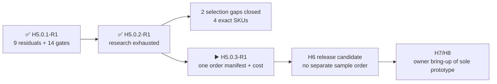

# H5.0.2-R1 · primary-source and serial-alternative research

[Русский](component-source-research.ru.md) · [Home](../README.md) · [Roadmap](roadmap.md)

Review completed on 2026-08-26: primary documents and serial alternatives were exhausted before releasing the sole prototype. Exact reference/bring-up identities close two former selection gaps; no physical claim is closed and no order is authorized.

## What improved without a purchase

- Reference microSD: `SDSQQNR-032G-GN6IA`.
- M5 interconnect set: `A034-G`, `A034-B`, `A096`.
- Robust IR now uses factory-stocked `TSOP75238TR` (`C511498`) without a footprint, contact, GPIO or firmware-interface change; stock, CPL rotation and feeder presentation are mandatory pre-order checks.
- `ES3C35P` and `HMX035CTFT-001` are retained only as legacy electrical/mechanical evidence; donor procurement is rejected, while exact production-panel identity and factory mating remain an open production gate.
- `TE 2118651-2` is confirmed active and documented; replacement has no demonstrated benefit.
- The makers of stock `U214` and `E01-ML01IPX` genuinely do not disclose the fitted connector-subpart MPNs.
- `SA818S-U` and `SA818S-V` are confirmed as two independent serial modules with one official 18-land package. JLCPCB: U is `C3001549`, stock 68/available 60 at `$9.7347`; V is `C51897911`, stock 0 and `pre-order` at `$10.0710`, MOQ 1 and a typical 8–15-working-day lead per the factory's partial 26 August response.
- `SA818S-CE` (`C19632390`, stock 8 at `$9.3449`) uses the same package, contacts and commands and is accepted only as a qualified-pending UHF alternate. It is never a silent substitution: the manifest must disable `470–480 MHz` and the received part must pass HIL.

## Result for the nine residuals

### `H3-PHY-017` · `display`

- Outcome: ES3C35P and HMX035CTFT-001 remain legacy electrical and mechanical evidence only. Complete-donor procurement is rejected because no standalone production-panel order identity, current-lot FPC drawing or factory-placeable route was proven.
- Sources: [LCDWiki](https://www.lcdwiki.com/3.5inch_ESP32-S3_Display), [LCDWiki](https://www.lcdwiki.com/res/ES3C35P/3.5inch_IPS_ESP32-S3_Specification_V1.0.pdf).
- After the sole prototype arrives: select one exact documented production panel, obtain written factory mating/final-assembly feasibility, and release deterministic assembly instructions for the sole prototype.

### `H3-PHY-024` · `ir`

- Outcome: The selected robust channel is exact TSOP75238TR from JLCPCB C511498. TR and the former TT code retain the same 6.8 x 3.0 x 3.2 mm package, contact order, 38-kHz AGC2 role and 3.3-V compatibility; only the tape presentation differs. Current stock covers the one installed prototype channel.
- Sources: [Vishay](https://www.vishay.com/docs/82494/tsop752.pdf), [JLCPCB](https://jlcpcb.com/partdetail/x/C511498).
- After the sole prototype arrives: approve CPL rotation and feeder presentation against the production placement preview, recheck exact stock before the sole-prototype order, and run the inherited two-channel dynamic fixture during owner H7/H8 bring-up.

### `H3-PHY-028` · `battery`

- Outcome: MAX17320 documentation defines the interfaces and limits. One received device covers blank -> deliberately invalid but electrically safe configuration -> reviewed golden/recovery with both address spaces, checksum, NVError and remaining-update bitmap read at each transition. Zero-remaining and failed-copy are emulator/fixture-only injections; all seven physical writes are never consumed and no sacrificial chip is required.
- Sources: existing selected-part primary datasheets in H5-EVR01.
- After the sole prototype arrives: run the safe HIL sequence on the installed prototype gauge during H7/H8 owner bring-up and keep exhaustion/failed-copy injections emulator- or fixture-only.

### `H3-PHY-038` · `timing`

- Outcome: SDSQQNR-032G-GN6IA is selected as the exact reference microSD; its rated performance clears the required rates on paper, while CMD6 identity, stalls and the 512 KiB buffer trace remain HIL evidence.
- Sources: [SanDisk](https://shop.sandisk.com/it-it/products/memory-cards/microsd-cards/sandisk-high-endurance-uhs-i-microsd?sku=SDSQQNR-032G-GN6IA), [TME](https://www.tme.com/in/en/details/sdsqqnr-032g-gn6ia/memory-cards/sandisk/).
- After the sole prototype arrives: include the exact reference card as an owner bring-up article and run the throughput/stall/buffer contract in H8.

### `H3-PHY-046` · `boundaries`

- Outcome: The official schematic names P1 only as HDR-SMD_14P-P2.54 and the official structure repository adds no BOM. Manufacturer MPN, section tolerance, material and plating of the fitted post remain undisclosed.
- Sources: [M5Stack](https://docs.m5stack.com/en/cap/Cap_LoRa-1262), [M5Stack](https://m5stack-doc.oss-cn-shenzhen.aliyuncs.com/1208/U214-sche-Cap-LoRa1262_SCH_V1.1_20251029_2025_11_07_22_53_19.pdf), [M5Stack](https://github.com/m5stack/M5_Hardware/tree/master/Products/U214_Cap_LoRa-1262/Structures).
- After the sole prototype arrives: pack the exact U214 with the sole prototype, then perform ordinary owner assembly/disassembly, continuity, bottoming-clearance and retention inspection on the mixed U214/HLE stack in H7/H8; unsourced forces remain design-analysis inputs.

### `H3-PHY-048` · `boundaries`

- Outcome: A034-G, A034-B and A096 form the exact short, boundary-length and instrument-breakout test set for the admitted M5 profiles; pull networks and waveforms through TXS0102 remain physical.
- Sources: [M5Stack](https://docs.m5stack.com/en/learn/interface/grove), [M5Stack](https://shop.m5stack.com/products/4pin-buckled-grove-cable), [M5Stack](https://docs.m5stack.com/en/accessory/cable/grove2dupont).
- After the sole prototype arrives: include the three exact cable SKUs in the bring-up manifest and run I2C, UART, GPIO and 1-Wire profiles in H8.

### `H3-PHY-053` · `phase`

- Outcome: Ebyte confirms an external IPEX interface but does not disclose the fitted receptacle MPN or lot axis. XC-IPX-SMA-15 was rejected because its 150 mm cable and direct SMA end are not a drop-in replacement for the selected 30 mm jumper, board receptacle and sealed edge SMA path.
- Sources: [Chengdu Ebyte](https://www.ebyte.com/product/47.html), [Chengdu Ebyte](https://www.ebyte.com/Uploadfiles/Files/2025-1-16/2025116152734216.pdf), [Chengdu Ebyte](https://www.ebyte.com/product/2040.html).
- After the sole prototype arrives: inspect the factory-fitted receptacles and measure all three assembled RF feeds on the sole prototype during H7/H8 owner bring-up.

### `H3-PHY-057` · `phase`

- Outcome: The original H5 contract was cyclic because total AMI capacitance includes the not-yet-routed PCB. It is split correctly: H5 locks exact identities, drawings and assembly instructions, H6 closes routed geometry and extracted budget, and H7/H8 inspect and measure the populated total path.
- Sources: existing selected-part primary datasheets in H5-EVR01.
- After the sole prototype arrives: lock exact SMA/pod identities, drawings and deterministic assembly instructions before order; inspect received fit in H7/H8 and retain routed-budget and total-capacitance claims for H6/H8.

### `H3-PHY-062` · `phase`

- Outcome: TE 2118651-2 remains active, fully documented and stocked by an authorized distributor. No evaluated 30 mm alternative improved its 9 GHz performance and price without changing the selected path; installed bend, strain and retention remain physical.
- Sources: [TE Connectivity](https://www.te.com/en/product-2118651-2.html), [DigiKey](https://www.digikey.com/en/products/detail/te-connectivity-amp-connectors/2118651-2/16538824), [Chengdu Ebyte](https://www.ebyte.com/product/47.html), [Chengdu Ebyte](https://www.ebyte.com/Uploadfiles/Files/2025-1-16/2025116152734216.pdf).
- After the sole prototype arrives: have the factory install five exact jumpers, then measure bend, strain, retention and RF loss on the sole prototype in H7/H8.

## Accepted replacement

- `TSOP75238TR`: retains the final Heimdall envelope, contacts, 38-kHz AGC2 role and 3.3-V operation; TR changes only tape presentation, so the placement preview remains an explicit gate.

## Evaluated and rejected alternatives

- `XC-IPX-SMA-15`: serial, but its 150 mm direct path does not replace the selected 30 mm internal jumper + PCB + sealed edge SMA.
- Other 3.5-inch QSPI panels: no drop-in model was found with the same controller, flex contacts, outline, touch stack and connector together.
- `SA818S-CE` is not an unconditional drop-in for `SA818S-U`: the common interface is proven, but its range is narrower (`400–470` instead of `400–480 MHz`). It is allowed only with an explicit CE manifest, HIL and frequency clamp.

## Honest boundary

- All 9 residuals and 14 mechanical gates now have an explicit research disposition.
- Documents close no fit/RF/timing/acoustic/thermal/retention claim.
- Exact reference/bring-up SKUs are selected for the integrated order manifest, but the prototype order is not authorized.
- PCB placement/routing and fabrication remain prohibited.
- Exact next marker: `H5.0.3-R1` — one order-integrated article manifest, H7/H8 evidence contracts and current sole-prototype cost; there is no separate sample purchase or H5 coupon-board phase.

Machine result: [`H5-EVR02`](../hardware/verification/generated/H5-EVR02-source-research.json).
