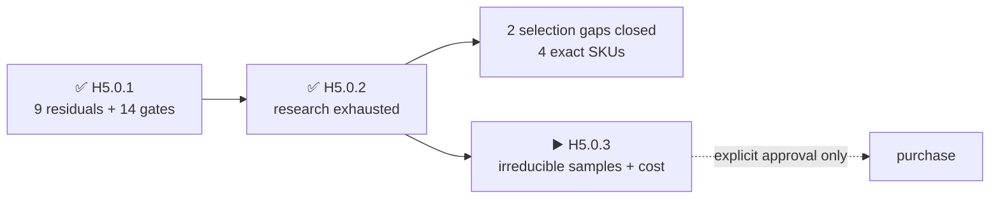

# H5.0.2 · primary-source and serial-alternative research

[Русский](component-source-research.ru.md) · [Home](../README.md) · [Roadmap](roadmap.md)

Review completed on 2026-08-25: primary documents and serial alternatives were exhausted before purchase. Exact test identities close two former selection gaps; no physical claim is closed and no order is authorized.

## What improved without a purchase

- Reference microSD: `SDSQQNR-032G-GN6IA`.
- M5 interconnect set: `A034-G`, `A034-B`, `A096`.
- Full-reel-only `TSOP95238TT` is replaced by stocked cut-tape `TSOP75238TT` without a footprint, contact, GPIO or firmware-interface change.
- A serial `ES3C35P` display donor route is identified; the raw panel still cannot be honestly qualified without a received sample.
- `TE 2118651-2` is confirmed active and documented; replacement has no demonstrated benefit.
- The makers of stock `U214` and `E01-ML01IPX` genuinely do not disclose the fitted connector-subpart MPNs.

## Result for the nine residuals

### `H3-PHY-017` · `display`

- Outcome: ES3C35P is an exact serial donor route for the HMX035CTFT-001-marked display assembly; no standalone raw-panel order identity, current-lot FPC drawing or fully documented drop-in raw replacement was found.
- Sources: [LCDWiki](https://www.lcdwiki.com/3.5inch_ESP32-S3_Display), [LCDWiki](https://www.lcdwiki.com/res/ES3C35P/3.5inch_IPS_ESP32-S3_Specification_V1.0.pdf).
- Still physical: receive one donor/assembly and measure controller identity, rails, tail and optical/electrical behaviour.

### `H3-PHY-024` · `ir`

- Outcome: The full-reel-only TSOP95238TT was replaced by stocked cut-tape TSOP75238TT. It keeps the same 6.8 x 3.0 x 3.2 mm top-view envelope, contact order, 38-kHz AGC2 role and 3.3-V compatibility while widening the supply range and improving nominal range; received orientation and dynamic behaviour remain physical.
- Sources: [Vishay](https://www.vishay.com/docs/82494/tsop752.pdf), [DigiKey](https://www.digikey.com/en/products/detail/vishay-semiconductor-opto-division/TSOP75238TT/4075864).
- Still physical: run the inherited two-channel dynamic fixture on received parts.

### `H3-PHY-028` · `battery`

- Outcome: MAX17320 documentation defines the interfaces and limits, but golden-image programming and blank/corrupt/exhausted-write reactions are deliberately injected state tests on received silicon.
- Sources: existing selected-part primary datasheets in H5-EVR01.
- Still physical: program and fault-inject the received gauge specimen set.

### `H3-PHY-038` · `timing`

- Outcome: SDSQQNR-032G-GN6IA is selected as the exact reference microSD; its rated performance clears the required rates on paper, while CMD6 identity, stalls and the 512 KiB buffer trace remain HIL evidence.
- Sources: [SanDisk](https://shop.sandisk.com/it-it/products/memory-cards/microsd-cards/sandisk-high-endurance-uhs-i-microsd?sku=SDSQQNR-032G-GN6IA), [TME](https://www.tme.com/in/en/details/sdsqqnr-032g-gn6ia/memory-cards/sandisk/).
- Still physical: receive the exact card and run the existing throughput/stall/buffer contract.

### `H3-PHY-046` · `boundaries`

- Outcome: The official schematic names P1 only as HDR-SMD_14P-P2.54 and the official structure repository adds no BOM. Manufacturer MPN, section tolerance, material and plating of the fitted post remain undisclosed.
- Sources: [M5Stack](https://docs.m5stack.com/en/cap/Cap_LoRa-1262), [M5Stack](https://m5stack-doc.oss-cn-shenzhen.aliyuncs.com/1208/U214-sche-Cap-LoRa1262_SCH_V1.1_20251029_2025_11_07_22_53_19.pdf), [M5Stack](https://github.com/m5stack/M5_Hardware/tree/master/Products/U214_Cap_LoRa-1262/Structures).
- Still physical: identify and measure a received U214, then cycle the mixed U214/HLE stack.

### `H3-PHY-048` · `boundaries`

- Outcome: A034-G, A034-B and A096 form the exact short, boundary-length and instrument-breakout test set for the admitted M5 profiles; pull networks and waveforms through TXS0102 remain physical.
- Sources: [M5Stack](https://docs.m5stack.com/en/learn/interface/grove), [M5Stack](https://shop.m5stack.com/products/4pin-buckled-grove-cable), [M5Stack](https://docs.m5stack.com/en/accessory/cable/grove2dupont).
- Still physical: receive the three exact cable SKUs and run I2C, UART, GPIO and 1-Wire profiles.

### `H3-PHY-053` · `phase`

- Outcome: Ebyte confirms an external IPEX interface but does not disclose the fitted receptacle MPN or lot axis. XC-IPX-SMA-15 was rejected because its 150 mm cable and direct SMA end are not a drop-in replacement for the selected 30 mm jumper, board receptacle and sealed edge SMA path.
- Sources: [Chengdu Ebyte](https://www.ebyte.com/product/47.html), [Chengdu Ebyte](https://www.ebyte.com/Uploadfiles/Files/2025-1-16/2025116152734216.pdf), [Chengdu Ebyte](https://www.ebyte.com/product/2040.html).
- Still physical: inspect the fitted receptacles and measure all three assembled RF feeds.

### `H3-PHY-057` · `phase`

- Outcome: The original H5 contract was cyclic because total AMI capacitance includes the not-yet-routed PCB. It is split correctly: H5 identifies and measures received SMA/pod constituents, H6 closes routed geometry and extracted budget, and H8 measures the populated total path.
- Sources: existing selected-part primary datasheets in H5-EVR01.
- Still physical: receive the exact SMA/pod constituent set in H5; retain routed-budget and total-capacitance claims for H6/H8.

### `H3-PHY-062` · `phase`

- Outcome: TE 2118651-2 remains active, fully documented and stocked by an authorized distributor. No evaluated 30 mm alternative improved its 9 GHz performance and price without changing the selected path; installed bend, strain and retention remain physical.
- Sources: [TE Connectivity](https://www.te.com/en/product-2118651-2.html), [DigiKey](https://www.digikey.com/en/products/detail/te-connectivity-amp-connectors/2118651-2/16538824), [Chengdu Ebyte](https://www.ebyte.com/product/47.html), [Chengdu Ebyte](https://www.ebyte.com/Uploadfiles/Files/2025-1-16/2025116152734216.pdf).
- Still physical: install five exact jumpers and measure bend, strain, retention and RF loss.

## Accepted replacement

- `TSOP75238TT`: accepted as a form/fit/function replacement for `TSOP95238TT`; it retains the top-view envelope, contacts, 38-kHz AGC2 role and 3.3-V operation while being orderable individually.

## Evaluated and rejected alternatives

- `XC-IPX-SMA-15`: serial, but its 150 mm direct path does not replace the selected 30 mm internal jumper + PCB + sealed edge SMA.
- Other 3.5-inch QSPI panels: no drop-in model was found with the same controller, flex contacts, outline, touch stack and connector together.

## Honest boundary

- All 9 residuals and 14 mechanical gates now have an explicit research disposition.
- Documents close no fit/RF/timing/acoustic/thermal/retention claim.
- Exact test SKUs are **selected, not ordered**.
- PCB placement/routing and fabrication remain prohibited.
- Exact next marker: `H5.0.3` — one deduplicated basket of irreducible samples, measurements and current cost for separate approval.

Machine result: [`H5-EVR02`](../hardware/verification/generated/H5-EVR02-source-research.json).
