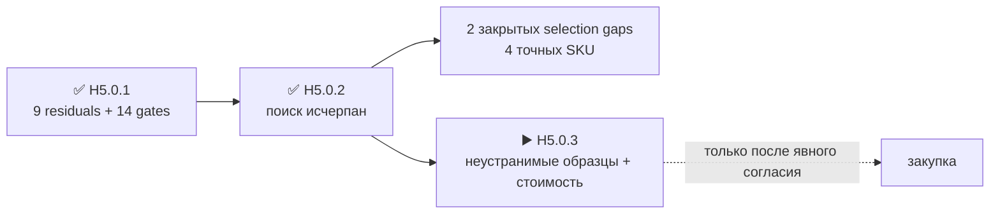

# H5.0.2 · поиск источников и серийных замен

[English](component-source-research.md) · [На главную](../README.ru.md) · [Роадмап](roadmap.ru.md)

Ревью проведено 2026-08-25: первичные документы и серийные альтернативы проверены до закупки. Выбраны точные тестовые identities для двух прежних пробелов; ни один физический claim не закрыт и заказ не разрешён.

## Что улучшилось без закупки

- Эталонная microSD: `SDSQQNR-032G-GN6IA`.
- Набор M5-проводов: `A034-G`, `A034-B`, `A096`.
- Для дисплея найден серийный донор `ES3C35P`; raw-панель всё ещё нельзя честно квалифицировать без образца.
- `TE 2118651-2` подтверждён как active и документированный; менять его нет оснований.
- Для stock `U214` и `E01-ML01IPX` производители действительно не раскрывают MPN установленных connector subparts.

## Результат по девяти residuals

### `H3-PHY-017` · `display`

- Итог: ES3C35P — точный серийный донор для сборки с маркировкой HMX035CTFT-001; самостоятельный order identity панели, чертёж FPC текущей партии и полностью документированная drop-in замена не найдены.
- Источники: [LCDWiki](https://www.lcdwiki.com/3.5inch_ESP32-S3_Display), [LCDWiki](https://www.lcdwiki.com/res/ES3C35P/3.5inch_IPS_ESP32-S3_Specification_V1.0.pdf).
- Осталось физически: получить одну donor-сборку и измерить identity контроллера, питания, шлейф, оптику и электрическое поведение.

### `H3-PHY-024` · `ir`

- Итог: Для выбранных IR-деталей уже есть первичные datasheet; ориентация полученной партии и динамические startup/capture/no-back-power — свойства собранного образца, а не пробел документации.
- Источники: первичные datasheet уже выбранных деталей из H5-EVR01.
- Осталось физически: прогнать принятую двухканальную динамическую fixture на полученных деталях.

### `H3-PHY-028` · `battery`

- Итог: Документация MAX17320 задаёт интерфейсы и пределы, но programming golden image и реакции на blank/corrupt/exhausted-write — намеренно вводимые состояния реального экземпляра.
- Источники: первичные datasheet уже выбранных деталей из H5-EVR01.
- Осталось физически: запрограммировать полученные gauge-образцы и провести fault injection.

### `H3-PHY-038` · `timing`

- Итог: Точная эталонная microSD выбрана: SDSQQNR-032G-GN6IA. Паспортные скорости выше требований, но CMD6 identity, задержки и трасса 512-КиБ буфера остаются HIL evidence.
- Источники: [SanDisk](https://shop.sandisk.com/it-it/products/memory-cards/microsd-cards/sandisk-high-endurance-uhs-i-microsd?sku=SDSQQNR-032G-GN6IA), [TME](https://www.tme.com/in/en/details/sdsqqnr-032g-gn6ia/memory-cards/sandisk/).
- Осталось физически: получить точную карту и прогнать принятый throughput/stall/buffer contract.

### `H3-PHY-046` · `boundaries`

- Итог: Официальная схема называет P1 только HDR-SMD_14P-P2.54, а structure repository не содержит BOM. MPN, допуск сечения, материал и покрытие установленного штыря не опубликованы.
- Источники: [M5Stack](https://docs.m5stack.com/en/cap/Cap_LoRa-1262), [M5Stack](https://m5stack-doc.oss-cn-shenzhen.aliyuncs.com/1208/U214-sche-Cap-LoRa1262_SCH_V1.1_20251029_2025_11_07_22_53_19.pdf), [M5Stack](https://github.com/m5stack/M5_Hardware/tree/master/Products/U214_Cap_LoRa-1262/Structures).
- Осталось физически: идентифицировать и измерить полученный U214, затем циклировать смешанный stack U214/HLE.

### `H3-PHY-048` · `boundaries`

- Итог: A034-G, A034-B и A096 образуют точный короткий, граничный и измерительный набор для разрешённых M5-профилей; pull-сети и формы сигналов через TXS0102 остаются физической проверкой.
- Источники: [M5Stack](https://docs.m5stack.com/en/learn/interface/grove), [M5Stack](https://shop.m5stack.com/products/4pin-buckled-grove-cable), [M5Stack](https://docs.m5stack.com/en/accessory/cable/grove2dupont).
- Осталось физически: получить три точных cable SKU и прогнать профили I2C, UART, GPIO и 1-Wire.

### `H3-PHY-053` · `phase`

- Итог: Ebyte подтверждает внешний IPEX, но не публикует MPN и ось установленного receptacle. XC-IPX-SMA-15 отклонён: кабель 150 мм и прямой SMA не являются drop-in заменой выбранным 30-мм jumper, board receptacle и герметичному краевому SMA-тракту.
- Источники: [Chengdu Ebyte](https://www.ebyte.com/product/47.html), [Chengdu Ebyte](https://www.ebyte.com/Uploadfiles/Files/2025-1-16/2025116152734216.pdf), [Chengdu Ebyte](https://www.ebyte.com/product/2040.html).
- Осталось физически: осмотреть установленные receptacle и измерить все три собранных RF-тракта.

### `H3-PHY-057` · `phase`

- Итог: Полная AMI-ёмкость включает полученный краевой SMA, разведённую PCB и собранный controlled pod; замена отдельной детали не доказывает ёмкость всего тракта.
- Источники: первичные datasheet уже выбранных деталей из H5-EVR01.
- Осталось физически: измерить завершённый точный тракт и сверить его с tuning contract.

### `H3-PHY-062` · `phase`

- Итог: TE 2118651-2 остаётся active, полностью документирован и доступен у авторизованного дистрибьютора. Рассмотренные 30-мм альтернативы не улучшили 9-ГГц характеристики и цену без изменения тракта; изгиб, strain и retention после установки остаются физическими.
- Источники: [TE Connectivity](https://www.te.com/en/product-2118651-2.html), [DigiKey](https://www.digikey.com/en/products/detail/te-connectivity-amp-connectors/2118651-2/16538824), [Chengdu Ebyte](https://www.ebyte.com/product/47.html), [Chengdu Ebyte](https://www.ebyte.com/Uploadfiles/Files/2025-1-16/2025116152734216.pdf).
- Осталось физически: установить пять точных jumper и измерить изгиб, strain, retention и RF-потери.

## Проверенные, но отклонённые замены

- `XC-IPX-SMA-15`: серийный, но его 150-мм прямой тракт не заменяет выбранный 30-мм внутренний jumper + PCB + герметичный краевой SMA.
- Другие 3.5-дюймовые QSPI-панели: не найдена drop-in модель с одновременно теми же controller, flex contacts, outline, touch stack и connector.

## Честная граница

- Все 9 residuals и 14 mechanical gates получили явный research disposition.
- Документами не закрыт ни один fit/RF/timing/acoustic/thermal/retention claim.
- Точные тестовые SKU **выбраны, но не заказаны**.
- PCB placement/routing и fabrication остаются запрещены.
- Точный следующий маркер: `H5.0.3` — единый недублирующийся набор только неустранимых образцов, измерения и текущая стоимость для отдельного согласования.

Машинный результат: [`H5-EVR02`](../hardware/verification/generated/H5-EVR02-source-research.json).
