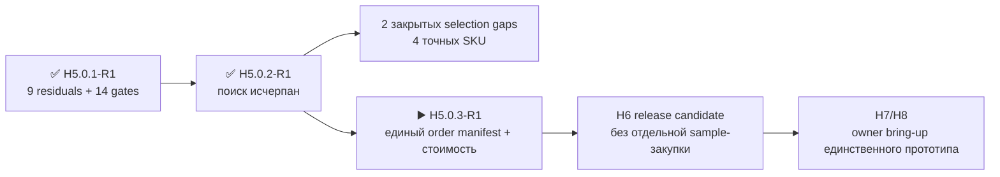

# H5.0.2-R1 · поиск источников и серийных замен

[English](component-source-research.md) · [На главную](../README.ru.md) · [Роадмап](roadmap.ru.md)

Ревью проведено 2026-08-26: первичные документы и серийные альтернативы проверены до выпуска единственного прототипа. Выбраны точные reference/bring-up identities для двух прежних пробелов; ни один физический claim не закрыт и заказ не разрешён.

## Что улучшилось без закупки

- Эталонная microSD: `SDSQQNR-032G-GN6IA`.
- Набор M5-проводов: `A034-G`, `A034-B`, `A096`.
- Для robust IR выбран factory-stocked `TSOP75238TR` (`C511498`) без изменения footprint, контактов, GPIO или интерфейса прошивки; перед заказом обязательны проверка остатка, CPL rotation и feeder presentation.
- `ES3C35P` и `HMX035CTFT-001` сохранены только как прежние electrical/mechanical evidence; закупка donor-сборки отклонена, а точная серийная панель и factory mating остаются открытым production gate.
- `TE 2118651-2` подтверждён как active и документированный; менять его нет оснований.
- Для stock `U214` и `E01-ML01SP4` производители действительно не раскрывают MPN установленных connector subparts.
- `SA818S-U` и `SA818S-V` подтверждены как два независимых серийных модуля с общим официальным 18-land package. JLCPCB: U — `C3001549`, stock 68/available 60, `$9.7347`; V — `C51897911`, stock 0, `pre-order`, `$10.0710`, MOQ 1 и типичные 8–15 рабочих дней по частичному ответу фабрики от 26 августа.
- `SA818S-CE` (`C19632390`, stock 8, `$9.3449`) имеет те же package, contacts и команды и принят только как qualified-pending замена UHF-модуля. Это не молчаливая замена: manifest обязан запретить `470–480 МГц`, а полученная деталь должна пройти HIL.

## Результат по девяти residuals

### `H3-PHY-017` · `display`

- Итог: ES3C35P и HMX035CTFT-001 остаются только прежними электрическими и механическими свидетельствами. Закупка полной donor-сборки отклонена: не доказаны самостоятельный production-panel order identity, чертёж FPC текущей партии и factory-placeable route.
- Источники: [LCDWiki](https://www.lcdwiki.com/3.5inch_ESP32-S3_Display), [LCDWiki](https://www.lcdwiki.com/res/ES3C35P/3.5inch_IPS_ESP32-S3_Specification_V1.0.pdf).
- После получения единственного прототипа: выбрать одну точную документированную серийную панель, письменно подтвердить factory mating/final assembly и выпустить однозначную инструкцию сборки единственного прототипа.

### `H3-PHY-024` · `ir`

- Итог: В устойчивом канале выбран точный TSOP75238TR через JLCPCB C511498. TR и прежний код TT сохраняют тот же корпус 6,8 x 3,0 x 3,2 мм, порядок контактов, роль 38 кГц AGC2 и совместимость с 3,3 В; отличается только подача в ленте. Текущий остаток покрывает один устанавливаемый канал прототипа.
- Источники: [Vishay](https://www.vishay.com/docs/82494/tsop752.pdf), [JLCPCB](https://jlcpcb.com/partdetail/x/C511498).
- После получения единственного прототипа: сверить CPL rotation и подачу feeder с production placement preview, повторно проверить точный остаток перед заказом единственного прототипа и прогнать принятую двухканальную dynamic fixture во время owner bring-up H7/H8.

### `H3-PHY-028` · `battery`

- Итог: Документация MAX17320 задаёт интерфейсы и пределы. Один полученный экземпляр покрывает blank → намеренно некорректную, но электрически безопасную конфигурацию → проверенный golden/recovery с чтением обоих address space, checksum, NVError и bitmap оставшихся обновлений на каждом переходе. Zero-remaining и failed-copy вводятся только в emulator/fixture; все семь физических записей не расходуются, отдельный жертвенный chip не нужен.
- Источники: первичные datasheet уже выбранных деталей из H5-EVR01.
- После получения единственного прототипа: выполнить безопасную HIL-последовательность на установленном gauge прототипа во время owner bring-up H7/H8, а exhaustion/failed-copy оставить только emulator/fixture-инъекциями.

### `H3-PHY-038` · `timing`

- Итог: Точная эталонная microSD выбрана: SDSQQNR-032G-GN6IA. Паспортные скорости выше требований, но CMD6 identity, задержки и трасса 512-КиБ буфера остаются HIL evidence.
- Источники: [SanDisk](https://shop.sandisk.com/it-it/products/memory-cards/microsd-cards/sandisk-high-endurance-uhs-i-microsd?sku=SDSQQNR-032G-GN6IA), [TME](https://www.tme.com/in/en/details/sdsqqnr-032g-gn6ia/memory-cards/sandisk/).
- После получения единственного прототипа: включить точную эталонную карту как owner bring-up article и прогнать throughput/stall/buffer contract в H8.

### `H3-PHY-046` · `boundaries`

- Итог: Официальная схема называет P1 только HDR-SMD_14P-P2.54, а structure repository не содержит BOM. MPN, допуск сечения, материал и покрытие установленного штыря не опубликованы.
- Источники: [M5Stack](https://docs.m5stack.com/en/cap/Cap_LoRa-1262), [M5Stack](https://m5stack-doc.oss-cn-shenzhen.aliyuncs.com/1208/U214-sche-Cap-LoRa1262_SCH_V1.1_20251029_2025_11_07_22_53_19.pdf), [M5Stack](https://github.com/m5stack/M5_Hardware/tree/master/Products/U214_Cap_LoRa-1262/Structures).
- После получения единственного прототипа: положить точный U214 в поставку единственного прототипа, затем выполнить обычную пользовательскую сборку/разборку, continuity, bottoming-clearance и retention inspection смешанного U214/HLE stack в H7/H8.

### `H3-PHY-048` · `boundaries`

- Итог: A034-G, A034-B и A096 образуют точный короткий, граничный и измерительный набор для разрешённых M5-профилей; pull-сети и формы сигналов через TXS0102 остаются физической проверкой.
- Источники: [M5Stack](https://docs.m5stack.com/en/learn/interface/grove), [M5Stack](https://shop.m5stack.com/products/4pin-buckled-grove-cable), [M5Stack](https://docs.m5stack.com/en/accessory/cable/grove2dupont).
- После получения единственного прототипа: включить три точных cable SKU в bring-up manifest и прогнать профили I2C, UART, GPIO и 1-Wire в H8.

### `H3-PHY-053` · `phase`

- Итог: Ebyte подтверждает внешний IPEX, но не публикует MPN и ось установленного receptacle. XC-IPX-SMA-15 отклонён: кабель 150 мм и прямой SMA не являются drop-in заменой выбранным 30-мм jumper, board receptacle и герметичному краевому SMA-тракту.
- Источники: [Chengdu Ebyte](https://www.ebyte.com/product/49.html), [Chengdu Ebyte](https://www.ebyte.com/Uploadfiles/Files/2025-1-16/2025116152778058.pdf), [Chengdu Ebyte](https://www.ebyte.com/product/2040.html).
- После получения единственного прототипа: осмотреть установленные фабрикой receptacle и измерить все три собранных RF-тракта единственного прототипа во время owner bring-up H7/H8.

### `H3-PHY-057` · `phase`

- Итог: Исходный контракт H5 был циклическим: полная AMI-ёмкость включает ещё не разведённую PCB. Контракт разделён корректно: H5 фиксирует exact identities, drawings и assembly instructions, H6 закрывает геометрию и extracted budget, а H7/H8 осматривают и измеряют полный собранный тракт.
- Источники: первичные datasheet уже выбранных деталей из H5-EVR01.
- После получения единственного прототипа: зафиксировать exact SMA/pod identities, drawings и однозначные assembly instructions до заказа; fit проверять в H7/H8, а routed budget и полную ёмкость оставить H6/H8.

### `H3-PHY-062` · `phase`

- Итог: TE 2118651-2 остаётся active, полностью документирован и доступен у авторизованного дистрибьютора. Рассмотренные 30-мм альтернативы не улучшили 9-ГГц характеристики и цену без изменения тракта; изгиб, strain и retention после установки остаются физическими.
- Источники: [TE Connectivity](https://www.te.com/en/product-2118651-2.html), [DigiKey](https://www.digikey.com/en/products/detail/te-connectivity-amp-connectors/2118651-2/16538824), [Chengdu Ebyte](https://www.ebyte.com/product/49.html), [Chengdu Ebyte](https://www.ebyte.com/Uploadfiles/Files/2025-1-16/2025116152778058.pdf).
- После получения единственного прототипа: установить фабрикой пять точных jumper, затем измерить изгиб, strain, retention и RF-потери на единственном прототипе в H7/H8.

## Проверенные замены

- `TSOP75238TR`: сохраняет конечный Heimdall envelope, контакты, 38-кГц AGC2 и питание 3,3 В; TR меняет только подачу в ленте, поэтому placement preview остаётся обязательным воротом.

## Проверенные, но отклонённые замены

- `XC-IPX-SMA-15`: серийный, но его 150-мм прямой тракт не заменяет выбранный 30-мм внутренний jumper + PCB + герметичный краевой SMA.
- Другие 3.5-дюймовые QSPI-панели: не найдена drop-in модель с одновременно теми же controller, flex contacts, outline, touch stack и connector.
- `SA818S-CE` не принимается как безусловная drop-in замена `SA818S-U`: общий interface доказан, но диапазон уже (`400–470` вместо `400–480 МГц`). Допускается только явный CE-manifest с HIL и частотным clamp.

## Честная граница

- Все 9 residuals и 14 mechanical gates получили явный research disposition.
- Документами не закрыт ни один fit/RF/timing/acoustic/thermal/retention claim.
- Точные reference/bring-up SKU выбраны для единого order manifest, но заказ прототипа не разрешён.
- PCB placement/routing и fabrication остаются запрещены.
- Точный следующий маркер: `H5.0.3-R1` — единый order-integrated article manifest, измерительные контракты H7/H8 и текущая стоимость одного прототипа; отдельной закупки образцов и H5 coupon-плат нет.

Машинный результат: [`H5-EVR02`](../hardware/verification/generated/H5-EVR02-source-research.json).
