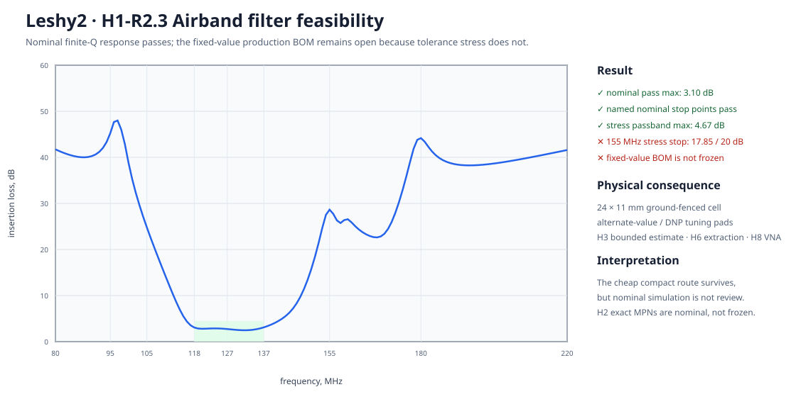

# H1-R2.3 · входной фильтр Airband

Проверена дешёвая и компактная замена большому `BPF-A127+`. Это результат физической проработки, а не разрешение начинать KiCad.

## Что получилось

- Номинальный finite-Q расчёт проходит маску: худшая потеря в 118–137 МГц — `3.03 дБ` при лимите `4,5 дБ`; все именованные nominal stop-точки проходят.
- Stress sweep из `16386` наборов сохраняет passband (`4.27 дБ` при лимите `4,5 дБ`), но на 180 МГц худшее подавление — `34.62 дБ` вместо `40 дБ`. Поэтому значения элементов и production MPN **не приняты**.
- Сохраняется серийная LC-реализация, но её физическая ячейка увеличена до `24 × 11 мм`, получает via-fence и площадки альтернативных/DNP номиналов.
- Полоса 180–2200 МГц не доказывается lumped-моделью выше SRF: H3 использует ограниченную pre-layout-модель, H6 повторяет расчёт с извлечёнными паразитиками до заказа H7, а H8 закрывает production-state измерением VNA.

## Свидетельства фабричной реализуемости

Это не production BOM фильтра: строки доказывают, что нужные классы точных серийных RF-индуктивностей существуют на фабричной поверхности. H2 фиксирует номинальный ECAD-state, H6 — предзаказный fitted/DNP-state после extraction, H8 — production-state после VNA.

| Exact MPN | JLCPCB | Value | Current route |
|---|---|---|---|
| `LQW2UASR56F00L` | [`C907989`](https://jlcpcb.com/partdetail/MurataElectronics-LQW2UASR56F00L/C907989) | 560 nH +/-1%, 1008 | 502 pieces, MOQ 1, USD 0.2618 at quantity 1 |
| `LQW2BASR22G00L` | [`C527968`](https://jlcpcb.com/partdetail/MurataElectronics-LQW2BASR22G00L/C527968) | 220 nH +/-2%, 0805 | 180 pieces, MOQ 1, USD 0.1325 at quantity 1 |
| `LQW2BASR33G00L` | [`C703717`](https://jlcpcb.com/partdetail/MurataElectronics-LQW2BASR33G00L/C703717) | 330 nH +/-2%, 0805 | 249 pieces, MOQ 1, USD 0.1455 at quantity 1 |
| `LQW15AN10NG80D` | [`C3224837`](https://www.lcsc.com/product-detail/C3224837.html) | 10 nH +/-2%, 0402 | 28,540 pieces, MOQ/multiple 10, USD 0.0575 at quantity 10 |

## Следующий gate

H2 переносит полную tuning-сеть в ECAD. H3 проверяет её с ограниченными pre-layout-паразитиками; H6 повторяет проверку с routed/extracted-паразитиками до заказа H7; H8 выбирает production fitted/DNP-state по VNA. При провале маски возвращаемся к точному покупному фильтру или меняем границу приёмника.

> Маркер результата: **H1-R2.3**. Текущий маркер H1 опубликован в роадмапе.
