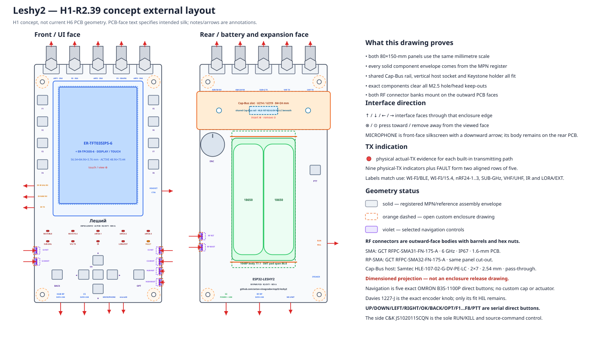
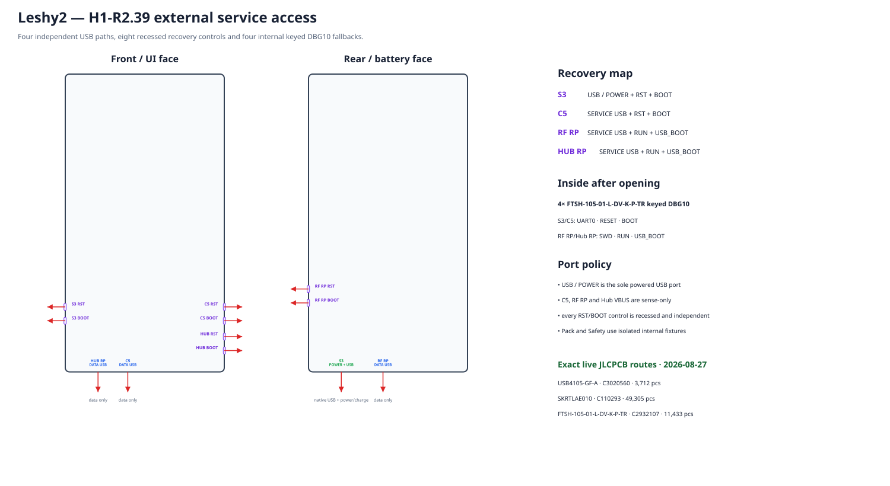
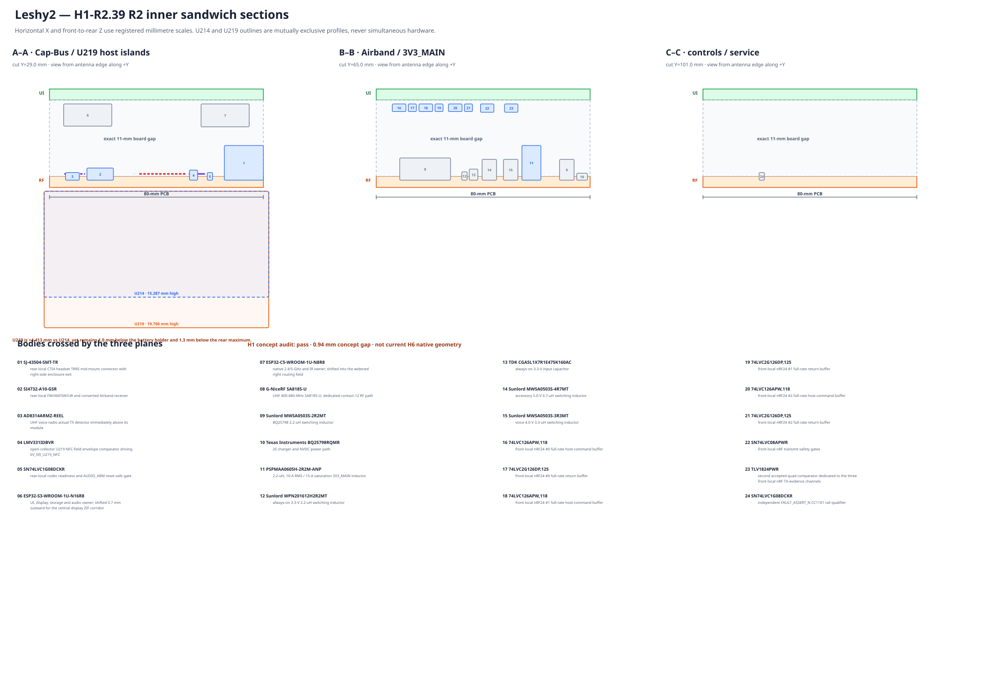
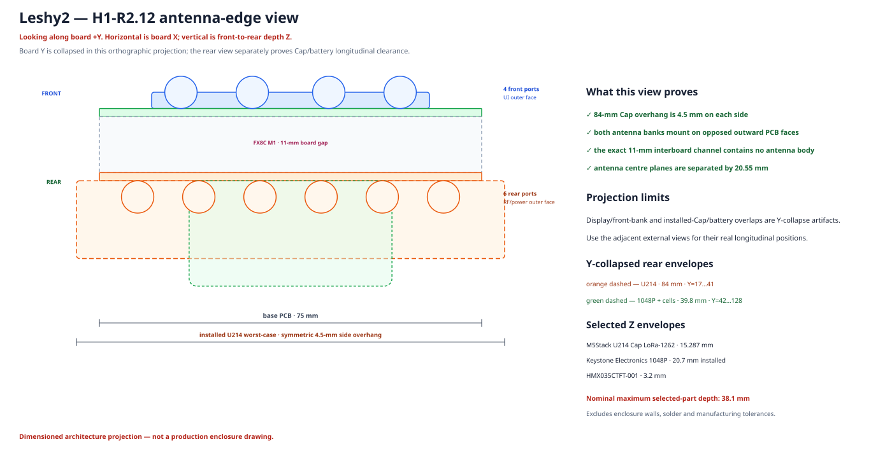
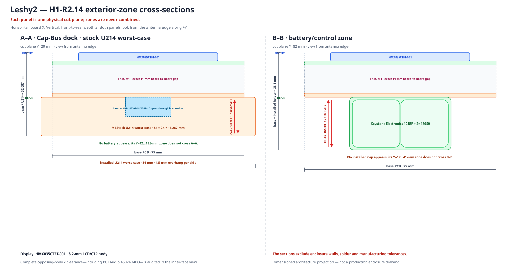
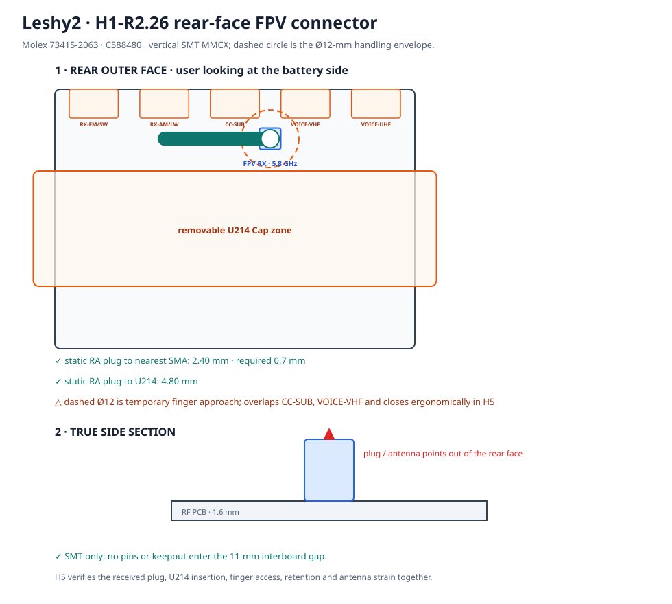

# H1-R2.14 · physical re-layout

This is the current verified H1 result, not a decision diary and not authorization to start KiCad.

The second Hub RP, its complete independent external recovery set, Airband active bodies, an expanded 24 × 11 mm filter-tuning cell, the FPV video decoder and a replaceable bay for the leading serial AKK K331 candidate are placed in the accepted 75 × 150 mm coordinate system. The reserve is not promoted to a fixed body before AKK-controlled dimensions exist.

## Already verified

- Same-face body collisions: `0`.
- Intentional opposing XY projections: `27`; minimum Z clearance is `1.44 mm` against `0.70 mm` required.
- The discovered H0↔H1 mismatch is corrected: Hub RP now has the fourth independent data-only `HUB SERVICE USB`, two recessed side `HUB RST/BOOT` controls and the fourth internal DBG10. Hub and C5 use the same exact `SKRTLAE010`, so the generator renders the same body, protective recess and recessed actuator.
- All four independent USB openings now face the bottom edge: the main `USB / POWER` and the three data-only service paths for C5, RF RP and Hub RP remain electrically independent.
- The UI board retains four SMA while the RF board packs six SMA plus the distinct FPV MMCX onto one antenna edge: exact bodies preserve 0.7-mm gaps and 3.0-mm board margins. No radio, coupler or physical-TX evidence chain moves, and no RF transition or link-budget loss is added.
- Both inner faces are now mirrored when each PCB is physically turned over; the earlier incremental view incorrectly mirrored only the RF PCB.
- An AKK-branded dimensioned reseller image gives a 28.7 × 23.1 mm nominal K331 board; collision checks use a conservative 30 × 24 × 4 mm reserve without changing the PCB outline or battery/U214 exterior zones.
- K331 functional pin fit is accepted, but the reserve is not a fixed body: maximum XYZ, land pattern and reflow/packaging must come from an AKK-controlled document.
- JLCPCB confirmed that K331 is absent from both Parts Library and Global Sourcing and found no direct replacement. The selected factory route is genuine AKK supply through Consigned Parts; its application and final Gerber/BOM/CPL DFM are later gates.
- JLCPCB can review a later 5 V, channel-select, RSSI and CVBS function-test procedure. Feasibility and quotation belong to H5/H6/H7 and do not block the present physical model.
- The controlled 26.16 × 16.38 × 3.70 mm `AWM666V RX` fallback and its recommended land pattern fit the same bay; it does not replace K331 automatically because it has seven channels instead of 24 and no public JLCPCB route.
- The exact linear TBS5G8MMCXA antenna mates with the distinct MMCX; K331 ANT IN reaches it over one direct 50-ohm PCB trace without U.FL.
- Corrected `DL-MMCX-KWE-90` geometry keeps 3.6 mm of body on the RF PCB and projects only the 3.0-mm barrel beyond the top antenna edge; its pins enter the interboard gap by a nominal 1.2 mm and the tail keepout meets no opposing body.
- The antenna edge has a 4.5-mm minimum free aperture and a Ø12×20-mm exterior handling corridor. The MMCX body leaves 0.7 mm to each adjacent `nRF24-2` and `VHF VOICE` SMA; its Ø12-mm handling envelope overlaps them, so the flexible 102-mm FPV antenna is fitted first. H5 verifies received parts, installation/removal order, retention and antenna strain.
- Hub remains on the UI board beside storage/audio/broadcast; the FPV RF module and decoder remain together on the RF board.
- Airband now has a [nominally passing but stress-open synthesis](h1-airband-filter.md); the enlarged cell carries alternate/DNP pads, H3 checks bounded estimates, H6 routed extraction before order and H8 the final VNA state.

## Exact factory parts

| Role | Exact MPN | JLCPCB | Selection status | Current route |
|---|---|---|---|---|
| Hub RP2354B factory assembly cross-reference | `SC1512-A4` | [`C39843328`](https://jlcpcb.com/partdetail/RaspberryPi-RP2354B/C39843328) | working selection; A4 marking remains an incoming gate | LCSC/JLC supply surface showed 3,682 pieces, MOQ 1, USD 1.6225 at quantity 1 |
| analog composite-video decoder | `TVP5150AM1PBS` | [`C3824301`](https://jlcpcb.com/partdetail/TexasInstruments-TVP5150AM1PBS/C3824301) | accepted for the working placement | 62 pieces, MOQ 1, USD 6.4081 at quantity 1 |
| 24-channel 5.8-GHz analog-FPV receiver module | `K331` | — | official application, complete 14-pin functions and 24-channel table accepted; genuine AKK supply plus JLCPCB Consigned Parts is the selected factory route; only the controlled physical/assembly package remains open | manufacturer store showed in stock at USD 29.99; JLCPCB confirmed zero Parts Library/Global Sourcing route and no direct replacement, but accepts a Consigned Parts application before shipment |
| top antenna-edge-facing 5.8-GHz user connector | `DL-MMCX-KWE-90` | [`C2894793`](https://jlcpcb.com/partdetail/DreamLNK-DL_MMCX_KWE90/C2894793) | accepted physical definition, corrected top antenna-edge placement and machine-proved solder-tail/service keepouts | 25,383 pieces, MOQ 1, USD 0.9077 at quantity 1 |
| Hub RP independent data-only service USB-C | `USB4105-GF-A` | [`C3020560`](https://jlcpcb.com/partdetail/GlobalConnectorTechnology-USB4105_GF_A/C3020560) | reused exact R1 service connector; accepted for the fourth independent R2 recovery path | 3,712 pieces, MOQ 1, USD 1.0605 at quantity 1 |
| Hub RP recessed RESET/USB_BOOT side switch | `SKRTLAE010` | [`C110293`](https://jlcpcb.com/partdetail/ALPSALPINE-SKRTLAE010/C110293) | reused exact R1 external recovery switch; two additional R2 placements | 49,305 pieces, MOQ 1, USD 0.1443 at quantity 1 |
| Hub RP keyed internal DBG10 recovery header | `FTSH-105-01-L-DV-K-P-TR` | [`C2932107`](https://jlcpcb.com/partdetail/Samtec-FTSH_105_01_L_DV_K_PTR/C2932107) | reused exact R1 DBG10 header; accepted for opened-sandwich Hub recovery | 11,433 pieces, MOQ 1, USD 1.2797 at quantity 1 |
| FPV decoder 1.8-V rail | `TPS7A2018PDBVR` | [`C963430`](https://jlcpcb.com/partdetail/TexasInstruments-TPS7A2018PDBVR/C963430) | accepted for the working placement | 2,225 pieces, MOQ/multiple 5, USD 0.2413 at quantity 5; JLC identifies Economic and Standard SMT assembly |
| 3V3_MAIN 6-A synchronous buck with protected diagnostic PG | `TPS566231PRQFR` | [`C3190178`](https://jlcpcb.com/partdetail/TexasInstruments-TPS566231PRQFR/C3190178) | accepted H1-R2 working selection; dynamic and thermal closure remains H3 | 112 pieces, MOQ 1, USD 1.0478 at quantity 1 |
| 3V3_MAIN 2.2-uH high-current shielded inductor | `PSPMAA0605H-2R2M-ANP` | [`C2983088`](https://jlcpcb.com/partdetail/PRODTech-PSPMAA0605H2R2MANP/C2983088) | accepted H1-R2 working selection; 10-A RMS and 15-A saturation ratings | 627 pieces, MOQ 1, USD 0.1735 at quantity 1 |
| 3V3_MAIN eFuse threshold resistor | `RC0402FR-071K18L` | [`C273709`](https://jlcpcb.com/partdetail/YAGEO-RC0402FR071K18L/C273709) | accepted H1-R2 working selection; 4.870-A nominal and 4.340-A guaranteed-low threshold | 5,864 pieces, MOQ 1, USD 0.0025 at quantity 1 |
| TPS566231P VCC decoupling capacitor | `CL10B105KO8NNNC` | [`C59782`](https://jlcpcb.com/partdetail/SamsungElectroMechanics-CL10B105KO8NNNC/C59782) | accepted H1-R2 working selection | 631,719 pieces, MOQ 1, USD 0.0210 at quantity 1 |
| TPS566231P bootstrap and local high-frequency decoupling capacitor | `CL05B104KB5NNNC` | [`C960916`](https://jlcpcb.com/partdetail/SamsungElectroMechanics-CL05B104KB5NNNC/C960916) | accepted H1-R2 working selection | 754,861 pieces, MOQ 1, USD 0.0093 at quantity 1 |
| 3V3_MAIN input/output bulk capacitor | `GRM32ER71E226KE15L` | [`C21397`](https://jlcpcb.com/partdetail/MurataElectronics-GRM32ER71E226KE15L/C21397) | accepted physical body and working nominal; H3 proves effective capacitance after bias/temperature/tolerance | 116,360 pieces, MOQ 1, USD 0.6222 at quantity 1 |
| TPS566231P serial bootstrap tuning link | `RC0402JR-070RL` | [`C60485`](https://jlcpcb.com/partdetail/YAGEO-RC0402JR070RL/C60485) | accepted fitted 0-ohm default | 4,551,848 pieces, MOQ 1, USD 0.0034 at quantity 1 |

## What blocks H1 now

- obtain one AKK-controlled production package with maximum XYZ dimensions, pad pitch/land pattern and packaging/soldering/reflow evidence before replacing the K331 reserve with a fixed body and submitting the Consigned Parts application

## Dependent H1 work

- promote the generated complete R2 exterior, mirrored inner faces and four real section planes from in-progress to reviewed only after the K331 reserve becomes a controlled fixed body

## Later verification — does not block H1

- **H5/H6/H7:** submit the genuine AKK K331 Consigned Parts application, pass final Gerber/BOM/CPL DFM and obtain feasibility plus quotation for the 5-V/channel-select/RSSI/CVBS function test
- **H5/H8:** qualify the supply-independent FXP831.09.0100C FPV fallback on the assembled enclosure and secure stock before relying on its current 16-week backorder route

> Exact current marker: **H1-R2.14**. H1 remains in progress.
