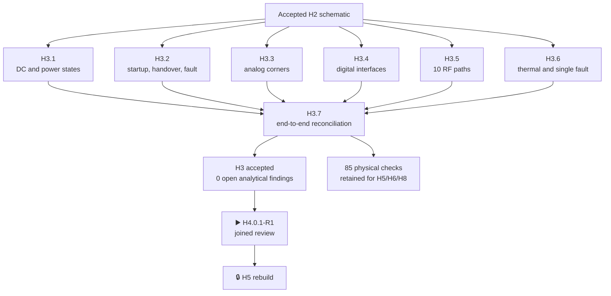

# Historical R1 H3 result · Virtual electrical verification

[Русский](h3-acceptance.ru.md) · [Home](../README.md) ·
[Roadmap](roadmap.md)

> Historical evidence only. This page closes the former single-RP R1 chain; it
> is not current dual-RP R2 authority. The current hardware marker is `H1-R2.32`,
> with R2 H2/H3 still waiting.

**Historical R1 status:** ✅ reviewed and automatically accepted on 26 August 2026. Every electrical check
available before board fabrication is reproducible and analytically closed.
The end-to-end reconciliation has no missing join or hash mismatch, while all
`85` physical-only rows retain their H5/H6/H8 owners and pass rules.

## Verified result

| Phase | Result | Corrections | Open analytical findings |
|---|---|---:|---:|
| `H3.1` | reviewed | 2 | 0 |
| `H3.2` | reviewed | 2 | 0 |
| `H3.3` | reviewed | 14 | 0 |
| `H3.4` | reviewed | 1 | 0 |
| `H3.5` | reviewed | 1 | 0 |
| `H3.6` | reviewed | 4 | 0 |
| `H3.7` | reviewed | 1 | 0 |
| **Total** | **reviewed** | **25** | **0** |

The reviewed scope covers DC budgets and power transitions,
display/audio/IR/battery analog, digital levels/timing/loading, all ten RF
feeds and coexistence, thermal behavior, watchdog, single faults and unattended
operation. Its end-to-end model connects `16` verification requirements, `29`
H3 artifacts, `1,081` H2 instances and `270` root nets with no missing edge.

All `25` corrections are accounted for, including one H3.7 cross-check fix
that was previously absent from the phase table. The known quantity-100 BOM
increase is `1.2814 USD`; no accepted product capability was removed.

## Evidence boundary

Acceptance completes the non-physical H3 scope and makes the corrected
artifacts the baseline. It does **not** authorize purchase, PCB placement or
routing, fabrication, or call any of the `85` physical checks passed. Received
parts, real geometry, routing and prototype evidence remain in H5, H6 and H8.

Firmware F3 remains reviewed historical R1 evidence without promoting non-S3
or physical claims. Its exact S3 QEMU and five-target boundary was joined at
historical `H4.0.1-R1`; neither that join nor the former SA518-derived H4/H5 is
current R2 authority.

## Evidence

- Readable stage summary: [virtual electrical verification](virtual-verification.md).
- Complete traceability: [H3 cross-check](h3-crosscheck.md).
- Physical residuals: [physical evidence register](physical-evidence-register.md).
- Machine package: [`H3-VRF73-acceptance-package.json`](../hardware/verification/generated/H3-VRF73-acceptance-package.json).
