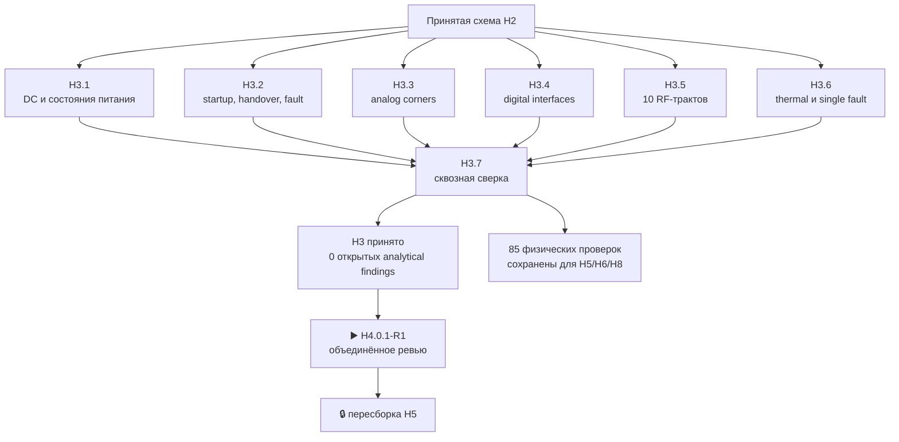

# Исторический итог H3/R1 · Виртуальная электрическая проверка

[English](h3-acceptance.md) · [На главную](../README.ru.md) ·
[Роадмап](roadmap.ru.md)

> Только историческое evidence. Эта страница закрывает прежнюю single-RP цепочку
> R1 и не является authority текущей dual-RP R2. Текущий аппаратный маркер —
> `H1-R2.37`; собственные R2 H2/H3 ещё ожидаются.

**Исторический статус R1:** ✅ проведено ревью и автоматически принято 26 августа 2026 года. Все доступные
до изготовления платы электрические проверки воспроизводимы и аналитически
закрыты. Сквозная сверка не имеет пропусков или hash mismatch, а все `85`
physical-only строк сохраняют владельцев и pass rules H5/H6/H8.

## Проверенный результат

| Фаза | Результат | Исправления | Открытые аналитические findings |
|---|---|---:|---:|
| `H3.1` | закрыт | 2 | 0 |
| `H3.2` | закрыт | 2 | 0 |
| `H3.3` | закрыт | 14 | 0 |
| `H3.4` | закрыт | 1 | 0 |
| `H3.5` | закрыт | 1 | 0 |
| `H3.6` | закрыт | 4 | 0 |
| `H3.7` | закрыт | 1 | 0 |
| **Итого** | **закрыт** | **25** | **0** |

Проверены DC-бюджеты и переходы питания, display/audio/IR/battery analog,
digital levels/timing/loading, все десять RF feed и coexistence, thermal,
watchdog, единичные отказы и длительная работа. Сквозная модель соединяет `16`
verification requirements, `29` H3-artifacts, `1 081` H2 instances и `270`
root nets без пропущенной связи.

Учтены все `25` исправлений, включая одно исправление сквозной сверки H3.7,
которого раньше не было видно в фазовой таблице. Известное увеличение BOM на
количестве 100 — `1.2814 USD`; ни одна принятая возможность продукта не
удалена.

## Граница доказанного

Приёмка завершает нефизическую часть H3 и превращает исправленные artifacts в
baseline. Она **не** разрешает закупку, PCB placement/routing, печать и не
называет пройденной ни одну из `85` физических проверок. Полученные детали,
реальную геометрию, трассировку и прототип закрывают H5, H6 и H8.

Firmware F3 остаётся историческим evidence R1 без повышения non-S3 или
физических claims. Её точное S3 QEMU и five-target boundary было объединено на
историческом `H4.0.1-R1`; ни этот join, ни прежние H4/H5 на основе SA518 не
являются authority текущей R2.

## Evidence

- Понятная сводка этапа: [виртуальная электрическая проверка](virtual-verification.ru.md).
- Полная трассировка: [H3 cross-check](h3-crosscheck.ru.md).
- Физические остатки: [реестр физических проверок](physical-evidence-register.ru.md).
- Машинный пакет: [`H3-VRF73-acceptance-package.json`](../hardware/verification/generated/H3-VRF73-acceptance-package.json).
