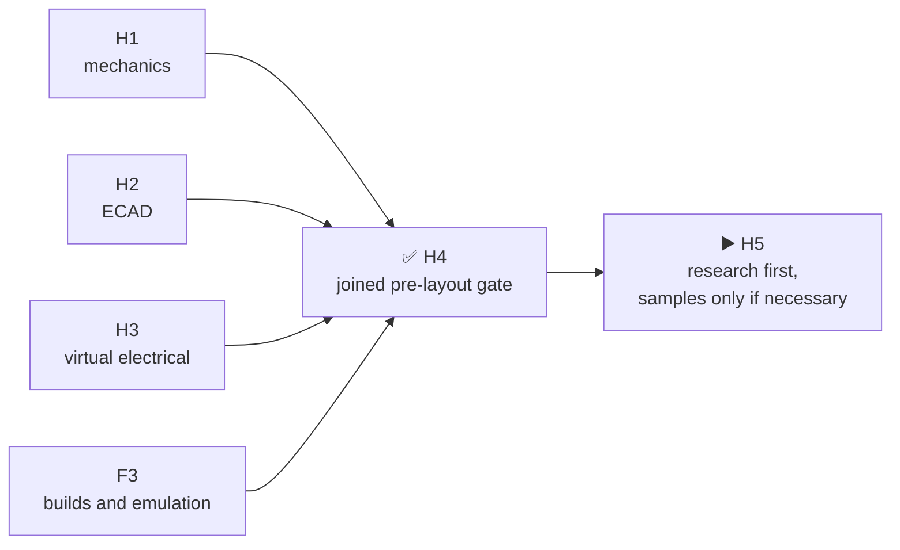

# H4 result · joined pre-layout gate

[Русский](h4-prelayout-gate-report.ru.md) · [Home](../README.md) · [Roadmap](roadmap.md)

H4 was repeated and is closed on the dual-SA818S revision. Accepted H1 mechanics, H2 production ECAD, H3 virtual verification and executable firmware F3 results now form one checkable boundary. The former SA518 join is superseded; no virtually testable contradiction remains open.

| Reviewed boundary | Result |
|---|---:|
| H1 M1 | 80 of 80 assigned; no NC |
| H2 electrical identities / root nets | 1079 / 270 |
| HW↔FW BSP | 5 domains, 125 contacts, byte-identical contract |
| Firmware F3 | 52 reproducible artifacts; 10 memory gates; exact S3 QEMU |
| H3 physical-only registry | 85 rows; H5=9, H6=10, H8=78 |

## What the repeated join proves

| Boundary | Result |
|---|---|
| Two voice modules | `SA818S-V` and `SA818S-U` are independent RF paths with hardware one-hot selection |
| Firmware contract | Five added contacts belong to local hardware logic; the public BSP remains at 125 MCU contacts with no temporary pin assignments |
| F3 evidence | Existing executable results are rejoined only across the unchanged MCU boundary; real voice modules remain a physical gate |

## What H4 does not prove

- None of the 85 physical checks is closed; every H5/H6/H8 owner remains intact.
- Non-S3 boot, real peripherals, RF/antennas, thermal behavior, received-part fit and flash rollback remain physical gates.
- Purchase, PCB placement/routing and fabrication remain unauthorized.

The next exact position is `H5.0.1-R1`: exhaust manufacturer documents and serial alternatives for the nine H5 residuals first. Only evidence that cannot be obtained otherwise may enter a separately cost-approved sample proposal.

Machine evidence: [`H4.1`](../hardware/verification/generated/H4-PLG11-joined-review.json), [`H4.2`](../hardware/verification/generated/H4-PLG12-correction-closure.json), [`H4.3`](../hardware/verification/generated/H4-PLG13-acceptance-package.json).
