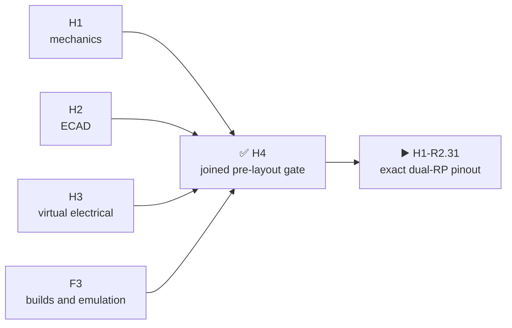

# Historical H4 result · joined R1 pre-layout gate

[Русский](h4-prelayout-gate-report.ru.md) · [Home](../README.md) · [Roadmap](roadmap.md)

This reproducible snapshot closes only the former single-RP R1 architecture. It is retained as evidence and is not an authority or authorization for the current dual-RP H0/H1-R2 design. Current R2 explicitly supersedes this boundary and must repeat its own H2–H4 after exact pinout closure.

| Reviewed boundary | Result |
|---|---:|
| H1 M1 | 80 of 80 assigned; no NC |
| H2 electrical identities / root nets | 1079 / 270 |
| HW↔FW BSP | 5 domains, 125 contacts, semantically identical contract; firmware copy is fail-closed historical R1 |
| Firmware F3 | 52 reproducible artifacts; 10 memory gates; exact S3 QEMU |
| H3 physical-only registry | 85 rows; H5=9, H6=10, H8=78 |

## What the historical join proves

| Boundary | Result |
|---|---|
| Two voice modules | `SA818S-V` and `SA818S-U` are independent RF paths with hardware one-hot selection |
| Firmware contract | Five added contacts belong to local hardware logic; the public BSP remains at 125 MCU contacts with no temporary pin assignments |
| F3 evidence | Existing executable results are rejoined only across the unchanged MCU boundary; real voice modules remain a physical gate |

## What historical H4 does not prove

- None of the 85 physical checks is closed; every H5/H6/H8 owner remains intact.
- Non-S3 boot, real peripherals, RF/antennas, thermal behavior, received-part fit and flash rollback remain physical gates.
- It does not describe dual-RP R2, `U219`, the current C5 SDIO/USB mux or the new exact pinout.
- Purchase, PCB placement/routing and fabrication remain unauthorized.

The current project position is `H1-R2.35`: the exact `H1-R2.31` dual-RP GPIO/M1 and C5 SDIO/USB mux baseline plus the complete current Cap/evidence body register are closed. The new R2 H2 remains closed until the physical H1 blockers and all production gates close. The former transition to `H5.0.1-R1` was cancelled by the architecture change.

Machine evidence: [`H4.1`](../hardware/verification/generated/H4-PLG11-joined-review.json), [`H4.2`](../hardware/verification/generated/H4-PLG12-correction-closure.json), [`H4.3`](../hardware/verification/generated/H4-PLG13-acceptance-package.json).
