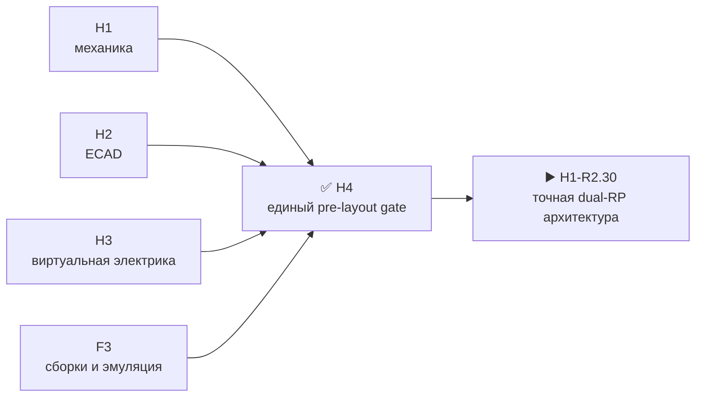

# Исторический итог H4 · объединённый pre-layout gate R1

[English](h4-prelayout-gate-report.md) · [На главную](../README.ru.md) · [Роадмап](roadmap.ru.md)

Этот воспроизводимый снимок закрывает только прежнюю одно-RP архитектуру R1. Он сохранён как evidence и не является разрешением или исходником для текущего dual-RP H0/H1-R2. Текущий R2 явно заменяет эту границу и должен повторно пройти собственные H2–H4 после завершения точной распиновки.

| Проверенная граница | Результат |
|---|---:|
| H1 M1 | 80 из 80 назначены; NC нет |
| H2 electrical identities / root nets | 1079 / 270 |
| HW↔FW BSP | 5 доменов, 125 контактов, семантически одинаковый контракт; firmware-копия fail-closed historical R1 |
| Firmware F3 | 52 воспроизводимых artifacts; 10 memory gates; точный QEMU для S3 |
| H3 physical-only registry | 85 строк; H5=9, H6=10, H8=78 |

## Что доказано историческим join

| Граница | Результат |
|---|---|
| Два voice-модуля | `SA818S-V` и `SA818S-U` присутствуют как независимые RF-тракты с аппаратным one-hot выбором |
| Контракт прошивки | Дополнительные пять контактов принадлежат локальной аппаратной логике; публичный BSP сохраняет 125 MCU-контактов и не получает временных pin assignments |
| Evidence F3 | Старые executable results повторно связаны только с неизменившейся MCU-границей; реальные voice-модули остаются физическим gate |

## Что исторический H4 не доказывает

- Не закрывает ни одну из 85 физических проверок: их владельцы H5/H6/H8 сохранены.
- Не доказывает boot четырёх non-S3 target, реальные peripherals, RF/антенны, тепловой режим, механический fit полученных деталей или flash rollback.
- Не описывает dual-RP R2, `U219`, текущий C5 SDIO/USB mux или новую точную распиновку.
- Не разрешает закупку, PCB placement/routing или fabrication.

Текущая позиция проекта — `H1-R2.30`: закрыть точные dual-RP GPIO/M1 и C5 SDIO/USB mux, затем строить новый R2 H2. Старый переход к `H5.0.1-R1` отменён сменой архитектуры.

Машинные evidence: [`H4.1`](../hardware/verification/generated/H4-PLG11-joined-review.json), [`H4.2`](../hardware/verification/generated/H4-PLG12-correction-closure.json), [`H4.3`](../hardware/verification/generated/H4-PLG13-acceptance-package.json).
