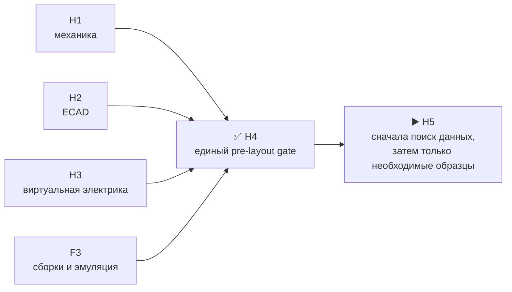

# Итог H4 · объединённый pre-layout gate

[English](h4-prelayout-gate-report.md) · [На главную](../README.ru.md) · [Роадмап](roadmap.ru.md)

H4 проведён и закрыт. Принятая механика H1, production ECAD H2, виртуальные проверки H3 и исполнимые результаты firmware F3 сведены в одну проверяемую границу. После исправления трёх документальных несоответствий открытых виртуально проверяемых противоречий нет.

| Проверенная граница | Результат |
|---|---:|
| H1 M1 | 80 из 80 назначены; NC нет |
| H2 electrical identities / root nets | 1 046 / 268 |
| HW↔FW BSP | 5 доменов, 125 контактов, побайтно одинаковый контракт |
| Firmware F3 | 52 воспроизводимых artifacts; 10 memory gates; точный QEMU для S3 |
| H3 physical-only registry | 85 строк; H5=9, H6=9, H8=78 |

## Что исправлено

| Finding | Исправление | Влияние |
|---|---|---|
| `H4-JOIN-001` | Удалено устаревшее утверждение о четырёх NC M1; источник и производные artifacts перегенерированы | Нет изменения распиновки, схемы или BOM |
| `H4-JOIN-002` | Публичные итоговые счётчики H2 привязаны к текущим machine artifacts | Только документация и traceability |
| `H4-JOIN-003` | Публичный счётчик intentional NC обновлён с 189 до текущих 191 | Только документация и traceability |

## Что H4 не доказывает

- Не закрывает ни одну из 85 физических проверок: их владельцы H5/H6/H8 сохранены.
- Не доказывает boot четырёх non-S3 target, реальные peripherals, RF/антенны, тепловой режим, механический fit полученных деталей или flash rollback.
- Не разрешает закупку, PCB placement/routing или fabrication.

Следующая точная позиция — `H5.0.1`: сначала исчерпать документацию, производителя и серийные замены для девяти H5 residuals; закупка появится только для того, что нельзя доказать иначе, и потребует отдельного одобрения стоимости.

Машинные evidence: [`H4.1`](../hardware/verification/generated/H4-PLG11-joined-review.json), [`H4.2`](../hardware/verification/generated/H4-PLG12-correction-closure.json), [`H4.3`](../hardware/verification/generated/H4-PLG13-acceptance-package.json).
