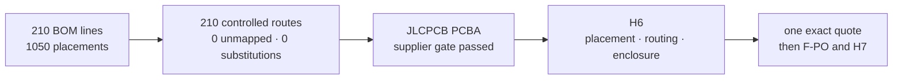

# H5-R1 global result · components and factory route

[Русский](h5-r1-acceptance.ru.md) · [Home](../README.md) · [Roadmap](roadmap.md) · [Stage results](stage-results.md#h5)

**H5-R1 is reviewed.** Every current BOM line has one controlled production, external owner-assembly or user-supplied route. JLCPCB confirmed exact `SA818S-U/V` placement at separate designators and no silent substitution. The owner accepted deterministic post-PCBA installation of the display, five microcoax jumpers, knob and enclosure, so full-device box build is no longer a release gate.

## Result at a glance

| Reviewed evidence | Result |
|---|---:|
| BOM lines / fitted placements | 210 / 1,050 |
| Routes `J0 / J2 / J3 / J4-F / J4-P / J5-U` | 165 / 29 / 10 / 4 / 1 / 1 |
| Unmapped lines / substitutions | 0 / 0 |
| Integrated owner-kit article lines | 33 |
| H7/H8 measurement contracts | 12 |
| Known conservative material budget | $267.91 |
| Supplier-gate blockers | 0 |

The four-board-corner stack keeps the Div-like **four long plastic screw** concept. Four exact unthreaded polyamide `Ettinger 007.02.611` sleeves set the 11.00-mm board gap; enclosure capture lips and anti-shear datums carry side load. The exact screw family is qualified, while H6 selects its length after both enclosure walls are dimensioned.

## What remains, with exact owners

- **H6:** placement/routing, routed electrical/RF/mechanical re-analysis, enclosure wall thickness, exact nylon screw length, Gerber/BOM/CPL and the resulting two-PCBA MOQ quote.
- **Immediately before the one order:** final `SA818S-V` pre-order charge/lead and a live stock/price recheck of every selected production MPN.
- **H7 owner assembly:** display/FPC dry fit and powered image/backlight/touch check before irreversible PSA bonding, careful five-jumper microcoax installation, knob and enclosure closure.

None of these is an unresolved H5 identity or factory-route problem. PCBWay's pending reply remains an optional cost/convenience comparison. No purchase, reservation, sourcing request or fabrication was authorized.

[Machine acceptance package](../hardware/verification/generated/H5-R1-acceptance-package.json) · [article manifest](component-sample-basket.md) · [factory map](manufacturing-platform.md).
