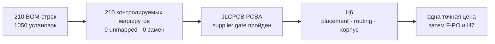

# Глобальный итог H5-R1 · компоненты и фабричный маршрут

[English](h5-r1-acceptance.md) · [Главная](../README.ru.md) · [Роадмап](roadmap.ru.md) · [Результаты этапов](stage-results.ru.md#h5)

**H5-R1 проведён ревью.** У каждой текущей BOM-строки есть один контролируемый production-, внешний owner-assembly- или user-supplied-маршрут. JLCPCB подтвердил установку exact `SA818S-U/V` на отдельных designator и запрет молчаливой замены. Владелец принял детерминированную post-PCBA установку дисплея, пяти microcoax, ручки и корпуса, поэтому полный box build больше не является release gate.

## Результат кратко

| Проверенное evidence | Результат |
|---|---:|
| BOM-строк / устанавливаемых позиций | 210 / 1 050 |
| Маршруты `J0 / J2 / J3 / J4-F / J4-P / J5-U` | 165 / 29 / 10 / 4 / 1 / 1 |
| Неназначенных строк / замен | 0 / 0 |
| Строк единого owner-комплекта | 33 |
| Контрактов измерений H7/H8 | 12 |
| Известный консервативный material budget | $267.91 |
| Блокеров supplier gate | 0 |

Четыре угла sandwich сохраняют Div-подобную идею **четырёх длинных пластиковых винтов**. Четыре точные проходные полиамидные втулки `Ettinger 007.02.611` задают межплатные 11,00 мм; боковую нагрузку несут capture lips и anti-shear datums корпуса. Семейство винтов квалифицировано, а точную длину H6 выбирает после размеров обеих стенок корпуса.

## Что осталось и кому назначено

- **H6:** placement/routing, повторный routed-анализ электричества/RF/механики, толщина стенок корпуса, точная длина nylon-винтов, Gerber/BOM/CPL и получаемая по ним цена двух PCBA при MOQ.
- **Непосредственно перед единственным заказом:** финальные charge/lead pre-order `SA818S-V` и live-перепроверка stock/price каждого выбранного production MPN.
- **Owner assembly в H7:** сухая примерка дисплея/FPC и проверка изображения/подсветки/touch до необратимой наклейки PSA, аккуратная установка пяти microcoax, ручки и корпуса.

Ни один из этих пунктов не является нерешённой проблемой identity или фабричного маршрута H5. Ожидаемый ответ PCBWay остаётся optional-сравнением цены/удобства. Закупка, reservation, sourcing request и fabrication не разрешались.

[Машинный пакет приёмки](../hardware/verification/generated/H5-R1-acceptance-package.json) · [article manifest](component-sample-basket.ru.md) · [фабричная карта](manufacturing-platform.ru.md).
