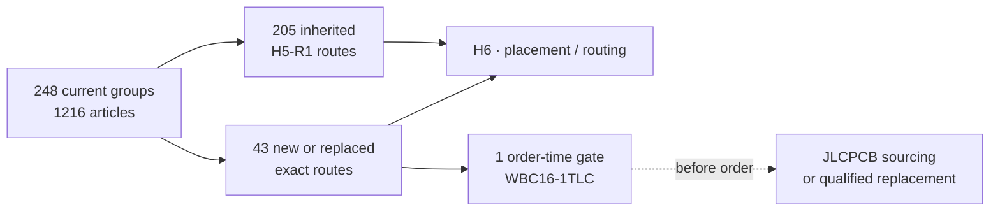

# H5-R2 global result · current component route

**H5-R2.1 is reviewed.** The current R2 surface contains **248 purchasable groups / 1216 articles**: 205 routes inherit the complete H5-R1 audit and 43 are current H2 additions or replacements. No group is unmapped.

## What changed

- The cost report and H5 now consume the same native R2 inventory instead of the historical 210-line BOM.
- The 2026-09-08 recomposition includes exact [RUN/KILL SA](../hardware/procurement/h6-js102011saqn-selection-review.json), [IR TR](../hardware/procurement/h6-tsmp95000tr-candidate-review.json) and [audio SJ43515TS](../hardware/procurement/h6-sj43515ts-selection-review.json) replacements. IR and audio use explicit preorder, not allocated assembly stock. This date does not renew the other retained availability/price snapshots.
- The 2026-09-09 unification combines four USB-C ports into one GCT USB4105-GF-A group: the [fresh C3020560 route](../hardware/verification/jlcpcb-usb-unification-2026-09-09.json) is pre-order, minimum 9 pieces for approximately $9.59 while four are fitted. This is a separate current purchase snapshot; the retained historical quantity-100 planning price is not a quote for the single prototype.
- Corrected known electronics are **$311.39**; known external antennas are **$138.32**; combined they are **$449.70** before PCB, assembly, enclosure, delivery and 5 unpriced component groups / 2 unpriced antenna groups.
- `WBC16-1TLC` remains the exact schematic part but JLCPCB live stock is now zero. `H3-TC16-161T+` is a mass-market candidate, but it does not enter the BOM without pin-map, RF and exact factory-route qualification.

## Boundary

H6 may continue placement with the accepted `WBC16-1TLC` footprint. Order release remains fail-closed until a confirmed JLCPCB sourcing/private-library route or a fully qualified replacement exists. Silent substitution is forbidden.

[Machine result](../hardware/verification/generated/H5-R2-current-route-revalidation.json) · [current cost top 20](h1-r2-cost.md)
