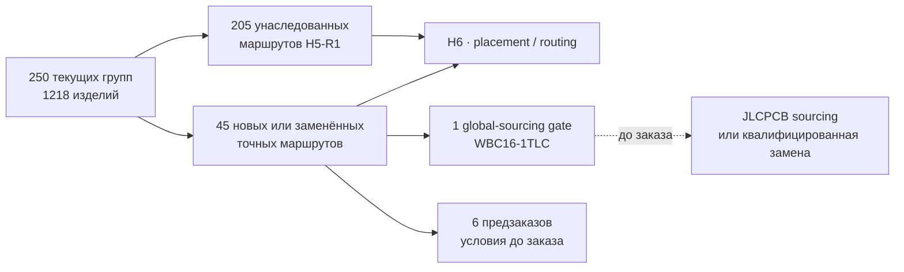

# Глобальный итог H5-R2 · актуальный маршрут компонентов

**H5-R2.1 проведён ревью.** Текущая R2-поверхность содержит **250 закупаемых групп / 1218 изделий**: 205 маршрутов унаследованы из полного H5-R1-аудита, ещё 45 добавлены или заменены текущим H2. Непривязанных групп нет.

## Что изменилось

- Стоимостной отчёт и H5 теперь используют один и тот же native R2 inventory, а не исторический 210-строчный BOM.
- Пересборка 2026-09-08 включает точные замены [RUN/KILL SA](../hardware/procurement/h6-js102011saqn-selection-review.json), [ИК TR](../hardware/procurement/h6-tsmp95000tr-candidate-review.json) и [аудио SJ43515TS](../hardware/procurement/h6-sj43515ts-selection-review.json). ИК и аудио имеют явный предзаказ, не готовый склад сборки. Эта дата не обновляет автоматически остальные старые снимки наличия и цен.
- Унификация 2026-09-09 объединяет четыре USB-C в один GCT USB4105-GF-A: [свежий маршрут C3020560](../hardware/verification/jlcpcb-usb-unification-2026-09-09.json) — предзаказ, минимум 9 штук примерно за $9.59 при четырёх устанавливаемых. Это отдельный текущий закупочный снимок; историческая цена серии при 100 штуках в плановом бюджете не превращается в цену единственного прототипа.
- C5 ECO от 2026-09-14 добавляет точные TS3USB221ERSER / C129313 (1 шт.), SN74LV20APWR / C2862070 (2 шт.) и NX3008NBKS,115 / C396098 (3 шт.). Первые и третьи имеют сохранённые снимки наличия и Standard PCBA; NAND — **нулевой склад, явный предзаказ MOQ 21**, оценка $0.4265/шт. и $8.9565 за минимум, не цена двух установленных деталей. Срок, окончательная цена и выделение партии NAND ещё не подтверждены. Все три снимка взяты из [реестра деталей](../hardware/architecture/devices.json), с сохранением точного времени проверки; нового запроса фабрике генератор не делает.
- Исправленная известная база электроники: **$312.04**; известные внешние антенны: **$138.32**; вместе **$450.35** до платы, сборки, корпуса, доставки и ещё 5 групп компонентов / 2 групп антенн без цены.
- `WBC16-1TLC` остаётся точной схемной деталью, но склад JLCPCB сейчас нулевой. `H3-TC16-161T+` найден как массовый кандидат, однако не войдёт в BOM без проверки pin map, RF-параметров и точного factory route.

## Граница

H6 может продолжать компоновку с принятыми footprint. Заказ остаётся fail-closed до подтверждённого JLCPCB sourcing/private-library маршрута `WBC16-1TLC` либо полностью квалифицированной замены, а также подтверждения MOQ, окончательной цены, срока и выделения партии для всех 6 предзаказов, включая NAND. Наличие всех точных деталей повторно проверяется перед заказом. Молчаливая замена запрещена.

[Машинный результат](../hardware/verification/generated/H5-R2-current-route-revalidation.json) · [актуальный топ-20 стоимости](h1-r2-cost.ru.md)
