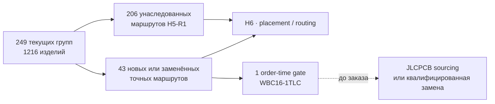

# Глобальный итог H5-R2 · актуальный маршрут компонентов

**H5-R2.1 проведён ревью.** Текущая R2-поверхность содержит **249 закупаемых групп / 1216 изделий**: 206 маршрутов унаследованы из полного H5-R1-аудита, ещё 43 добавлены или заменены текущим H2. Непривязанных групп нет.

## Что изменилось

- Стоимостной отчёт и H5 теперь используют один и тот же native R2 inventory, а не исторический 210-строчный BOM.
- Пересборка 2026-09-08 включает точные замены [RUN/KILL SA](../hardware/procurement/h6-js102011saqn-selection-review.json), [ИК TR](../hardware/procurement/h6-tsmp95000tr-candidate-review.json) и [аудио SJ43515TS](../hardware/procurement/h6-sj43515ts-selection-review.json). ИК и аудио имеют явный предзаказ, не готовый склад сборки. Эта дата не обновляет автоматически остальные старые снимки наличия и цен.
- Исправленная известная база электроники: **$312.04**; известные внешние антенны: **$138.32**; вместе **$450.35** до платы, сборки, корпуса, доставки и ещё 5 групп компонентов / 2 групп антенн без цены.
- `WBC16-1TLC` остаётся точной схемной деталью, но склад JLCPCB сейчас нулевой. `H3-TC16-161T+` найден как массовый кандидат, однако не войдёт в BOM без проверки pin map, RF-параметров и точного factory route.

## Граница

H6 может продолжать компоновку с принятым footprint `WBC16-1TLC`. Заказ остаётся fail-closed до подтверждённого JLCPCB sourcing/private-library маршрута либо полностью квалифицированной замены. Молчаливая замена запрещена.

[Машинный результат](../hardware/verification/generated/H5-R2-current-route-revalidation.json) · [актуальный топ-20 стоимости](h1-r2-cost.ru.md)
