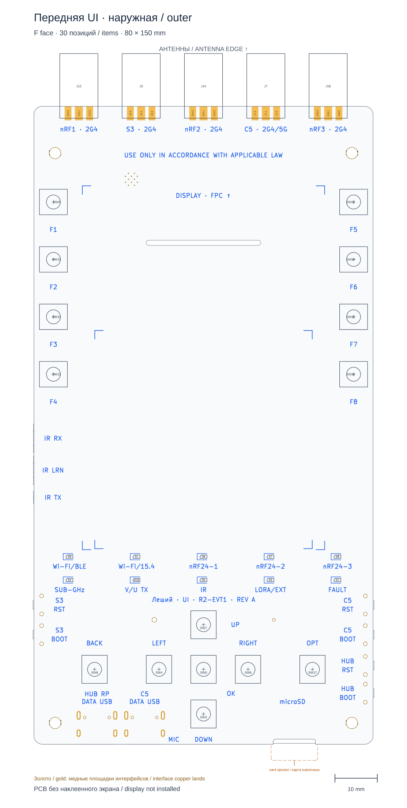
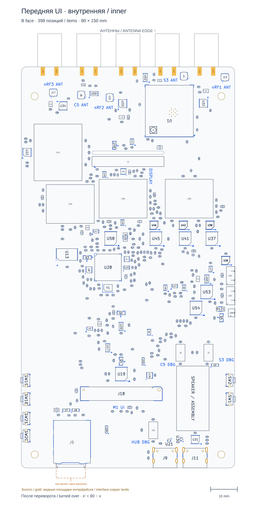

# Компоненты обеих плат · четыре стороны

[Главная](../README.ru.md) · [Находки ревью](h6-r2-interface-review.ru.md) · [English](h6-r2-component-views.md)

Прямые виды текущих KiCad PCB, **в одном масштабе**, без дорожек и линий
неразведённых соединений. Нажмите на нужный вид, чтобы открыть полный SVG
и увеличить мелкие компоненты без потери качества.

| Передняя/UI-плата | Задняя/RF-плата |
| --- | --- |
| **Наружная F — 30 позиций + 4 крепёжных footprint** | **Наружная F — 16 позиций + 4 крепёжных footprint** |
| [](images/h6-r2-components-ui-outer.svg) | [](images/h6-r2-components-rf-outer.svg) |
| **Внутренняя B — 398 позиций** | **Внутренняя B — 764 позиции** |
| [](images/h6-r2-components-ui-inner.svg) | [](images/h6-r2-components-rf-inner.svg) |

[Все четыре вида на одном листе](images/h6-r2-components-overview.svg).

## Как читать

- Серый — контуры текущих корпусов из Fab и обозначения компонентов.
  Добавленные для проверки обозначения **не являются новой шелкографией**.
- Синий — фактическая шелкография выбранной стороны PCB.
  Подписи антенн приближены к разъёмам; ниже расположена единственная фраза
  об использовании в соответствии с законом: английская на UI, русская на RF.
- Охра — отверстия и пунктирный резерв NFC L32. **Петля ещё не разведена**.
- Золотистая заливка — **все 50 реальных медных площадок пайки SMA**:
  по три на F и две на B у каждого разъёма, непосредственно из нативной PCB.
  Мелкие подписи обозначают разъём и номер площадки. Это пояснения к рисунку,
  не новая шелкография; заливка не изображает объём припоя или окна пасты/маски.
  Нижние площадки видны, хотя корпус footprint SMA относится к стороне F.
  Тем же цветом с обеих сторон показаны **37 сквозных площадок интерфейсов**
  (16 креплений USB, 14 Cap, 7 энкодера), а также **два вывода NFC L32** —
  это не ножки компонентов и не разведённая антенна. Внутри площадок видны
  настоящие отверстия. Массивы тепловых переходных отверстий в этот ограниченный
  слой интерфейсов не входят; цвет не подтверждает качество паяного соединения.
- Внутренний вид показан после переворота платы вокруг вертикальной оси:
  `x′ = 80 − x`, антенны остаются сверху. Это виды каждой платы отдельно,
  не единая система координат собранного устройства.
- Выступы деталей с противоположной стороны показаны только за контуром
  платы, бледнее. Это контекст размещения, не расчёт видимости в 3D.

Показаны все **1208 позиций** текущего нативного инвентаря и 8 крепёжных
footprint. Экран, аккумуляторы, внешние антенны, свободные кабели и корпус
не дорисованы: это виды PCB до окончательной сборки. Большая область на UI
— место наклейки дисплея; на RF — текущий контур держателя без аккумуляторов.

**Открытые механические вопросы остаются открытыми.** В частности, этот
лист не подтверждает геометрию держателя или доступ инструмента для пайки и не
подменяет [открытые находки](h6-r2-interface-review.ru.md) проверкой готовности.
Геометрия Fab не является подтверждённой 3D-моделью каждого компонента.

## Проверка мест пайки SMA

[Нативный отчёт по площадкам и соседям](../hardware/layout/generated/H6-R2-sma-solder-access-audit.json)
проверяет обе платы, отдельно учитывая медь площадок, контуры Fab и монтажные
зоны соседних деталей. Для поиска тесных мест используется предварительное
прямоугольное расширение габарита каждой площадки **на 1 мм по каждой оси**:
это инженерный фильтр для ревью,
не требование фабрики и не модель конкретного жала. Попадание в этот запас
не означает пересечения деталей или короткого замыкания. Доступ инструмента,
нагрев и осмотр швов всё ещё требуют проверки; прежние «окна пайки» проверяли
только число разъёмов и их шаг.

<!-- SMA-SOLDER-ACCESS:BEGIN -->

Текущий результат: **50 площадок**, 0 пересечений/касаний чужих медных площадок, 0 пересечений имеющихся Fab-габаритов и 0 пересечений монтажных зон. Предварительный запас выделил **0 площадок для ревью**.

Расстояния до монтажной зоны — **не до физического корпуса**; полные отдельные измерения меди и Fab находятся в отчёте. Это список для проверки доступа к пайке, не список коротких замыканий. `status: no_candidates_in_screened_scope`; `solder_process_qualified: false`.

<!-- SMA-SOLDER-ACCESS:END -->

## Актуальность

Хеши обеих исходных PCB, генератора и пяти SVG находятся в
[снимке визуализации](../hardware/layout/generated/H6-R2-component-views.json).
Генерация не изменяет PCB. Обычная команда обновления изображений разводки
теперь обновляет и разводку, и эти пять SVG с компонентами:

```sh
python3 hardware/layout/h6_r2_routing_render.py --write
python3 hardware/layout/h6_r2_routing_render.py --check
```

Общая проверка завершается ошибкой, если устарела любая группа изображений.
Она включена в архитектурные регрессии, в том числе CI. После изменения PCB
обновляйте виды перед публикацией контрольного среза; это не фоновое наблюдение
за открытым редактором.

Отдельные команды `h6_r2_component_render.py --write/--check` тоже сохранены.
Для отдельной генерации нужны Python из KiCad (`pcbnew`) и KiCad CLI;
для проверки достаточно обычного Python.

Для отчёта по зазорам SMA и его таблиц есть отдельная нативная команда:
`python3 hardware/layout/h6_r2_sma_solder_access.py --write` из Python с
`pcbnew`, затем `--check` для повторного расчёта и сравнения. После изменений
PCB обновляются и изображения, и этот отчёт; регрессии отвергают устаревшие
хеши источников или таблицы. Сама PCB этими командами не изменяется.
