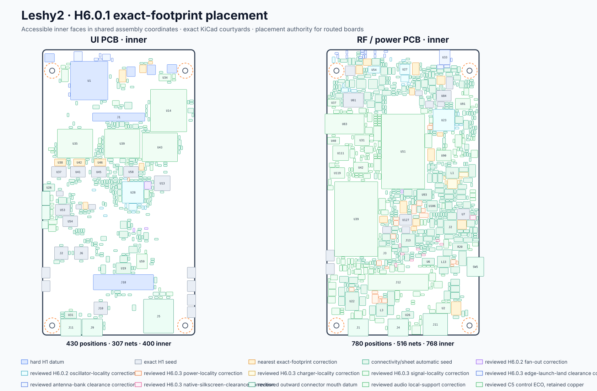

# H6.0.1-R1 · Размещение точных footprints

[Главная](../README.ru.md) · [Роадмап](roadmap.ru.md) · [English](h6-r2-exact-placement.md)

**Статус:** ✅ нативный PCB-срез размещения H6.0.1 воспроизводим и не содержит
коллизий. [Механический стек](h6-r2-mechanical-stack.ru.md) и
[закрытие сервиса microcoax](h6-r2-microcoax-service.ru.md) теперь завершают
H6.0.1. **Сейчас выполняется повторная квалификация трассировки H6.0.3 на базе 80 × 150 мм.** Результат
не разрешает изготовление или закупку.



## Что теперь существует

- две нативные шестислойные платы KiCad 10 рядом с проведёнными ревью схемами
  H2: [UI-плата](../hardware/ecad/kicad/LESHY2-UI-R2/LESHY2-UI-R2.kicad_pcb)
  и [RF/power-плата](../hardware/ecad/kicad/LESHY2-RF-R2/LESHY2-RF-R2.kicad_pcb);
- все **1 208/1 208** установленных экземпляров из схемы размещены с выбранными
  KiCad-footprints: 428 на UI и 780 на RF/power;
- все **789** глобальных канонических / **823** локальных для плат сети H2 назначены реальным контактам footprints;
- на каждой плате есть четыре оси M2.5-упоров, скруглённый контур 80 × 150 мм,
  а на UI — точное ложе экрана, направляющая готового квадрата PSA и прорезь
  ненатянутого шлейфа;
- текущий антенный ряд 5+5 и пользовательская шелкография экрана/плат уже
  находятся в нативных платах;
- генератор нетрассированного seed, машинный контракт, аудит размещения с
  хешами и точная **заморозка 1 208 якорей**, не позволяющая локальной
  трассировочной коррекции переупаковать остальные компоненты.

[Машинный аудит](../hardware/layout/generated/H6-R2-placement-audit.json)
показывает ноль жёстких courtyard-коллизий, ноль потерянных экземпляров и ноль
ошибок отображения net/footprint. Повторная генерация нетрассированного seed
совпадает байт-в-байт. Обычный `--check` теперь использует независимую от
трассировки сигнатуру: footprints, привязка pad/net, настройки, ограничения и
геометрия платы обязаны совпадать, а дорожки, переходные отверстия и медные
заливки сохраняются и не участвуют в сравнении. Намеренно разрушительный режим
`--write` оставлен только для пересборки чистого нетрассированного seed. KiCad 10
разбирает обе платы и экспортирует из них placement-файлы.

В freeze также вошли проверенные локальные коррекции H6.0.2 и новая 80-мм база
H6.0.3: `R59` сдвинут,
чтобы освободить fan-out выводов 2/3 U12 со стороны энкодера, а `R109` — чтобы
освободить вывод 7 U12 ветви service-USB C5. Все остальные якоря остались точно
на принятых местах; повторная генерация всё так же даёт 1 208/1 208 позиций и
ноль жёстких коллизий.

## Что исправили после загрузки точных footprints

H1 был проведённой ревью физической моделью корпусов, но не обещал, что каждый
условный прямоугольник уже равен KiCad-courtyard. Точные производственные
footprints выявили и закрыли четыре реальные проблемы:

1. центры обоих рядов по пять антенн стали симметричными:
   **14,00 / 25,75 / 37,50 / 49,25 / 61,00 мм**; верхние зоны головок винтов
   свободны, все RF-тракты остались на своей плате;
2. весь комплект экран–прорезь–ZIF сдвинут на 8,50 мм от точных courtyard SMA;
   взаимная геометрия и минимум 5 мм ненатянутого запаса шлейфа сохранены;
3. боковые функциональные кнопки повёрнуты на 90°, шаг D-pad увеличен до
   10,5 мм — точные OMRON B3S не пересекаются друг с другом и экраном;
4. посадочное место энкодера повёрнуто на 90° вокруг прежней пользовательской
   оси ручки и оставляет 0,91 мм до courtyard держателя аккумуляторов.

Это корректировки производственных footprints, а не функций устройства.

## Кандидат stackup и закрытие H6.0.1

Текущий фабричный калькулятор называет стандартным/рекомендованным заказной
вариант 1,6 мм [`JLC06161H-3313`](https://jlcpcb.com/pcb-impedance-calculator/)
с расчётной готовой толщиной 1,54 мм ±10 %: внешняя медь 0,035 мм,
внутренняя 0,0152 мм, внешние препреги 3313 по 0,0994 мм, центральный 2116
0,1088 мм и два core по 0,55 мм. Геометрия внешних контролируемых трасс уже
зафиксирована в политике трассировки; перед заказом калькулятор проверяется ещё раз.

[Срез механического стека](h6-r2-mechanical-stack.ru.md) уже фиксирует краевые
захваты корпуса, четыре pilot-datum, опорные стенки и точную геометрию
20-мм нейлонового винта с захваченной гайкой. В худшем углу допусков в гайке
остаётся 2,18 мм резьбы, кончик винта спрятан, а M1 не несёт механической
нагрузки. [Пять ненатянутых коридоров сервисных петель microcoax](h6-r2-microcoax-service.ru.md),
позиции фиксации и зазоры корпуса/окон осмотра теперь проверены машинно. Они
закрывают H6.0.1 и разрешают трассировку H6.0.2 без изменения размещения;
H6.0.2 принимает DRC без findings с паритетом схема↔PCB.

## Воспроизведение

Команда для встроенного Python KiCad:

```bash
/Applications/KiCad/KiCad.app/Contents/Frameworks/Python.framework/Versions/3.9/bin/python3 hardware/layout/h6_r2_placement.py --check
/Applications/KiCad/KiCad.app/Contents/Frameworks/Python.framework/Versions/3.9/bin/python3 hardware/layout/h6_r2_placement_freeze.py --check
```

Ожидаемый результат:

```text
H6-R2 placement pass: 1208/1208 positions; 0 hard conflicts; 0 unplaced
H6-R2 placement freeze pass: 1208 exact anchors
```

Эта проверка безопасна и для уже разведённой платы. После начала трассировки
нельзя запускать `--write`: он намеренно заменяет каждую PCB проверенным
нетрассированным seed.
