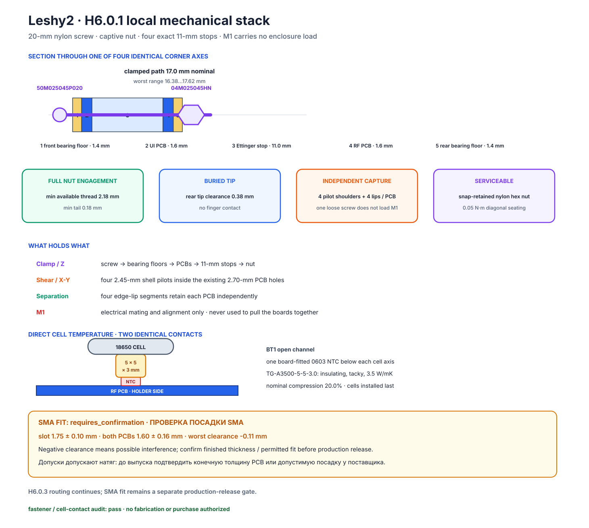

# H6.0.1-R1 · Механический стек и разгрузка M1

[Главная](../README.ru.md) · [Роадмап](roadmap.ru.md) · [English](h6-r2-mechanical-stack.md) · [Точное размещение](h6-r2-exact-placement.ru.md)

**Статус:** ✅ локальная геометрия винта, упора, опор корпуса и независимых захватов PCB зафиксирована и проверена машинно. **H6.0.1 остаётся в работе** до фиксации пяти сервисных петель microcoax и зазоров корпуса/окон осмотра. Трассировка, закупка и производство не разрешены.



## Результат

Четыре существующие оси M2.5 теперь используют один точный обслуживаемый стек:

- четыре проходных полиамидных упора `Ettinger 007.02.611` задают зазор между PCB **11,00 мм**;
- четыре полностью резьбовых винта `Essentra 50M025045P020` из nylon 6/6 имеют длину **20,00 мм под головкой**;
- четыре шестигранные гайки M2.5 `Essentra 04M025045HN` из nylon 6/6 защёлкиваются в не допускающие вращения карманы задней половины корпуса;
- обе половины корпуса дают локальную опорную толщину **1,40 мм** и опорные кольца 7,00 мм внутри уже существующих PCB-keepout диаметром 8,00 мм;
- четыре плечика корпуса диаметром 2,45 мм позиционируют каждую PCB в существующих отверстиях 2,70 мм, а четыре коротких краевых зацепа независимо удерживают каждую плату.

M1 не работает стяжкой, упором или штифтом на сдвиг. При сборке сначала усаживаются обе платы и все четыре точных упора, M1 соединяется параллельной оснасткой, и только затем винты затягиваются по диагонали до малого установочного момента **0,05 Н·м**. Предел **0,09 Н·м** — консервативный потолок для нейлонового крепежа, а не команда добавлять преднатяг после касания упоров.

## Худший стек допусков

[Машинный аудит](../hardware/layout/generated/H6-R2-mechanical-stack-audit.json) одновременно перебирает допуски опор корпуса, обеих PCB, упора, винта и гайки:

| Величина | Результат |
|---|---:|
| Путь под головкой, номинал | 17,00 мм |
| Полный диапазон пути под головкой | 16,38…17,62 мм |
| Резьба, доступная в гайке, худший минимум | 2,18 мм |
| Хвост после гайки 2,00 мм, худший минимум | 0,18 мм |
| Хвост после гайки 1,80 мм, худший максимум | 2,02 мм |
| Зазор кончика винта до задней внешней поверхности, худший минимум | 0,38 мм |
| Диаметральный зазор плечика в отверстии, худший минимум | 0,15 мм |

Поэтому короткий винт при самом толстом стеке полностью проходит консервативную гайку 2,00 мм, а длинный винт при самом тонком стеке остаётся внутри заднего кармана глубиной 4,20 мм.

## Если один винт ослаблен

Один винт, отпущенный на шаг резьбы, не перекладывает работу корпуса на M1:

1. остальные три винта всё ещё стягивают sandwich через четыре упора;
2. четыре плечика каждой половины корпуса принимают сдвиг PCB в плоскости;
3. четыре краевых зацепа на каждую PCB не дают соответствующей плате выйти из своей посадки;
4. захваченные задние гайки не вращаются и не выпадают в электронику при обычном обслуживании.

Это запас прочности конструкцией для единственного хобби-прототипа. Проект не придумывает ненужные drop-, vibration- или prescribed-cycle испытания.

## Поставка и входной контроль

Это устанавливаемые владельцем части корпуса, а не позиции JLCPCB PCBA. Точный винт активен и доступен у дистрибьютора; длину 20,00 мм, диаметр головки 5,00 мм и высоту 2,10 мм публикует [DigiKey](https://www.digikey.com/en/products/detail/essentra-components/50M025045P020/11637969). Точную гайку, размер под ключ 5,00 мм и текущую высоту 2,00 мм публикует [Essentra](https://www.essentracomponents.com/en-gb/p/standard-hex-nuts-plastic/04m025045hn?indexed=true); аудит намеренно допускает как второй угол каталоговую/дистрибьюторскую высоту 1,80 мм. Выбранный 11-мм упор прослеживается по [точной карточке Bürklin](https://www.buerklin.com/en/p/ettinger/spacer-bolts/007-02-611/18H0210/).

Перед финальной сборкой четыре винта, гайки и упора измеряются по окнам входного контроля из [исходного контракта](../hardware/layout/h6-r2-mechanical-stack.json). Выходящая за окно деталь отбраковывается; PCB или корпус под неё молча не переделываются.

## Что осталось в H6.0.1

Следующий срез заменяет старые иллюстративные линии кабелей пятью точными H6-коридорами сервисных петель и позициями фиксаторов по актуальным footprints. Нужно сохранить ненатянутую длину, доступ для осмотра коннекторов, карман display/FPC и зазор до встречной платы. Только после этого H6.0.1 закрывается и начинается трассировка.

## Воспроизведение

```bash
python3 hardware/layout/h6_r2_mechanical_stack.py --check
```

Ожидаемый результат:

```text
H6-R2 mechanical stack pass: 4 axes; 2.18 mm minimum nut thread; 0.38 mm tip clearance
```
