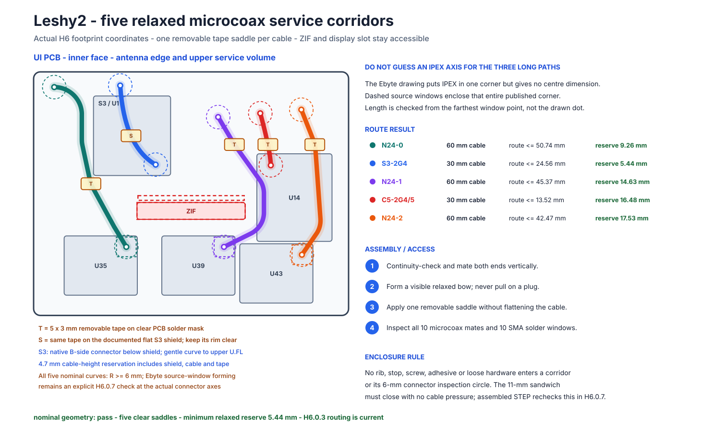

# H6.0.1-R1 - Сервисные трассы microcoax и окна осмотра

[Главная](../README.ru.md) - [Роадмап](roadmap.ru.md) - [English](h6-r2-microcoax-service.md) - [Точное размещение](h6-r2-exact-placement.ru.md) - [Механический стек](h6-r2-mechanical-stack.ru.md)

**Статус:** ✅ все пять устанавливаемых владельцем microcoax получили точные H6-коридоры, свободные площадки фиксации, ненатянутый запас длины и доступ для осмотра разъёмов/антенных паек. Это закрывает `H6.0.1-R1`; сейчас выполняется **`H6.0.2-R1` - трассировка и сверка сетей.** Закупка и производство не разрешены.



## Результат

Весь передний радиобанк остаётся локальным для UI PCB:

| Тракт | Точный кабель | Консервативный коридор, максимум | Ненатянутый запас, минимум |
|---|---|---:|---:|
| `N24-0` | `TE Connectivity 1-2118651-0`, 60 мм | 45,064 мм | 14,936 мм |
| `S3-2G4` | `TE Connectivity 2118651-2`, 30 мм | 15,280 мм | 14,720 мм |
| `N24-1` | `TE Connectivity 1-2118651-0`, 60 мм | 49,524 мм | 10,476 мм |
| `C5-2G4/5` | `TE Connectivity 2118651-2`, 30 мм | 20,870 мм | **9,130 мм** |
| `N24-2` | `TE Connectivity 1-2118651-0`, 60 мм | 42,457 мм | 17,543 мм |

Для каждого кабеля диаметром 1,13 мм выделен сервисный коридор шириной 2,50 мм и одна машинно проверенная свободная площадка **5 × 3 мм** под съёмное седло из полимидной ленты. По длине трассы седло удалено от обоих разъёмов минимум на 5 мм. Оно накладывается только после стыковки обоих концов и формирования видимой свободной дуги: лента удерживает маршрут, но не сплющивает кабель и не создаёт натяг разъёма.

Оси источников двух 30-мм кабелей взяты из точных чертежей модулей. Спецификация Ebyte показывает IPEX в одном углу каждого nRF-модуля, но не даёт размер до его центра. Поэтому три nRF-проверки считают длину до самой дальней точки большого **5 × 5 мм окна опубликованного угла**, не выдумывая точную ось по картинке. Даже так все три тракта превышают единое требование запаса 5 мм.

## Зазоры дисплея и корпуса

`N24-0` проходит слева от щели FPC и ZIF дисплея, `N24-1` - справа. Генерируемый аудит учитывает полную ширину кабельного коридора и доказывает не меньше **2,255 мм по оси** до этих исключений при требуемом конверте 2,00 мм. Ни кабель, ни седло не перекрывают щель или защёлку ZIF.

Контракт корпуса резервирует над внутренней стороной UI маршрутную призму высотой 4,50 мм и минимум 1,00 мм свободного пространства над кабелем. Ребро корпуса, упор, винт, клей или свободная деталь не могут входить в коридор либо в 6-мм цилиндр осмотра разъёма. Машинный аудит теперь проверяет каждый коридор полной ширины и площадку ленты относительно всех четырёх 4-мм keepout винтов/головок; минимальный оставшийся 2D-зазор по краям равен **0,456 мм**. Собранный STEP повторно проверит точные встречные компоненты и корпус в `H6.0.6`; 2D-рисунок не подменяет эту проверку.

Для двух антенных банков также определены по пять неперекрывающихся окон шириной 10,0 мм. До закрытия корпуса в каждом SMA/RP-SMA видны обе припаянные к сторонам платы земляные лапки и центральный вывод. Минимальный текущий шаг портов 11,75 мм оставляет не меньше 1,75 мм между соседними окнами.

## Порядок самостоятельной сборки

1. На раскрытых обесточенных PCBA проверить центральную жилу, экран и отсутствие замыкания жила-экран у каждого кабеля.
2. Стыковать каждый штекер строго вертикальным нажатием на металлическую крышку. Не тянуть и не расстыковывать за кабель.
3. Уложить кабель в его подписанный коридор, сформировать видимую ненатянутую дугу и поставить одно съёмное седло из ленты.
4. Осмотреть все десять microcoax-соединений и десять двухсторонних окон пайки антенн.
5. Проверить, что кабель не пересекает M1, упор, ось винта, щель дисплея или защёлку ZIF; только затем поставить четыре упора и параллельно состыковать M1 в приспособлении.

Радиус формовки 6 мм - консервативная проектная цель H6, а не неопубликованный предел TE. Реальный изгиб, удержание и стыковка полученных кабелей остаются физическим evidence H7/H8; если полученный IPEX Ebyte окажется вне опубликованного углового окна, результат переоткрывается, а кабель не натягивается.

## Воспроизведение

```bash
python3 hardware/layout/h6_r2_microcoax_service.py --check
```

Ожидаемый результат:

```text
H6-R2 microcoax service pass: 5 paths; 5 clear saddles; 7.69 mm minimum reserve
```

Машинные данные: [исходный контракт](../hardware/layout/h6-r2-microcoax-service.json) и [генерируемый аудит](../hardware/layout/generated/H6-R2-microcoax-service-audit.json).
