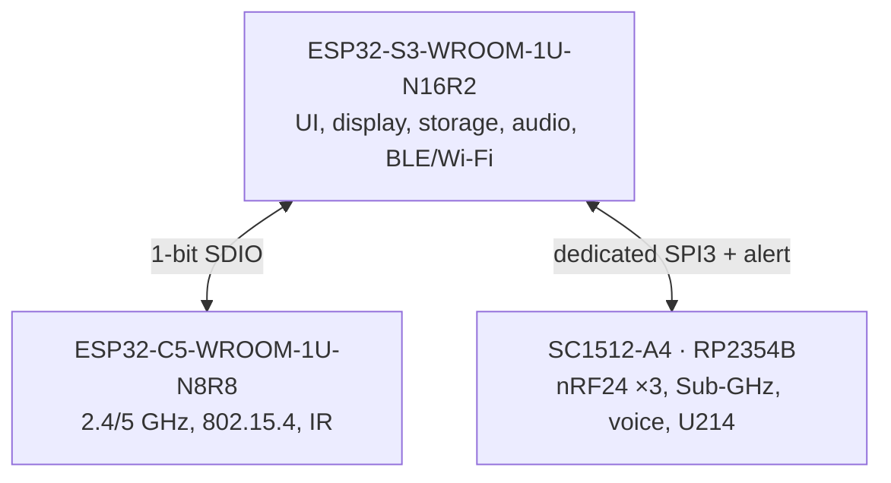
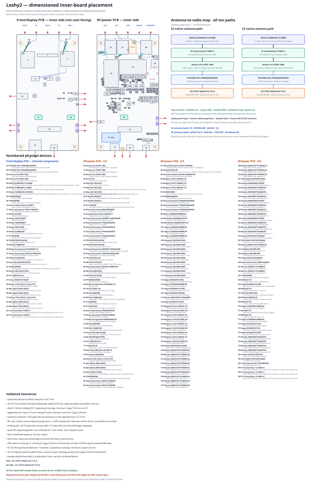

# Leshy2 hardware architecture

[Home](../README.md) · [Русский](hardware.ru.md) · [Safety](safety.md)

## Compute ownership

Each owner has independent buses to latency-sensitive devices. The display,
storage and radio paths do not wait on one overloaded shared bus. Within its
group, all three nRF24 radios retain concurrent receive and transmit. Across
top-level signal groups, one group is active while the others are physically
powered down and discharged.

## Radio paths

| Path | Primary MPN | Owner | Capability |
|---|---|---|---|
| Native S3 | `ESP32-S3-WROOM-1U-N16R2` | S3 | 2.4-GHz Wi-Fi, BLE, ESP-NOW |
| Native C5 | `ESP32-C5-WROOM-1U-N8R8` | C5 | 2.4/5-GHz Wi-Fi, IEEE 802.15.4 |
| nRF24 ×3 | `Ebyte E01-ML01IPX` | RP2354B | Concurrent `3R`, `1T2R`, `2T1R`, `3T` |
| Sub-GHz | `CC1101RGPR` | RP2354B | 315, 433, 868 and 915 MHz |
| Broadcast RX | `Si4732-A10-GSR` | S3 | FM/SW plus a separate AM/LW input |
| Voice | `NiceRF SA518` | RP2354B | Analog VHF/UHF communications |
| IR RX | `TSOP95238TT` + `TSMP95000TT` | C5 | 38-kHz demodulation and 30–60-kHz learning |
| IR TX | `VSMY14940` | C5 | Controlled 940-nm transmit with optical evidence |
| LoRa/GNSS Cap | `M5Stack U214 Cap LoRa-1262` | RP2354B | Removable rear expansion |

Every transmit path has independent actual-TX evidence. Native S3/C5 use their
own `U.FL-R-SMT-1(10)` and `CP0603Q5425ENTR` directional couplers; each nRF24
has its own external SMA and `DC2337J5010AHF`. Evidence reports actual transmit
activity and a relative level; it never grants transmit permission.

## User interface, storage and audio

| Device | MPN | Implementation |
|---|---|---|
| Display | `HMX035CTFT-001` | 3.5-inch `320×480` IPS, direct QSPI, capacitive touch |
| FPC mate | `Hirose FH12-40S-0.5SH(55)` | 40 contacts, 0.5-mm pitch |
| microSD | `Hirose DM3AT-SF-PEJM5` | Push-push; independently powered and isolated |
| Audio codec | `Everest ES8311` | I²S capture and playback |
| Microphone | `Same Sky CMEJ-0413-42-SMT-TR` | Built-in electret input |
| Speaker | `PUI Audio AS02404PO` | 4-ohm differential output |
| Headphones | `Same Sky SJ1-3515-SMT-TR` | 3.5-mm connector with detect |
| Main I/O expander | `TCA6424ARGJR` | Power, modes and slow signals |
| Control panel | `TCA9534APWR` | D-pad, OK, BACK, OPT, F1, F2 and encoder push |
| Encoder | `Alps Alpine EC11E18244AU` | Phases wired directly to S3 PCNT |

The local panel includes D-pad, `OK`, `BACK`, `OPT`, `F1`, `F2`, encoder,
`PTT`, hardware `STOP` and `RE-ARM`. A phone may provide occasional long-form
text input but cannot confirm dangerous actions.

## Expansion

- The rear 14-contact dock accepts `M5Stack U214 Cap LoRa-1262`; the Cap sits
  above the batteries and overhangs the enclosure by 4.5 mm on each side.
- A separate M5 Unit port provides a protected, switchable 5-V branch and two
  isolated signal lines for qualified GNSS, LoRa, NFC, iButton/1-Wire and other
  modules.
- High-throughput raw SDR needs a dedicated interface; the low-rate Unit port
  is not presented as a raw RF data path.

## Dimensioned layout

Solid component outlines use dimensions from the part-number register. Orange
dashed outlines are reserved space whose exact part number has not yet been
selected. The generator rejects component-to-component overlap and entry into
the 4-mm screw-head keep-outs around the M2.5 mounting holes.

A red indicator beside a connector reports actual transmission by that path.
S3, C5, all three nRF24 radios, CC1101 and voice have independent indicators;
the two Si4732 inputs are receive-only. IR has its own optical TX indicator.

## Power and service

- The main `JAE DX07S016JA1R1500` carries S3 USB 2.0 Full-Speed and sink-only
  USB-PD: 5 V, 9 V × 3 A or 15 V × 2 A, up to 30 W. There is no power-bank mode.
- `TPS25751DREFR`, `TVS2200DRVR` and `BQ25798RQMR` form the protected PD/NVDC
  frontend and 2S charger, starting conservatively at 1 A and capped at 2 A.
- Two replaceable protected button-top `XTAR 18650 4000mAh` cells sit in a
  polarized `Keystone 1048P`; both are required, providing 28.8 Wh total.
- `MAX17320G20+T` protects and gauges the 2S pack while
  `MSPM0C1104SDGS20R` performs local fail-closed admission.
- Independent fixed rails: 3.3-V always-on from `TPS629203DRLR`, plus separate
  3.3-V main, 4.0-V voice and 5.0-V accessory rails from `TPS564252DRLR`.
- S3 exposes product USB and keyed UART0/RESET/BOOT; C5 exposes data-only USB
  and UART0/RESET/BOOT; RP2354B exposes data-only USB and SWD/RUN/USB_BOOT.
  Service USB ports never power the device.

## Implementation data

The detailed tables serve schematic, verification and manufacturing work:

- [Exact assignment of every programmable controller](pinout.md)
- [Device principle diagrams](schematics.md)
- [Machine-readable BOM CSV](../hardware/architecture/generated/G2F-3I-target-bom.csv)
