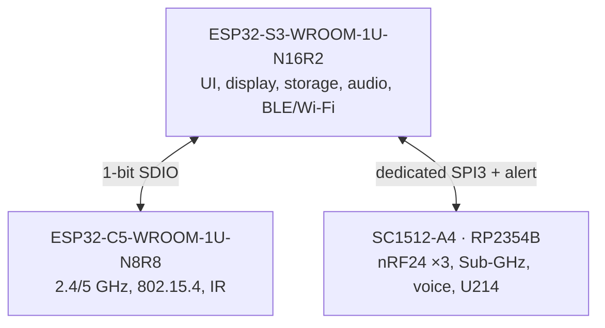

# Leshy2 hardware architecture

[Home](../README.md) · [Русский](hardware.ru.md) · [Safety](safety.md)

## Principle component interconnections

[Open the complete principle-diagram set](schematics.md). It is split into
readable maps for compute owners, UI and storage, C5 and IR, the RP radio
domain, controls, audio, service and recovery, all nine antenna paths, power
and hardware safety. Every node represents one physical device and includes
its MPN and product role; arrows show link purpose and direction.

The [pin table](pinout.md) gives the exact contacts behind these links, while
the [M1 map](interconnect.md) shows how they cross the two boards.

## Compute ownership

Each owner has independent buses to latency-sensitive devices. The display,
storage and radio paths do not wait on one overloaded shared bus. Within its
group, all three nRF24 radios retain concurrent receive and transmit. Across
top-level signal groups, one group is active while the others are physically
powered down and discharged.

## Radio paths

| Path | Primary MPN | Owner | Capability |
|---|---|---|---|
| Native S3 | `ESP32-S3-WROOM-1U-N16R2` | S3 | 2.4-GHz Wi-Fi, BLE, ESP-NOW |
| Native C5 | `ESP32-C5-WROOM-1U-N8R8` | C5 | 2.4/5-GHz Wi-Fi, IEEE 802.15.4 |
| nRF24 ×3 | `Ebyte E01-ML01IPX` | RP2354B | Concurrent `3R`, `1T2R`, `2T1R`, `3T` |
| Sub-GHz | `CC1101RGPR` | RP2354B | 315, 433, 868 and 915 MHz |
| Broadcast RX | `Si4732-A10-GSR` | S3 | FM/SW plus a separate AM/LW input |
| Voice | `NiceRF SA518` | RP2354B | Analog VHF/UHF communications |
| IR RX | `TSOP95238TT` + `TSMP95000TT` | C5 | 38-kHz demodulation and 30–60-kHz learning |
| IR TX | `VSMY14940` | C5 | Controlled 940-nm transmit with optical evidence |
| LoRa/GNSS Cap | `M5Stack U214 Cap LoRa-1262` | RP2354B | Removable rear expansion |
| External antenna jacks | `7× GCT RFPC-SMA31-FN-175-A` + `2× GCT RFPC-SMA32-FN-175-A` | Dedicated per path | 6-GHz, 50-ohm board-edge SMA/RP-SMA; no RF sharing |

Every transmit path has independent actual-TX evidence. Native S3/C5 use their
own `U.FL-R-SMT-1(10)` and `CP0603Q5425ENTR` directional couplers; each nRF24
has its own external SMA and `DC2337J5010AHF`. Eight labelled per-path
indicators plus a `TX ACTIVE` summary sit in one line on the front below the display. Evidence
reports actual transmit activity and a relative level; it never grants transmit
permission.

## User interface, storage and audio

| Device | MPN | Implementation |
|---|---|---|
| Display | `HMX035CTFT-001` | 3.5-inch `320×480` IPS, direct QSPI, capacitive touch |
| FPC mate | `Hirose FH12-40S-0.5SH(55)` | 40 contacts, 0.5-mm pitch |
| microSD | `Hirose DM3AT-SF-PEJM5` | Push-push; independently powered and isolated |
| Audio codec | `Everest ES8311` | I²S capture and playback |
| Microphone | `Same Sky CMEJ-0413-42-SMT-TR` | Rear RF/power board; bottom acoustic port |
| Speaker | `PUI Audio AS02404PO` | Rear RF/power board; 4-ohm differential output through side grille |
| Headphones | `Same Sky SJ1-3515-SMT-TR` | 3.5-mm connector with detect |
| Main I/O expander | `TCA6424ARGJR` | Power, modes and slow signals |
| Control panel | `TCA9534APWR` | D-pad, OK, BACK, OPT, F1, F2 and encoder push |
| D-pad switches | `C&K Y78B23214FP` | Five low-profile switches beneath one cross |
| Direct buttons | `OMRON B3S-1100P` | BACK, OPT, F1, F2, PTT and recessed RE-ARM |
| Hard STOP | `Panasonic AEQ10410` | Separate normally-closed safety path |
| Encoder | `Alps Alpine EC11E18244AU` | Phases wired directly to S3 PCNT |

The front panel contains one D-pad cross with centre `OK`. `BACK`, `OPT`, `F1`,
`F2`, `PTT` and recessed `RE-ARM` are identical directly pressed
`OMRON B3S-1100P` buttons—there is no separate cap or plunger. F1/F2, the
encoder, PTT, hardware STOP and RE-ARM surround the rear battery; the encoder
sits above F1/F2. `STOP` is the one functional exception: its similar-size user
area operates a separate normally-closed safety mechanism, so a broken wire is
also interpreted as stop. A phone may provide occasional long-form text input
but cannot confirm dangerous actions.

The battery holder and rear controls mount directly on the external face of the
RF/power PCB. There is no continuous rear lid over the holder: cells insert
directly into the open `Keystone 1048P`. `F1/F2` sit to the holder's left and
`PTT/STOP` to its right, so their actuation axes do not cross the battery
envelope. Dashed rear outlines are limited to the STOP actuator, RE-ARM
protective recess and encoder knob; they are not part of a common cover.

## Expansion

- The raised rear 14-contact rail uses exact vertical `Samtec SSW-107-02-S-D`
  and accepts `M5Stack U214 Cap LoRa-1262` normal to the rear face. The Cap sits
  between the antenna bank and battery holder and overhangs the 75-mm base by
  4.5 mm per side.
- A separate exact `1125R-SMT-4P` right-angle M5 Unit receptacle provides a
  protected, switchable 5-V branch and two isolated signal lines for qualified
  GNSS, LoRa, NFC, iButton/1-Wire and other modules. Its keyed mating-view order
  is GND, 5 V, SIG0, SIG1.
- High-throughput raw SDR needs a dedicated interface; the low-rate Unit port
  is not presented as a raw RF data path.

## Dimensioned layout

Solid component outlines use dimensions from the part-number register. Orange
dashed outlines are reserved space whose exact part number has not yet been
selected. The generator rejects component-to-component overlap and entry into
the 4-mm screw-head keep-outs around the M2.5 mounting holes.

In one line below the display, user-facing actual-transmit labels cover
`WI-FI/BLE`, `WI-FI/15.4`, `nRF24-1`, `nRF24-2`, `nRF24-3`, `SUB-GHz`,
`VHF/UHF`, `IR` and the aggregate `TX ACTIVE`. Antenna silkscreen uses the
same names and also states the required frequency and `SMA`/`RP-SMA` type.
The two Si4732 antenna inputs are receive-only.

The complete rear-face top view projects every exact control body. F1/F2/PTT
and RE-ARM are the directly visible solid switch bodies; STOP retains a dashed
actuator reserve, RE-ARM a dashed protective recess, and the encoder a dashed
knob reserve pending final depth, feel and sealing qualification.

## Power and service

- The main `JAE DX07S016JA1R1500` carries S3 USB 2.0 Full-Speed and sink-only
  USB-PD: 5 V, 9 V × 3 A or 15 V × 2 A, up to 30 W. There is no power-bank mode.
- `TPS25751DREFR`, `TVS2200DRVR` and `BQ25798RQMR` form the protected PD/NVDC
  frontend and 2S charger, starting conservatively at 1 A and capped at 2 A.
- Two replaceable protected button-top `XTAR 18650 4000mAh` cells sit in a
  polarized `Keystone 1048P`; both are required, providing 28.8 Wh total.
- `MAX17320G20+T` protects and gauges the 2S pack while
  `MSPM0C1104SDGS20R` performs local fail-closed admission.
- The maintained `C&K JS102011SCQN` sends only a low-current ON/OFF request
  to that admission controller. OFF never interrupts USB charging, service
  recovery, cell current or the protected power path directly.
- Independent fixed rails: 3.3-V always-on from `TPS629203DRLR`, plus separate
  3.3-V main, 4.0-V voice and 5.0-V accessory rails from `TPS564252DRLR`.
- S3 exposes product USB and keyed UART0/RESET/BOOT; C5 exposes data-only USB
  and UART0/RESET/BOOT; RP2354B exposes data-only USB and SWD/RUN/USB_BOOT.
  Service USB ports never power the device.

## Implementation data

The detailed tables serve schematic, verification and manufacturing work:

- [Exact assignment of every programmable controller](pinout.md)
- [Device principle diagrams](schematics.md)
- [Exact M1 inter-board connection](interconnect.md)
- [Machine-readable BOM CSV](../hardware/architecture/generated/G2F-3I-target-bom.csv)
