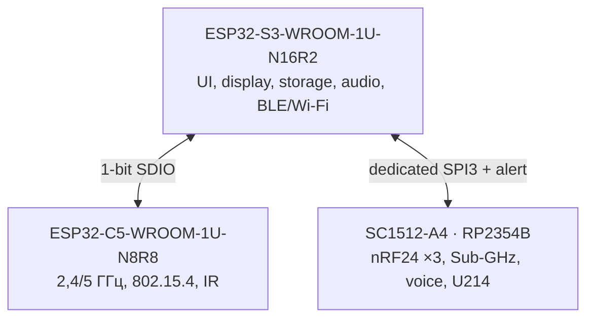

# Аппаратная архитектура Leshy2

[На главную](../README.ru.md) · [English](hardware.md) · [Безопасность](safety.ru.md)

## Принципиальные связи компонентов

[Открыть полный комплект принципиальных схем](schematics.ru.md). Он разбит на
читаемые диаграммы: вычислители, UI и storage, C5 и IR, радиодомен RP,
органы управления, аудиотракт, сервис и восстановление, девять антенных
трактов, питание и аппаратная безопасность. Каждый узел обозначает одно
физическое устройство, содержит его MPN и роль; стрелки показывают
направление и назначение связи.

Точные контакты этих связей приведены в [таблице распиновки](pinout.ru.md), а
физическое прохождение между платами — в [карте M1](interconnect.ru.md).

## Вычислительные владельцы

У каждого владельца собственные шины к чувствительным устройствам. Экран,
карта памяти и радиотракты не ждут друг друга на общей загруженной шине.
Внутри группы три nRF24 сохраняют одновременный приём и передачу; между
верхнеуровневыми сигнальными группами активна одна группа, а остальные
аппаратно отключены и разряжены.

## Радиотракты

| Тракт | Основной MPN | Владелец | Возможность |
|---|---|---|---|
| Native S3 | `ESP32-S3-WROOM-1U-N16R2` | S3 | Wi‑Fi 2,4 ГГц, BLE, ESP‑NOW |
| Native C5 | `ESP32-C5-WROOM-1U-N8R8` | C5 | Wi‑Fi 2,4/5 ГГц, IEEE 802.15.4 |
| nRF24 ×3 | `Ebyte E01-ML01IPX` | RP2354B | Одновременные `3R`, `1T2R`, `2T1R`, `3T` |
| Sub‑GHz | `CC1101RGPR` | RP2354B | 315, 433, 868 и 915 МГц |
| Broadcast RX | `Si4732-A10-GSR` | S3 | FM/SW и отдельный AM/LW вход |
| Voice | `NiceRF SA518` | RP2354B | Аналоговая VHF/UHF связь |
| IR RX | `TSOP95238TT` + `TSMP95000TT` | C5 | 38-кГц демодуляция и обучение 30–60 кГц |
| IR TX | `VSMY14940` | C5 | Управляемая передача 940 нм с оптическим подтверждением |
| LoRa/GNSS Cap | `M5Stack U214 Cap LoRa-1262` | RP2354B | Съёмное заднее расширение |
| Внешние антенные разъёмы | `7× GCT RFPC-SMA31-FN-175-A` + `2× GCT RFPC-SMA32-FN-175-A` | Отдельный на каждый тракт | 6 ГГц, 50 Ом, board-edge SMA/RP-SMA; без RF-sharing |

У каждого передающего тракта есть отдельное фактическое подтверждение TX.
Native S3/C5 используют собственные `U.FL-R-SMT-1(10)` и направленные
ответвители `CP0603Q5425ENTR`; каждый nRF24 — собственный внешний SMA и
`DC2337J5010AHF`. Восемь подписанных индикаторов отдельных трактов и сводный
`TX ACTIVE` расположены одной линией на лицевой стороне под экраном. Подтверждение показывает
факт и относительный уровень передачи, но само никогда не разрешает TX.

## Интерфейс, storage и audio

| Узел | MPN | Реализация |
|---|---|---|
| Дисплей | `HMX035CTFT-001` | IPS 3,5″, `320×480`, direct QSPI, capacitive touch |
| FPC mate | `Hirose FH12-40S-0.5SH(55)` | 40 контактов, шаг 0,5 мм |
| microSD | `Hirose DM3AT-SF-PEJM5` | Push-push; отдельное питание и изоляция данных |
| Audio codec | `Everest ES8311` | Захват и воспроизведение I²S |
| Микрофон | `Same Sky CMEJ-0413-42-SMT-TR` | Задняя RF/power-плата; нижний акустический порт |
| Динамик | `PUI Audio AS02404PO` | Задняя RF/power-плата; 4-Ом differential output через боковую решётку |
| Наушники | `Same Sky SJ1-3515-SMT-TR` | 3,5-мм разъём с detect |
| Основной I/O expander | `TCA6424ARGJR` | Питание, режимы и медленные сигналы |
| Панель управления | `TCA9534APWR` | D-pad, OK, BACK, OPT, F1, F2 и encoder push |
| Переключатели D-pad | `C&K Y78B23214FP` | Пять низкопрофильных переключателей под одной крестовиной |
| Обычные кнопки | `OMRON B3S-1100P` | BACK, OPT, F1, F2, PTT и утопленный RE-ARM |
| Аппаратный STOP | `C&K TLSMDT3C020GLFS` | Прямая кнопка того же размера; отдельный нормально-замкнутый safety-тракт |
| Энкодер | `Alps Alpine EC11E18244AU` | Фазы напрямую на S3 PCNT |
| Ручка энкодера | `Davies Molding 1227-J` | 15-мм soft-touch посадка на D-вал 6×4,5 мм |

Лицевая панель содержит одну крестовину D-pad с центральным `OK`. `BACK`, `OPT`,
`F1`, `F2`, `PTT` и утопленный `RE‑ARM` — одинаковые готовые кнопки
`OMRON B3S-1100P`, которые нажимаются непосредственно: отдельного колпачка или
толкателя у них нет. F1/F2, энкодер, PTT, аппаратный STOP и RE-ARM расположены
вокруг заднего аккумулятора; энкодер находится над F1/F2 и несёт точную ручку
`Davies Molding 1227-J`. `STOP` использует непосредственно нажимаемый SPDT
tact-switch 6,0×6,1 мм; его нормально-замкнутый
контакт сохраняет отдельный fail-safe тракт, поэтому обрыв провода также
считается остановом. Телефон может использоваться для редкого длинного ввода
текста, но не подтверждает опасные действия.

Держатель аккумуляторов и задние органы управления установлены непосредственно
на внешней стороне RF/power-платы. Сплошной задней крышки над держателем нет:
банки вставляются прямо в открытый `Keystone 1048P`. `F1/F2` находятся слева от
держателя, `PTT/STOP` — справа, поэтому их оси не проходят через аккумуляторный
объём. Единственный пунктир на задней стороне обозначает заказное защитное
углубление `RE-ARM`; общей крышки там нет.

## Расширения

- Поднятая задняя 14-контактная планка использует точный вертикальный разъём
  `Samtec SSW-107-02-S-D` и принимает `M5Stack U214 Cap LoRa-1262` нормально к
  задней стороне. Cap находится между антеннами и держателем батарей и
  выступает за 75-мм основание на 4,5 мм с каждой стороны.
- Отдельный точный угловой разъём M5 Unit `1125R-SMT-4P` предоставляет
  защищённую, отключаемую 5-В ветвь и две изолированные сигнальные линии для
  квалифицированных GNSS, LoRa, NFC, iButton/1‑Wire и других модулей. Порядок
  контактов со стороны сопряжения с ключом: GND, 5 В, SIG0, SIG1.
- Высокоскоростной raw-SDR требует отдельного интерфейса: низкоскоростной Unit
  port не называется трактом сырых RF-данных.

## Размерная компоновка

Сплошные контуры компонентов построены по размерам из реестра партномеров.
Фиолетовая крестовина D-pad — заказная деталь устройства: для неё нужен
контролируемый производственный чертёж, а не партномер поставщика. Оранжевый
пунктир отмечает единственный открытый элемент задней стороны: заказную
геометрию защитного углубления RE-ARM без выпущенного чертежа. Точная ручка
энкодера `Davies Molding 1227-J` показана сплошным 15-мм контуром. Генератор
запрещает пересечения
компонентов между собой и с 4-мм зонами головок крепежа вокруг отверстий M2.5.

Одной линией под экраном находятся пользовательские подписи индикаторов
фактической передачи: `WI-FI/BLE`, `WI-FI/15.4`, `nRF24-1`, `nRF24-2`,
`nRF24-3`, `SUB-GHz`, `VHF/UHF`, `IR` и сводный `TX ACTIVE`. На шелкографии
антенн используются те же имена, а также диапазон и тип `SMA`/`RP-SMA`.
Два входа Si4732 работают только на приём.

## Питание и сервис

- Основной `JAE DX07S016JA1R1500` — USB 2.0 Full-Speed S3 и sink-only USB-PD:
  5 В, 9 В × 3 А или 15 В × 2 А, максимум 30 Вт. Режима power bank нет.
- `TPS25751DREFR`, `TVS2200DRVR` и `BQ25798RQMR` образуют защищённый PD/NVDC
  frontend и заряд 2S с консервативным стартом 1 А и штатным пределом 2 А.
- Две сменные защищённые button-top `XTAR 18650 4000mAh` установлены в
  поляризованный `Keystone 1048P`; обе нужны для работы, суммарно 28,8 Вт·ч.
- `MAX17320G20+T` защищает и измеряет 2S pack, а
  `MSPM0C1104SDGS20R` локально выполняет fail-closed admission.
- Фиксируемый `C&K JS102011SCQN` передаёт этому контроллеру только
  малотоковую команду ON/OFF. Положение OFF не разрывает напрямую заряд от
  USB, сервисное восстановление, ток ячеек или защищённый силовой тракт.
- Независимые fixed rails: always-on 3,3 В на `TPS629203DRLR`, main 3,3 В,
  voice 4,0 В и accessory 5,0 В на отдельных `TPS564252DRLR`.
- S3 имеет основной USB и keyed UART0/RESET/BOOT; C5 — data-only USB и
  UART0/RESET/BOOT; RP2354B — data-only USB и SWD/RUN/USB_BOOT. Сервисные USB
  не питают устройство.

## Данные реализации

Подробные таблицы предназначены для схемы, проверки и производства:

- [Точная распиновка всех программируемых контроллеров](pinout.ru.md)
- [Принципиальные схемы устройства](schematics.ru.md)
- [Точное межплатное соединение M1](interconnect.ru.md)
- [Машинный BOM CSV](../hardware/architecture/generated/G2F-3I-target-bom.csv)
