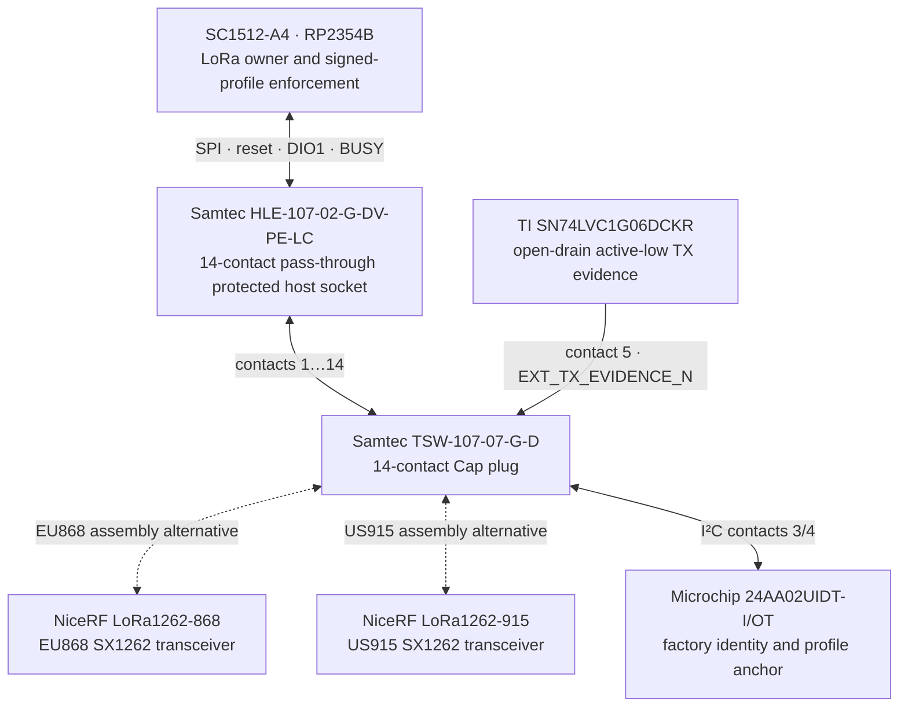
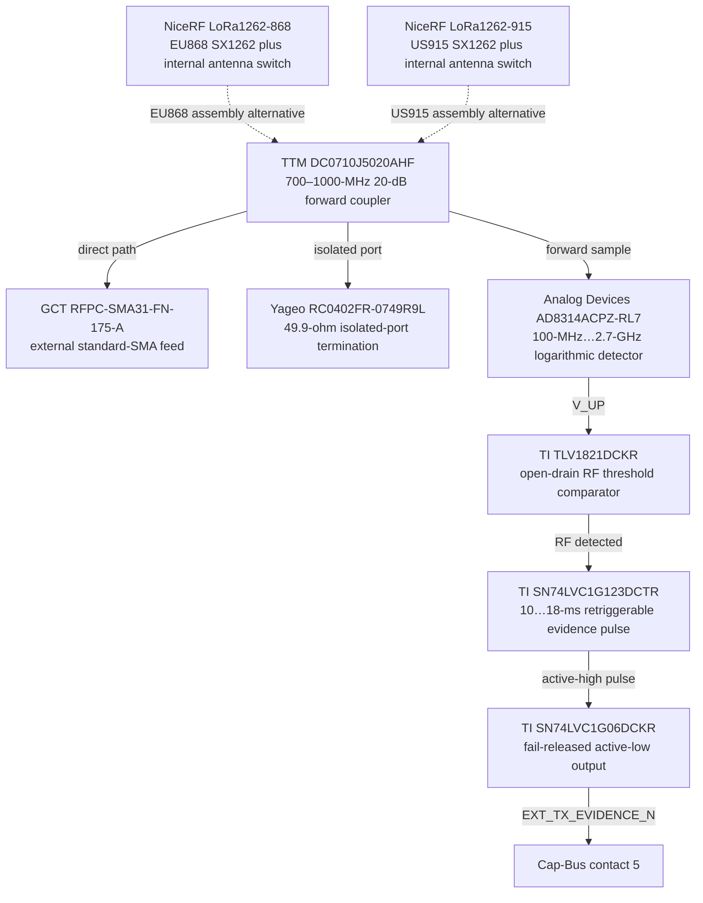
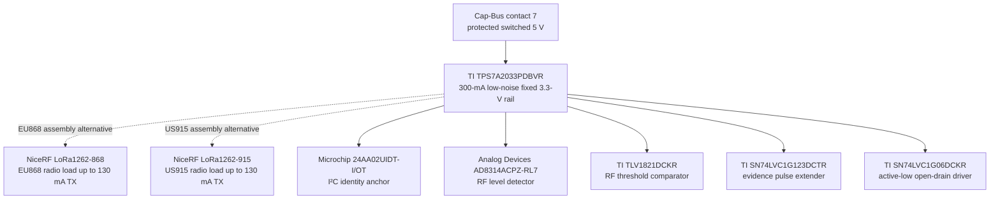

# Leshy2 LoRa Cap

[Home](../README.md) · [Русский](lora-cap.ru.md) · [Hardware](hardware.md) · [Safety](safety.md)

`LESHY2-LORA-CAP-01` is the removable LoRa transmitter/receiver for the rear
Cap Bus. It preserves compatibility with the stock `M5Stack U214`: either Cap
uses the same 84×24-mm dock, 56-mm retention pitch and 14-contact interface,
but only the Leshy Cap has independent physical evidence after the final RF
switch. The stock U214 therefore remains useful for receive and GNSS; its TX is
blocked.

Two exact assemblies cover the common LoRa regions without a compromised
wide-band RF match:

| Assembly | Exact radio MPN | Qualified module band | Module certificate |
|---|---|---|---|
| `LESHY2-LORA-CAP-01-EU868` | `NiceRF LoRa1262-868` | 848–888 MHz | CE |
| `LESHY2-LORA-CAP-01-US915` | `NiceRF LoRa1262-915` | 900–940 MHz | FCC |

Both modules use an SX1262, default 0.5-ppm TCXO, integrated chip-controlled
antenna switch, up to +22 dBm, less than 6.5 mA in RX and less than 130 mA in
TX. Because the RF switch is internal, the existing Cap Bus needs no extra
GPIO. The finished product still requires the regional regulatory assessment;
a module certificate is not a certificate for the complete Leshy2 assembly.

## Cap-Bus boundary

Contacts 1/2, used for GNSS UART by U214, are deliberately NC on the Leshy Cap.
The exact dual-profile pin table is [generated from the machine source](../hardware/accessories/generated/LESHY2-LORA-CAP-01-pinout.md).
The unique ID selects an installed profile; it is not authorization. TX still
requires a signed host manifest, the exact qualified assembly profile, a live
lease and physical evidence.

## Final-feed RF evidence

The detector is after the module's antenna switch and immediately before the
external SMA, so firmware state, `BUSY` or supply current cannot masquerade as
RF evidence. A 220-kΩ/10-kΩ divider sets the nominal 143.5-mV threshold. The
133-kΩ/100-nF timing network produces a nominal 14.6-ms pulse, long enough for
the host's 5-ms safety loop and shorter than its 20-ms post-revoke window.

Finite directional-coupler directivity means an exceptionally strong inbound
signal can still assert evidence. That condition is safe: unexpected evidence
latches a fault and removes the lease. Evidence only reports measured RF; it
never grants permission to transmit.

## Power and identity

Removing or disabling the Cap cuts its complete local rail. All host-facing
signal buffers are disabled by the Leshy2 group transition and the open-drain
evidence output releases high, so the accessory cannot back-power the base.

## Mechanical projection and production data

The external SMA exits the antenna edge; the male Cap connector faces inward.
All user-facing band, antenna and orientation labels are on the accessible
outer silkscreen. The thicker stock U214 remains the worst-case shared-dock
depth, so accepting this thinner custom Cap does not enlarge the base device.

The [machine source](../hardware/accessories/leshy2-lora-cap-01.json) validates
the exact devices, routes, pin contract, keep-outs and qualification gates. The
[accessory BOM](../hardware/accessories/generated/LESHY2-LORA-CAP-01-bom.csv)
is separate from the base-device BOM. Known quantity-100 electronics total
`$10.40` per Cap; the regional radio module, PCB and assembly remain RFQ gates,
so no unsupported finished-price claim is made.

Before KiCad release, HIL must close conducted threshold and pulse-width sweeps,
minimum-power and shortest-packet detection, strong-inbound false evidence,
brownout/hot-plug behavior, received connector fit, retention and complete
regional RF performance.
