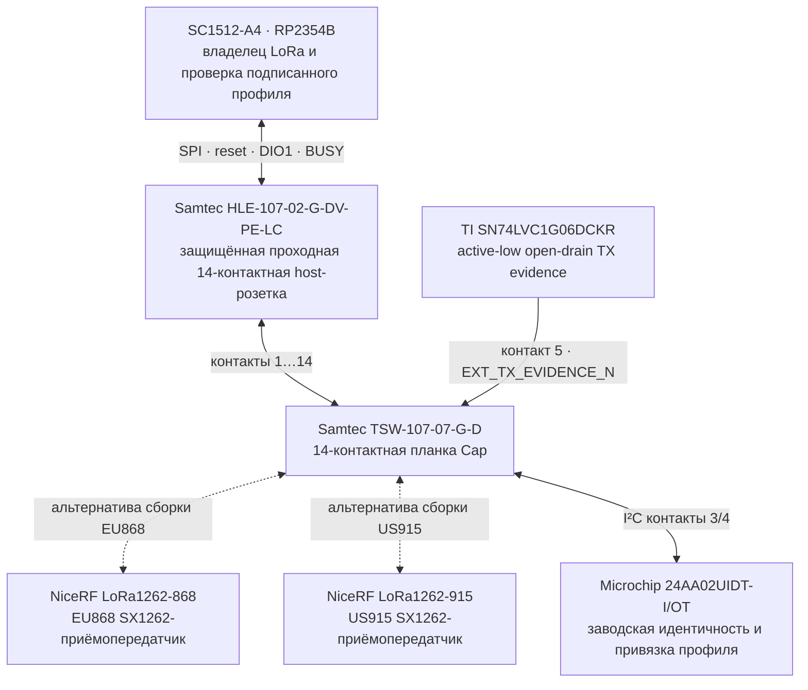
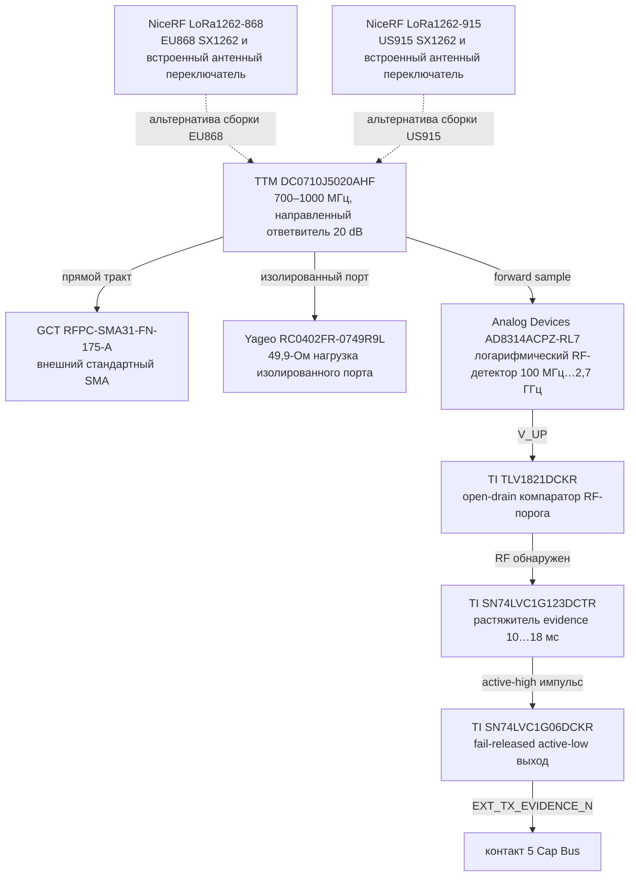
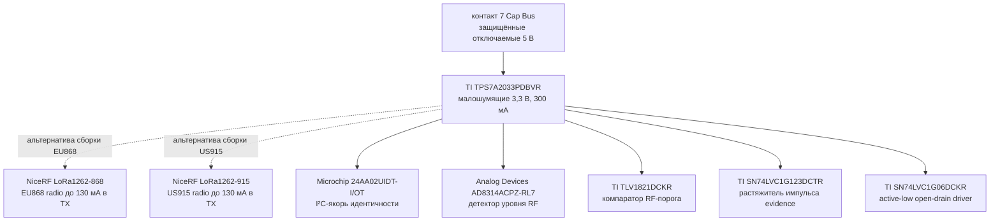

# Leshy2 LoRa Cap

[На главную](../README.ru.md) · [English](lora-cap.md) · [Железо](hardware.ru.md) · [Безопасность](safety.ru.md)

`LESHY2-LORA-CAP-01` — съёмный LoRa-приёмопередатчик для заднего Cap Bus. Он
сохраняет совместимость со штатным `M5Stack U214`: оба Cap используют один док
84×24 мм, крепёж с шагом 56 мм и 14-контактный интерфейс. Но только Leshy Cap
измеряет фактическую передачу после конечного RF-переключателя. Поэтому штатный
U214 остаётся полезным для приёма и GNSS, а его TX заблокирован.

Общепринятые LoRa-диапазоны покрывают две точные региональные сборки без
компромиссного широкополосного согласования:

| Сборка | Точный MPN радио | Диапазон модуля | Сертификат модуля |
|---|---|---|---|
| `LESHY2-LORA-CAP-01-EU868` | `NiceRF LoRa1262-868` | 848–888 МГц | CE |
| `LESHY2-LORA-CAP-01-US915` | `NiceRF LoRa1262-915` | 900–940 МГц | FCC |

Оба модуля используют SX1262, штатный TCXO 0,5 ppm, встроенный управляемый
чипом антенный переключатель, мощность до +22 dBm, ток менее 6,5 мА в RX и
менее 130 мА в TX. Встроенный RF-переключатель не требует нового GPIO на Cap
Bus. Готовому продукту всё равно нужна региональная оценка: сертификат модуля
не является сертификатом Leshy2 в сборе.

## Граница Cap Bus

Контакты 1/2, занятые GNSS UART у U214, у Leshy Cap намеренно оставлены NC.
Точная двухпрофильная карта контактов [генерируется из машинного источника](../hardware/accessories/generated/LESHY2-LORA-CAP-01-pinout.md).
Уникальный ID выбирает профиль установленной сборки, но не даёт разрешение.
Для TX всё равно нужны подписанный host manifest, точный квалифицированный
профиль сборки, действующий lease и физическое evidence.

## Evidence на конечном RF-тракте

Детектор стоит после антенного переключателя модуля непосредственно перед
внешним SMA. Поэтому состояние firmware, `BUSY` или ток питания не могут
выдаваться за RF evidence. Делитель 220 кОм/10 кОм задаёт номинальный порог
143,5 мВ. Цепь 133 кОм/100 нФ формирует номинальные 14,6 мс — дольше 5-мс
цикла safety-контроллера и короче 20-мс окна после снятия разрешения.

Из-за конечной направленности ответвителя исключительно сильный входной сигнал
может вызвать evidence. Это безопасно: неожиданное evidence защёлкивает fault
и снимает lease. Evidence сообщает только факт измеренного RF и никогда само
не разрешает передачу.

## Питание и идентичность

При снятии или отключении Cap полностью теряет локальное питание. Leshy2
отключает все host-буферы при переходе группы в quiet-state, а open-drain
evidence отпускает линию вверх: аксессуар не может подпитать базу через сигналы.

## Механика и производственные данные

Внешний SMA выходит в сторону антенного торца, а мужская планка Cap смотрит
внутрь, к доку. Диапазон, название антенны и ориентация находятся на доступной
внешней шелкографии. Более толстый штатный U214 остаётся худшим случаем по
глубине общего дока, поэтому новый Cap не увеличивает базовое устройство.

[Машинный источник](../hardware/accessories/leshy2-lora-cap-01.json) проверяет
точные устройства, маршруты, контакты, keep-out и квалификационные ворота.
[BOM аксессуара](../hardware/accessories/generated/LESHY2-LORA-CAP-01-bom.csv)
отделён от BOM базового устройства. Известная электроника при количестве 100
стоит `$10,40` на Cap; региональный радиомодуль, PCB и сборка остаются RFQ-
воротами, поэтому неподтверждённой цены готового изделия здесь нет.

До выпуска в KiCad HIL должен закрыть проводные sweep порога и длительности
импульса, обнаружение минимальной мощности и самого короткого пакета, сильный
входной сигнал, brownout/hot-plug, сопряжение полученных разъёмов, удержание и
полный региональный RF-тракт.
