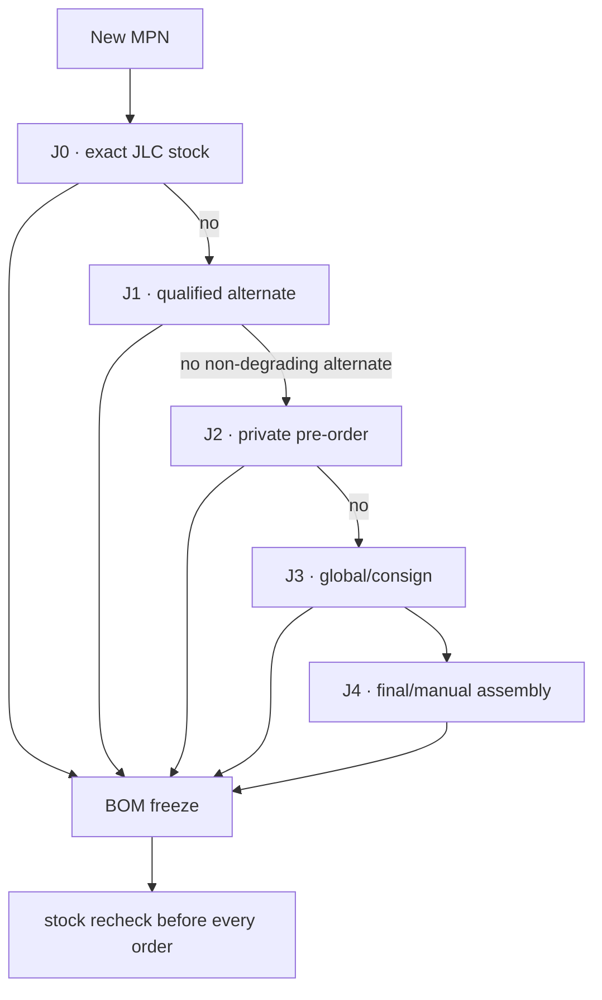

# Leshy2 manufacturing platform

[Русский](manufacturing-platform.ru.md) · [Home](../README.md) · [Roadmap](roadmap.md)

## Reference line

**The working reference is JLCPCB Standard PCBA.** This is neither exclusive lock-in nor order authorization. Standard was selected for its public stock/JLC-number assembly library, double-sided SMT+THT, fine-pitch/BGA/QFN, special stackups and SPI/AOI/X-ray. See the official [assembly capabilities](https://jlcpcb.com/capabilities/pcb-assembly-capabilities) and [parts-sourcing paths](https://jlcpcb.com/help/article/pcba-parts-sourcing-instruction).

PCBWay remains the manual turnkey/box-build quote fallback; Seeed Fusion remains a second manufacturing quote. Their supplier availability is less suitable as a repeatable machine-checkable MPN-selection source.

## Meaning of “always available”

No platform guarantees perpetual public stock. Leshy2 therefore selects ordinary parts from JLC stock or with prequalified alternates; unique functional identities are reserved in the [private parts library](https://jlcpcb.com/help/article/how-to-build-your-own-parts-library-in-jlcpcb) or received through global sourcing/consignment. A shortage never permits a silent factory substitution.

## First critical-part check

`10` of `209` exact BOM lines are spot-checked. This starts the full audit; it is not a complete assembly quote.

| MPN | JLC | Current evidence | Route |
|---|---:|---|---|
| [`ESP32-S3-WROOM-1U-N16R8`](https://jlcpcb.com/partdetail/ESP32-S3-WROOM-1U-N16R8/C3013946) | `C3013946` | stock 14529 | `J0` · exact selected module is directly assembleable |
| [`ESP32-C5-WROOM-1U-N8R8-V1.2`](https://jlcpcb.com/partdetail/C54951858) | `C54951858` | stock 547 | `J0` · current explicit V1.2 stock matches the architecture revision floor; BOM spelling must be normalized before release |
| [`CC1101RGPR`](https://jlcpcb.com/partdetail/TexasInstruments-CC1101RGPR/C29953) | `C29953` | stock 14194 | `J0` · exact selected transceiver is directly assembleable |
| [`ES8311`](https://jlcpcb.com/partdetail/1044199-ES8311/C962342) | `C962342` | stock 96905 | `J0` · exact selected codec is directly assembleable |
| [`MAX17320G20+ / selected order suffix +T`](https://jlcpcb.com/partdetail/8483980-MAX17320G20/C7457894) | `C7457894` | stock 13 | `J0` · functional identity is present but packaging/order-suffix equivalence and low stock require confirmation or J2 reservation |
| [`SC1512-A4`](https://jlcpcb.com/partdetail/RaspberryPi-SC1512A4/C52763783) | `C52763783` | SMT; fixture; Economic and Standard | `J2` · listed and assembleable, but not public-stock; reserve by pre-order or consign exact parts |
| [`MSPM0C1106SDGS20R`](https://jlcpcb.com/partdetail/55934010-MSPM0C1106SDGS20R/C52995805) | `C52995805` | Extended SMT | `J2` · listed with pre-order MOQ 6; two fitted devices plus attrition are compatible with a small reservation |
| [`E01-ML01IPX`](https://jlcpcb.com/parts/componentSearch?searchTxt=E01-ML01IPX) | `—` | not found in public library | `J3` · retain exact module only through new-part/global-sourcing/consignment until a function-preserving stocked module is qualified |
| [`NiceRF SA518`](https://jlcpcb.com/parts/componentSearch?searchTxt=SA518) | `—` | not found in public library | `J3` · route the exact module and its supplier questions through JLC sourcing first; direct manufacturer contact is no longer the first action |
| [`HMX035CTFT-001`](https://jlcpcb.com/parts/componentSearch?searchTxt=HMX035CTFT-001) | `—` | display/flex belongs to final assembly | `J4` · keep replaceable display-adapter architecture; the display is not treated as an ordinary line-loaded SMT part |

## Assembly boundary

JLCPCB assembles both boards and accepted SMT/THT parts. Display flex mating, U214/M5, cells, external antennas and final sandwich integration remain post-PCBA operations until a separate box-build quote proves otherwise.

## Current result

- JLCPCB Standard PCBA is the working reference without lock-in.
- Full mapping remains open for `199` lines.
- Direct NiceRF contact is deferred while the JLC global-sourcing/new-part route is checked first.
- The minimum BOM upload (MPN and quantity only) is authorized and prepared but not yet transmitted because user sign-in is required. API application, sourcing request, purchase, replacements, KiCad layout and fabrication are not authorized.

Machine result: [`H5-EVR04`](../hardware/verification/generated/H5-EVR04-pcba-platform-baseline.json).
