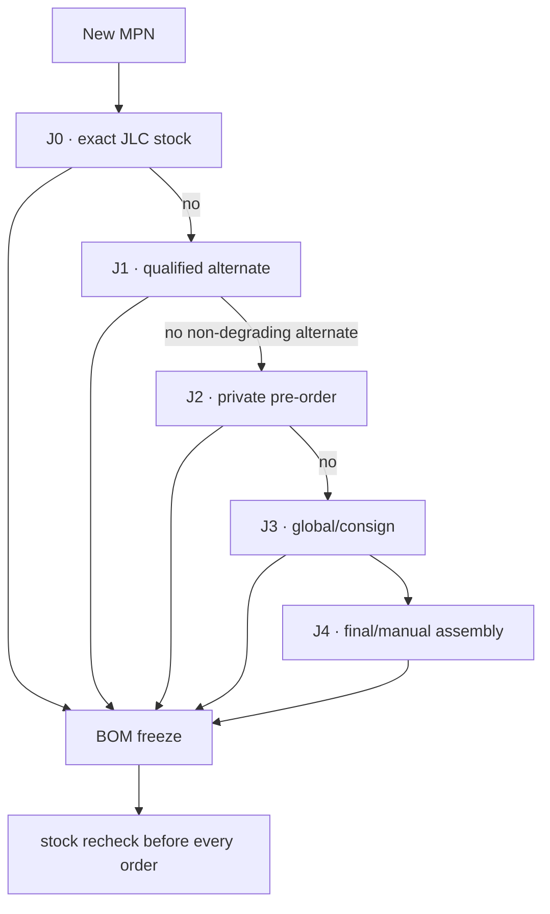

# Leshy2 manufacturing platform

[Русский](manufacturing-platform.ru.md) · [Home](../README.md) · [Roadmap](roadmap.md)

## Reference line

**The working reference is JLCPCB Standard PCBA.** This is neither exclusive lock-in nor order authorization. Standard was selected for its public stock/JLC-number assembly library, double-sided SMT+THT, fine-pitch/BGA/QFN, special stackups and SPI/AOI/X-ray. See the official [assembly capabilities](https://jlcpcb.com/capabilities/pcb-assembly-capabilities) and [parts-sourcing paths](https://jlcpcb.com/help/article/pcba-parts-sourcing-instruction).

PCBWay remains the manual turnkey/box-build quote fallback; Seeed Fusion remains a second manufacturing quote. Their supplier availability is less suitable as a repeatable machine-checkable MPN-selection source.

## Meaning of “always available”

No platform guarantees perpetual public stock. Leshy2 therefore selects ordinary parts from JLC stock or with prequalified alternates; unique functional identities are reserved in the [private parts library](https://jlcpcb.com/help/article/how-to-build-your-own-parts-library-in-jlcpcb) or received through global sourcing/consignment. A shortage never permits a silent factory substitution.

## Controlled BOM Tool run

The normalized BOM was accepted and processed for an assessment quantity of five boards. JLCPCB matched `176` of `209` unique lines: `135` public-stock and `41` pre-order; `33` remain explicit outliers. All `1019` placements were parsed. Two Panasonic spellings differ only by punctuation; zero semantic MPN substitutions were observed.

The displayed `$1255.6365` is the sum of recommended order quantities for only the 176 matched lines, including reference pre-order prices. It is **not** a complete assembly price, quote or order.

33 lines requiring local qualification

| Normalized MPN | Qty | Next evidence |
|---|---:|---|
| `1227-J` | 1 | exact search → non-degrading serial alternate → J2/J3/J4 |
| `E01-ML01IPX` | 3 | exact search → non-degrading serial alternate → J2/J3/J4 |
| `ESP32-C5-WROOM-1U-N8R8` | 1 | exact search → non-degrading serial alternate → J2/J3/J4 |
| `RFPC-SMA31-FN-175-A` | 7 | exact search → non-degrading serial alternate → J2/J3/J4 |
| `RFPC-SMA32-FN-175-A` | 2 | exact search → non-degrading serial alternate → J2/J3/J4 |
| `FX8C-80S-SV5(92)` | 1 | exact search → non-degrading serial alternate → J2/J3/J4 |
| `BGS13SN8E6327XTSA1` | 2 | exact search → non-degrading serial alternate → J2/J3/J4 |
| `U214 Cap LoRa-1262` | 1 | exact search → non-degrading serial alternate → J2/J3/J4 |
| `GJM1555C1H101JB01D` | 2 | exact search → non-degrading serial alternate → J2/J3/J4 |
| `PESD24VY1BSF` | 1 | exact search → non-degrading serial alternate → J2/J3/J4 |
| `SA518` | 1 | exact search → non-degrading serial alternate → J2/J3/J4 |
| `AS02404PO` | 1 | exact search → non-degrading serial alternate → J2/J3/J4 |
| `HMX035CTFT-001` | 1 | exact search → non-degrading serial alternate → J2/J3/J4 |
| `SC1512-A4` | 1 | exact search → non-degrading serial alternate → J2/J3/J4 |
| `1125R-SMT-4P` | 1 | exact search → non-degrading serial alternate → J2/J3/J4 |
| `2118651-2` | 5 | exact search → non-degrading serial alternate → J2/J3/J4 |
| `MSPM0C1106SDGS20R` | 2 | exact search → non-degrading serial alternate → J2/J3/J4 |
| `SN74LVC1G07DCKR` | 10 | exact search → non-degrading serial alternate → J2/J3/J4 |
| `SN74LVC1G08DCKR` | 4 | exact search → non-degrading serial alternate → J2/J3/J4 |
| `SN74LVC1G17DCKR` | 1 | exact search → non-degrading serial alternate → J2/J3/J4 |
| `TCA9539PWR` | 1 | exact search → non-degrading serial alternate → J2/J3/J4 |
| `TLV1821DCKR` | 1 | exact search → non-degrading serial alternate → J2/J3/J4 |
| `TLV1824PWR` | 2 | exact search → non-degrading serial alternate → J2/J3/J4 |
| `TPD2EUSB30ADRTR` | 2 | exact search → non-degrading serial alternate → J2/J3/J4 |
| `TPD4E05U06DQAR` | 13 | exact search → non-degrading serial alternate → J2/J3/J4 |
| `TPUL2G223BQBR` | 1 | exact search → non-degrading serial alternate → J2/J3/J4 |
| `B0310J50100AHF` | 1 | exact search → non-degrading serial alternate → J2/J3/J4 |
| `TSMP95000TT` | 1 | exact search → non-degrading serial alternate → J2/J3/J4 |
| `18650 4000mAh` | 2 | exact search → non-degrading serial alternate → J2/J3/J4 |
| `RC0402FR-07100RL` | 7 | exact search → non-degrading serial alternate → J2/J3/J4 |
| `RC0402FR-071KL` | 12 | exact search → non-degrading serial alternate → J2/J3/J4 |
| `RC0402FR-0733RL` | 1 | exact search → non-degrading serial alternate → J2/J3/J4 |
| `RC0402FR-074K7L` | 1 | exact search → non-degrading serial alternate → J2/J3/J4 |

## Independent critical-part check

`10` critical identities were checked independently before the bulk run. Their stock snapshots neither override the current BOM Tool result nor promise permanent availability.

| MPN | JLC | Current evidence | Route |
|---|---:|---|---|
| [`ESP32-S3-WROOM-1U-N16R8`](https://jlcpcb.com/partdetail/ESP32-S3-WROOM-1U-N16R8/C3013946) | `C3013946` | stock 14529 | `J0` · exact selected module is directly assembleable |
| [`ESP32-C5-WROOM-1U-N8R8-V1.2`](https://jlcpcb.com/partdetail/C54951858) | `C54951858` | stock 547 | `J0` · current explicit V1.2 stock matches the architecture revision floor; BOM spelling must be normalized before release |
| [`CC1101RGPR`](https://jlcpcb.com/partdetail/TexasInstruments-CC1101RGPR/C29953) | `C29953` | stock 14194 | `J0` · exact selected transceiver is directly assembleable |
| [`ES8311`](https://jlcpcb.com/partdetail/1044199-ES8311/C962342) | `C962342` | stock 96905 | `J0` · exact selected codec is directly assembleable |
| [`MAX17320G20+ / selected order suffix +T`](https://jlcpcb.com/partdetail/8483980-MAX17320G20/C7457894) | `C7457894` | stock 13 | `J0` · functional identity is present but packaging/order-suffix equivalence and low stock require confirmation or J2 reservation |
| [`SC1512-A4`](https://jlcpcb.com/partdetail/RaspberryPi-SC1512A4/C52763783) | `C52763783` | SMT; fixture; Economic and Standard | `J2` · listed and assembleable, but not public-stock; reserve by pre-order or consign exact parts |
| [`MSPM0C1106SDGS20R`](https://jlcpcb.com/partdetail/55934010-MSPM0C1106SDGS20R/C52995805) | `C52995805` | Extended SMT | `J2` · listed with pre-order MOQ 6; two fitted devices plus attrition are compatible with a small reservation |
| [`E01-ML01IPX`](https://jlcpcb.com/parts/componentSearch?searchTxt=E01-ML01IPX) | `—` | not found in public library | `J3` · retain exact module only through new-part/global-sourcing/consignment until a function-preserving stocked module is qualified |
| [`NiceRF SA518`](https://jlcpcb.com/parts/componentSearch?searchTxt=SA518) | `—` | not found in public library | `J3` · route the exact module and its supplier questions through JLC sourcing first; direct manufacturer contact is no longer the first action |
| [`HMX035CTFT-001`](https://jlcpcb.com/parts/componentSearch?searchTxt=HMX035CTFT-001) | `—` | display/flex belongs to final assembly | `J4` · keep replaceable display-adapter architecture; the display is not treated as an ordinary line-loaded SMT part |

## Assembly boundary

JLCPCB assembles both boards and accepted SMT/THT parts. Display flex mating, U214/M5, cells, external antennas and final sandwich integration remain post-PCBA operations until a separate box-build quote proves otherwise.

## Current result

- JLCPCB Standard PCBA is the working reference without lock-in.
- Bulk mapping is complete for `176` lines; local qualification remains open for `33` outliers.
- Direct NiceRF contact is deferred while the JLC global-sourcing/new-part route is checked first.
- The minimum BOM upload was transmitted and processed. No quote, Parts API application, sourcing request, reservation, purchase, replacement, KiCad layout or fabrication was performed or authorized.

Machine results: [`H5-EVR04`](../hardware/verification/generated/H5-EVR04-pcba-platform-baseline.json) and [`H5-EVR05`](../hardware/verification/generated/H5-EVR05-jlcpcb-bom-match.json). [JLCPCB BOM requirements](https://jlcpcb.com/help/article/bill-of-materials-for-pcb-assembly).
