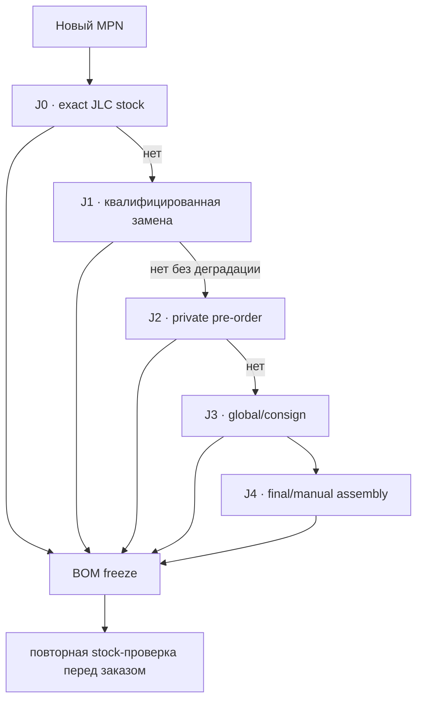

# Производственная платформа Leshy2

[English](manufacturing-platform.md) · [На главную](../README.ru.md) · [Роадмап](roadmap.ru.md)

## Базовая линия

**Рабочий reference — JLCPCB Standard PCBA.** Это не эксклюзивная привязка и не разрешение заказа. Standard выбран из-за публичной assembly-библиотеки со stock/JLC-number, двухстороннего SMT+THT, fine-pitch/BGA/QFN, специального stack-up и SPI/AOI/X-ray. [Официальные capabilities](https://jlcpcb.com/capabilities/pcb-assembly-capabilities) и [варианты sourcing](https://jlcpcb.com/help/article/pcba-parts-sourcing-instruction).

PCBWay остаётся fallback для ручного turnkey/box-build quote, Seeed Fusion — второй производственный quote. Их supplier availability хуже подходит как автоматически проверяемый источник выбора MPN.

## Что значит «доступно всегда»

Ни одна площадка не гарантирует вечный публичный остаток. Для Leshy2 это означает: обычные детали выбираются из JLC stock или имеют заранее квалифицированные замены; уникальные функциональные MPN резервируются в private library через [pre-order](https://jlcpcb.com/help/article/how-to-build-your-own-parts-library-in-jlcpcb) или поступают через global sourcing/consignment. Недостаток stock никогда не разрешает фабрике молчаливую замену.

## Контрольный BOM Tool прогон

Нормализованный BOM принят и обработан для расчётного тиража 5 плат. JLCPCB сопоставил `176` из `209` уникальных строк: `135` public-stock и `41` pre-order; `33` строк остались явными outliers. Все `1019` установок распознаны. Два написания Panasonic отличаются только дефисами; семантических подмен MPN — ноль.

Показываемая BOM Tool сумма `$1255.6365` — сумма рекомендованных заказных количеств только для 176 найденных строк, включая справочные pre-order цены. Это **не** полная цена сборки, не quote и не заказ.

33 строки, требующие локальной квалификации

| Нормализованный MPN | Кол-во | Следующее доказательство |
|---|---:|---|
| `1227-J` | 1 | exact search → недеградирующая серийная замена → J2/J3/J4 |
| `E01-ML01IPX` | 3 | exact search → недеградирующая серийная замена → J2/J3/J4 |
| `ESP32-C5-WROOM-1U-N8R8` | 1 | exact search → недеградирующая серийная замена → J2/J3/J4 |
| `RFPC-SMA31-FN-175-A` | 7 | exact search → недеградирующая серийная замена → J2/J3/J4 |
| `RFPC-SMA32-FN-175-A` | 2 | exact search → недеградирующая серийная замена → J2/J3/J4 |
| `FX8C-80S-SV5(92)` | 1 | exact search → недеградирующая серийная замена → J2/J3/J4 |
| `BGS13SN8E6327XTSA1` | 2 | exact search → недеградирующая серийная замена → J2/J3/J4 |
| `U214 Cap LoRa-1262` | 1 | exact search → недеградирующая серийная замена → J2/J3/J4 |
| `GJM1555C1H101JB01D` | 2 | exact search → недеградирующая серийная замена → J2/J3/J4 |
| `PESD24VY1BSF` | 1 | exact search → недеградирующая серийная замена → J2/J3/J4 |
| `SA518` | 1 | exact search → недеградирующая серийная замена → J2/J3/J4 |
| `AS02404PO` | 1 | exact search → недеградирующая серийная замена → J2/J3/J4 |
| `HMX035CTFT-001` | 1 | exact search → недеградирующая серийная замена → J2/J3/J4 |
| `SC1512-A4` | 1 | exact search → недеградирующая серийная замена → J2/J3/J4 |
| `1125R-SMT-4P` | 1 | exact search → недеградирующая серийная замена → J2/J3/J4 |
| `2118651-2` | 5 | exact search → недеградирующая серийная замена → J2/J3/J4 |
| `MSPM0C1106SDGS20R` | 2 | exact search → недеградирующая серийная замена → J2/J3/J4 |
| `SN74LVC1G07DCKR` | 10 | exact search → недеградирующая серийная замена → J2/J3/J4 |
| `SN74LVC1G08DCKR` | 4 | exact search → недеградирующая серийная замена → J2/J3/J4 |
| `SN74LVC1G17DCKR` | 1 | exact search → недеградирующая серийная замена → J2/J3/J4 |
| `TCA9539PWR` | 1 | exact search → недеградирующая серийная замена → J2/J3/J4 |
| `TLV1821DCKR` | 1 | exact search → недеградирующая серийная замена → J2/J3/J4 |
| `TLV1824PWR` | 2 | exact search → недеградирующая серийная замена → J2/J3/J4 |
| `TPD2EUSB30ADRTR` | 2 | exact search → недеградирующая серийная замена → J2/J3/J4 |
| `TPD4E05U06DQAR` | 13 | exact search → недеградирующая серийная замена → J2/J3/J4 |
| `TPUL2G223BQBR` | 1 | exact search → недеградирующая серийная замена → J2/J3/J4 |
| `B0310J50100AHF` | 1 | exact search → недеградирующая серийная замена → J2/J3/J4 |
| `TSMP95000TT` | 1 | exact search → недеградирующая серийная замена → J2/J3/J4 |
| `18650 4000mAh` | 2 | exact search → недеградирующая серийная замена → J2/J3/J4 |
| `RC0402FR-07100RL` | 7 | exact search → недеградирующая серийная замена → J2/J3/J4 |
| `RC0402FR-071KL` | 12 | exact search → недеградирующая серийная замена → J2/J3/J4 |
| `RC0402FR-0733RL` | 1 | exact search → недеградирующая серийная замена → J2/J3/J4 |
| `RC0402FR-074K7L` | 1 | exact search → недеградирующая серийная замена → J2/J3/J4 |

## Независимая проверка критических деталей

До bulk-прогона отдельно проверены `10` критических идентичностей. Их stock-снимки не заменяют текущий BOM Tool результат и не обещают постоянную доступность.

| MPN | JLC | Сейчас | Маршрут |
|---|---:|---|---|
| [`ESP32-S3-WROOM-1U-N16R8`](https://jlcpcb.com/partdetail/ESP32-S3-WROOM-1U-N16R8/C3013946) | `C3013946` | stock 14529 | `J0` · exact selected module is directly assembleable |
| [`ESP32-C5-WROOM-1U-N8R8-V1.2`](https://jlcpcb.com/partdetail/C54951858) | `C54951858` | stock 547 | `J0` · current explicit V1.2 stock matches the architecture revision floor; BOM spelling must be normalized before release |
| [`CC1101RGPR`](https://jlcpcb.com/partdetail/TexasInstruments-CC1101RGPR/C29953) | `C29953` | stock 14194 | `J0` · exact selected transceiver is directly assembleable |
| [`ES8311`](https://jlcpcb.com/partdetail/1044199-ES8311/C962342) | `C962342` | stock 96905 | `J0` · exact selected codec is directly assembleable |
| [`MAX17320G20+ / selected order suffix +T`](https://jlcpcb.com/partdetail/8483980-MAX17320G20/C7457894) | `C7457894` | stock 13 | `J0` · functional identity is present but packaging/order-suffix equivalence and low stock require confirmation or J2 reservation |
| [`SC1512-A4`](https://jlcpcb.com/partdetail/RaspberryPi-SC1512A4/C52763783) | `C52763783` | SMT; fixture; Economic and Standard | `J2` · listed and assembleable, but not public-stock; reserve by pre-order or consign exact parts |
| [`MSPM0C1106SDGS20R`](https://jlcpcb.com/partdetail/55934010-MSPM0C1106SDGS20R/C52995805) | `C52995805` | Extended SMT | `J2` · listed with pre-order MOQ 6; two fitted devices plus attrition are compatible with a small reservation |
| [`E01-ML01IPX`](https://jlcpcb.com/parts/componentSearch?searchTxt=E01-ML01IPX) | `—` | not found in public library | `J3` · retain exact module only through new-part/global-sourcing/consignment until a function-preserving stocked module is qualified |
| [`NiceRF SA518`](https://jlcpcb.com/parts/componentSearch?searchTxt=SA518) | `—` | not found in public library | `J3` · route the exact module and its supplier questions through JLC sourcing first; direct manufacturer contact is no longer the first action |
| [`HMX035CTFT-001`](https://jlcpcb.com/parts/componentSearch?searchTxt=HMX035CTFT-001) | `—` | display/flex belongs to final assembly | `J4` · keep replaceable display-adapter architecture; the display is not treated as an ordinary line-loaded SMT part |

## Граница сборки

JLCPCB собирает обе платы и принятые SMT/THT-компоненты. Дисплейный flex, U214/M5, аккумуляторы, внешние антенны и финальная сборка «бутерброда» остаются post-PCBA operations, пока отдельный box-build quote не докажет обратное.

## Текущий результат

- JLCPCB Standard PCBA принят как рабочий reference без lock-in.
- Bulk mapping закрыт для `176` строк; локальная квалификация открыта для `33` outliers.
- Прямой RFQ NiceRF отложен: сначала проверяется JLC global sourcing/new-part route.
- Минимальный BOM upload передан и обработан; quote, Parts API application, sourcing request, reservation, покупка, замены, KiCad layout и fabrication не выполнялись и не разрешены.

Машинные результаты: [`H5-EVR04`](../hardware/verification/generated/H5-EVR04-pcba-platform-baseline.json) и [`H5-EVR05`](../hardware/verification/generated/H5-EVR05-jlcpcb-bom-match.json). [Требования JLCPCB к BOM](https://jlcpcb.com/help/article/bill-of-materials-for-pcb-assembly).
