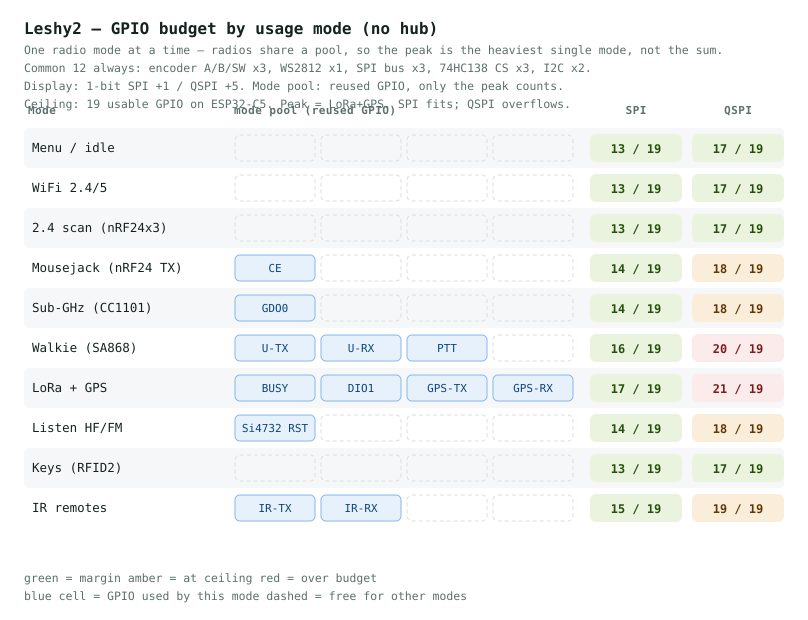

# Leshy2 — GPIO budget by usage mode

*Read this in: **English** · [Русский](pin-budget.ru.md)*

The ESP32-C5 exposes GPIO0–28. In-package flash/PSRAM takes GPIO16–22 and native USB takes GPIO13–14, leaving about **20 usable GPIO** (repurposing the UART-console pins for I/O and using the strapping pins with care). That is tight for this much radio, so the budget rests on one rule:

> **Buses and the CS decoder reuse across modes; per-chip control lines do not.** Every SPI radio shares one 3-wire bus, and one 74HC138 turns 3 pins into 8 chip-selects — genuinely shared. But each radio's own control/interrupt line (CC1101 `GDO0`, LoRa `BUSY`/`DIO1`, nRF24 `CE`, IR TX/RX) runs to a different chip on its own trace, so those pins **add up** — they are not a reusable pool.

A slow-signal **I²C GPIO expander (PCA9555)** carries the low-speed control lines (resets, PTT, power-downs, the encoder button) for **0 host GPIO** — it rides the I²C bus. That is what makes the whole thing fit.



## 1. Core direct pins — buses, decoder, encoder (12)

| Line | Pins | Why |
|---|:--:|---|
| `SPI SCK/MOSI/MISO` | 3 | one shared bus: microSD + CC1101 + 3× nRF24 + LoRa |
| `I²C SDA/SCL` | 2 | Si4732, u-blox GPS, RFID2, the PCA9555 expander, Grove |
| `UART TX/RX` | 2 | SA868 walkie control |
| `74HC138 A/B/C` | 3 | 3→8 chip-selects (SD, CC1101, 3× nRF24, LoRa, display) |
| `Encoder A/B` | 2 | quadrature (the SW button goes on the expander) |

## 2. Per-chip radio lines — direct, and they SUM (6)

Each runs to a **different chip**, so none can share a pin with another.

| Line | Pins | Chip / why |
|---|:--:|---|
| CC1101 `GDO0` | 1 | raw OOK data (RMT) — timing-critical |
| nRF24 `CE` | 1 | fast TX/RX enable (3 modules tied) |
| LoRa `BUSY` | 1 | poll before each command (*lever:* can be a fixed delay) |
| IR `RX` | 1 | demod capture (RMT) |
| IR `TX` | 1 | carrier out (RMT) |
| `WS2812` status | 1 | addressable-LED timing (RMT); needs a 5 V level shifter (Sheet 6) |

**Polled, not on a pin:** LoRa `DIO1` (TX/RX-done via SPI `GetIrqStatus`) and nRF24 `IRQ` (via SPI STATUS) — polling both is what keeps the build inside 20 GPIO.

## 3. Slow controls — on the PCA9555 expander (0 host GPIO)

The expander (already on the I²C bus) carries **16 low-speed lines** for free: `Encoder SW` · `SA868 PTT/PD` · `Si4732 RST` · `LoRa NRESET` · `LoRa T/R` (drives RXEN/TXEN via an inverter) · `buzzer` · `LCD RESX` · `LCD backlight EN` · `audio MUX_SEL` · `PAM shutdown` · `CC1101 band switch` · `74HC138 enable` · `BQ25887 INT/CD`. Timing-critical lines (group 2) **cannot** go here — an I²C round-trip is too slow — which is why they stay direct.

## 4. Display — chosen: ST7796 over SPI (+1)

The display rides the **main SPI bus** (write-only), takes its CS from the 74HC138, and adds one **DC** line — a single GPIO.

| Display | Pins | Note |
|---|:--:|---|
| **ST7796 IPS TFT, 3.5″ 320×480, SPI** ✓ | **+1** | shares the radio SPI bus; large color waterfall, bright/outdoor-readable |
| any AMOLED over QSPI | +5 | own 4-bit bus (`CLK`+`D0..D3`) — would blow the budget (below) |

## Totals

```
Core (buses + 74HC138 + encoder A/B) ...... 12
Per-chip radio lines (they sum) ........... +6   (DIO1 & nRF24-IRQ polled)
Display (ST7796 SPI: DC) .................. +1
Signal pins ............................... 19
BOOT button (GPIO28) ...................... +1
                                            = 20 / 20 usable — no spare
```

| Config | Direct pins | vs ~20 |
|---|:--:|:--:|
| **ST7796 / SPI (chosen)** | **20 / 20** (19 signals + BOOT) | ✅ fits, no spare |
| any display / QSPI | +4 | ❌ over |

`DIO1` and the nRF24 IRQ are **polled** as part of this baseline — that is what makes 20 fit. If a spare pin is ever needed, one more lever frees one: a fixed-delay `BUSY`, or dropping the `WS2812` (status on the screen).

A **QSPI** panel would only fit by reclaiming the USB data pins (+2, flash over UART/OTA) **and** more shaving — landing ~21/22 with real compromises, so it was not taken. The **ST7796 over SPI** fits at a single pin.

## Why buses reuse but control lines don't

A **bus** is one set of wires every device taps (SPI, I²C, UART); mode-exclusivity means only one device talks at a time, so 3 SPI wires serve five chips. A **control line** is point-to-point to one chip's pin — a second chip needs its own trace. Wiring one MCU pin to two chips' control pins and hoping the idle chip releases the line (high-Z) is not guaranteed, so it is avoided. Control lines are therefore counted one by one.

## Switching modes — latency and no freezes

Mode-exclusivity still buys two things: the shared buses, and a radio that is **truly off** (asleep, not radiating) when another is active. Switching = sleep the old radio → start the new one. The wait is startup, and it never freezes the UI (radios wait on a timer while the CPU is free).

| Enter mode | From sleep | Feel |
|---|:--:|---|
| nRF24 / CC1101 / LoRa / WiFi | ≤5 ms | instant |
| Si4732 AM/FM | ~200 ms | brief "tuning…" |
| SA868 walkie | ~0.3–1 s | short spinner |
| Si4732 **SSB** (patch) | ~1.2 s | spinner + progress bar |

Firmware: non-blocking init on the single-core C5 (background task); keep **nRF24 warm**, **sleep CC1101 and Si4732** between uses; **pre-warm on menu focus**; SA868 mic cap **1 µF (not 10 µF)** cuts TX fade-in. "Always-on Meshtastic" is background RX only while no other radio mode is engaged — switching to another radio suspends LoRa.

---
*Interactive version (click a mode) is in chat; GitHub renders the static page above.*
*Part of [Leshy2](../README.md) · MIT.*
