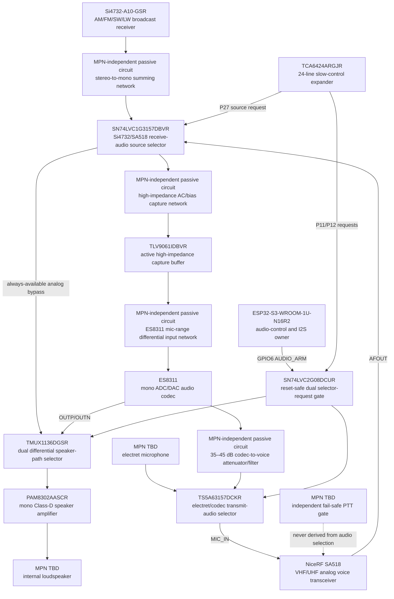

# AUDIO-0002 — complete fail-safe audio-path comparison

> Subsequent pin-state amendment: `DEC-0059/REV-0005L` assigns GPIO43/44 to
> permanent S3 UART0 service and leaves GPIO47 free. No audio path changes.

- Статус: **Проведено ревью; вариант A принят как DEC-0054, schematic/HIL открыт**
- Дата: 2026-08-17
- Предыдущий contact review: [`AUDIO-0001`](AUDIO-0001-es8311-exact-electrical-fit.md)
- Находки: [`FND-0066`](../findings/FND-0066-es8311-line-input-and-pam-differential-capability.md),
  [`FND-0067`](../findings/FND-0067-audio-source-select-and-reset-bypass.md)
- Предложение: [`IMP-0046`](../improvements/IMP-0046-es8311-analog-routing-topology.md)
- Решение: [`DEC-0054`](../decisions/DEC-0054-fail-safe-complete-audio-path.md)
- Reviews: [`REV-0005C`](../reviews/REV-0005C-complete-audio-path-prerequisites.md),
  [`REV-0005D`](../reviews/REV-0005D-audio-decision-propagation.md)

## Что сравнивается

Это не выбор «кодека получше». Законченный вариант обязан одновременно:

1. оставить аппаратный `Si4732/SA518 AFOUT → PAM8302A` обход рабочим при
   выключенном или неисправном codec;
2. оставить `electret → SA518 MIC_IN` рабочим по умолчанию;
3. записывать выбранный RX-источник без заметной просадки обычного динамика;
4. воспроизводить полный differential DAC на PAM8302A;
5. подавать DAC в `SA518 MIC_IN` только через отдельный selector и большой
   аттенюатор, не связывая это с PTT;
6. вернуться в оба analog default после S3 reset/watchdog, даже если slow-I/O
   до reset удерживал старое значение;
7. сохранить текущие I2S/I2C GPIO и не скрыть новый control signal.

У каждого physical device указан отдельный узел с партномером и ролью.
Пассивные цепи обозначены как circuit, а ещё не выбранные динамик, микрофон и
hard-PTT implementation — как `MPN TBD`, поэтому диаграмма не выдаёт их за
замороженные BOM-позиции.

## Почему прямой ADC tap не проходит

В legacy speaker branch внешний `Rin32=10 kΩ` стоит последовательно с
внутренним входным сопротивлением PAM8302A порядка `10 kΩ`. Для Si4732 stereo
sum две одинаковые `10 kΩ` ветви дают около `5 kΩ` Thevenin resistance ещё до
неизвестного output resistance самого receiver.

Простой first-order расчёт показывает масштаб проблемы:

- без capture branch: `5 kΩ` source видит примерно `20 kΩ` speaker branch;
- direct ES8311 tap порядка `6 kΩ` ставится параллельно и может уменьшить
  амплитуду Si4732 bypass на несколько dB;
- direct TAC5111 `40 kΩ` tap лучше, но на той же упрощённой модели всё ещё
  меняет уровень примерно на `0.8 dB`;
- branch порядка `100 kΩ + codec input` уменьшает paper delta примерно до
  нескольких десятых dB, но ослабляет запись и требует gain/noise HIL.

Это ориентир, не schematic result: точные DC common mode, source impedance и
амплитуда Si4732 не опубликованы в доступном current data short и должны быть
измерены на specimen. Для SA518 риск нагрузки меньше: current product page
указывает типичный `AFOUT≈700 mV` и `200 Ω` output impedance.

## Общий выходной тракт для всех пригодных вариантов

PAM8302A физически имеет `IN+` и `IN-`, поэтому центральный
differential-to-single-ended op-amp не нужен. Leading circuit class:

- dual SPDT выбирает на обоих входах PAM либо analog bypass + matched
  AC-ground branch, либо AC-coupled `DAC_P/DAC_M`;
- отдельный single SPDT выбирает для SA518 обычный electret или DAC injection;
- TX codec branch получает AC coupling, low-pass/anti-RF network и аттенюатор
  порядка `35…45 dB`: у SA518 типичная modulation sensitivity около `10 mV`,
  тогда как codec DAC имеет swing порядка volts RMS;
- selector ICs живут на always-available quiet audio rail, а codec rail может
  отключаться независимо;
- neither selector nor DAC can assert PTT.

Current exact candidates, не BOM freeze:

| Роль | Exact orderable candidate |
|---|---|
| speaker dual SPDT | TI `TMUX1136DGSR` (VSSOP-10) или `TMUX1136DQAR` (USON-10) |
| TX single SPDT | TI `TS5A63157DCKR` (SC70-6) |
| active capture buffer | TI `TLV9061IDBVR` (SOT-23-5) |
| reset-default gate | TI `SN74LVC2G08DCUR` (VSSOP-8) |
| existing RX-source mux | TI `SN74LVC1G3157DBVR` (SOT-23-6) |
| existing speaker amp | Diodes `PAM8302AASCR` (MSOP-8) |

Every listed exact order code and every exposed package contact is recorded in
`hardware/architecture/devices.json` and guarded by regression tests. This
still does not freeze the circuit: electrical operating points and footprints
remain schematic-review gates.

Exact common-mode range, powered-off behavior, on-resistance, pop/click and
RF immunity remain schematic/HIL gates. Candidate names prove real packages;
they do not pre-approve footprints or substitute qualification.

## Complete input/codec candidates

### E1-P — ES8311 plus passive high-impedance capture

`MUX_OUT` reaches an AC-coupled, high-series-impedance network that presents a
microphone-range signal to `MIC1P/MIC1N`. ES8311 gain recovers the attenuation.

- Lowest BOM and area.
- Keeps current Espressif `esp_codec_dev` ES8311 driver.
- Can qualify as the later cost-down stuffing option.
- Cannot be called zero-loss before measured Si4732 level, record SNR, low-band
  response and bypass delta pass HIL.
- The user guide's line-input warning is addressed only if the network truly
  presents a manufacturer-valid mic-range/common-mode signal.

### E2-B — ES8311 plus active high-Z capture buffer

`MUX_OUT` is AC-coupled and biased into a high-input-impedance unity/qualified
gain buffer. The low-impedance buffer output then drives the ES8311 input
network without loading the ordinary bypass.

- Strongest zero-loss baseline while retaining the already supported codec.
- Source load can be set by a `100 kΩ`-class bias network rather than by the
  codec's `≈6 kΩ` input.
- Adds one op-amp, decoupling and passives; exact rail, bias, startup mute and
  RF filtering require schematic proof.
- Prototype PCB can expose E2 populated and an E1 bypass/DNP stuffing path;
  E1 may replace it only after the same board proves equivalence.

### T1-P — TAC5111IRGER plus passive high-impedance capture

TI `TAC5111IRGER` is a current `ACTIVE` mono codec in VQFN-24 `4×4 mm`,
`0.5 mm` pitch. It explicitly supports microphone or line input, differential
or single-ended, AC or DC coupling; ADC impedance is selectable to nominal
`5/10/40 kΩ` with `±20%` variation. It provides `2 Vrms` differential ADC and
DAC full scale and can derive clocks from BCLK/FSYNC.

Its exact digital contacts fit the same S3 routes without an extra MCLK:

| TAC5111 | Physical | Current S3 net |
|---|---:|---|
| `BCLK` | 2 | GPIO15 / I2S BCLK |
| `FSYNC` | 3 | GPIO16 / I2S WS |
| `DOUT` | 4 | GPIO18 / I2S DIN |
| `DIN` | 5 | GPIO17 / I2S DOUT |
| `SCL` | 7 | GPIO2 / system I2C SCL |
| `SDA` | 8 | GPIO1 / system I2C SDA |

All 1…24, four corner grounds and thermal pad are in `devices.json`; unused
GPIO/GPI/GPO, second analog pair and second output pair still require explicit
NC/strap treatment if selected.

- Technically cleanest codec documentation for our line/mic use case.
- `40 kΩ` alone still does not prove zero bypass loss; a high series network or
  buffer remains necessary.
- Current `esp_codec_dev` supported-device list includes ES8311 but not TAC5111,
  so T1 requires a new register driver and HIL.
- Dated public snapshot: TAC5111 is `$3.71` at 1 and `$2.27` at 100 (Mouser),
  versus ES8311 about `$0.55/$0.31` (LCSC). Even adding a roughly `$0.61/$0.38`
  TLV9061 screen to E2 leaves TAC5111 about `$2.5/$1.6` higher before common
  selectors/passives. This is cross-distributor screening, not production COGS.

If T1 later also needs an active buffer, it loses its only possible circuit
simplification while keeping the price and driver burden; that branch is not a
reasonable baseline.

## Reset/watchdog control correction

Current paper map put `AUDIO_SEL0/1` on TCA6424A `P11/P12`. External pulls
define power-on state only while those contacts are inputs/high-Z. Once the
expander drives codec position, an S3 reset does not reset the expander, so
the old value may persist. That contradicts `DEC-0009`.

The missing ordinary `RX_AUDIO_SOURCE_SEL` is now corrected on `P27`, changing
slow-plane accounting to `24 used / 0 reserved / 0 free`.

For the two safety-relevant selectors, the leading correction is:

- retain `P11/P12` as requested speaker/TX modes;
- consume S3 `GPIO6` as direct active-high `AUDIO_ARM`, with an external
  bypass-safe pull-down;
- gate both requested modes through a dual AND such as `SN74LVC2G08DCUR`;
- when `AUDIO_ARM=0`, both selector controls are forced to analog bypass even
  if TCA6424 holds stale bits;
- assert `AUDIO_ARM` only after codec power/readback/clock/level checks;
- reset, brownout or watchdog returns GPIO6 to pulled-low input state;
- S3 GPIO43 remains free for measured TE benefit or later direct demand.

Moving both selectors directly to GPIO6/GPIO43 is electrically simpler but
spends both remaining S3 free pins. Resetting/power-cycling the whole slow
expander couples unrelated UI/power controls and is rejected as the audio
default mechanism.

## Result

Facts and complete-path comparison receive **«Проведено ревью»**. The owner
accepted `IMP-0046/A` as [`DEC-0054`](../decisions/DEC-0054-fail-safe-complete-audio-path.md):
E2-B plus the one-pin `AUDIO_ARM` gate is the prototype baseline, E1-P remains
only a measured cost-down stuffing option, and TAC5111 remains a premium
comparison reference. This accepts the architecture, not passive values,
footprints, production AVL or HIL results.

## Mandatory schematic/HIL gates after choice

1. Measure Si4732 L/R and SA518 AFOUT min/nom/max level, DC common mode and
   source impedance; measure SA518 MIC_IN level for target deviation.
2. Calculate every coupling capacitor, bias, impedance, DAC attenuation,
   switch rail and PAM gain; simulate startup/fault states.
3. Scope power-on/reset/brownout/watchdog with stale P11/P12 and prove
   `AUDIO_ARM=0` forces both analog defaults before codec/expander firmware.
4. Measure bypass delta, record SNR/THD, clipping, low-frequency response,
   playback level, TX deviation, pop/click and latency.
5. Repeat under display/SD/Wi-Fi and each admitted RF signal group; prove no
   back-power or desense with codec/interfaces off.
6. Freeze exact order codes, footprints, AVL, production quotes and test time.

## Primary/current sources

- [Everest ES8311 product brief rev 17.0](https://www.everest-semi.com/pdf/ES8311%20PB.pdf)
- [ES8311 user guide](https://files.waveshare.com/wiki/common/ES8311.user.Guide.pdf)
- [TI TAC5111IRGER current product page](https://www.ti.com/product/TAC5111/part-details/TAC5111IRGER)
- [TI TAC5111 datasheet SLASF25A](https://www.ti.com/lit/ds/symlink/tac5111.pdf)
- [Espressif esp_codec_dev supported devices](https://components.espressif.com/components/espressif/esp_codec_dev)
- [Diodes PAM8302A datasheet](https://www.diodes.com/datasheet/download/PAM8302A.pdf)
- [NiceRF SA518 current product page](https://www.nicerf.com/walkie-talkie-module/sa518-uv-dual-frequency-walkie-talkie-module.html)
- [LCSC ES8311 C962342 snapshot](https://lcsc.com/product-detail/Signal-Switches-Multiplexers-Decoders_Everest-semi-Everest-Semiconductor-ES8311_C962342.html)
- [Mouser TAC5111IRGER snapshot](https://www.mouser.com/ProductDetail/Texas-Instruments/TAC5111IRGER)
- [TI SN74LVC2G08](https://www.ti.com/product/SN74LVC2G08)
