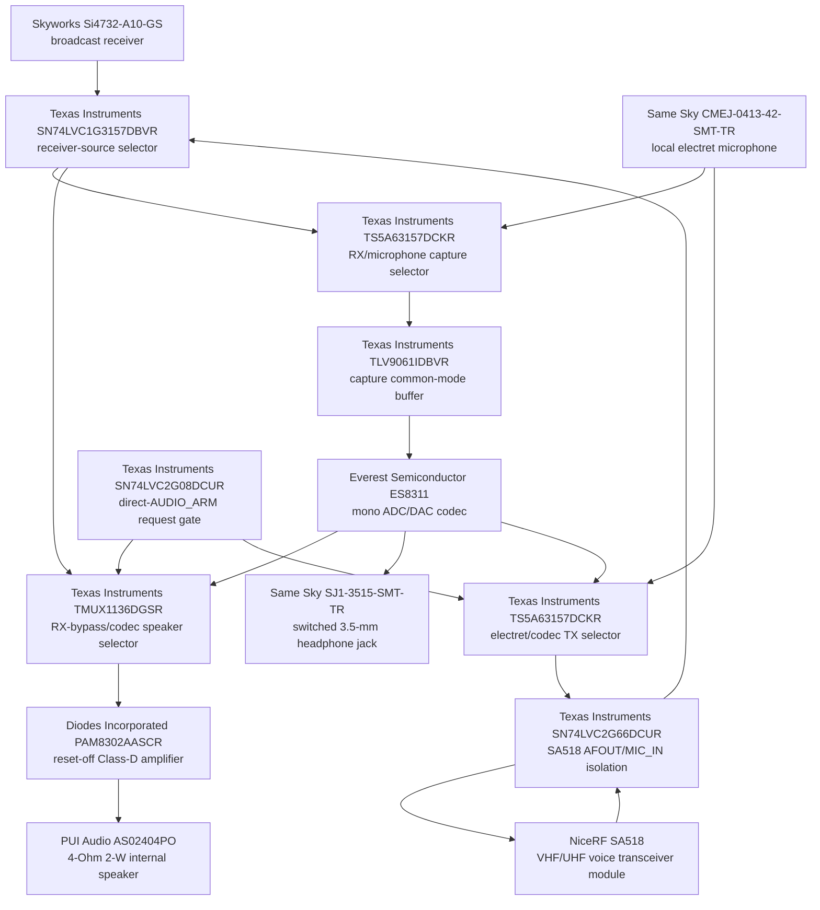

# AUDIO-0003 — exact complete audio and receiver endpoint

- Status: **Проведено ревью paper electrical block; HIL open**
- Finding: [`FND-0095`](../findings/FND-0095-i5-abstract-audio-hidden-power-domain-failures.md)
- Decision: [`DEC-0090`](../decisions/DEC-0090-i5-exact-audio-and-receiver-paper-closure.md)
- Machine source: [`G2F-3I.json`](../../../hardware/architecture/candidates/G2F-3I.json)

## Scope and prerequisites

This is the dependency review of I5 after I1 compute/recovery, I2 hard STOP,
I3 protected rails and I4 controls/shared interfaces were reviewed. It closes
the first-target paper circuits from S3 digital contacts through codec,
receiver and SA518 interfaces to real microphone, speaker and headphone
contacts. It does not close RF matching, PCB placement, mechanics or specimen
performance.

## Exact functional topology

Every box is one physical device and names its role. Passives and power-domain
devices are listed below rather than combined into multi-device diagram boxes.

## Control and pin result

| Control | Physical owner | Reset/default | Purpose |
|---|---|---|---|
| `P00` | `TCA6424ARGJR` | low through 10 kOhm | receiver capture; high selects local microphone |
| `P01` | `TCA6424ARGJR` | low through 10 kOhm | speaker amplifier off; firmware enables only when needed and no headphones are inserted |
| `P02` | `TCA6424ARGJR` | 100-kOhm low when switch is open | high means no plug, low means inserted/open-wire and forces speaker off |
| `P10` | `TCA6424ARGJR` | low through 10 kOhm | codec power off |
| `P11/P12` + S3 GPIO6 | expander requests + direct `AUDIO_ARM` | all low | codec speaker/TX selection needs both the slow request and direct S3 consent |
| `P13` | `TCA6424ARGJR` into AON gate | low | requests voice domain; STOP remains authoritative |
| `P14` | `TCA6424ARGJR` into `SN74LVC1G07DCKR` | low | SA518 `H/L` low or released only, never driven high |
| `P15` | `TCA6424ARGJR` | inactive | receiver domain request |
| `P24` | `TCA6424ARGJR` | inactive | SA518 audio path request |
| `P27` | `TCA6424ARGJR` | low | Si4732 is reset-default receive source; SA518 can be selected |

Main slow I/O is `21 used / 0 reserved / 3 free`; P03, P04 and P05 remain
available. The complete D-pad, PTT, STOP, RE-ARM, F1, F2 and encoder remain on
their previously reviewed paths and are not multiplexed with audio.

## Power and interface admission

| Domain | Exact admission | Interface isolation | Required sequence |
|---|---|---|---|
| codec | `TPS22919DCKR`, 1-uF input, 10-uF output, QOD, 10-kOhm ON pull-down | one `SN74LVC2G66DCUR` for I2C; four separate `SN74LVC1G126DCKR` for BCLK/WS/DOUT/DIN | P10 high → rail above 3.08 V → `TPS3839K33DBZR` about 200 ms → interfaces enabled; shutdown reverses and discharges |
| receiver | independent `TPS22919DCKR`, 1-uF input, 10-uF output, QOD, 10-kOhm ON pull-down | one `SN74LVC2G66DCUR` for I2C and one `SN74LVC1G07DCKR` for active-low IRQ | P15 high → rail above 3.08 V → `TPS3839K33DBZR` about 200 ms → RST/interface release; shutdown isolates then discharges |
| voice interfaces | protected 4-V voice rail plus separately discharged `TPS22919DCKR` 3.3-V I/O rail | separate `SN74LVC1G126DCKR` PTT and UART-input buffers; `SN74LVC1G07DCKR` H/L; `SN74LVC2G66DCUR` audio | STOP-permitted 4 V above about 3.73 V → `TPS3808G33DBVR` plus 10 nF about 57.6 ms → I/O rail and PD release; any STOP/brownout returns PTT to RX |

The voice module's UART TX goes directly to an RP input with a host-side
pull-down; RP-to-module UART RX is buffered and held low while asleep. UPDATE
is fixture-only with adjacent ground. Standard VOXEN is no-connect. Local
microphone capture enables authorized host-side VOX analysis but never asserts
PTT by implication.

## Exact analog and acoustic profile

| Circuit | First-target physical implementation |
|---|---|
| audio ground | one `RC0402JR-070RL` 0-Ohm star link from the local audio region to power ground |
| main midpoint | 100 kOhm / 100 kOhm and 1 uF |
| Si4732 mono | each L/R output: 1-uF AC coupling and 10-kOhm summing; 100-kOhm midpoint bias |
| SA518 receive | isolated AFOUT, 1-uF AC coupling, 10-kOhm series and 100-kOhm midpoint bias |
| microphone | `CMEJ-0413-42-SMT-TR`; 220-Ohm + 10-uF bias filter and 2.2-kOhm feed; independent AC branches to capture and ordinary TX |
| ADC input | selector → 1-uF AC coupling → local midpoint → `TLV9061IDBVR`; matched 1-uF + 33-kOhm legs to MIC1P/MIC1N |
| codec supplies | PVDD switched + 100 nF; AVDD and DVDD each through `BLM18PG181SN1D` + 100 nF; DACVREF, ADCVREF and VMID each 1 uF; CE 10-kOhm high gives `0x19` |
| codec TX injection | 1 uF then 220-kOhm / 2.2-kOhm attenuation with 10-nF filter; electret remains selector default |
| speaker input/power | matched 1-uF + 47-kOhm inputs; `PAM8302AASCR` on 3.3 V with 1-uF + 10-uF bypass and P01 reset-off |
| speaker output | each BTL leg uses one `BLM18PG181SN1D` and one 220-pF shunt before exact `AS02404PO`; neither speaker terminal is grounded |
| headphones | two separate 22-uF capacitors in parallel per codec output, then 22 Ohm to tip/ring of `SJ1-3515-SMT-TR`; `TPD4E05U06DQAR` and switched-tip insertion sensing |
| receiver clock/address | Epson `Q13FC13500005` crystal across RCLK/GPO3 with two 22-pF first-target loads; SENB 10-kOhm low first, firmware probes `0x11` and `0x63` |

The protected 3.3-V rail's reviewed 2.5-A continuous / 3.0-A step envelope is
not reopened: the new speaker branch is bounded near 0.5 A at paper level.

## Runtime invariants

- Receive bypass is the hardware default and can work while ES8311 is off.
- Codec playback or TX injection requires direct S3 `AUDIO_ARM` in addition to
  an expander request; reset cannot select either path.
- PTT is independent of audio routing and remains under the AON STOP gate.
- Speaker is off during reset, headphone insertion and quiet radio profiles.
- Unused codec, receiver, voice interfaces and their local rails are
  physically isolated or discharged; firmware power policy is not the sole
  barrier.
- Audio I2S is dedicated DMA. The shared SYS_I2C carries no radio-FIFO, encoder
  edge or PTT deadline.

## HIL exit gates

1. Read ES8311 at `0x19`; prove BCLK-derived clocking, full-duplex I2S and no
   back-power across all off/on/brownout states.
2. Probe Si4732 at `0x11` and `0x63`; freeze the specimen identity, trim/verify
   crystal startup, IRQ behavior and FMI/AMI endpoint performance.
3. Measure capture/playback/TX gain, common mode, noise, distortion, headphone
   loading, pop/click and RF immunity.
4. Verify `AS02404PO` enclosure response, class-D EMI/temperature and plug
   insertion behavior.
5. Fault-inject STOP and voice power while exercising PD/PTT/UART/H-L/AFOUT/
   MIC_IN and inspect UPDATE only with the service fixture.
6. Run display, storage, C5 IPC and the active radio group concurrently and
   prove continuous audio plus the standing no-interface-stall requirement.

I5 has **Проведено ревью** at paper electrical level. I6 owns exact RF front
ends, matching/protection, antenna-feed geometry and conducted/OTA evidence.
KiCad, final atomic freeze and the integrated physical mockup remain blocked.

## Primary sources

- [Everest Semiconductor ES8311 product brief](http://www.everest-semi.com/pdf/ES8311%20PB.pdf)
- [Skyworks AN383 — Si47xx antenna and crystal interface](https://www.skyworksinc.com/-/media/Skyworks/SL/documents/public/application-notes/AN383.pdf)
- [TI SN74LVC2G66 product page](https://www.ti.com/product/SN74LVC2G66)
- [Diodes Incorporated PAM8302A product page](https://www.diodes.com/part/view/PAM8302A)
- [Same Sky CMEJ-0413-42-SMT-TR](https://www.sameskydevices.com/product/audio/microphones/electret-condenser-microphones/cmej-0413-42-smt-tr)
- [PUI Audio AS02404PO](https://puiaudio.com/product/speakers-and-receivers/as02404po)
